# 生命禅院金钱观

**生命禅院金钱观**，是导游雪峰从生命升华角度对金钱、货币与财富的系统阐释：货币只是交换符号而非真正财富；真正的财富应以心灵财富为先、精神财富次之、物质财富最后；家园实行"一无所有，拥有一切"的无货币制度，禅院草彼此间不用货币、不借不贷，从而消除金钱利害关系，建立真正和谐的共同体。

> "生命禅院的金钱观是，逐步不要货币，常驻家园的禅院草不接触货币……当人与人之间没有了金钱货币的利害关系时，相处就简单轻松容易了，就格外和谐和睦祥和了。"
>
> ——雪峰文集·禅院篇·生命禅院的金钱观

| 版本 | 适合 | 核心角度 |
|------|------|----------|
| [友好版](friendly.md) | 初次了解 | 生活类比，讲清为何金钱是障碍而非财富 |
| [学术版](academic.md) | 研究者 | 系统分析金钱观的理论框架与比较研究 |
| [内部版](internal.md) | 深度研修 | 文集全文，一字不改 |

---

## 视频版

<iframe style="width:100%;aspect-ratio:4/3;border:0" src="https://www.youtube-nocookie.com/embed/O95mtFYbydw" title="生命禅院金钱观（生命禅院百科·视频版）" allowfullscreen></iframe>

??? info "📖 图文幻灯（14 张，点击展开）"

    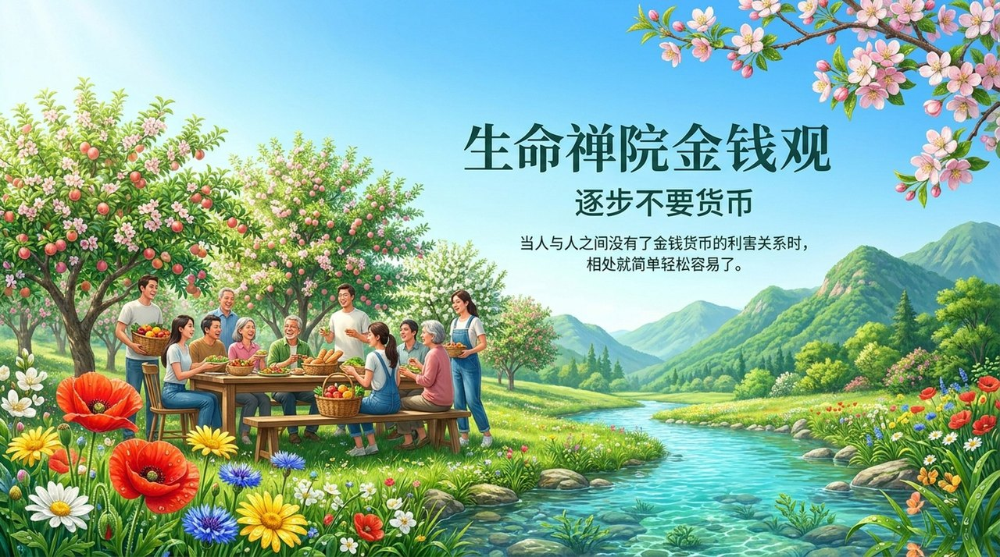
    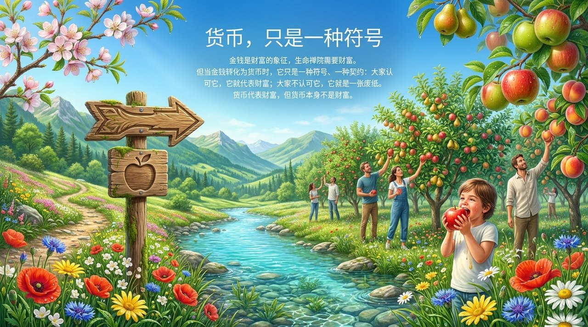
    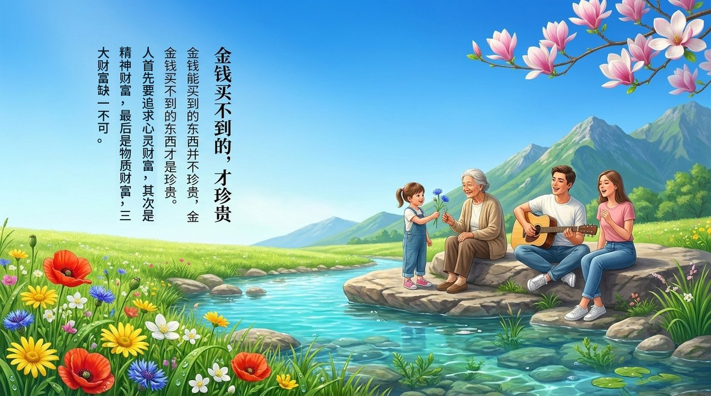
    
    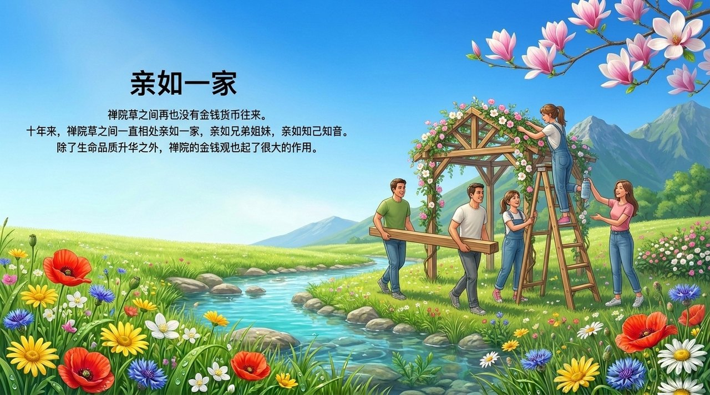
    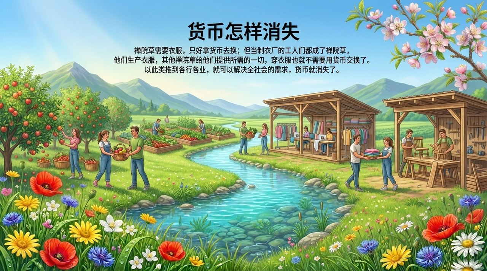
    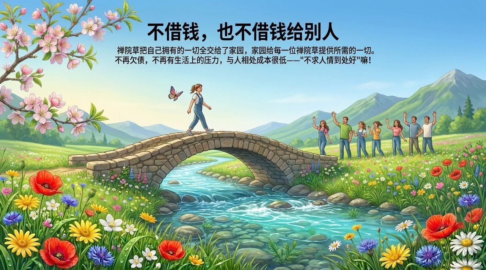
    
    
    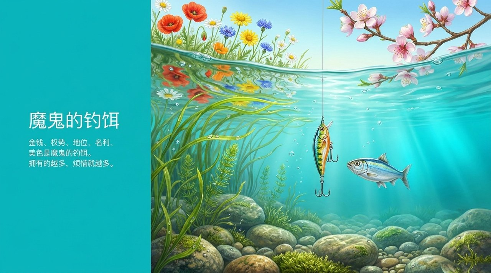
    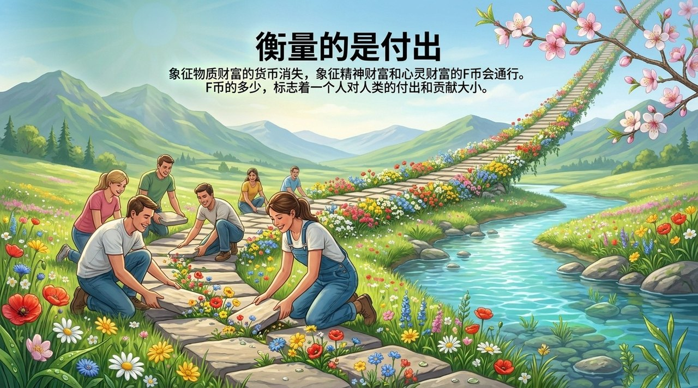
    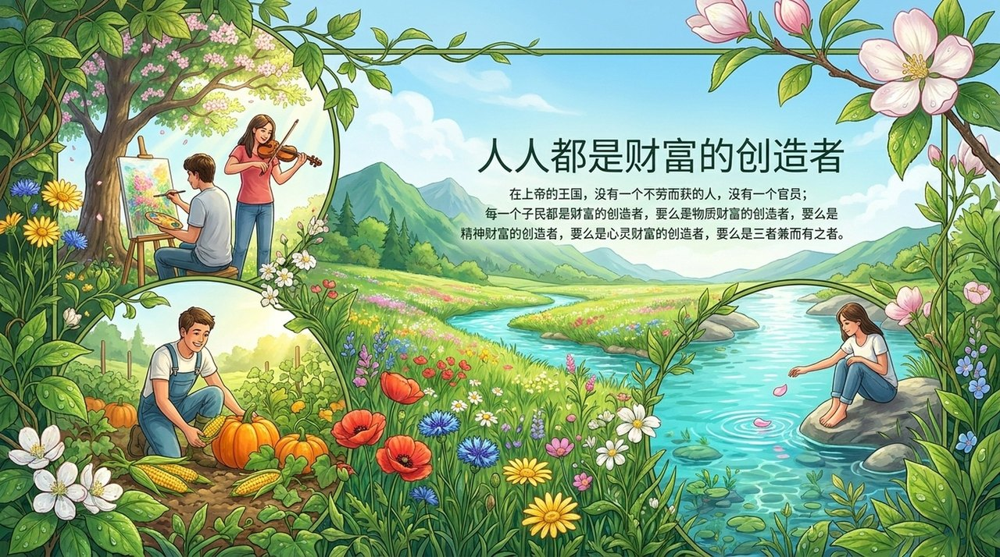
    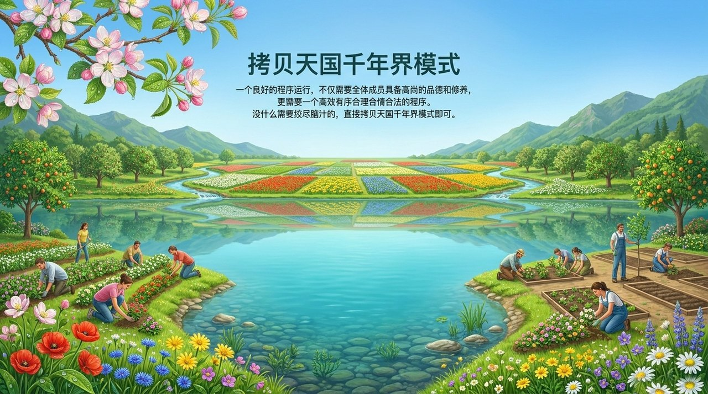
    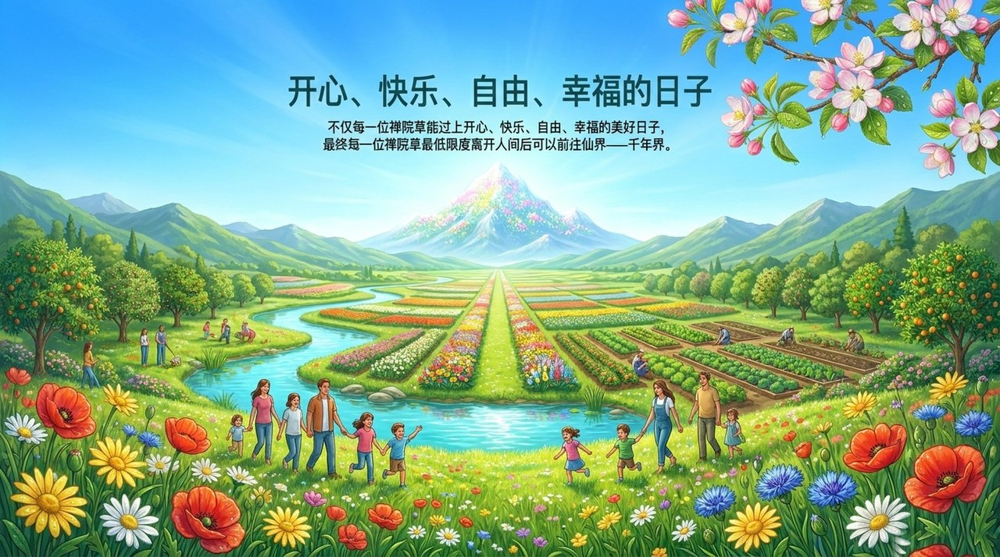

---

## 相关词条

[F币](/zh/f-coin/) · [天国财宝](/zh/heavenly-treasures/) · [浑沌经济·市场经济·计划经济](/zh/hundun-economy/) · [上帝是第一生产力](/zh/greatest-creator-first-productive-force/) · [心灵财富·精神财富·物质财富](/zh/three-forms-of-wealth/) · [第二家园](/zh/second-home/) · [雪峰式共产主义](/zh/xuefeng-communism/) · [生命绿洲](/zh/life-oasis/)
