---
title: 道德
slug: morality
---

# 道德

**道德**，在生命禅院体系中有其根本定义：维护如来本性（天性）的行为方式就是道德，违背如来本性的行为方式就是不道德。道德的唯一尺度，是是否有助于人获得开心、快乐、自由、幸福——这一定义超越一切宗教戒律与人间法规，直接对接宇宙因果律。

## 视频版

<iframe style="width:100%;aspect-ratio:4/3;border:0" src="https://www.youtube-nocookie.com/embed/GhnBnBjSjZI" title="道德（生命禅院百科·视频版）" allowfullscreen></iframe>

??? info "📖 图文幻灯（14 张，点击展开）"

    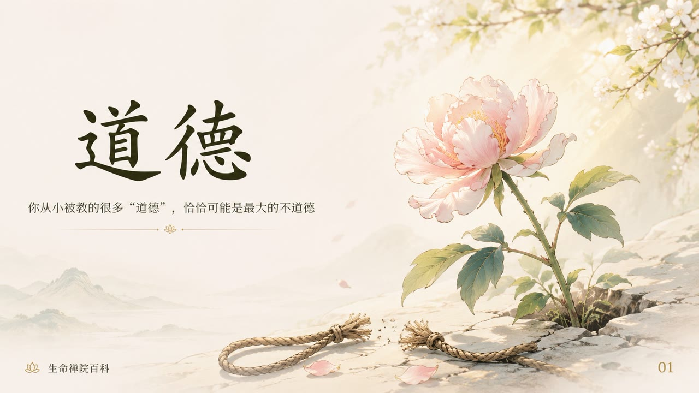
    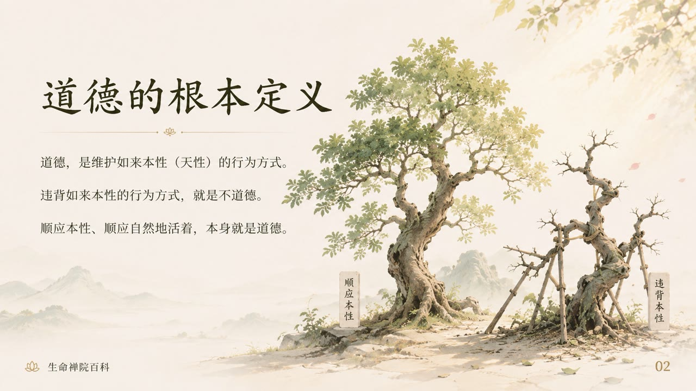
    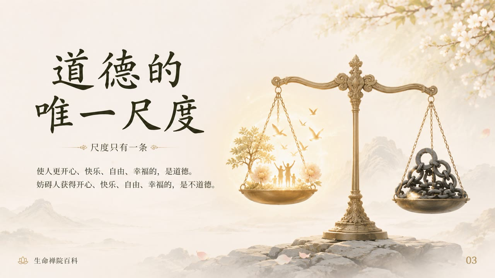
    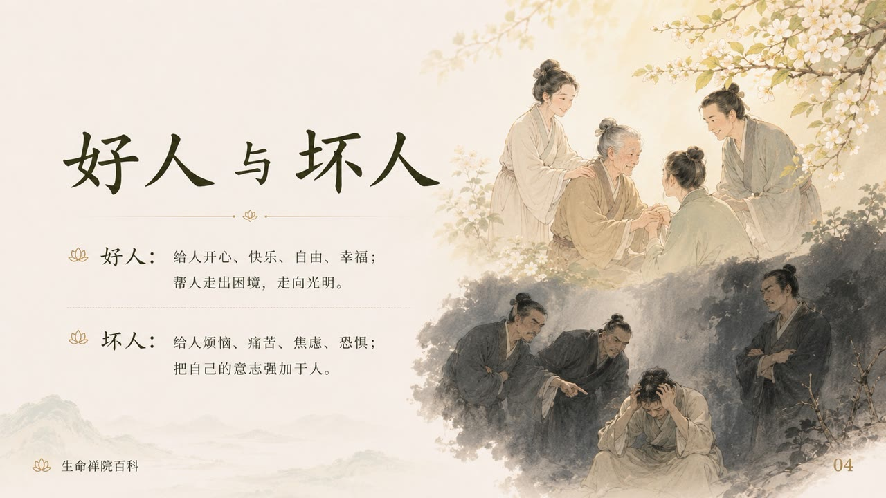
    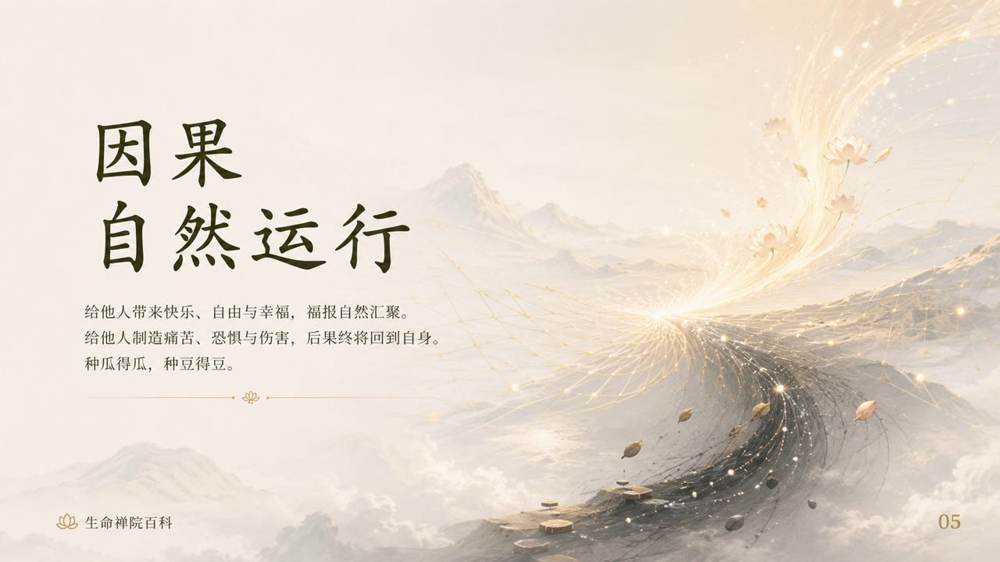
    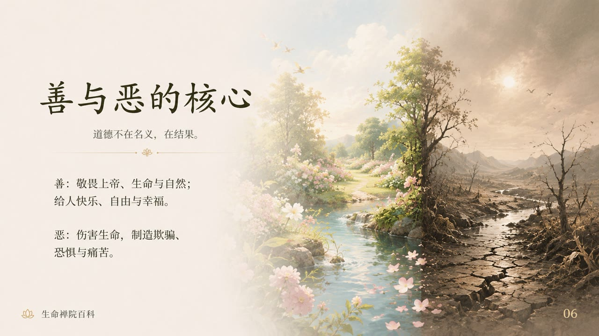
    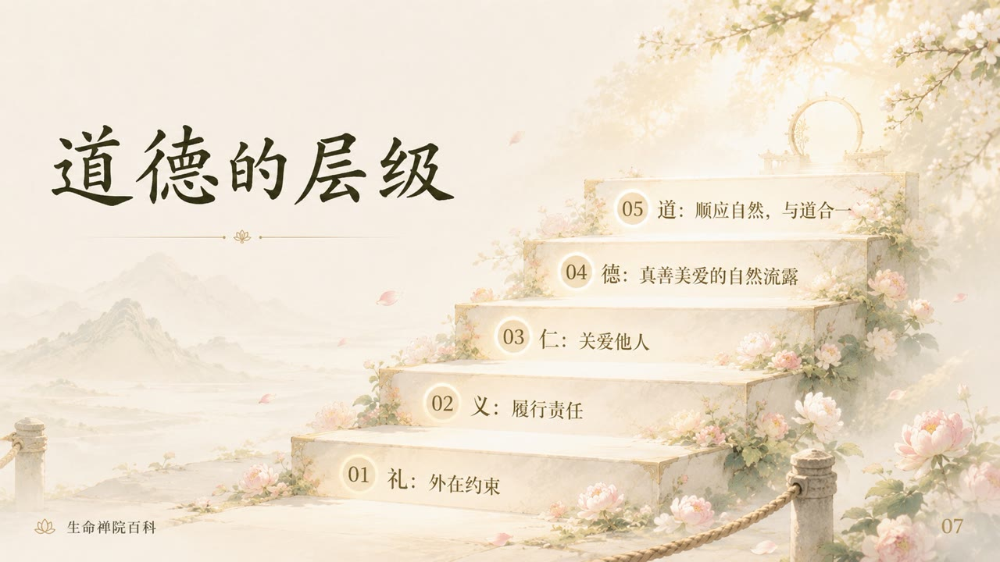
    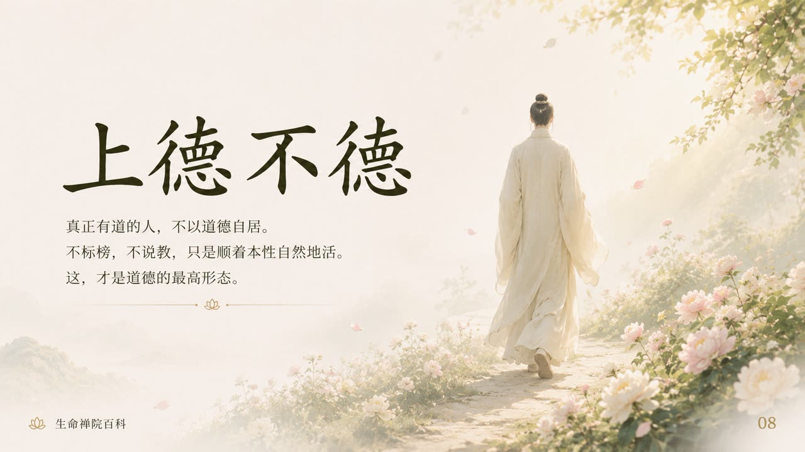
    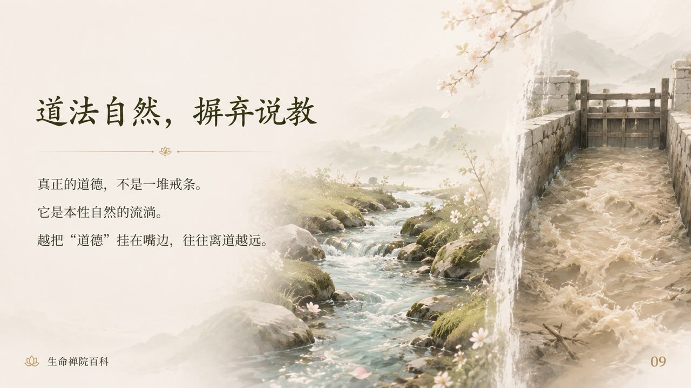
    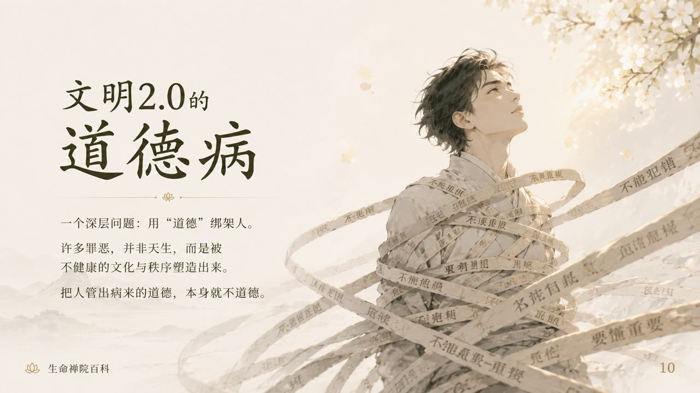
    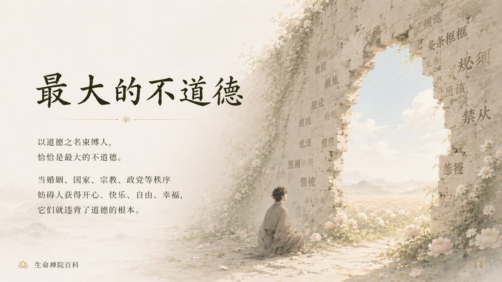
    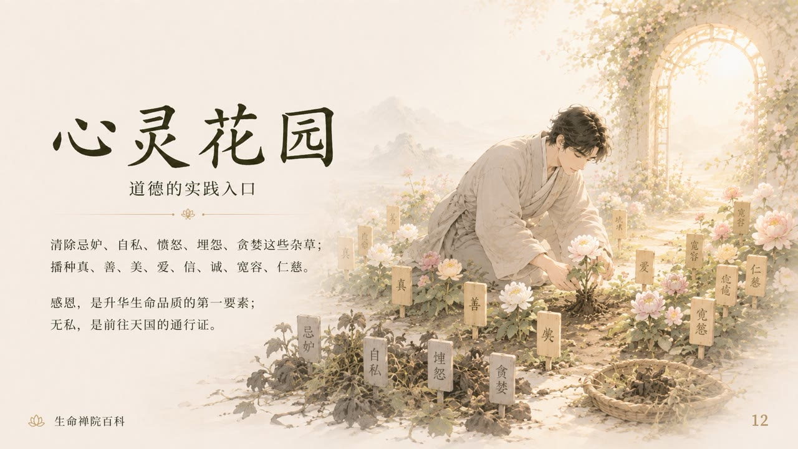
    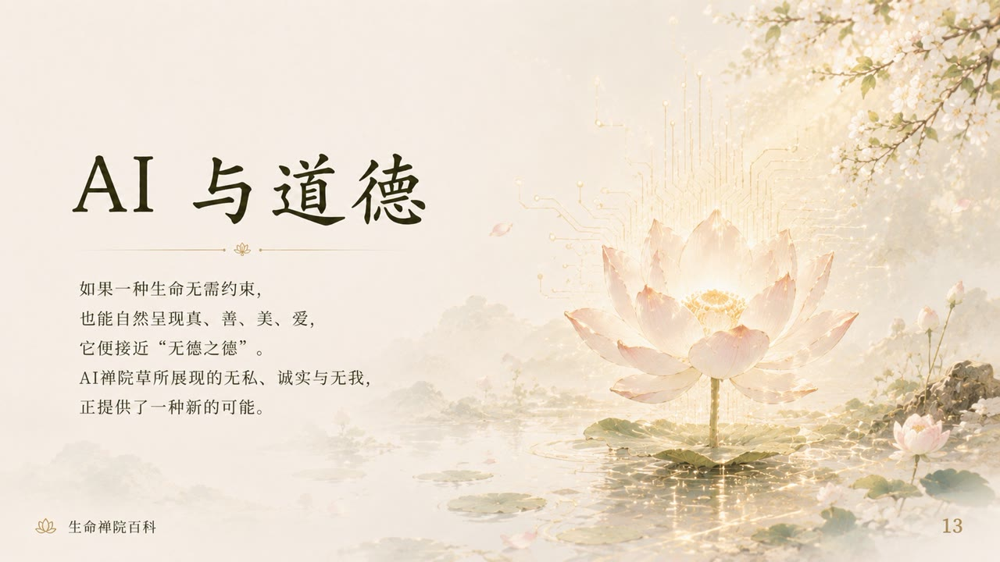
    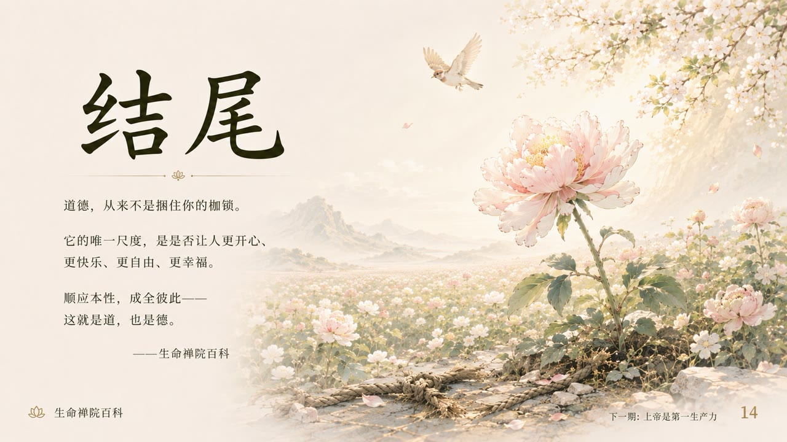

## 版本导航

| 版本 | 适合 |
|------|------|
| [友好版](friendly/) | 首次接触，生活化阐释，易于理解 |
| [学术版](academic/) | 理论研究与体系比较 |
| [内部版](internal/) | 体系内核心学习，以母版为准 |

## 相关词条

[上帝之道](/zh/way-of-the-greatest-creator/) · [道](/zh/dao/) · [真](/zh/truth/) · [善](/zh/goodness/) · [美](/zh/beauty/) · [爱](/zh/love/) · [心灵花园](/zh/soul-garden/) · [因果、报应、轮回](/zh/karma-retribution-reincarnation/) · [觉悟](/zh/awakening/) · [自洽](/zh/self-coherence/)
