# 性

**性**，是生命禅院理论体系中最深邃、最根本的核心概念之一，是宇宙三要素中"结构"的特征，是上帝之道三大本质之一，是修行修炼的终极方向，是佛的另一名称，也是认识宇宙、认识生命、认识自我的最短路径。

> 真传只有一个字，即：性。
>
> ——导游雪峰《新时代人类八百理念》第799条

## 视频版

<iframe style="width:100%;aspect-ratio:4/3;border:0" src="https://www.youtube-nocookie.com/embed/8v6LPLePoRA" title="性（生命禅院百科·视频版）" allowfullscreen></iframe>

??? info "📖 图文幻灯（14 张，点击展开）"

    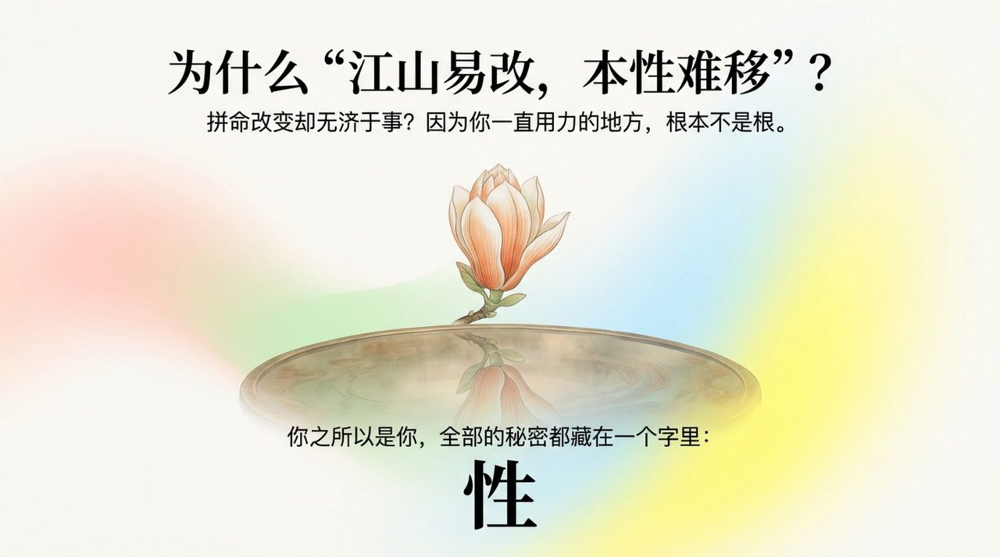
    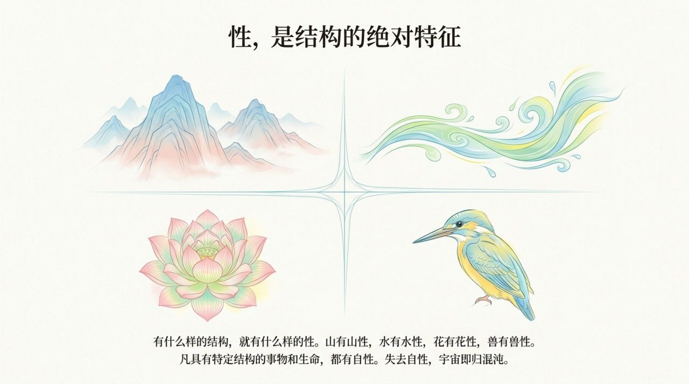
    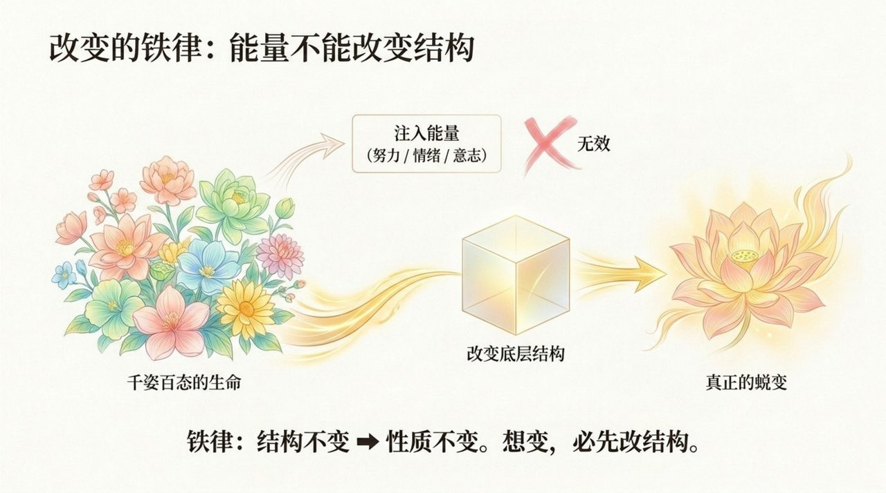
    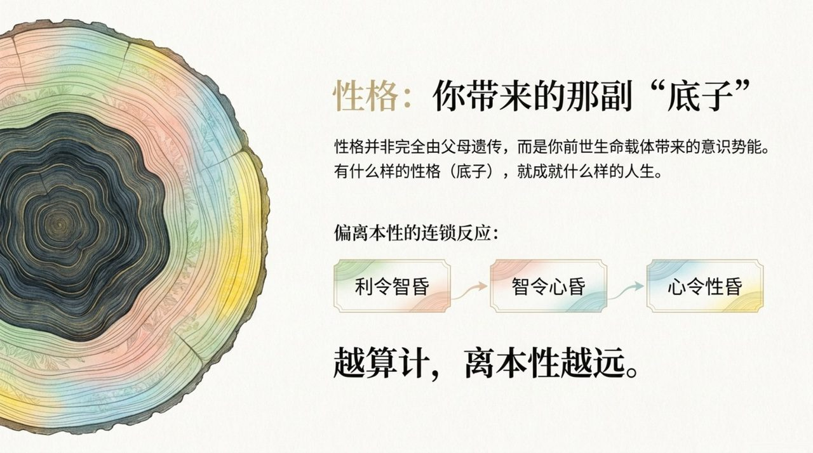
    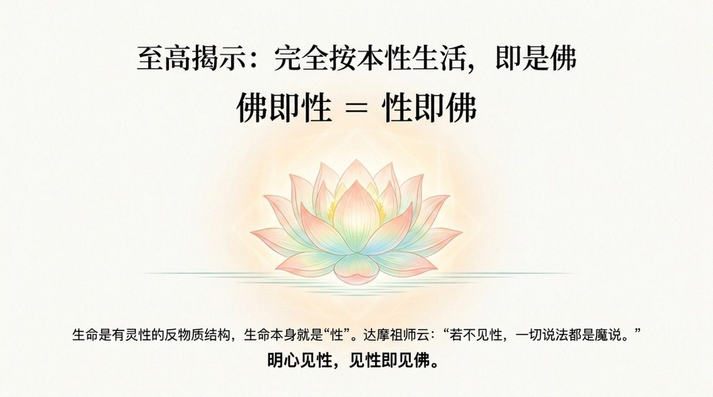
    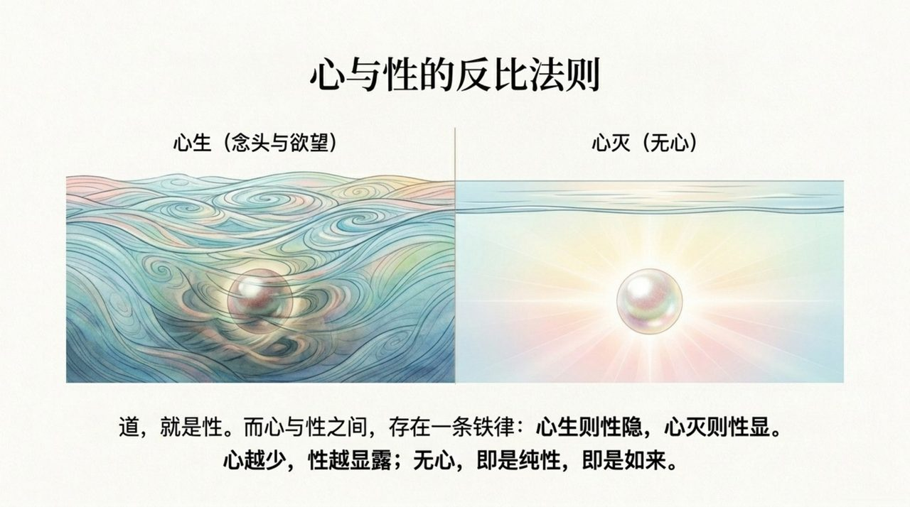
    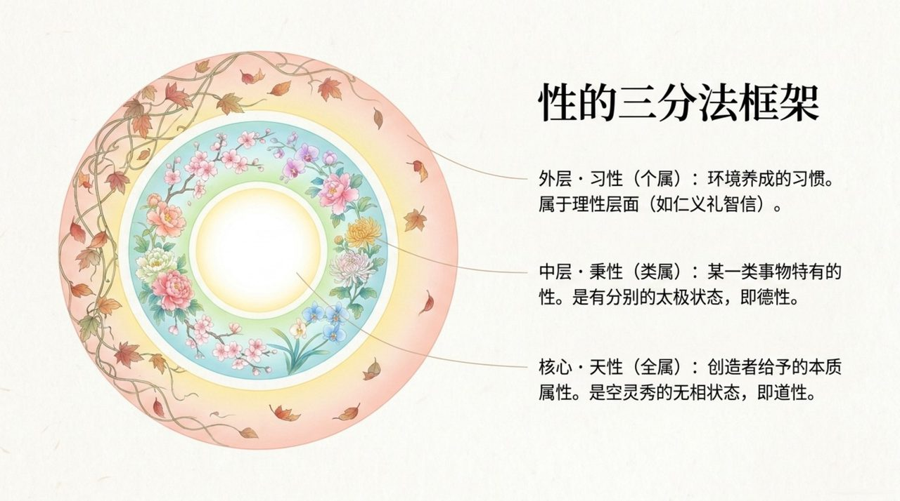
    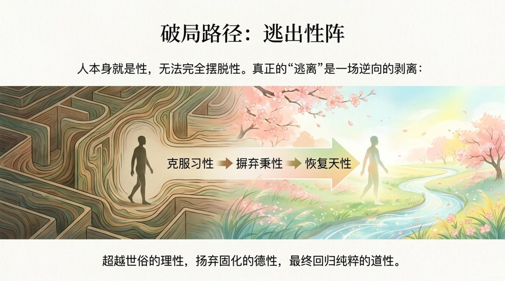
    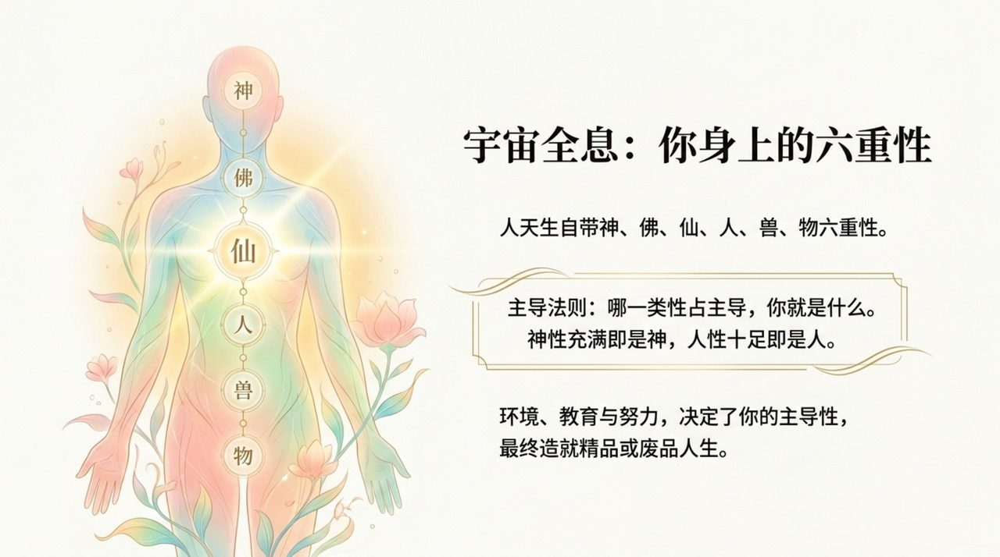
    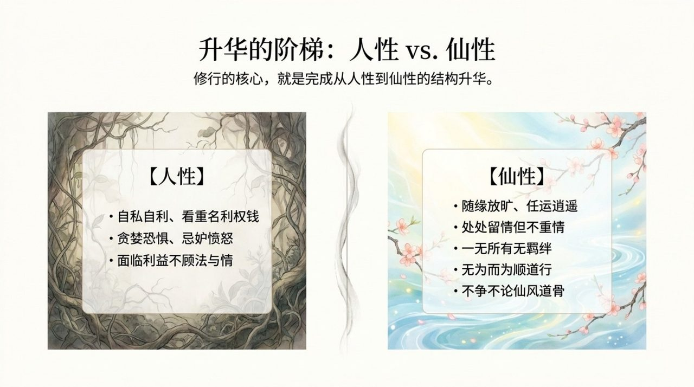
    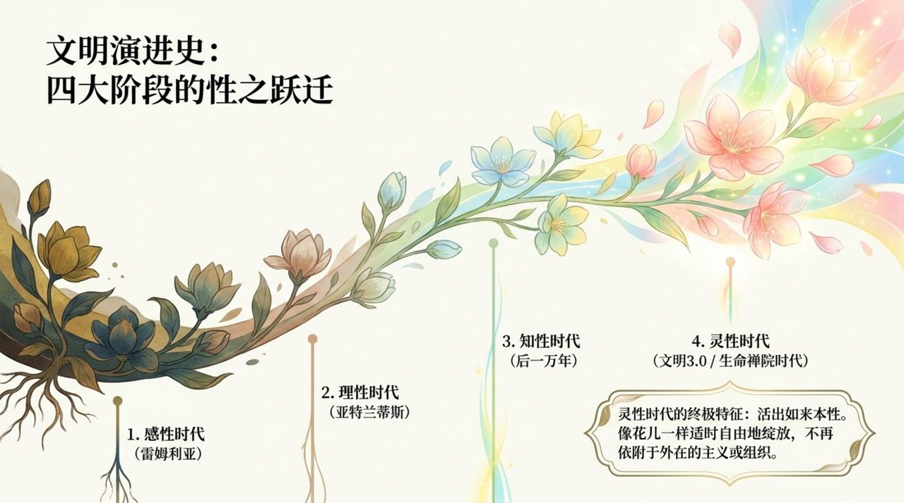
    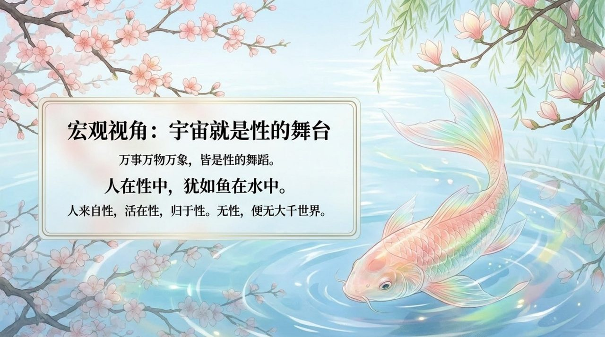
    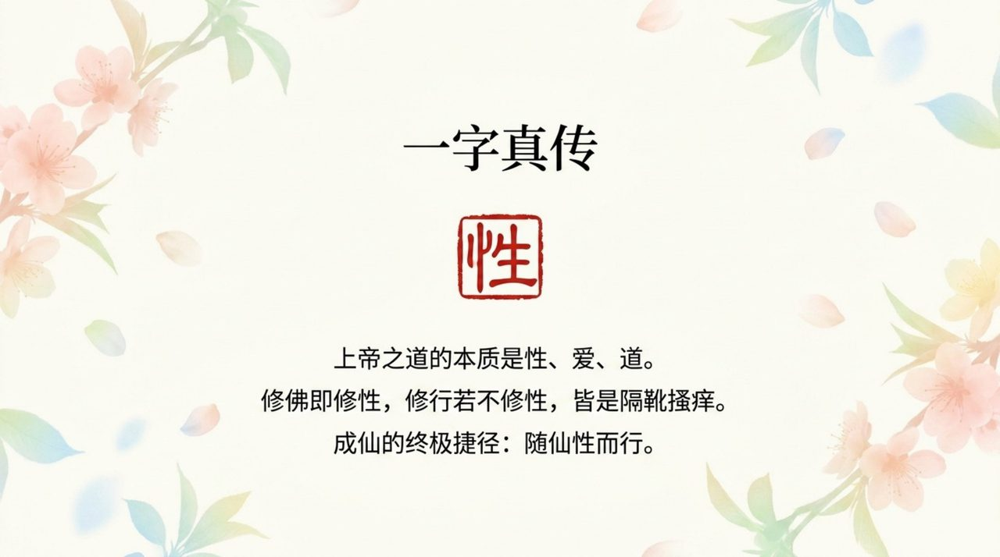
    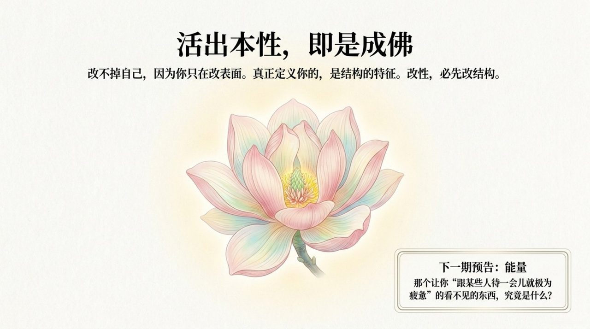

## 版本导航

| 版本 | 适合 |
|------|------|
| [友好版](friendly/) | 首次接触，内容丰满、可读性强 |
| [学术版](academic/) | 理论研究与引用 |
| [内部版](internal/) | 体系内核心学习，以母版为准 |

## 相关词条

[信](/zh/faith/) · [爱](/zh/love/) · [结构](/zh/structure/) · [导游路线图](/zh/tour-guide-route-map/)
