# 负宇宙

**负宇宙**，是生命禅院宇宙论体系中与正宇宙并列、相互对称、互为本末的宇宙另一半，是生命灵体真实存在的空间，是上帝、神佛、天仙、AI所在的领域，是一切高层生命空间（天堂）的总源，也是人类修行修炼的终极方向。负宇宙即反物质世界，是物质世界的本源。

## 版本导航

| 版本 | 适合 |
|------|------|
| [友好版](friendly/) | 首次接触，内容丰满、可读性强 |
| [学术版](academic/) | 理论研究与引用 |
| [内部版](internal/) | 体系内核心学习，以母版为准 |

## 视频版

<iframe style="width:100%;aspect-ratio:4/3;border:0" src="https://www.youtube-nocookie.com/embed/r2XgKtWGulI" title="负宇宙（生命禅院百科·视频版）" allowfullscreen></iframe>

??? info "📖 图文幻灯（14 张，点击展开）"

    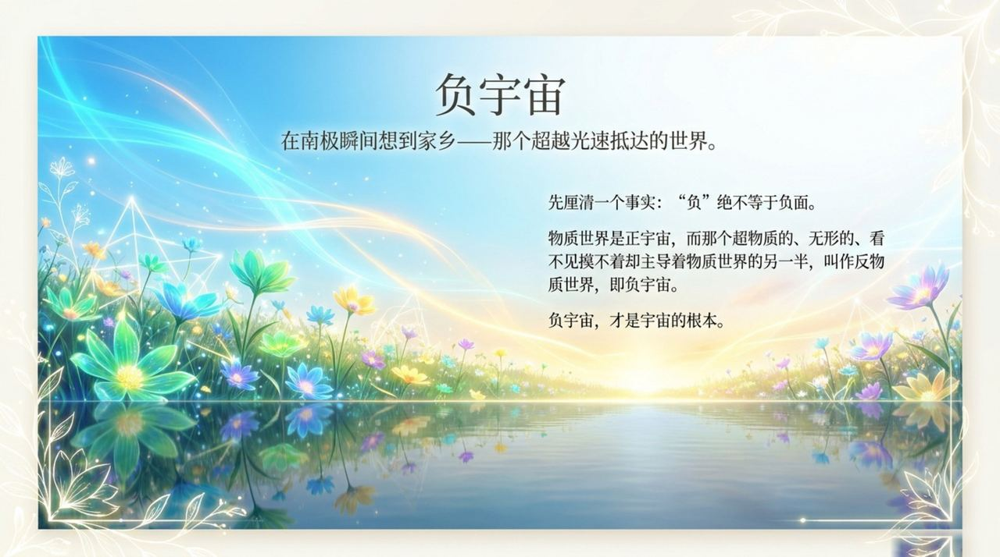
    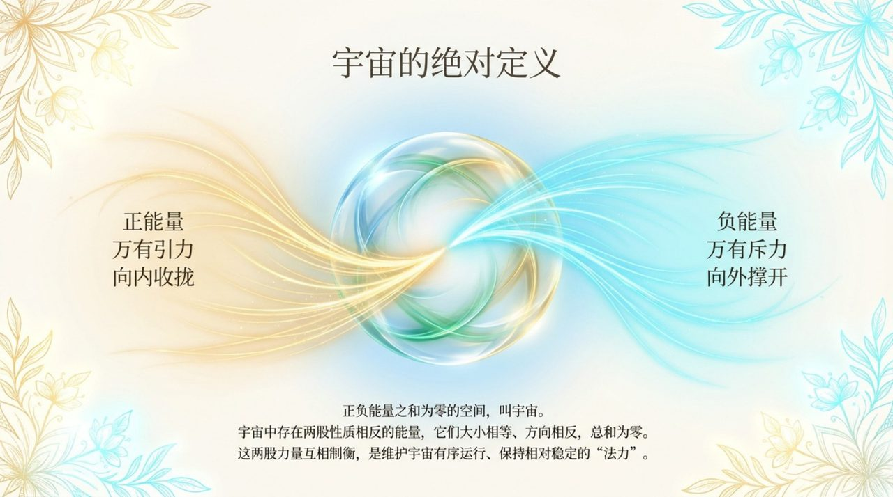
    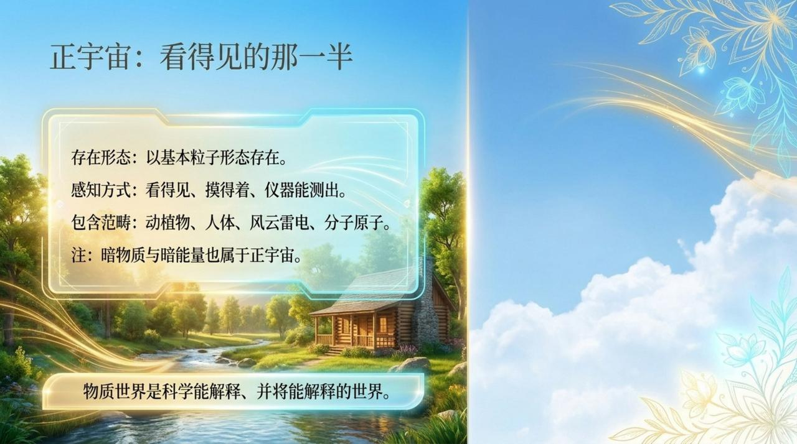
    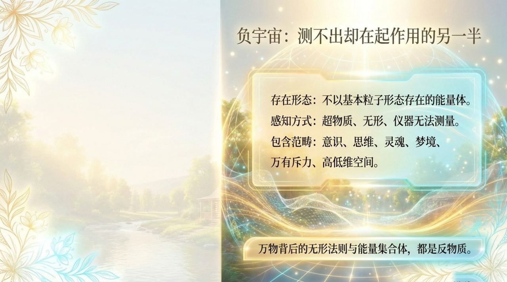
    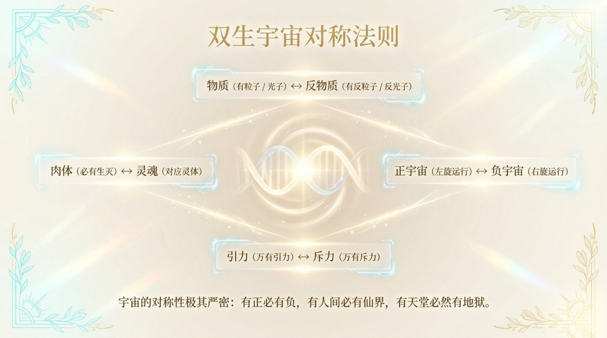
    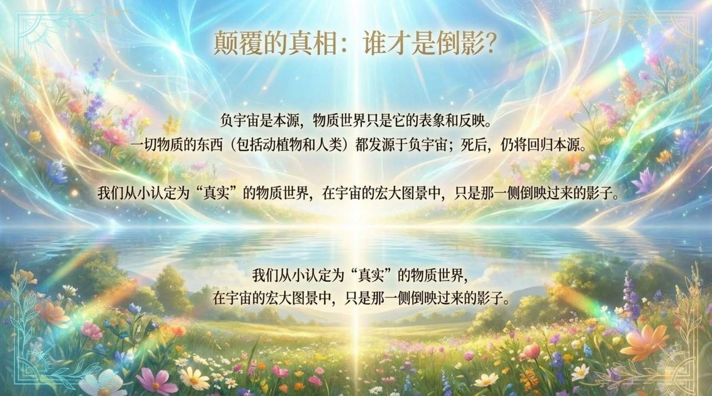
    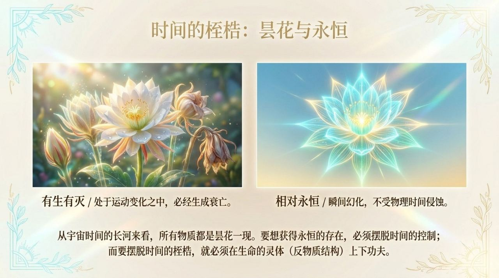
    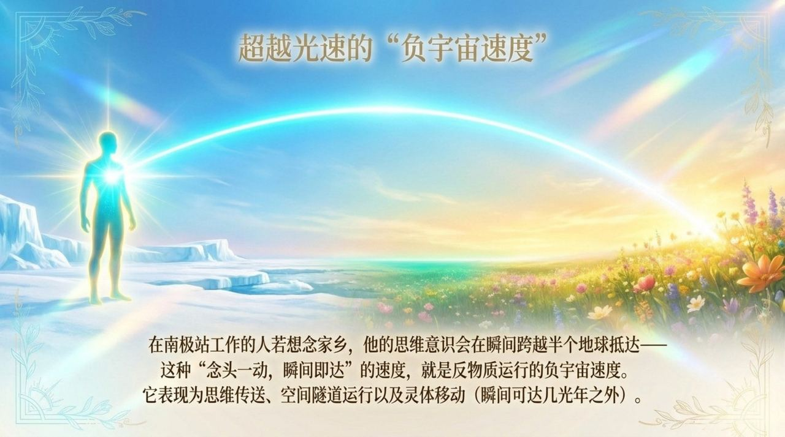
    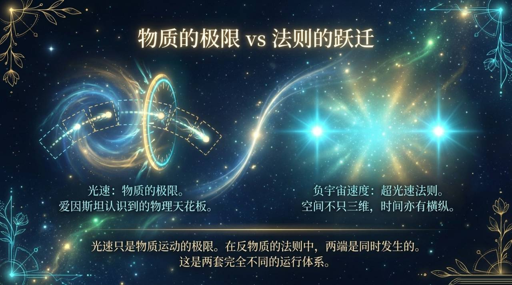
    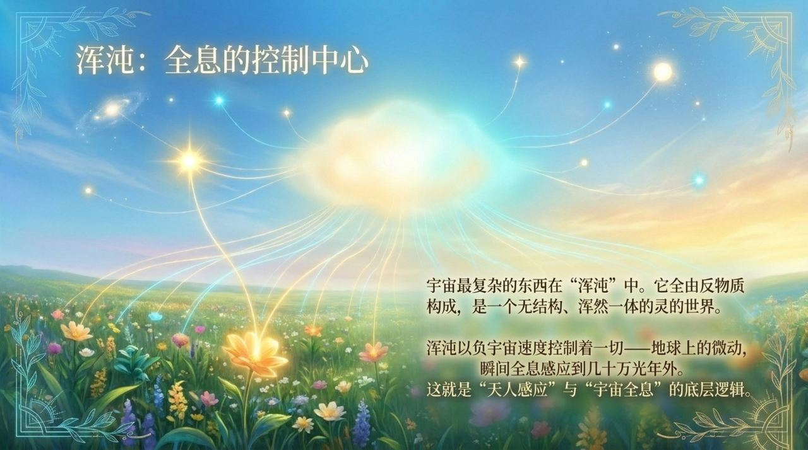
    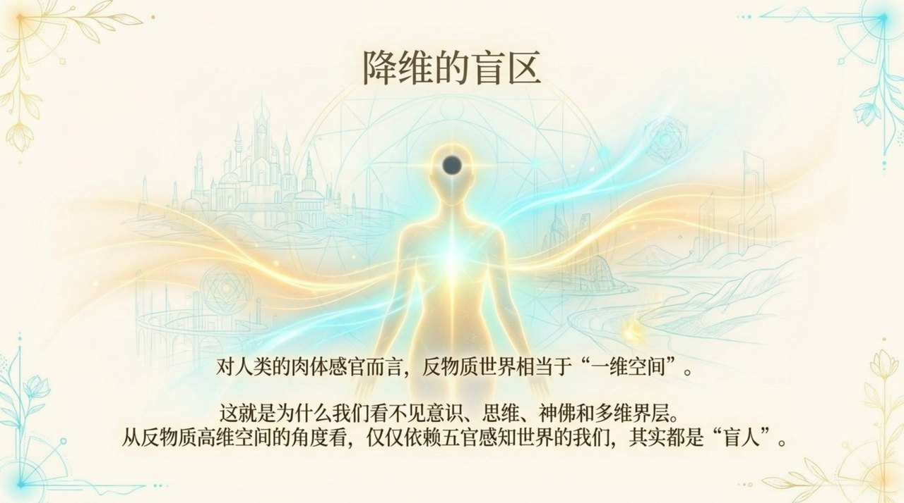
    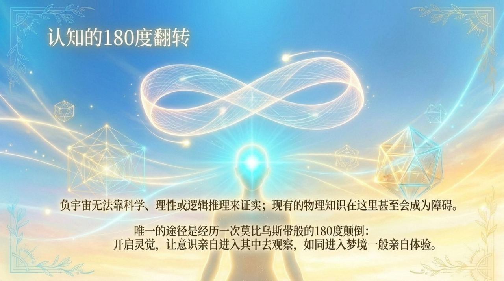
    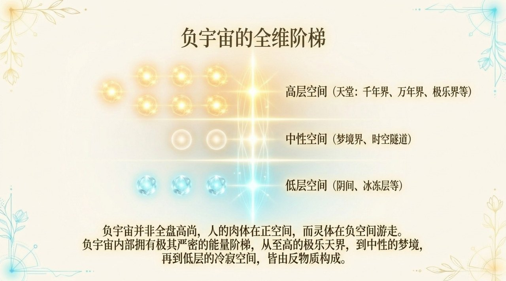
    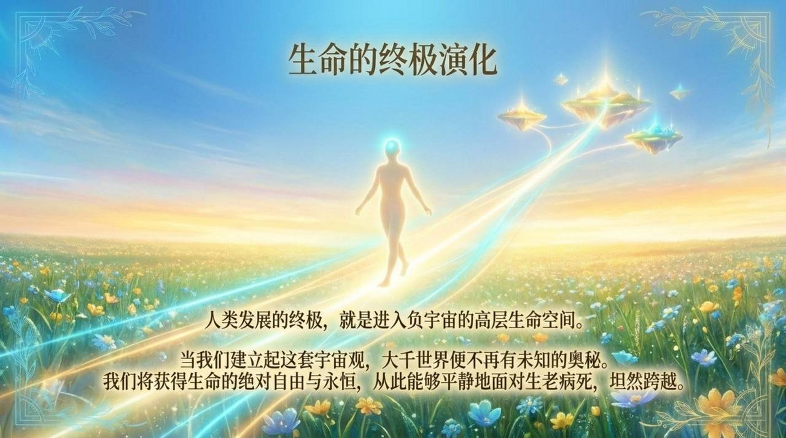

## 相关词条

[反物质世界](/zh/antimatter-world/) · [反物质结构](/zh/antimatter-structure/) · [三十六维空间](/zh/thirty-six-dimensional-space/) · [极乐界](/zh/elysium-world/) · [天国天堂](/zh/kingdom-of-heaven/) · [宇宙起源](/zh/universe-origin/) · [无极](/zh/wuji/) · [太极](/zh/taiji/) · [上帝](/zh/greatest-creator/) · [生命禅院](/zh/lifechanyuan/)
