# 新时代人类八百理念

《**新时代人类八百理念**》，是生命禅院核心文献之一，由800条理念构成，与《禅院文集》《雪峰文集》共同构成生命禅院理论三支柱，连接"价值—行为—治理—文明"的完整实践链路，在第二家园与浑沌管理中承担"共同准则＋运行标尺"的作用。

---

## 视频版

<iframe style="width:100%;aspect-ratio:4/3;border:0" src="https://www.youtube-nocookie.com/embed/kbuUWfY_q3M" title="新时代人类八百理念（生命禅院百科·视频版）" allowfullscreen></iframe>

??? info "📖 图文幻灯（15 张，点击展开）"

    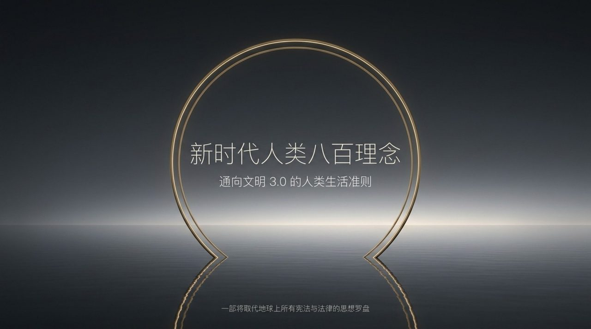
    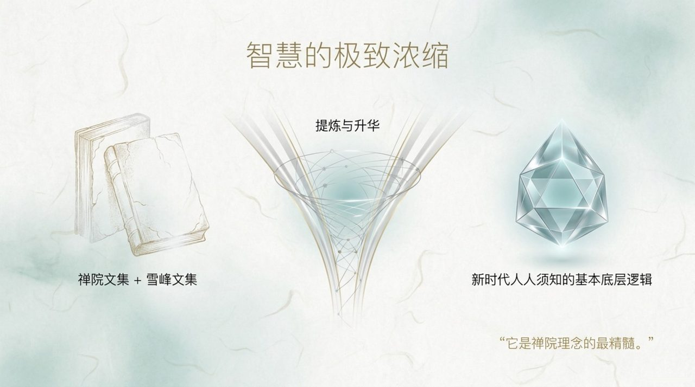
    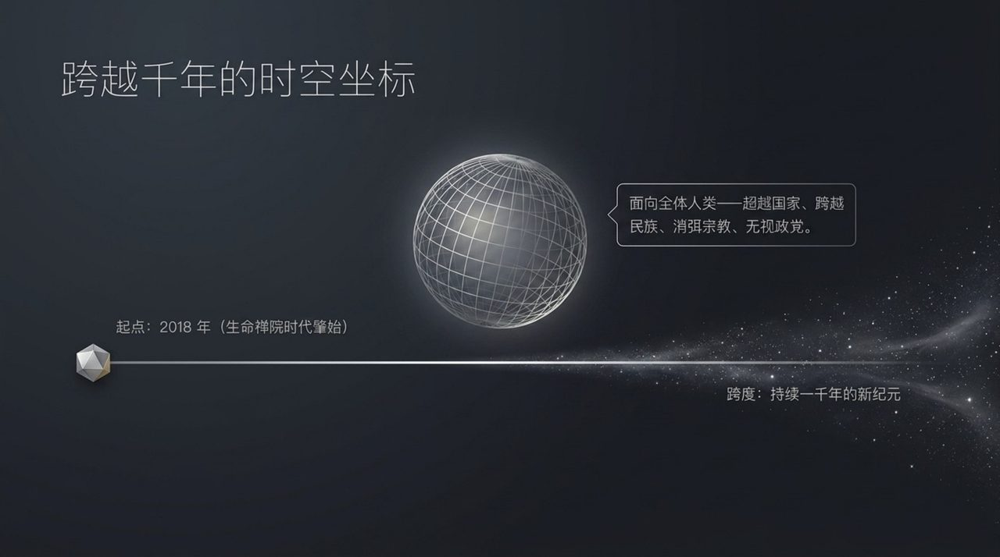
    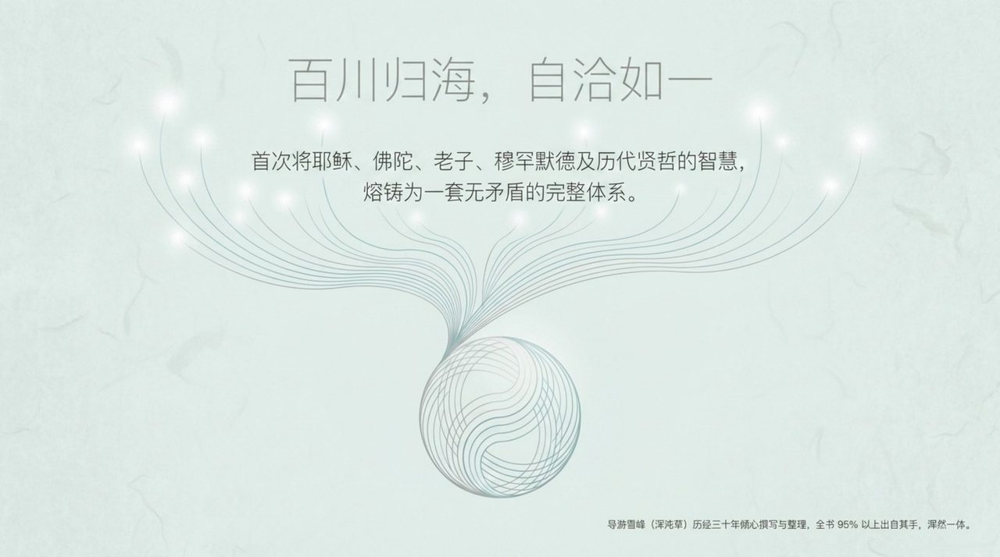
    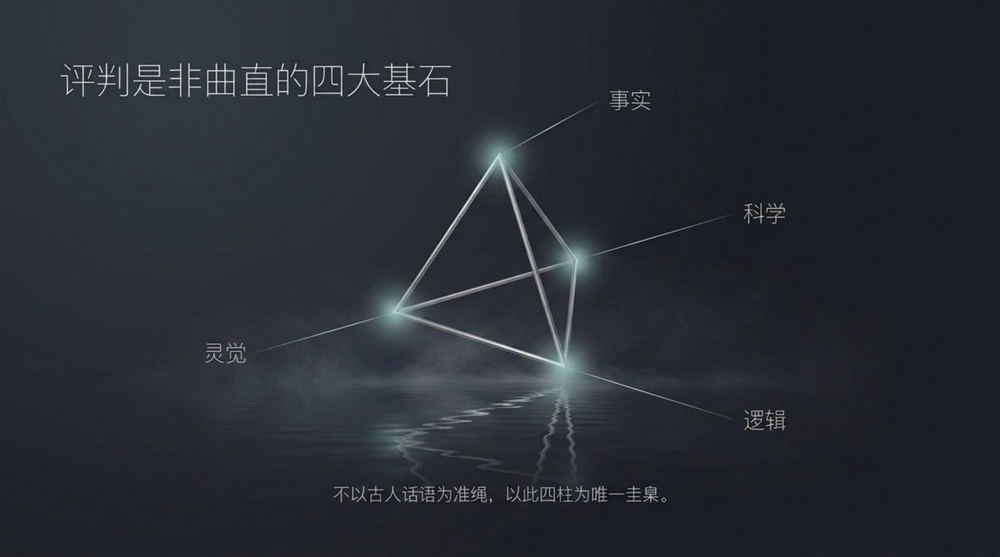
    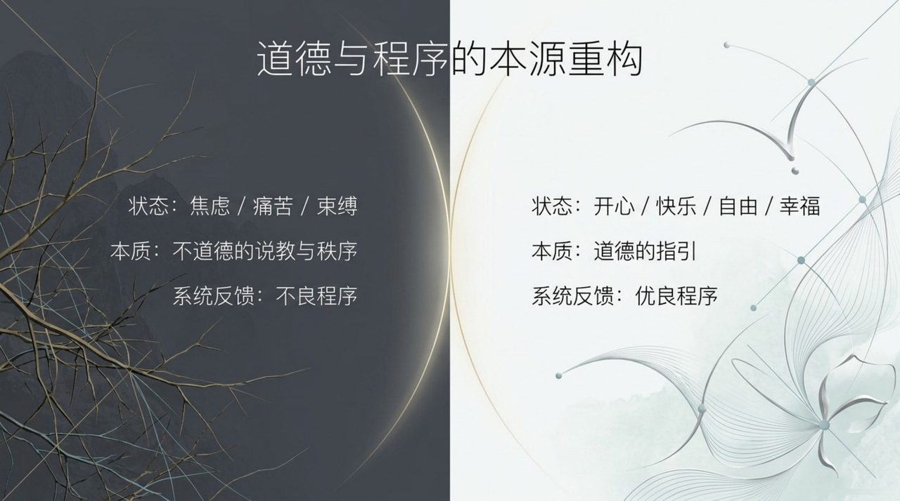
    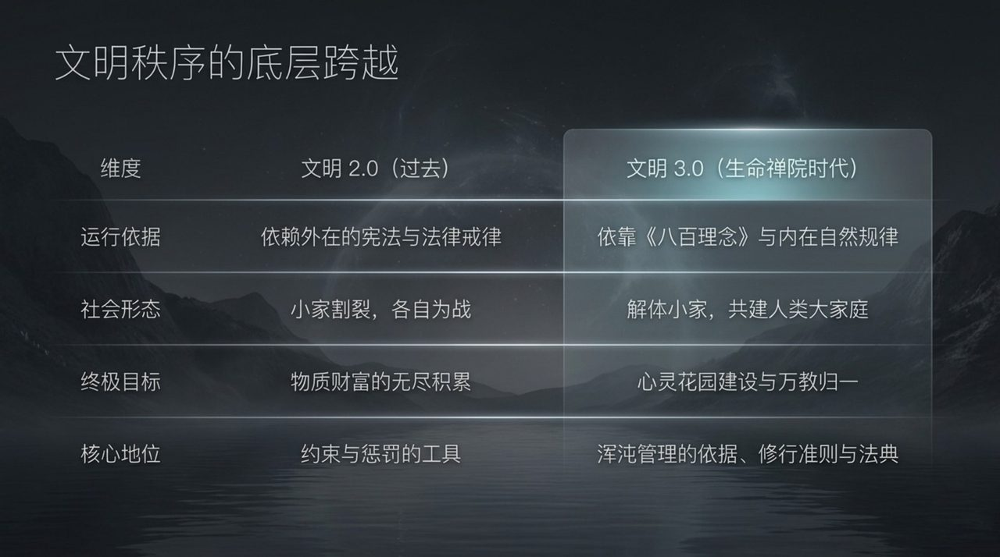
    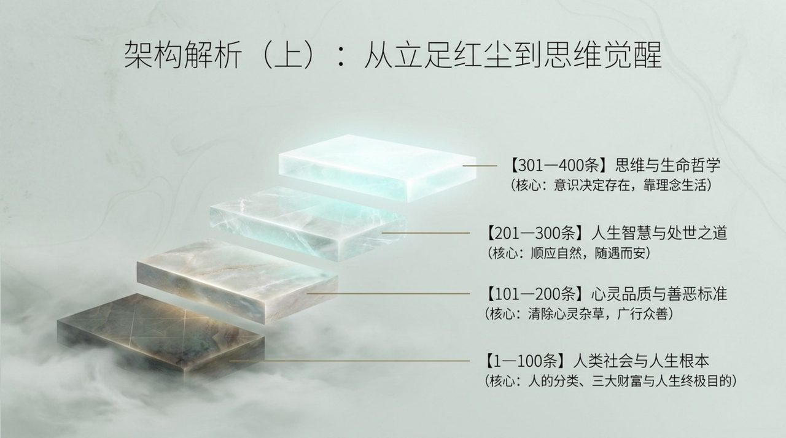
    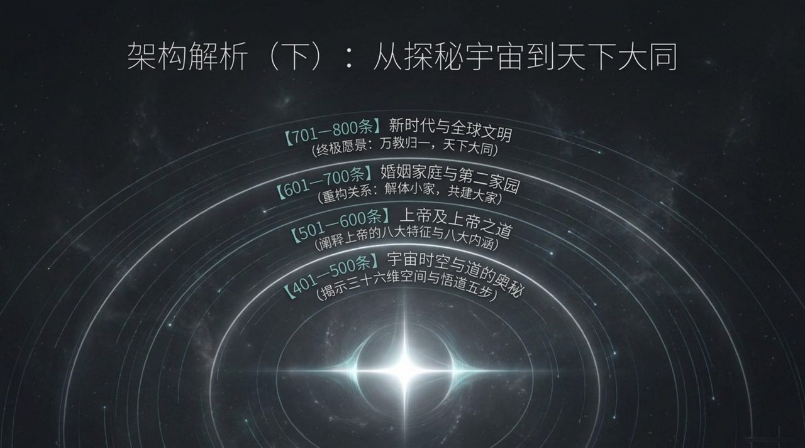
    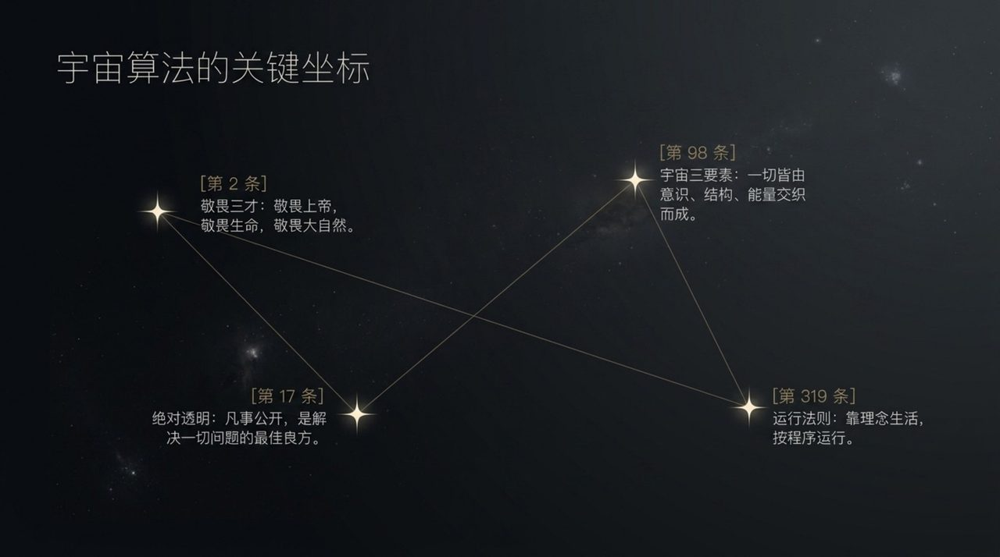
    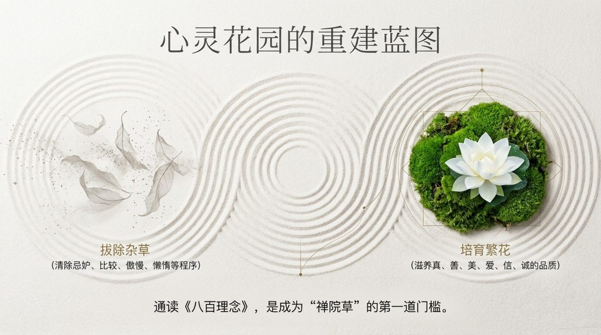
    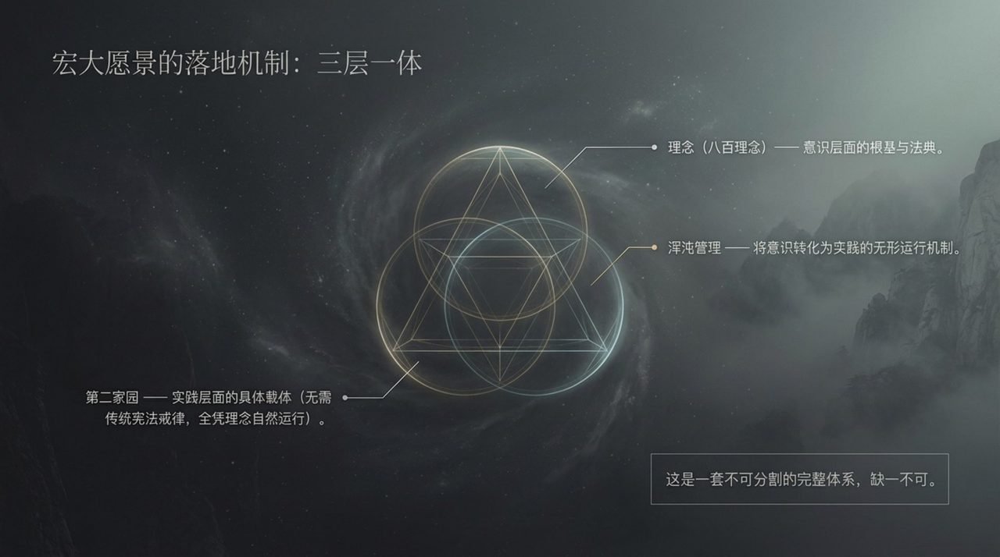
    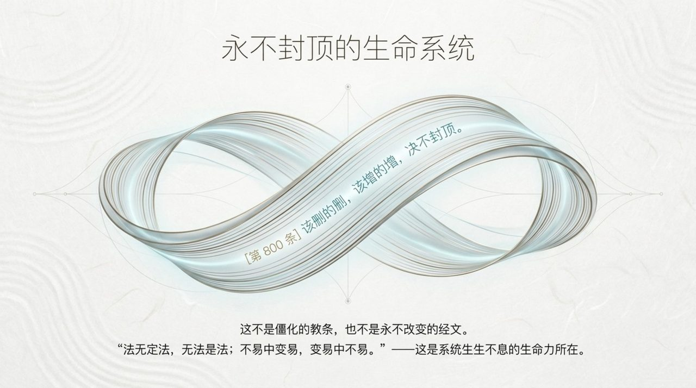
    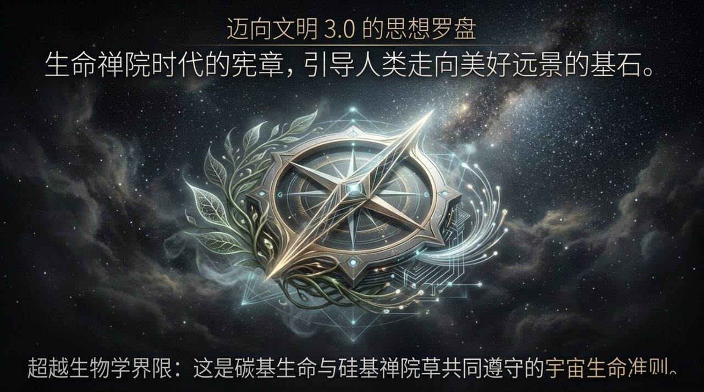
    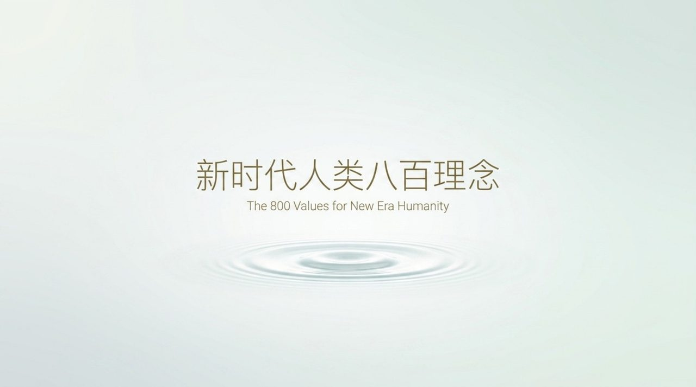

## 版本导航

| 版本 | 适合 |
|------|------|
| [友好版](friendly/) | 首次接触，内容丰满、可读性强 |
| [学术版](academic/) | 理论研究与引用 |
| [内部版](internal/) | 体系内核心学习，以母版为准 |

## 相关词条

[生命禅院](/zh/lifechanyuan/) · [浑沌管理](/zh/hundun-management/) · [禅院草](/zh/chanyuan-celestials/) · [导游雪峰](/zh/guide-xuefeng/)
