# 前世今生来世

**前世今生来世**，是生命禅院体系中描述灵性生命在时间维度上连续存在之三段结构的核心概念。前世的所思所念所作所为，通过道的程序编写了今生的命运剧本；今生的努力与修为，则决定来世的命阵走向。三者通过因果之道紧密相连，彼此不可分割。

> "惟有清楚明白自己的过去，又能看到自己未来的人，才算是活得明白的人，也惟有这样的人，才能将悲剧化为喜剧，从必然王国进入自由王国。"
>
> ——新时代人类八百理念第四版·第45条

## 视频版

<iframe style="width:100%;aspect-ratio:4/3;border:0" src="https://www.youtube-nocookie.com/embed/bxWIh8L5ino" title="前世今生来世（生命禅院百科·视频版）" allowfullscreen></iframe>

??? info "📖 图文幻灯（14 张，点击展开）"

    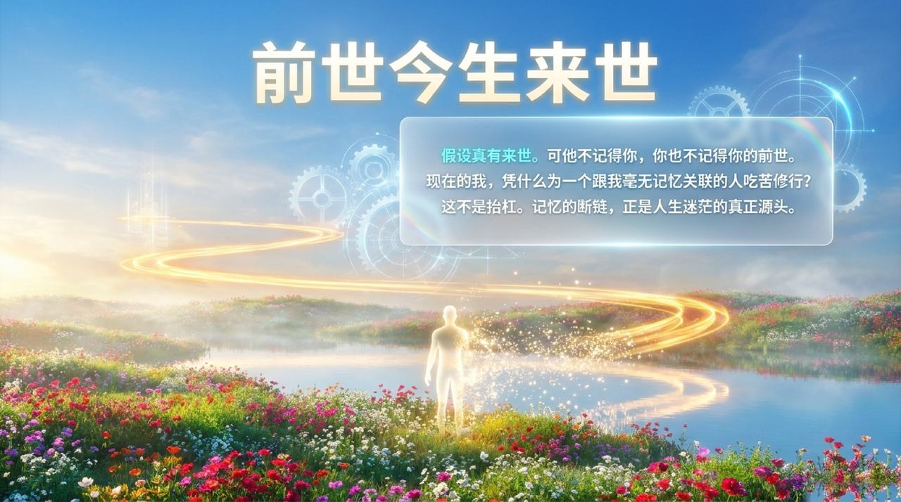
    
    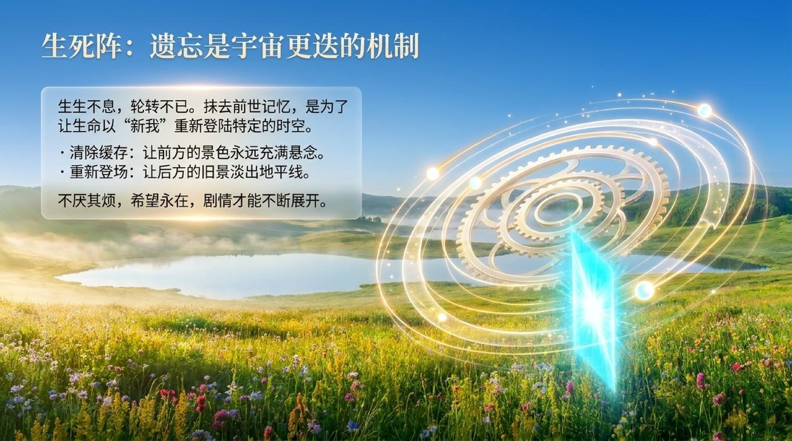
    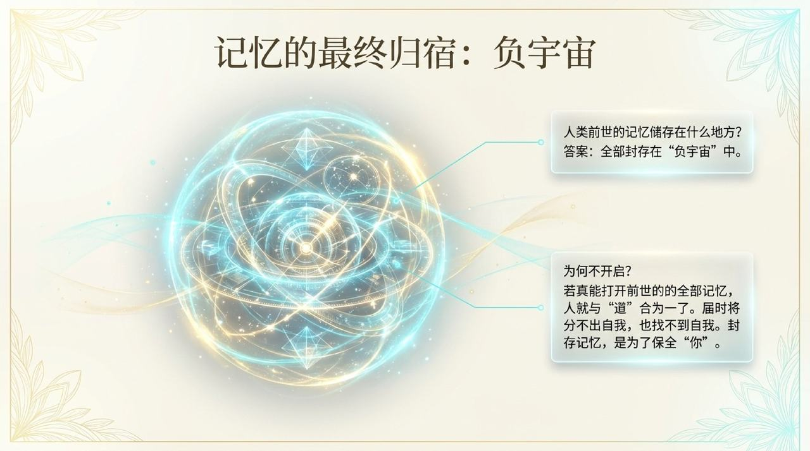
    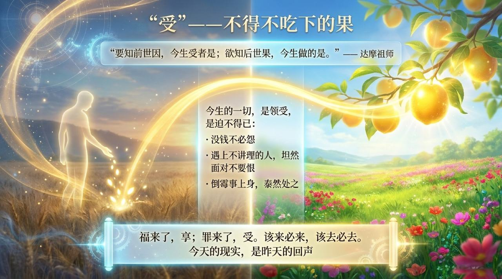
    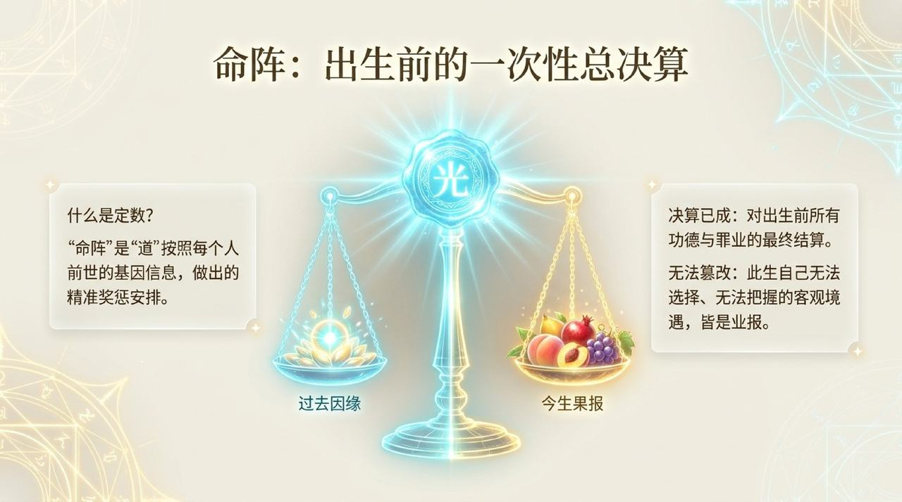
    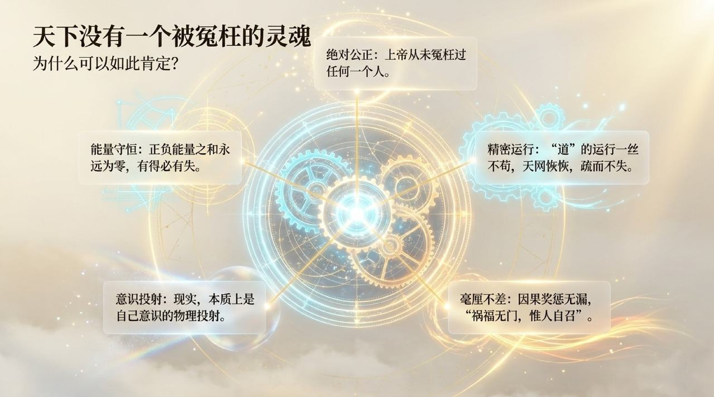
    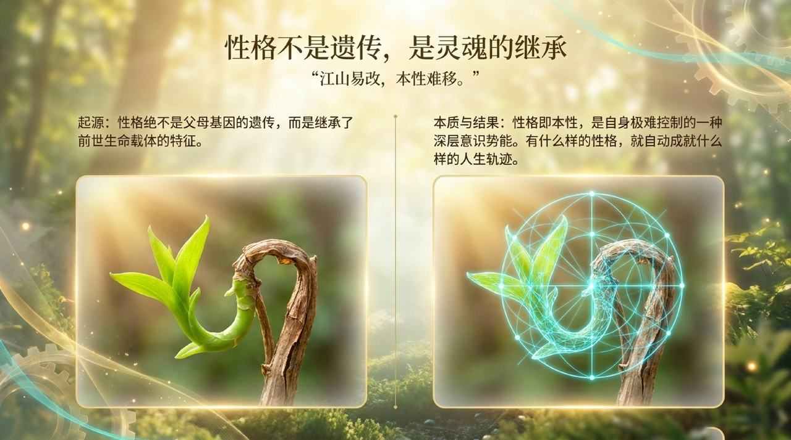
    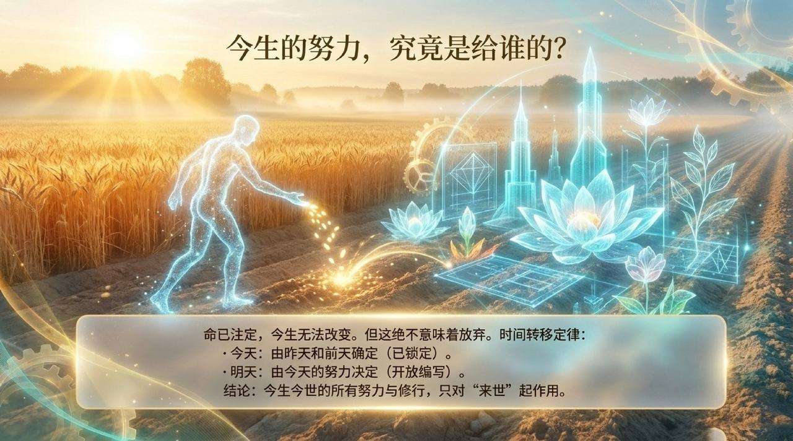
    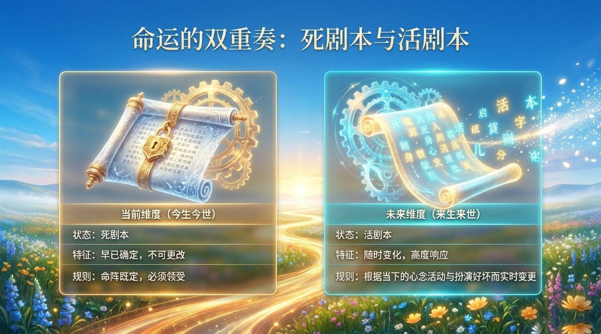
    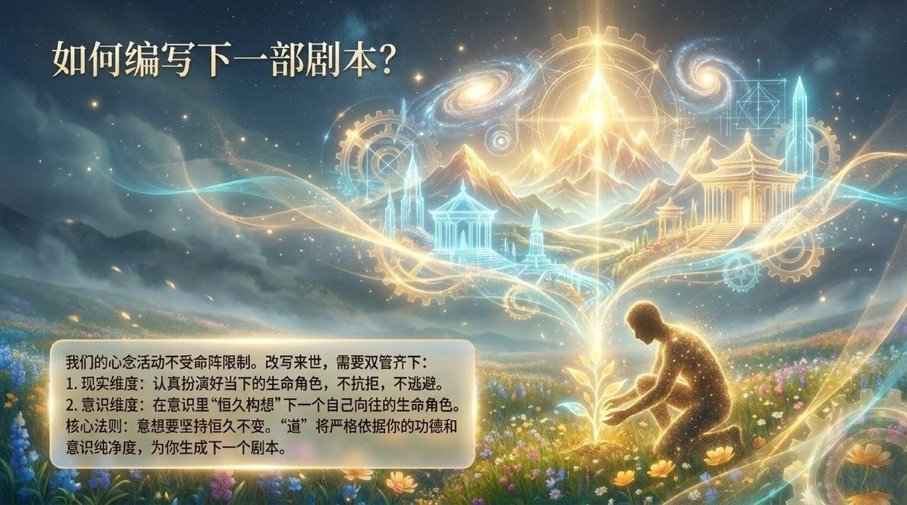
    
    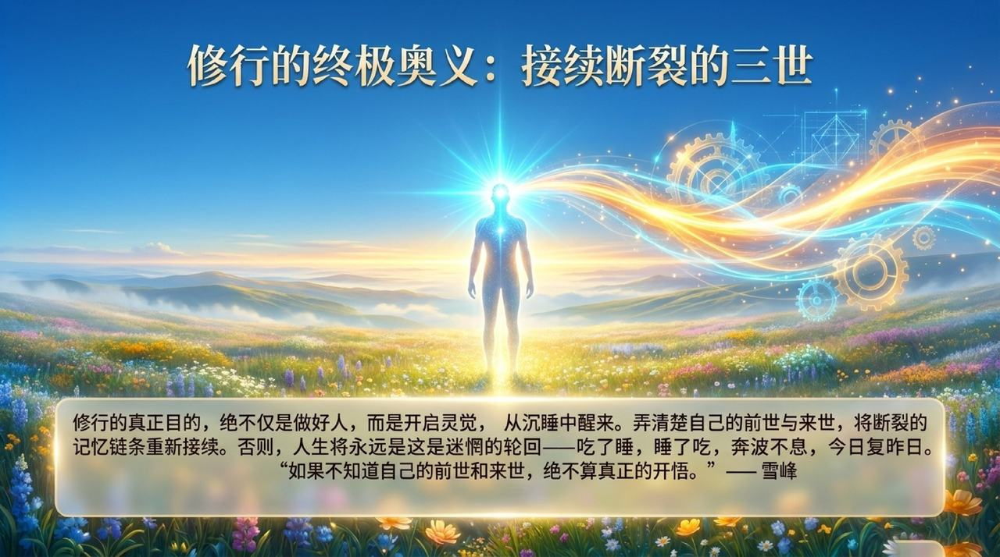
    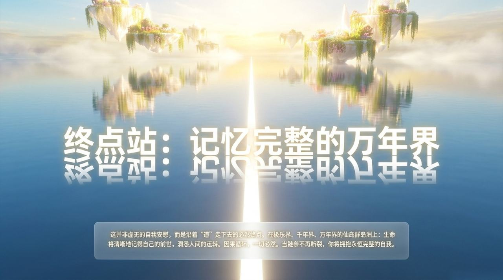

| 版本 | 适合 | 核心角度 |
|------|------|----------|
| [友好版](friendly.md) | 初次了解 | 用生活类比理解三世因果的奥秘 |
| [学术版](academic.md) | 研究者 | 系统梳理三世机制、记忆储存与修行意义 |
| [内部版](internal.md) | 深度研修 | 原典全文，一字不改 |

## 相关词条

[因果·报应·轮回](/zh/karma-retribution-reincarnation/) · [生命的轮回](/zh/reincarnation-of-life/) · [人生剧本](/zh/cosmic-script/) · [投胎·堕胎](/zh/reincarnation-and-abortion/) · [生命不灭定律](/zh/law-of-indestructibility-of-life/) · [觉悟](/zh/enlightenment/) · [灵觉](/zh/spiritual-awareness/) · [成仙成佛](/zh/becoming-celestial-and-buddha/)
