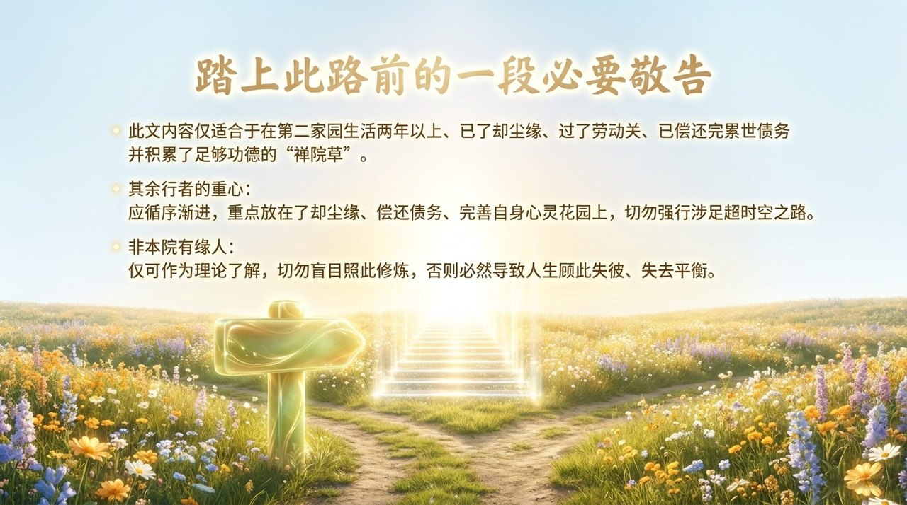
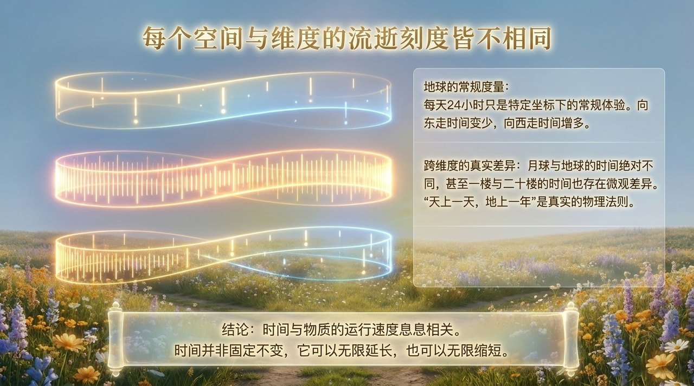
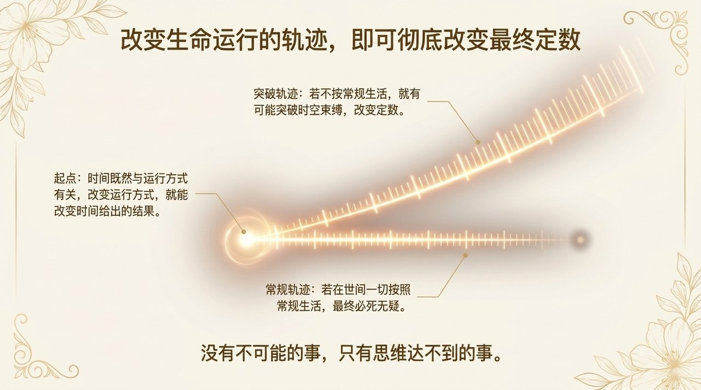
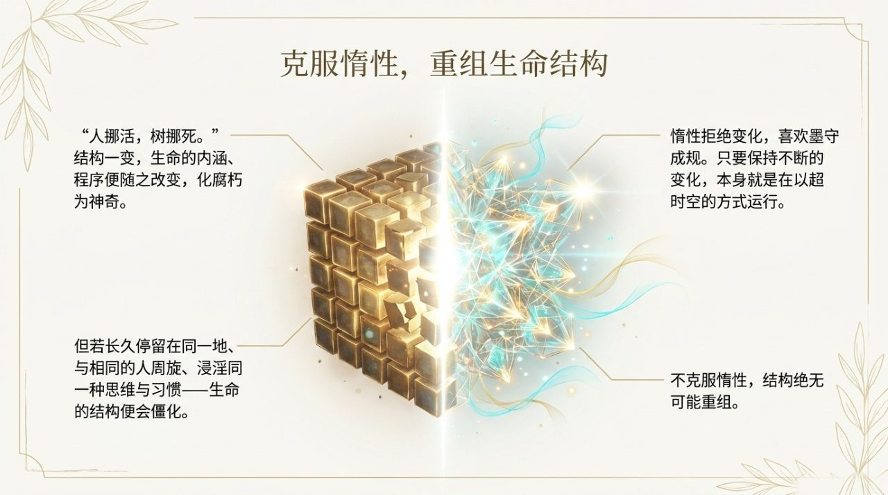
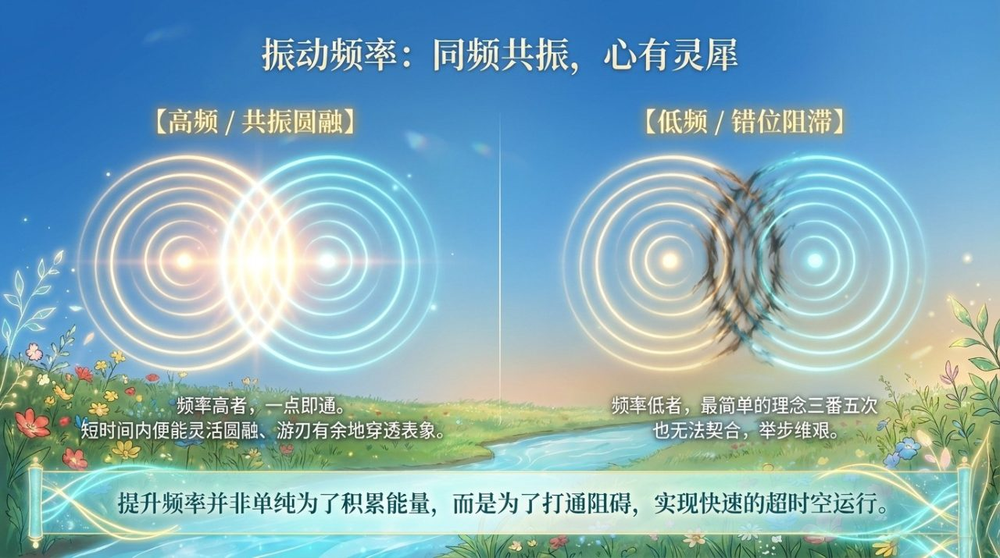
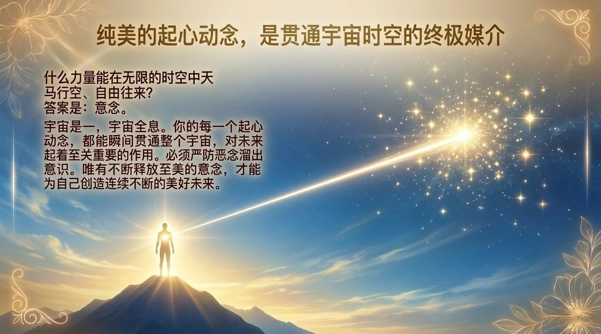
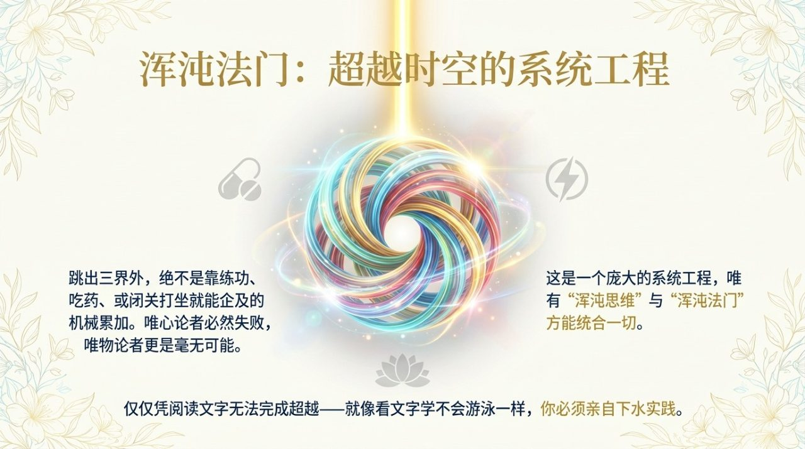

# 超时空之路

> 超越时空是一件非常复杂的事件……这是一个庞大的系统工程，唯心论者必然失败，唯物论者更没有可能，唯有浑沌思维和浑沌法门才有希望走上超时空之路。  
> ——导游雪峰《禅院文集·宇宙时空篇·超时空之路》

**超时空之路**，在生命禅院体系中具有双重含义：其一是历史意义——《超时空之路》是《生命禅院》的前身，是导游雪峰2002年在非洲完成的奠基性著作，后由娥皇草建议改名为"生命禅院"；其二是修炼路径意义——超时空之路指在浑沌思维和浑沌法门指引下，通过第二家园的系统修行修炼，突破物质时间与空间的局限，迈向千年界、万年界、极乐界等高层生命空间的完整工程。

| 版本 | 适合 | 核心角度 |
|------|------|----------|
| [友好版](friendly.md) | 初次了解 | 什么是超时空之路，为何生命禅院就是这条路 |
| [学术版](academic.md) | 研究者 | 时空理论、超越路径与生命结构的系统分析 |
| [内部版](internal.md) | 深度研修 | 完整原典，导游关于超越时空的全部论述 |

## 视频版

<iframe style="width:100%;aspect-ratio:4/3;border:0" src="https://www.youtube-nocookie.com/embed/5q0zPvZXpO4" title="超时空之路（生命禅院百科·视频版）" allowfullscreen></iframe>

??? info "📖 图文幻灯（14 张，点击展开）"

    
    
    
    
    
    
    
    
    
    
    
    
    
    

---

## 相关词条

[时空](/zh/spacetime/) · [高级修炼](/zh/advanced-cultivation/) · [成仙](/zh/becoming-celestial/) · [成佛](/zh/becoming-buddha/) · [提升振动频率](/zh/raise-vibration/) · [浑沌](/zh/hundun/) · [导游路线图](/zh/tour-guide-route/) · [极乐妙境](/zh/elysian-realm/) · [心像思维](/zh/xin-xiang-thinking/) · [第二家园](/zh/second-home/)
