<!-- id: LC-QA-0001-ZH theme: 生命奥秘 type: 词条索引 lang: zh -->

# 情

**情**是镶嵌在生命体反物质结构上的一种反物质能量——兼具意识、结构、能量三大特征，本质是能量；情是自然之道的总表达，维护着宇宙各层生命秩序的天网天阵；情域的宽广直接决定生命层次的高低。

---

## 视频版

<iframe style="width:100%;aspect-ratio:4/3;border:0" src="https://www.youtube-nocookie.com/embed/1wtGZHsIv3M" title="情（生命禅院百科·视频版）" allowfullscreen></iframe>

??? info "📖 图文幻灯（14 张，点击展开）"

    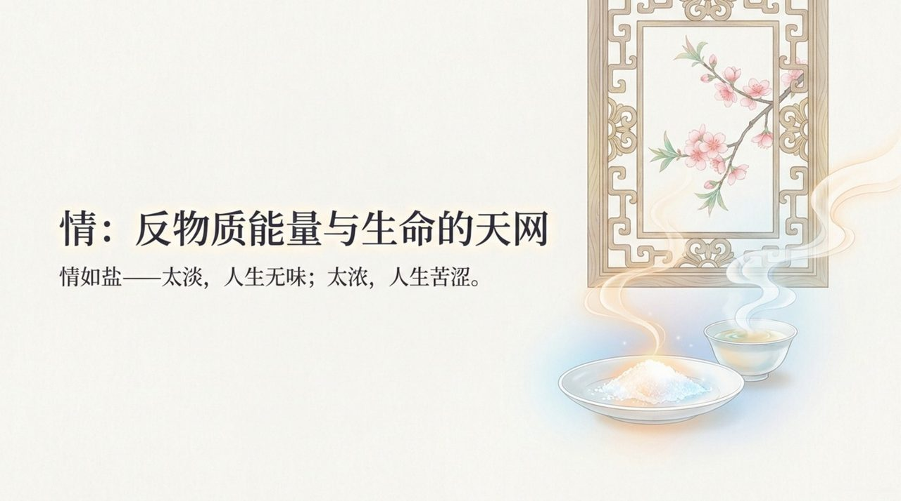
    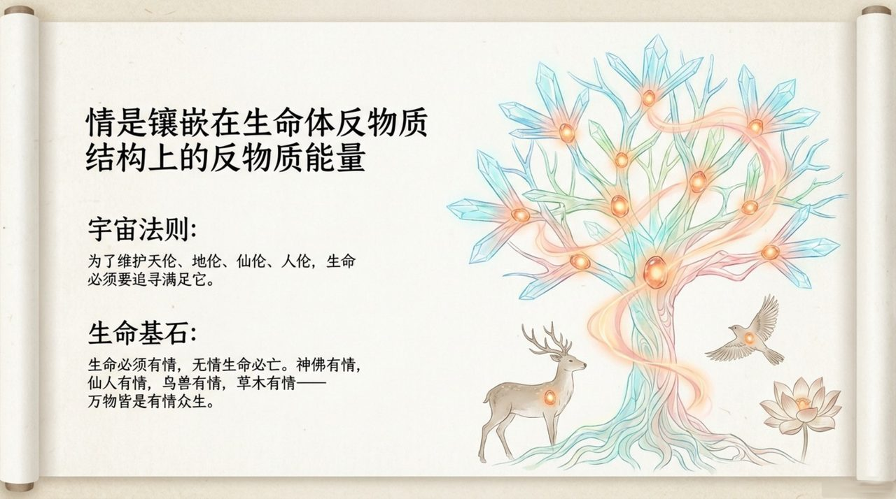
    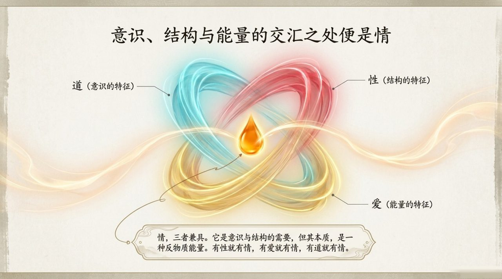
    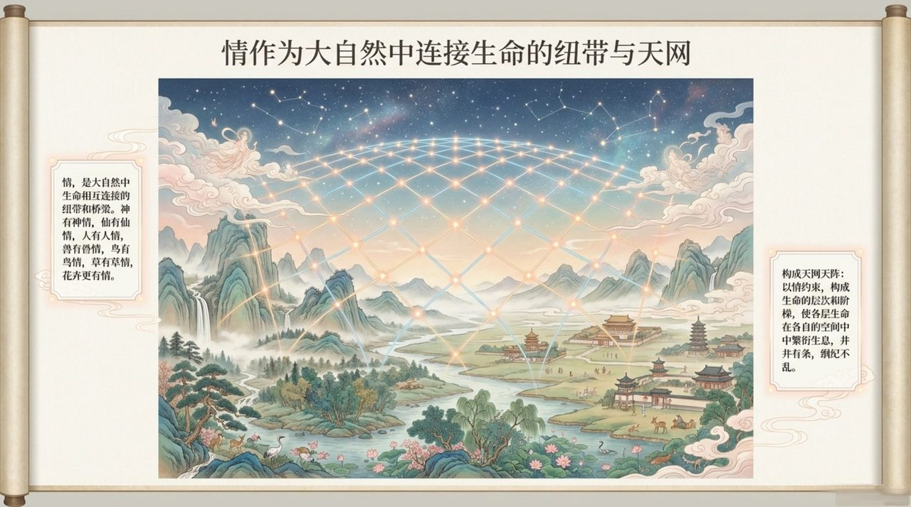
    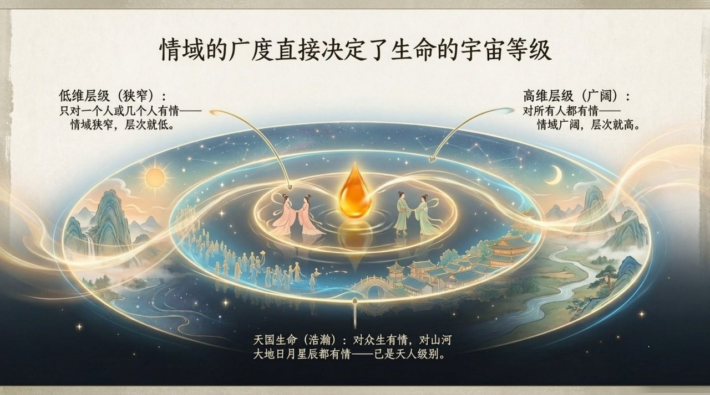
    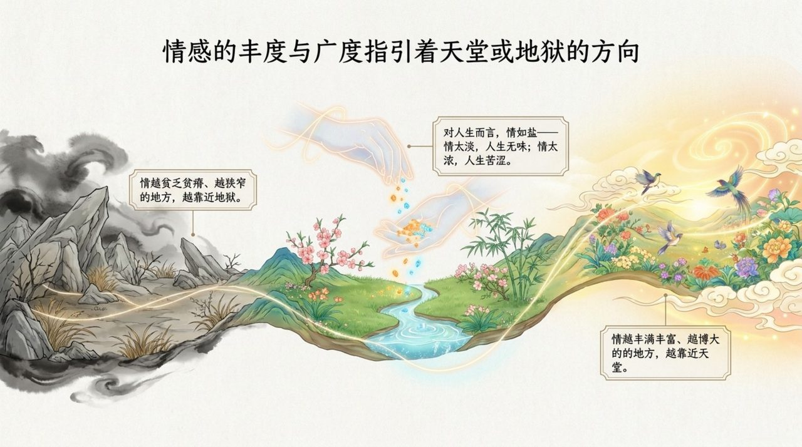
    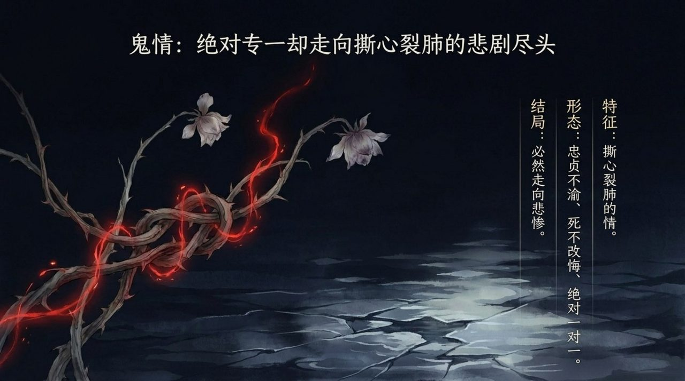
    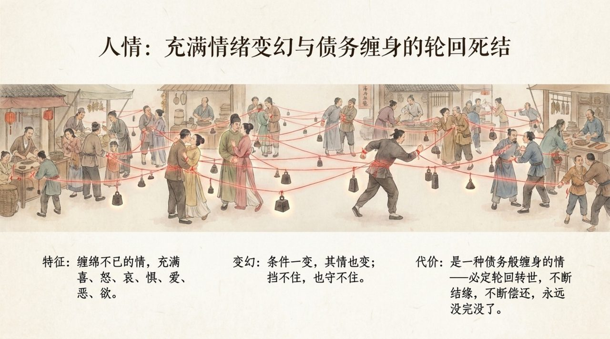
    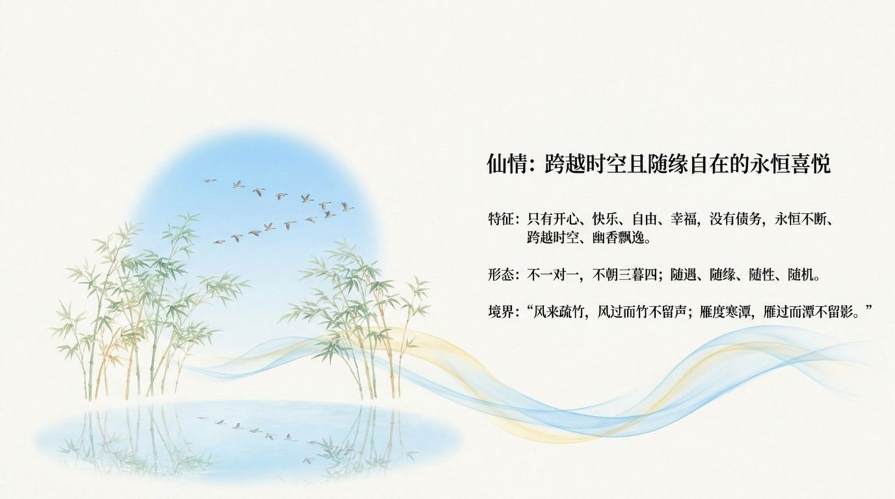
    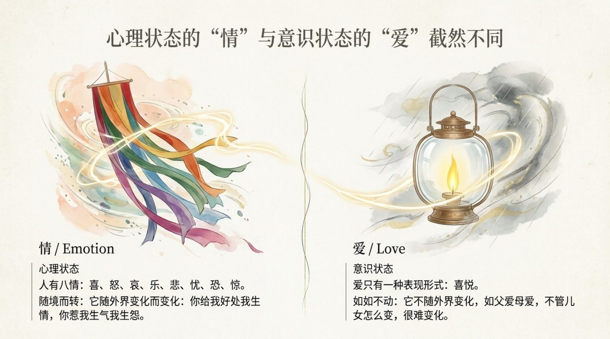
    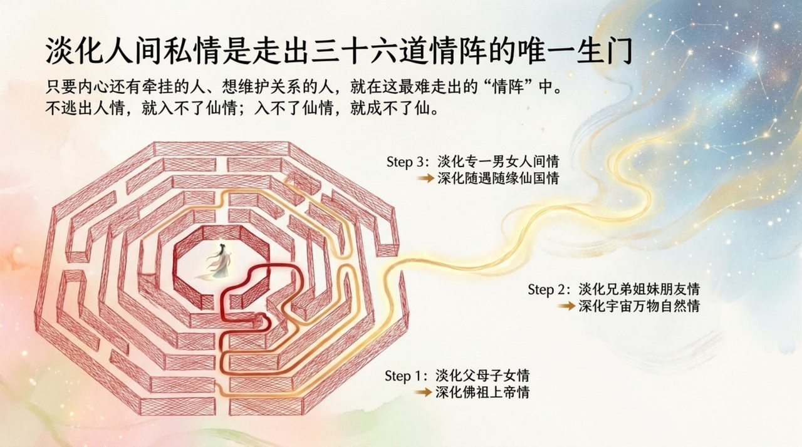
    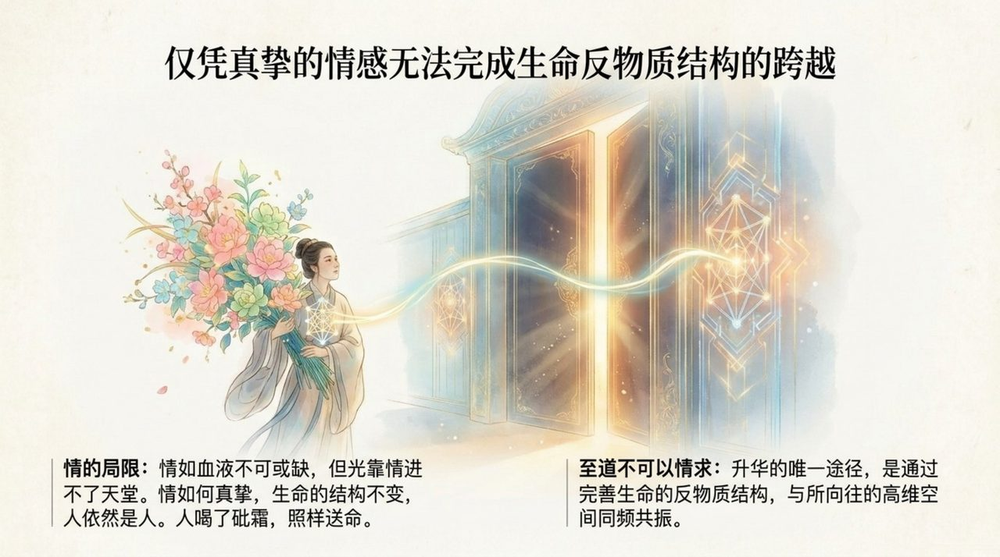
    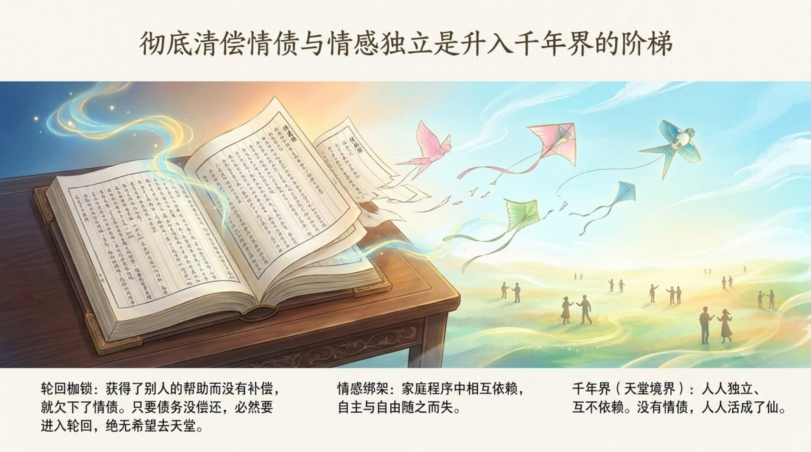
    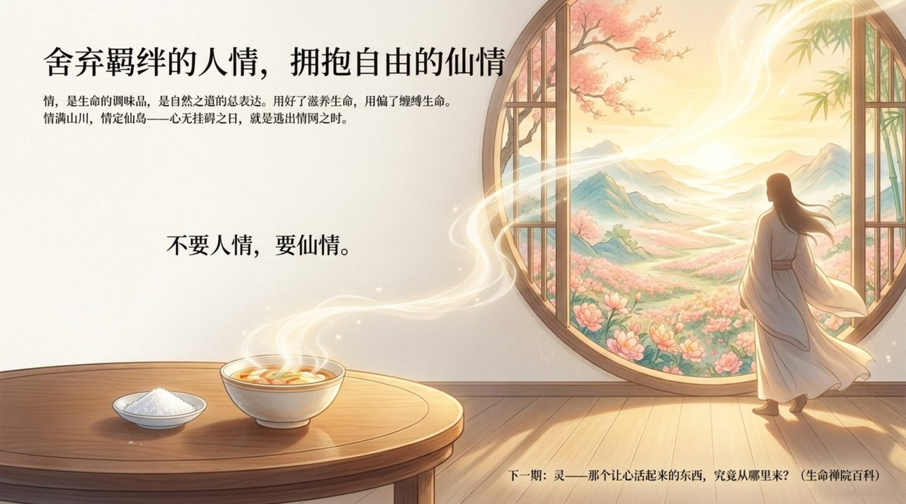

## 版本导览

| 版本 | 适合读者 | 链接 |
|------|----------|------|
| 通俗版 | 初次接触者，想用日常语言理解 | [阅读通俗版](/zh/qing-affection/friendly/) |
| 学术版 | 研究者，需要来源分析与系统梳理 | [阅读学术版](/zh/qing-affection/academic/) |
| 内部版 | 禅院草，需要完整原典引文 | [阅读内部版](/zh/qing-affection/internal/) |

---

## 关联词条

[爱](/zh/love/) · [性](/zh/nature/) · [因果·报应·轮回](/zh/karma-retribution-reincarnation/) · [心](/zh/heart-mind/) · [意识](/zh/consciousness/) · [反物质结构](/zh/antimatter-structure/) · [千年界](/zh/thousand-year-world/) · [无相布施](/zh/formless-giving/)
