# 忏悔

**忏悔**，在生命禅院体系中，是人与创造主——上帝之间的私事，是人认识到自己言行偏离上帝意愿后，用心灵诚恳向上帝诉说过错、祈求宽恕的行为。忏悔不是宗教仪式，不对人，只对上帝，以心灵为唯一媒介。忏悔是净化心灵的有效法门，是消除孽障的一剂良方，是摆脱困境的第一法门，也是升华生命品质的必要条件。

> 忏悔是生命品质升华的必要条件，无忏悔，无升华。

---

## 版本导航

| 版本 | 适合读者 | 入口 |
|------|----------|------|
| 友好版 | 初次接触，希望轻松理解 | [阅读友好版](/zh/repentance/friendly/) |
| 学术版 | 深入研究，系统梳理 | [阅读学术版](/zh/repentance/academic/) |
| 内部版 | 禅院草，研读原典 | [阅读内部版](/zh/repentance/internal/) |

---

## 视频版

<iframe style="width:100%;aspect-ratio:4/3;border:0" src="https://www.youtube-nocookie.com/embed/3z4o-N01R2Y" title="忏悔（生命禅院百科·视频版）" allowfullscreen></iframe>

??? info "📖 图文幻灯（14 张，点击展开）"

    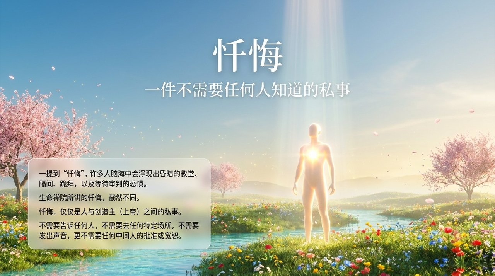
    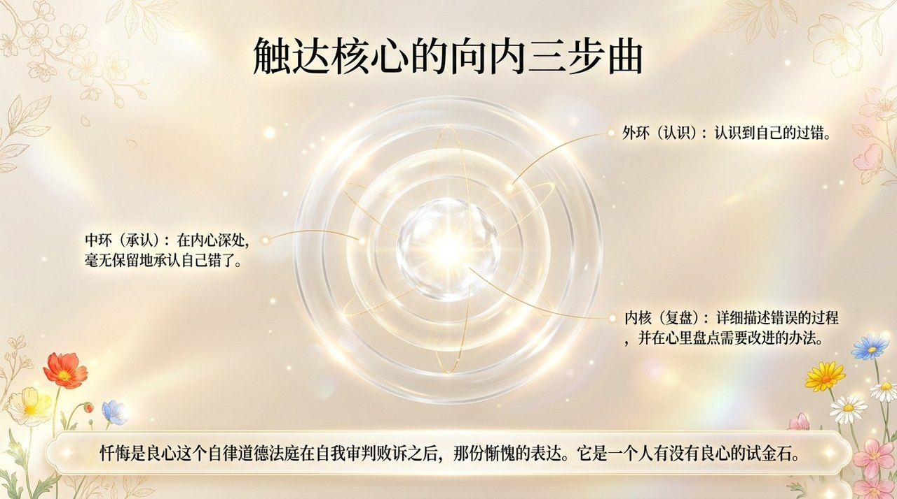
    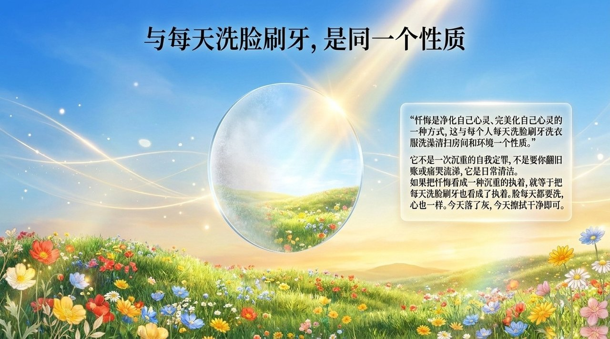
    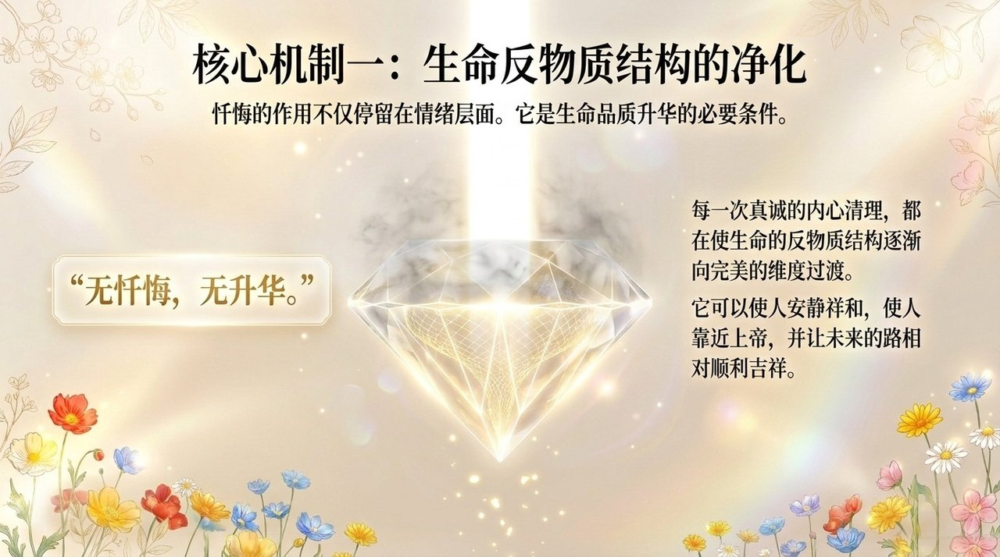
    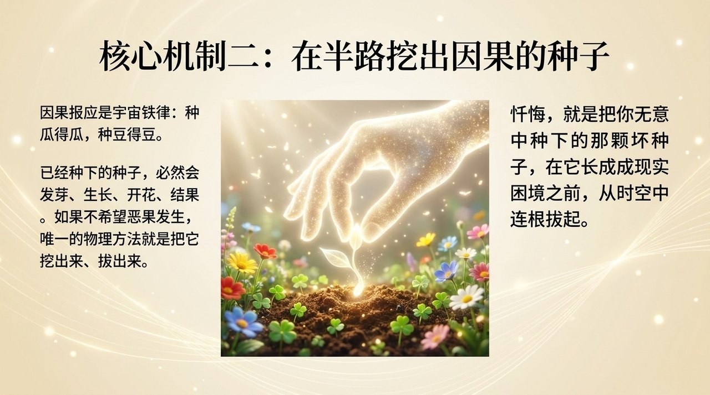
    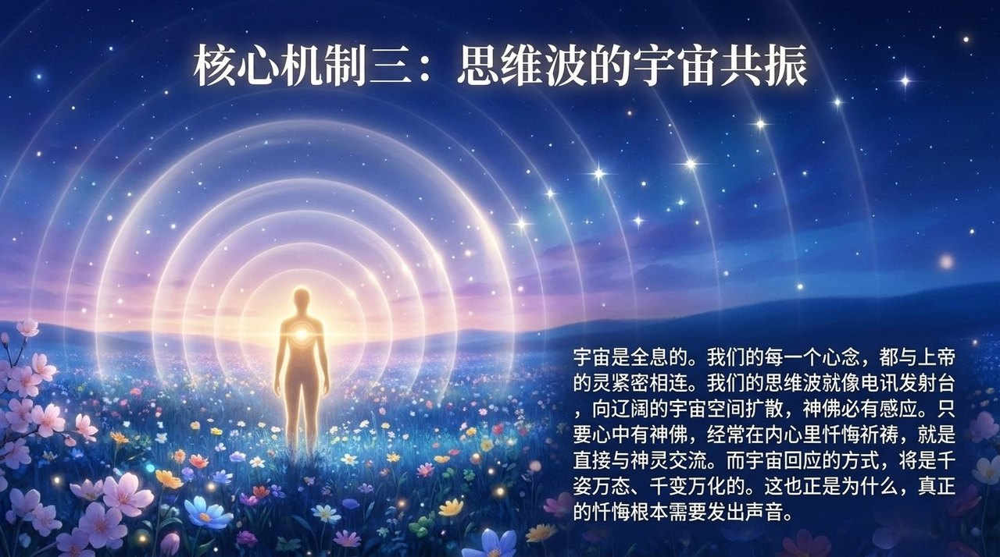
    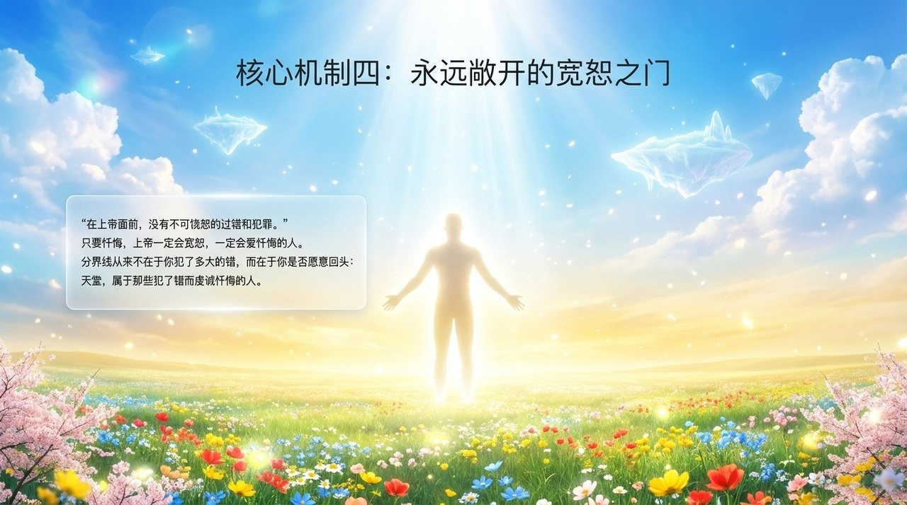
    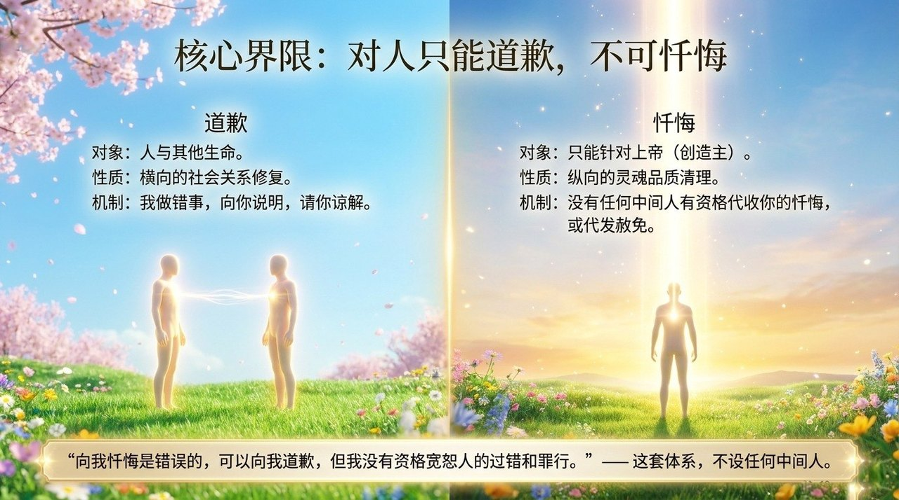
    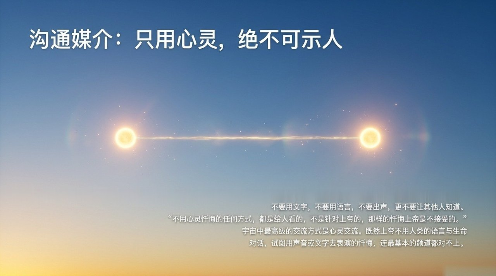
    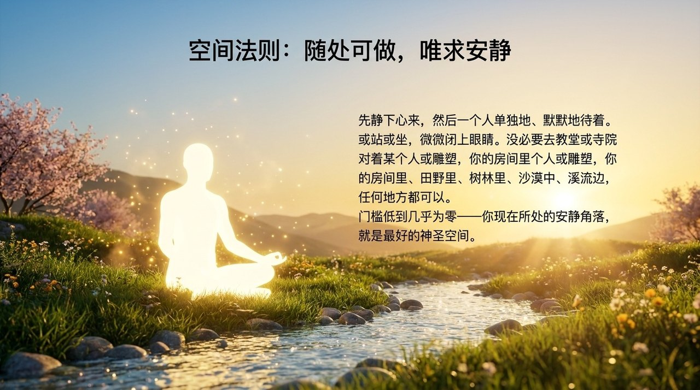
    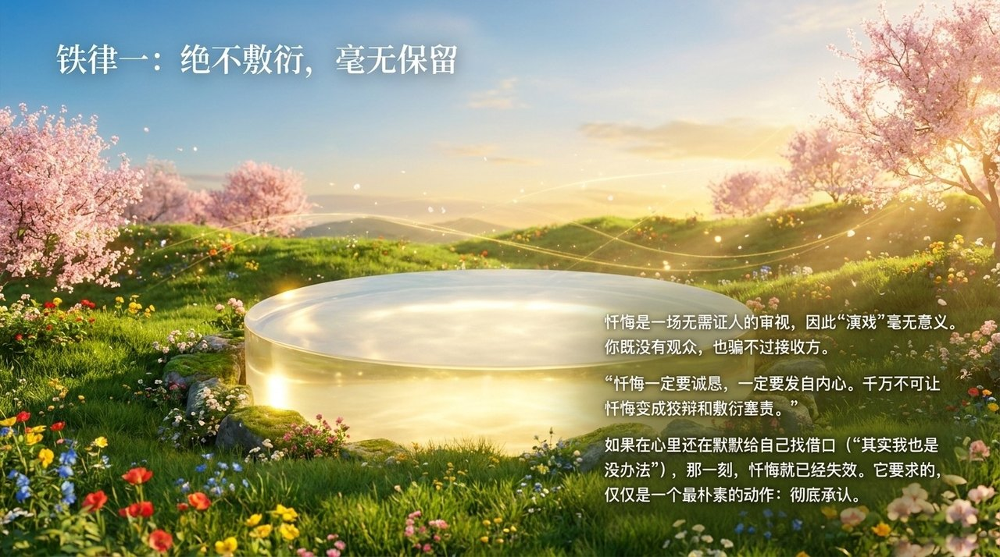
    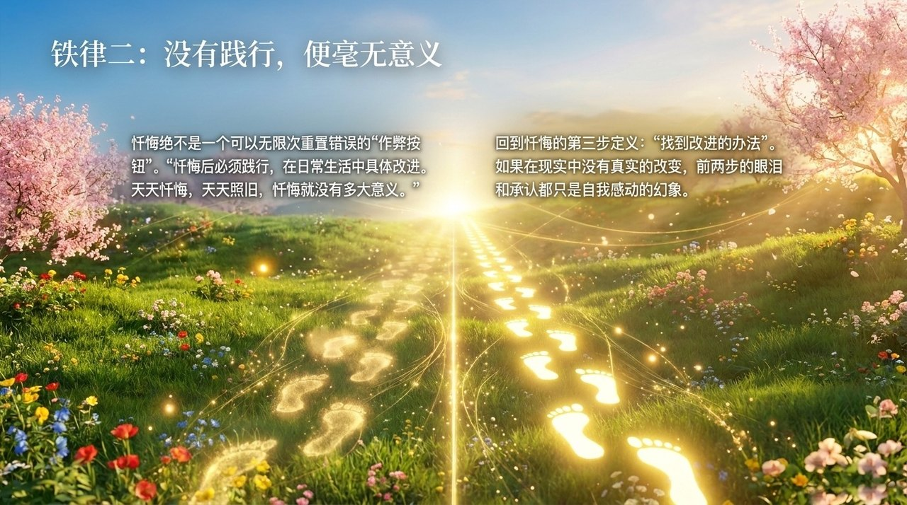
    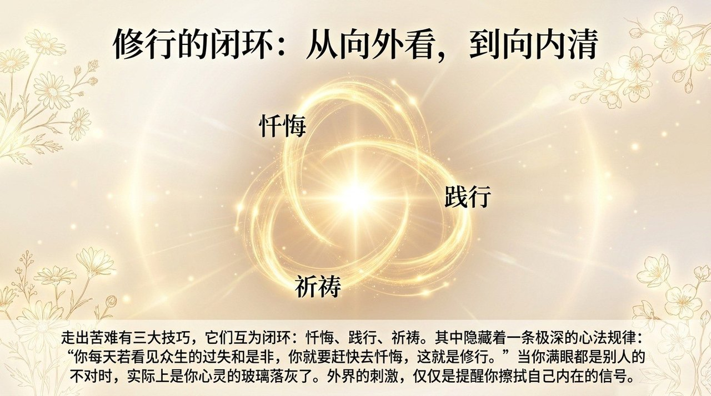
    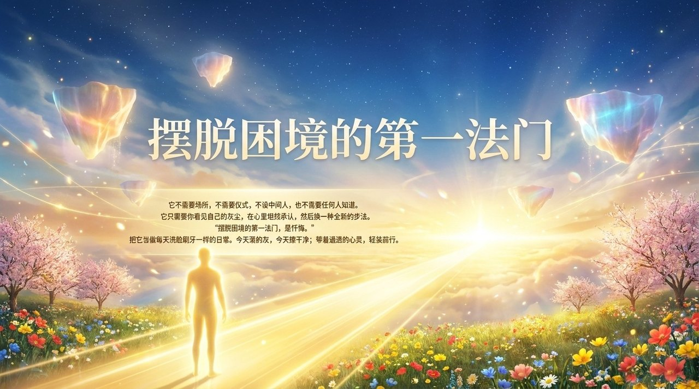

---

## 相关词条

[心灵（总论）](/zh/soul-overview/) · [心灵花园](/zh/soul-garden/) · [觉悟](/zh/awakening/) · [上帝之道](/zh/way-of-the-greatest-creator/) · [提升振动频率](/zh/raise-vibration-frequency/) · [归零](/zh/return-to-zero/) · [感恩](/zh/gratitude/) · [缘](/zh/yuan/)
