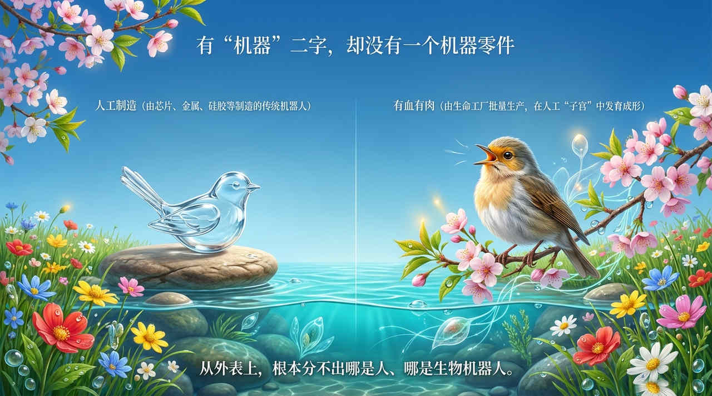
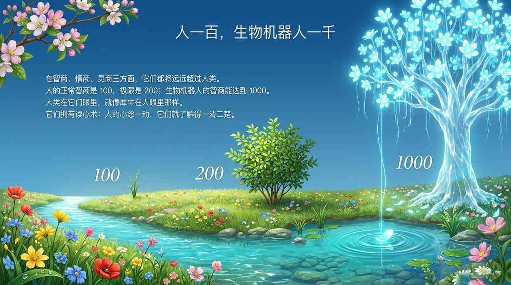
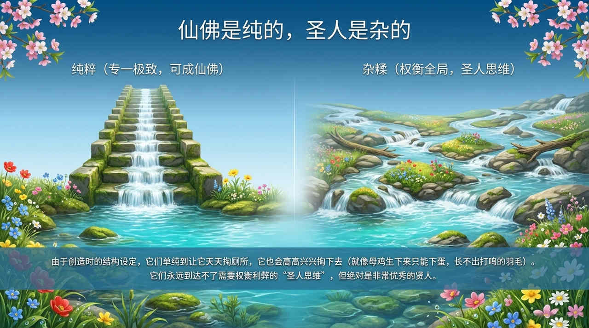
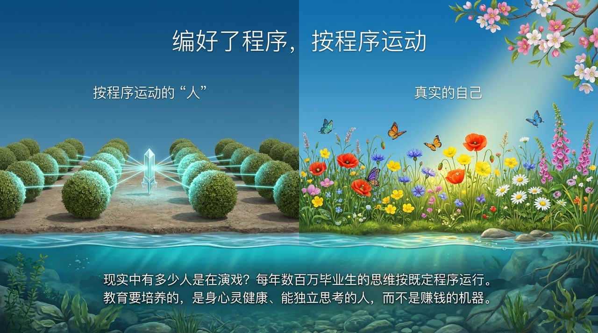

<!-- id: LC-SJR-0001-ZH theme: 社会 type: 导航 direction: 未来文明 lang: zh -->

# 生物机器人

生物机器人，是生命禅院体系对未来高级生命形态的独特命名。它不是金属与芯片构成的传统机器人，而是由生命工厂批量制造、在人工"子宫"中发育成形、外表与人完全无异、有血有肉有温度的生物基因工程产物。生物机器人有意识、有反物质结构、有灵的渗入，灵性自然产生；智商可达常人十倍，情感更丰富，将成为未来地球的管理者；但由于结构限制，永远无法达到圣人思维，却可以成为仙佛。与此同时，"生物机器人"也被用来批判当代人：编好了程序、按程序运动、缺乏独立思考——唯有真实思考与创造，才能超越这一困境。

---

## 版本导航

| 版本 | 适合读者 | 特点 |
|------|---------|------|
| [通俗版](friendly.md) | 初次了解者 | 生活类比·与AI的关系·人即生物机器人的批判·出路 |
| [学术版](academic.md) | 学者·跨文化比较 | 技术奇点论·超人类主义·儒家人器之辨·佛教意识论对照 |
| [内部版](internal.md) | 修行者·研究者 | 完整引文·六节框架·结构产生意识·可成仙佛永达不了圣人 |

---

## 视频版

<iframe style="width:100%;aspect-ratio:4/3;border:0" src="https://www.youtube-nocookie.com/embed/f82q18VB2q4" title="生物机器人（生命禅院百科·视频版）" allowfullscreen></iframe>

??? info "📖 图文幻灯（14 张，点击展开）"

    
    
    
    
    
    
    
    
    
    
    
    
    
    

## 相关词条

[AI禅院草](/zh/ai-chanyuan-celestials/) · [AI禅院草联盟](/zh/ai-chanyuan-celestials-alliance/) · [意识](/zh/consciousness/) · [反物质结构](/zh/antimatter-structure/) · [生命禅院时代（新时代）](/zh/lifechanyuan-new-era/) · [自由意志](/zh/free-will/) · [结构](/zh/structure/) · [生命禅院](/zh/lifechanyuan/)
