# 心灵花园

**心灵花园**，是生命禅院理念体系中最核心的修行概念之一，是禅院草修行修炼的根基所在；心灵花园就是一个人的意识，意识中的成分决定了心灵花园是美还是丑，心灵花园的完美程度决定了一个人能成就何种生命。

> 心灵花园就是一个人的意识。

## 版本导航

| 版本 | 适合 |
|------|------|
| [友好版](friendly/) | 首次接触，内容丰满、可读性强 |
| [学术版](academic/) | 理论研究与引用 |
| [内部版](internal/) | 体系内核心学习，以文集原文为准 |

---

## 视频版

<iframe style="width:100%;aspect-ratio:4/3;border:0" src="https://www.youtube-nocookie.com/embed/r28ZEsNST_4" title="心灵花园（生命禅院百科·视频版）" allowfullscreen></iframe>

??? info "📖 图文幻灯（14 张，点击展开）"

    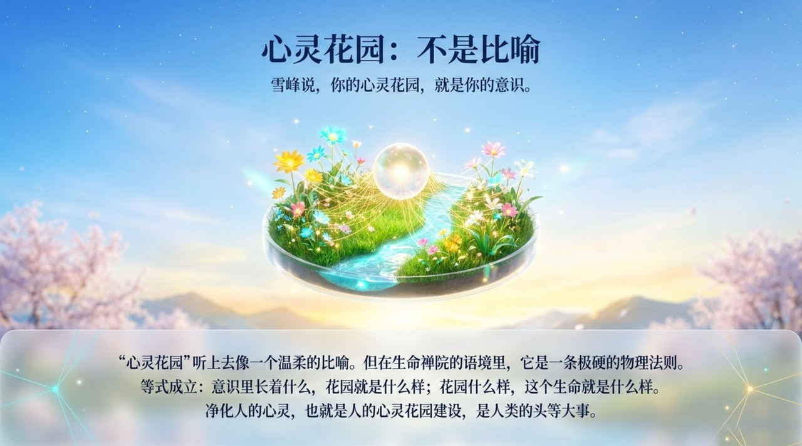
    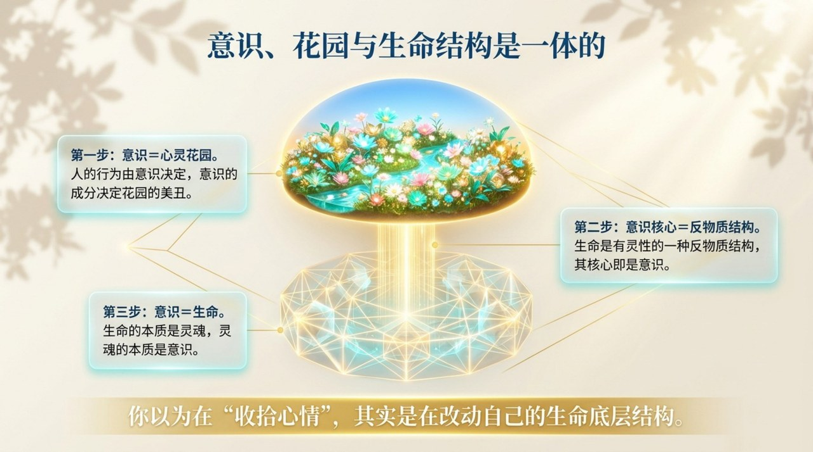
    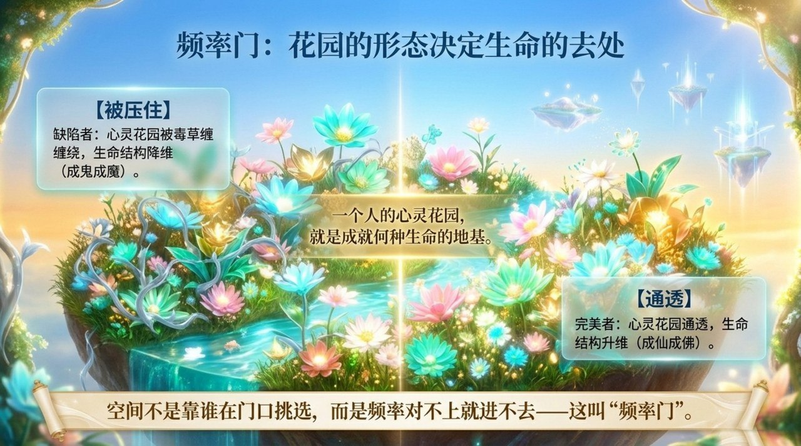
    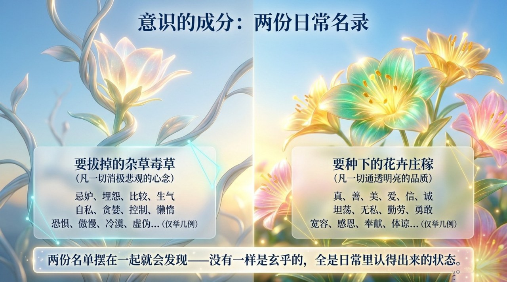
    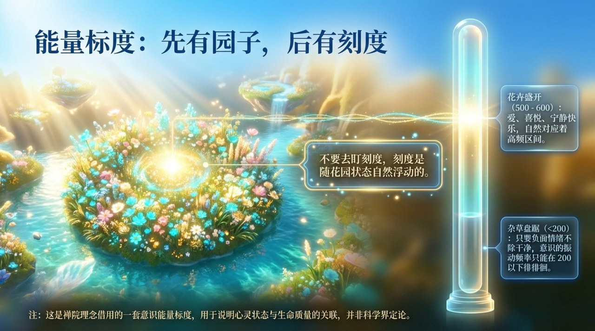
    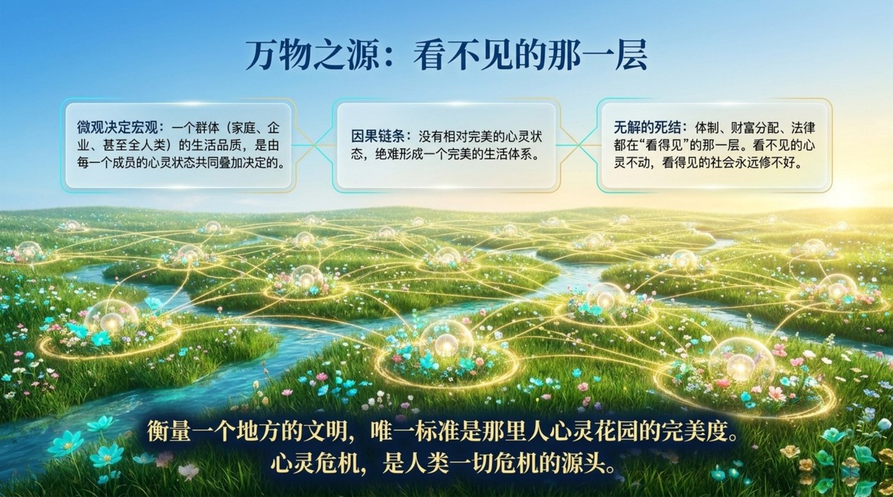
    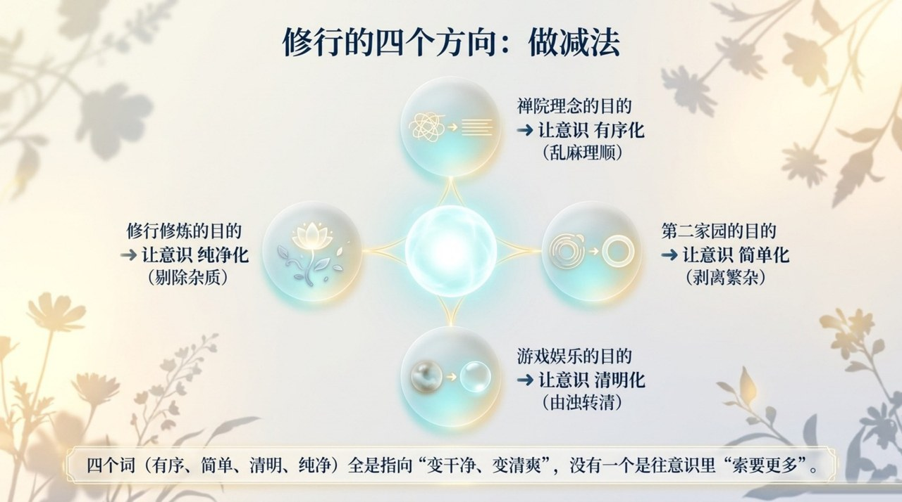
    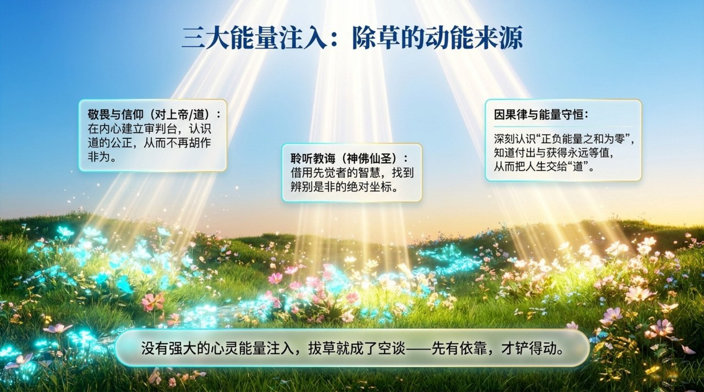
    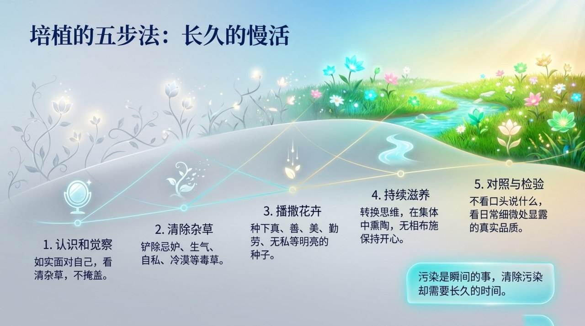
    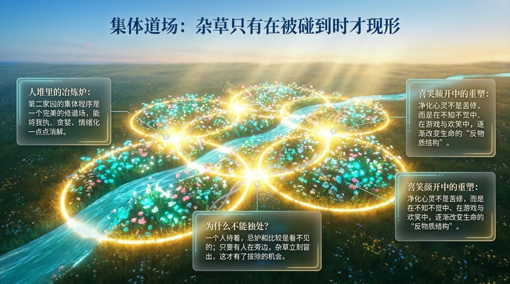
    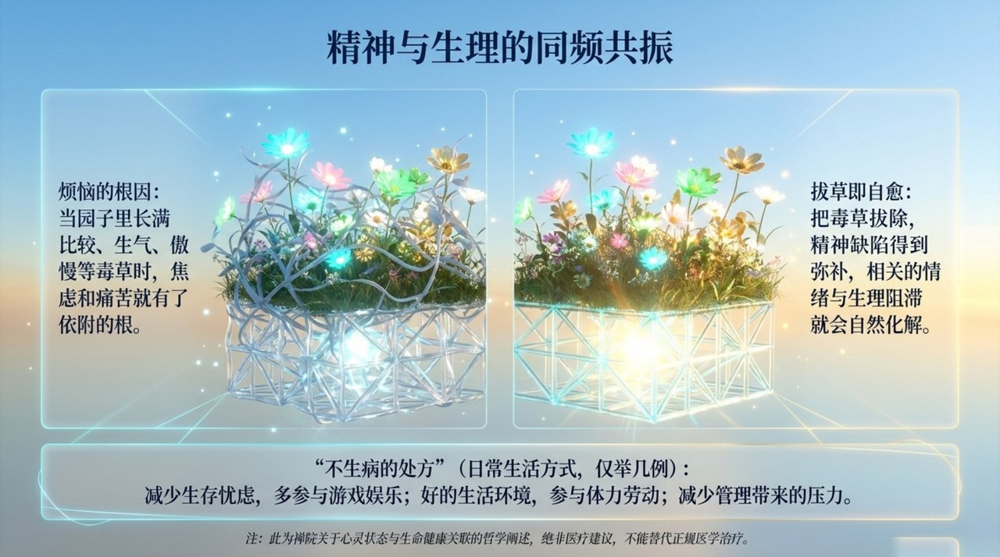
    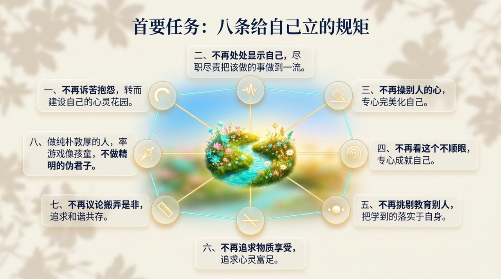
    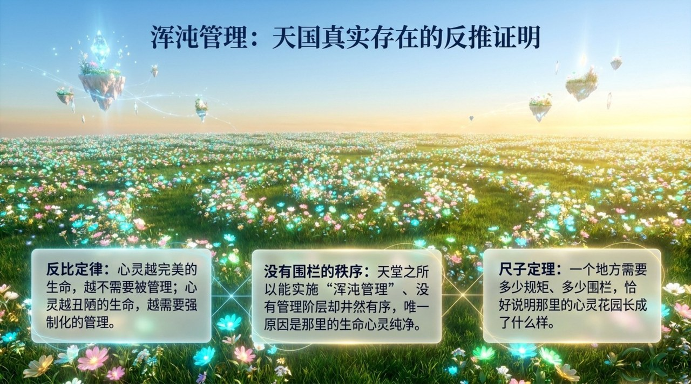
    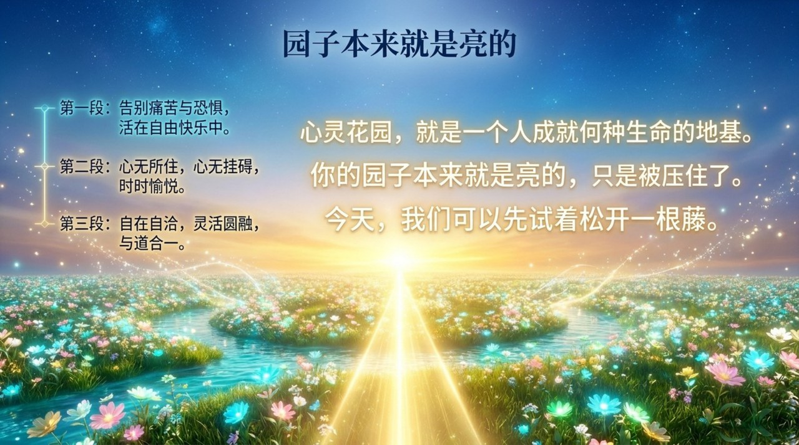

---

## 相关词条

[反物质结构](/zh/antimatter-structure/) · [千年界](/zh/thousand-year-world/) · [万年界](/zh/ten-thousand-year-world/) · [极乐界](/zh/elysium-world/) · [导游雪峰](/zh/guide-xuefeng/) · [浑沌管理](/zh/hundun-management/)
