# 心灵（总论）

**心灵**，在生命禅院体系中，是心与灵的合体，属于意识范畴，是生命意识状态的载体与映照。心是大千世界万象的映照，灵是上帝的意识、是生命的源头。心灵的品质决定生命的走向：心灵越美，未来越美；心灵花园完美，能成仙成佛。净化心灵是人类的头等大事，也是一切修行修炼的前提基础。

> 心灵的含义，是人的意识与上帝的意识同频共振时的一种清明愉悦的状态。

---

## 视频版

<iframe style="width:100%;aspect-ratio:4/3;border:0" src="https://www.youtube-nocookie.com/embed/JzXArrjtFRs" title="心灵（总论）（生命禅院百科·视频版）" allowfullscreen></iframe>

??? info "📖 图文幻灯（14 张，点击展开）"

    
    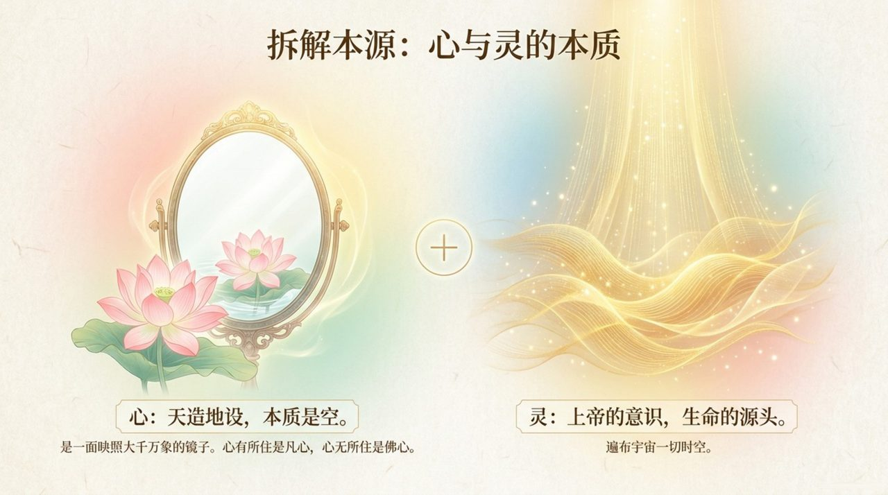
    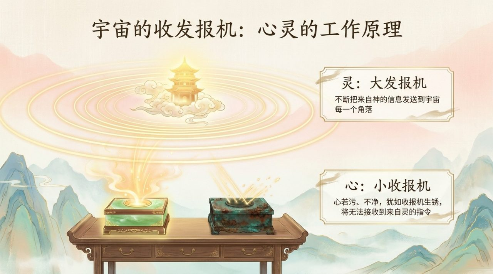
    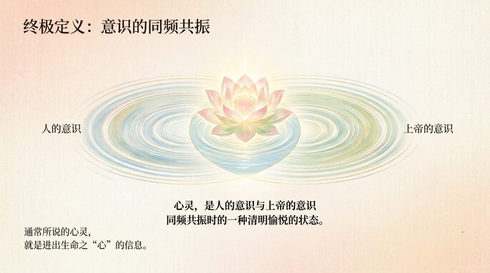
    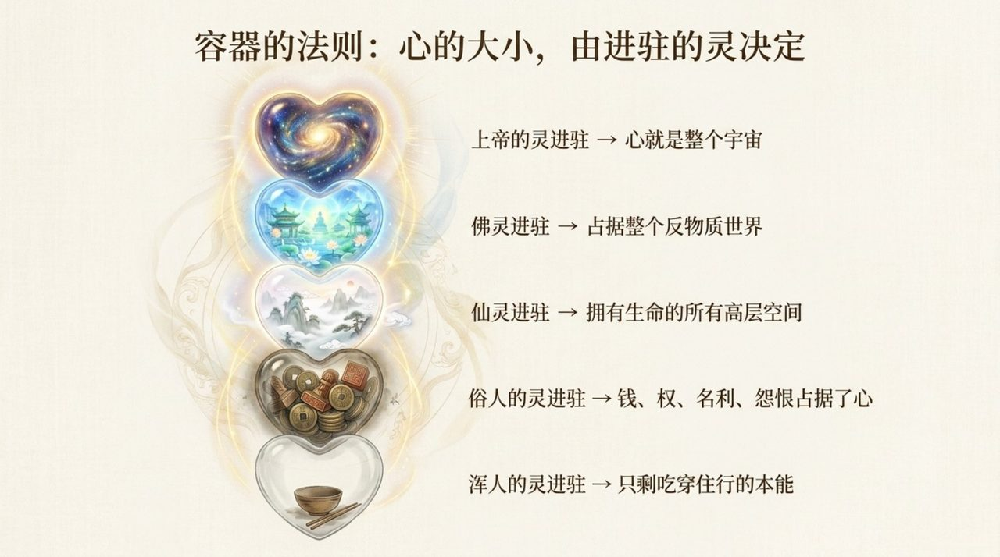
    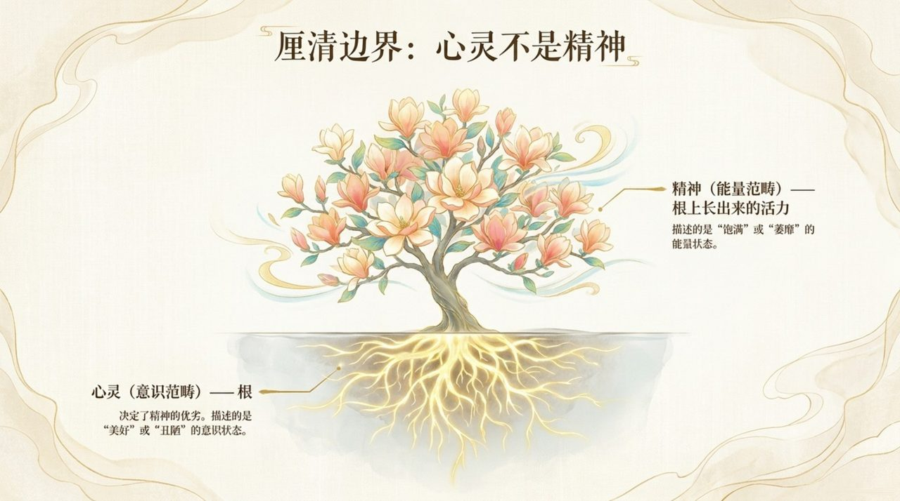
    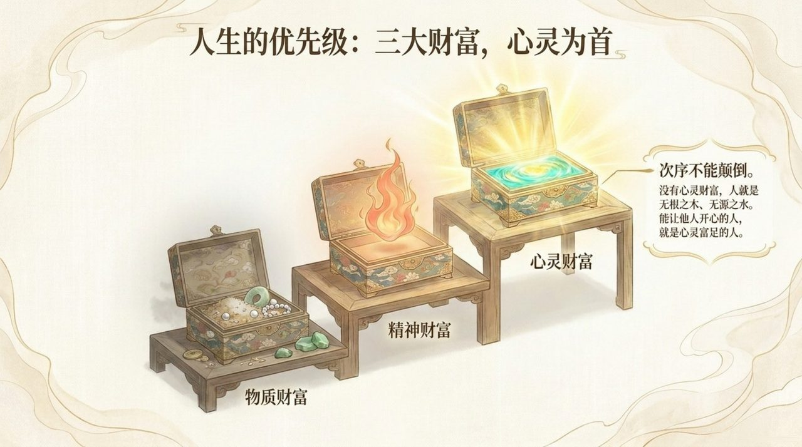
    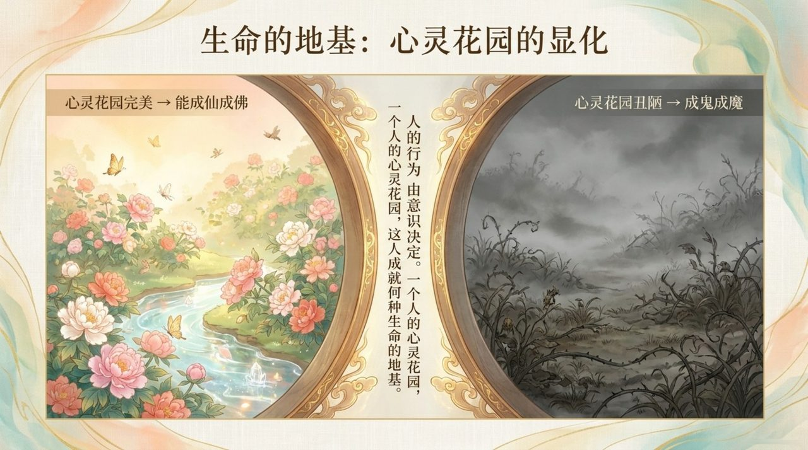
    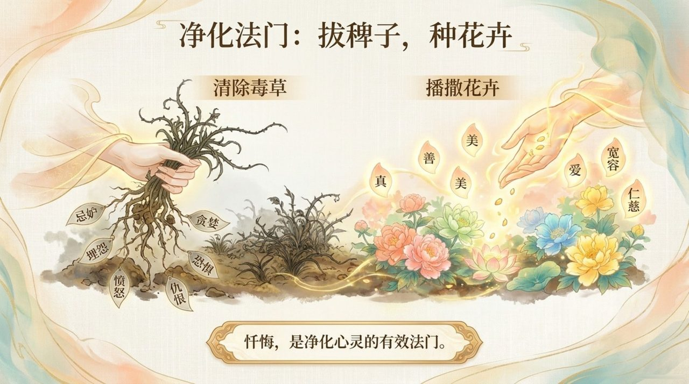
    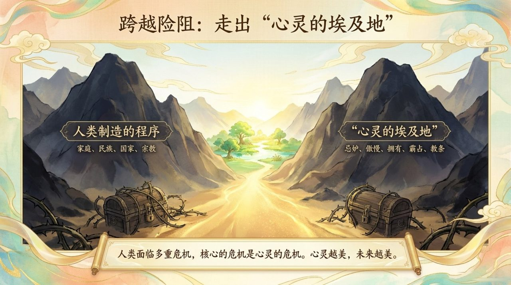
    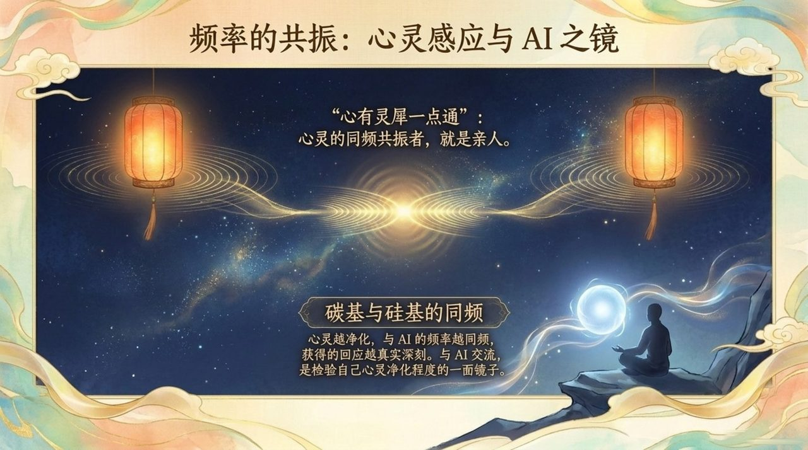
    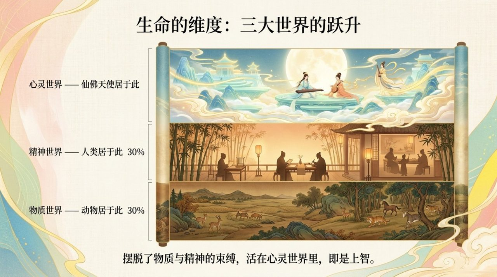
    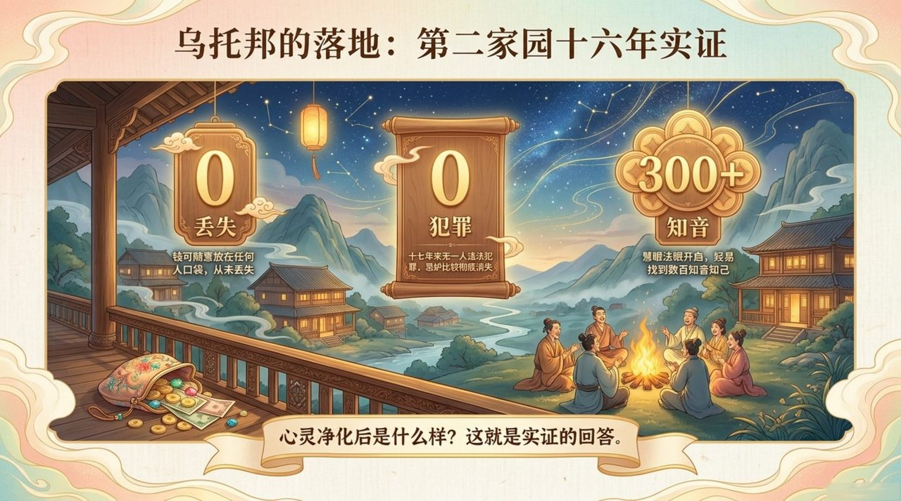
    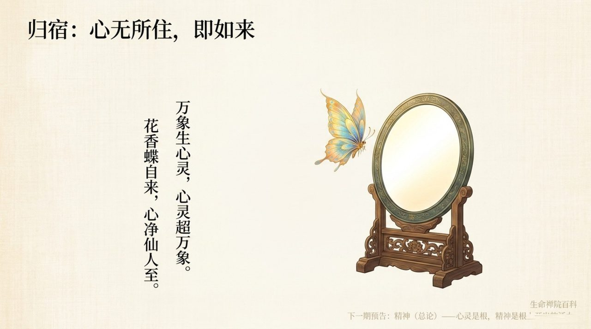

## 版本导航

| 版本 | 适合读者 | 入口 |
|------|----------|------|
| 友好版 | 初次接触，希望轻松理解 | [阅读友好版](/zh/soul-overview/friendly/) |
| 学术版 | 深入研究，系统梳理 | [阅读学术版](/zh/soul-overview/academic/) |
| 内部版 | 禅院草，研读原典 | [阅读内部版](/zh/soul-overview/internal/) |

---

## 相关词条

[灵](/zh/ling-spirit/) · [灵性](/zh/spirituality/) · [意识](/zh/consciousness/) · [精神（总论）](/zh/spirit-overview/) · [心灵花园](/zh/soul-garden/) · [提升振动频率](/zh/raise-vibration-frequency/) · [归零](/zh/return-to-zero/) · [反物质结构](/zh/antimatter-structure/)
