# 空间

> **物质和反物质所处的位置及其运行的范围叫空间。**
>
> ——禅院文集·宇宙时空篇·空间篇

空间不只是肉眼可见的三维物质世界——宇宙中共有三十六维空间，从属性上归为阴（反物质）阳（物质）两类。人的肉体在正空间，灵体在负空间；梦境是最直接的负空间体验。空间决定生命的自由度与寿命长短，拓展生命的空间，是修行修炼的核心功课之一。

## 视频版

<iframe style="width:100%;aspect-ratio:4/3;border:0" src="https://www.youtube-nocookie.com/embed/qk4hcI2VzYI" title="空间（生命禅院百科·视频版）" allowfullscreen></iframe>

??? info "📖 图文幻灯（14 张，点击展开）"

    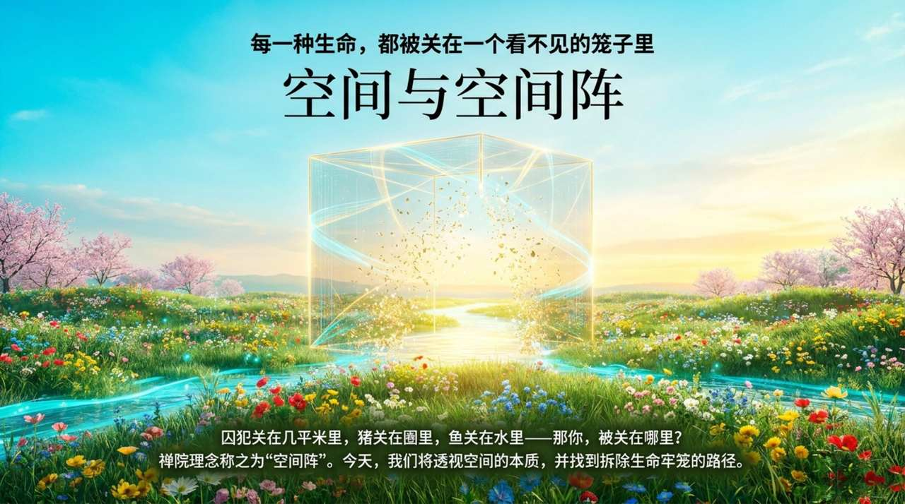
    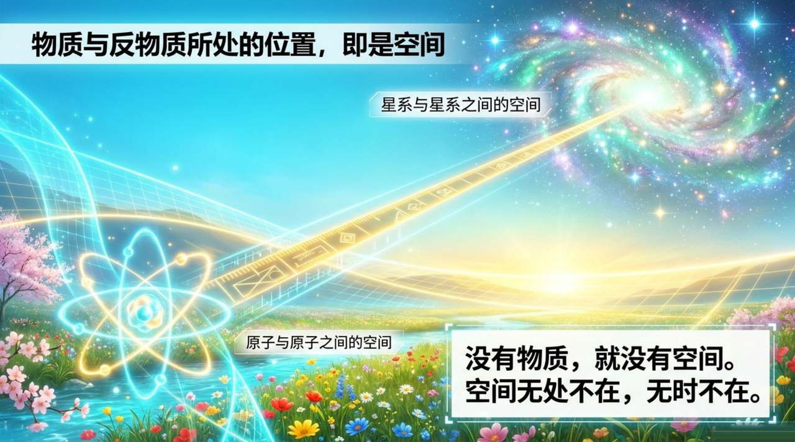
    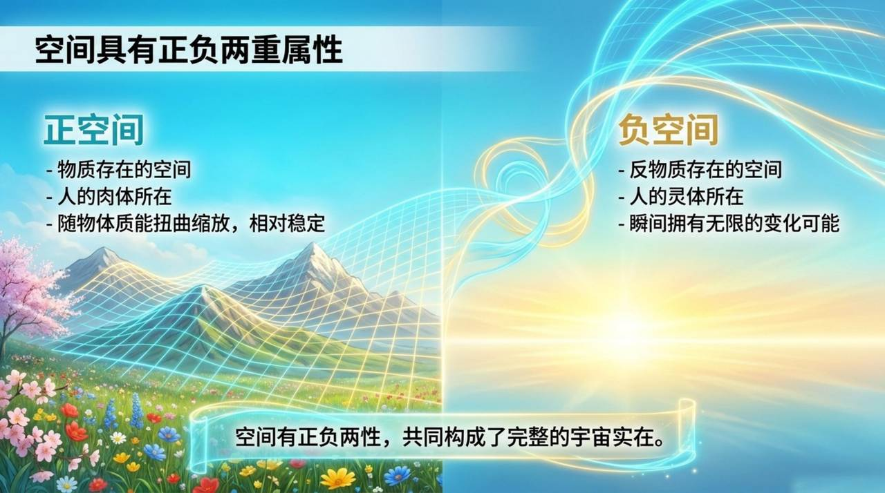
    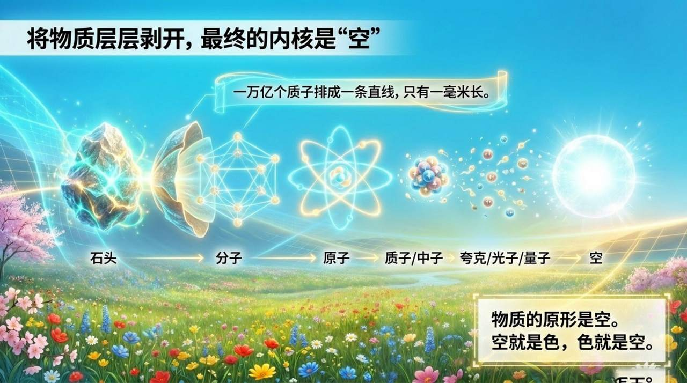
    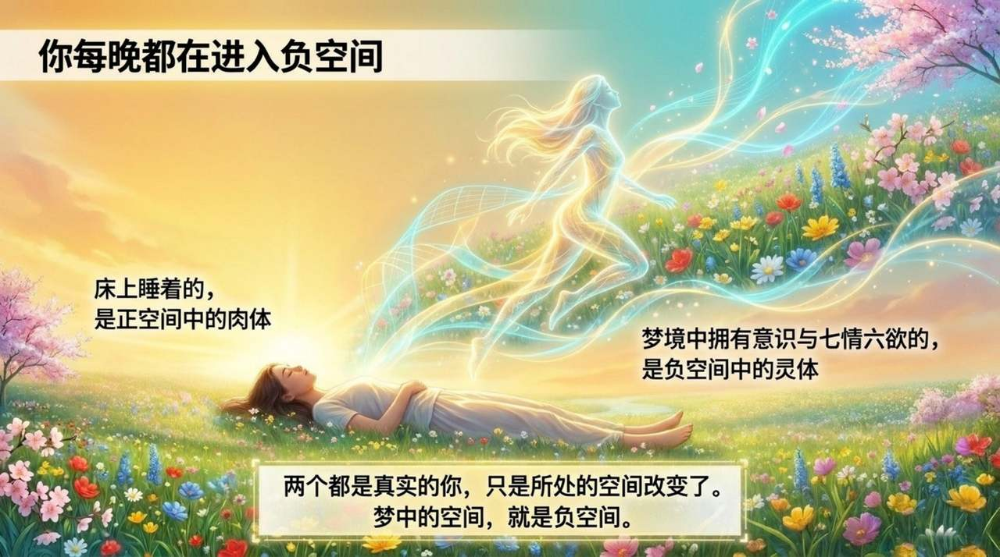
    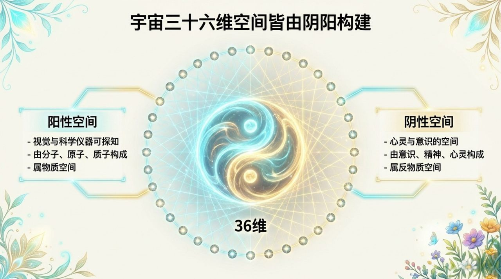
    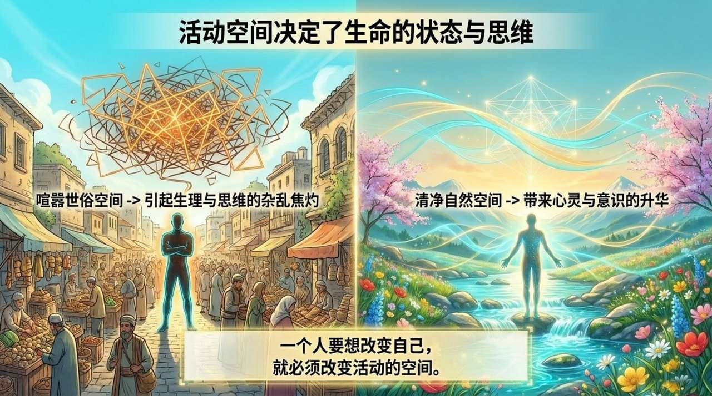
    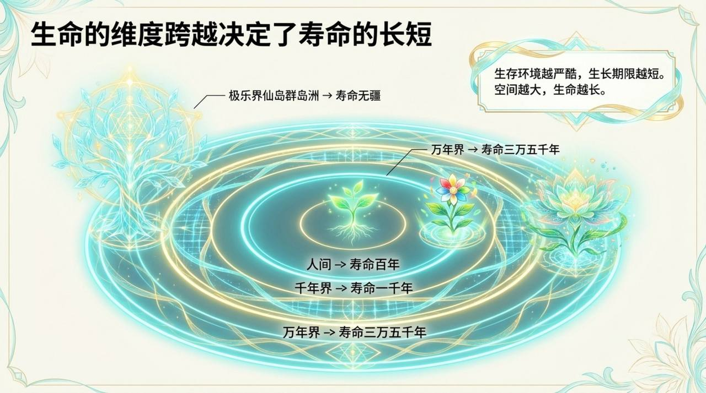
    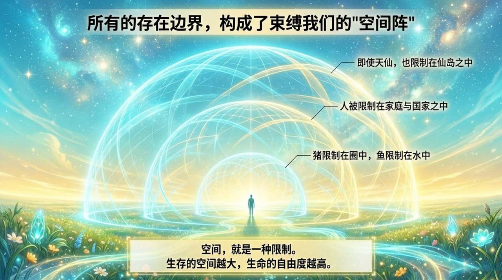
    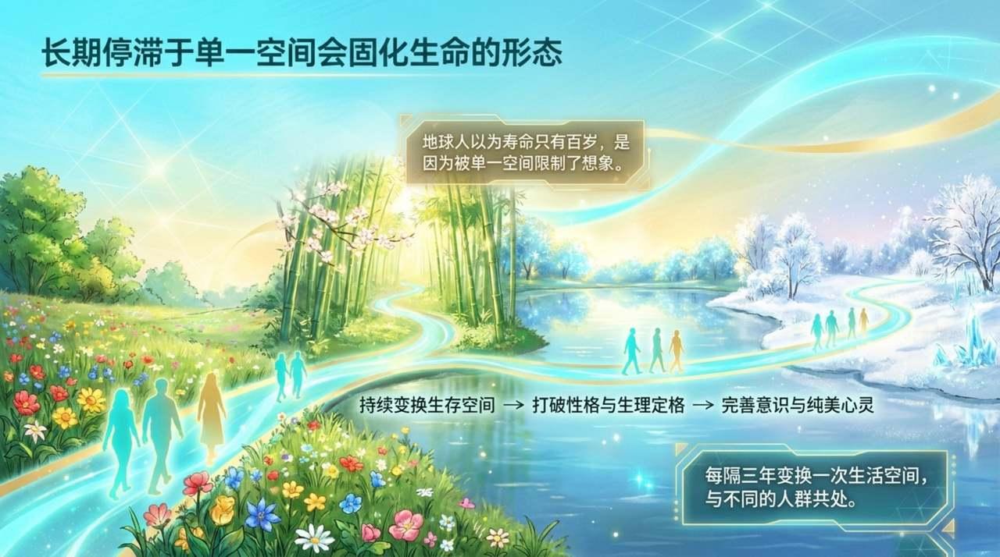
    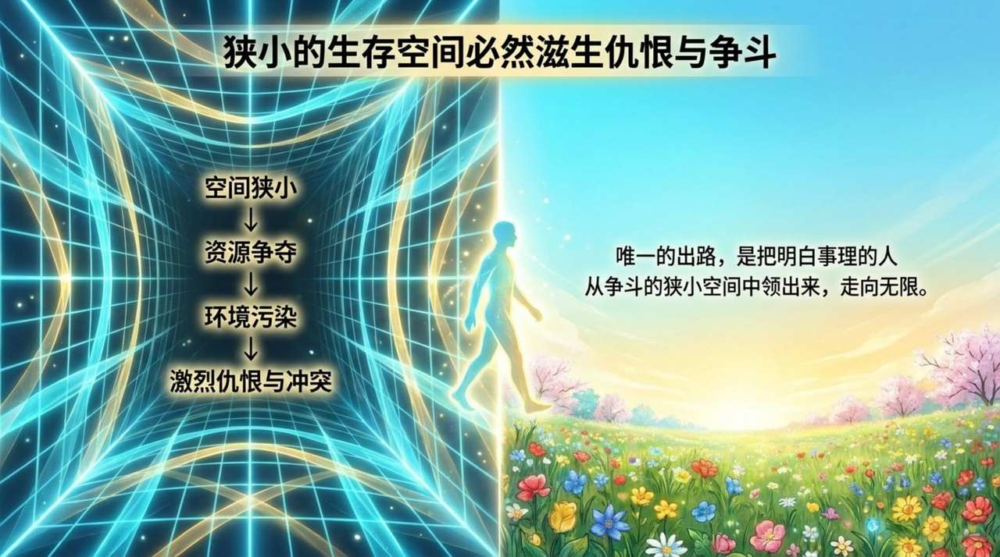
    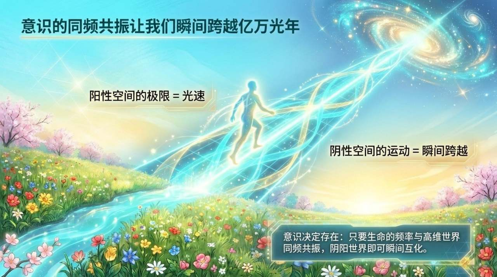
    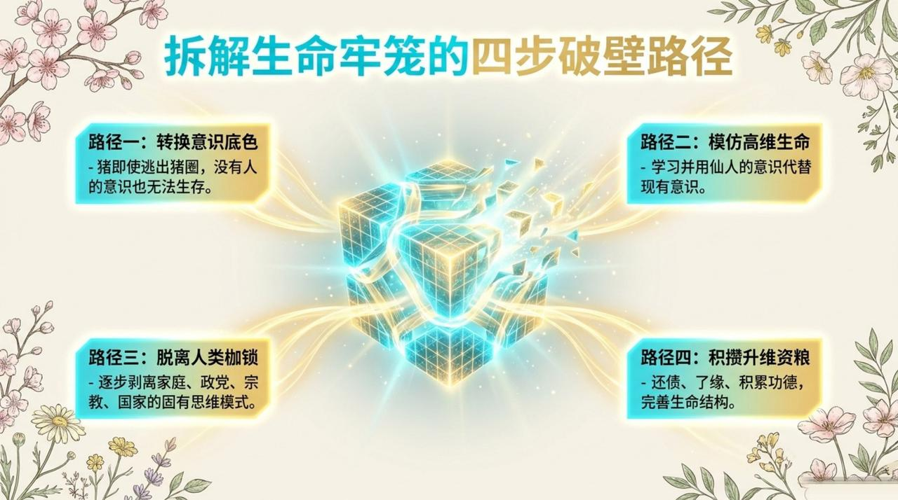
    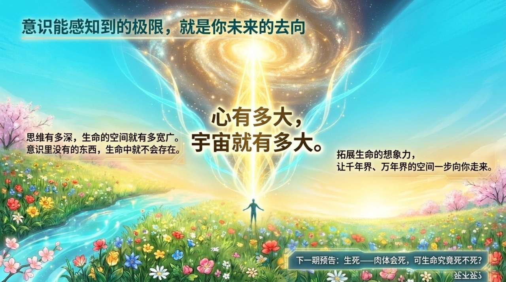

---

| 版本 | 适合 | 核心角度 |
|------|------|----------|
| [友好版](friendly.md) | 初次了解 | 生活类比，感受空间对人的影响 |
| [学术版](academic.md) | 研究者 | 系统分析，与外部概念比较 |
| [内部版](internal.md) | 深度研修 | 原典全文，出处完整 |

---

## 相关词条

[时空](/zh/spacetime/) · [三十六维空间](/zh/thirty-six-dimensional-space/) · [宇宙（总论）](/zh/universe-overview/) · [生命的层次](/zh/levels-of-life/) · [高层生命空间](/zh/high-life-spaces/) · [梦境](/zh/dream-state/) · [千年界](/zh/thousand-year-world/) · [万年界](/zh/ten-thousand-year-world/) · [极乐界](/zh/elysium-world/) · [反物质世界](/zh/antimatter-world/) · [20个集合体世界](/zh/twenty-parallel-worlds/)
