# 精神（总论）

**精神**，在生命禅院体系中，是"精"与"神"的综合体，是生命体的支柱，是物质与反物质相互联系、互相作用的桥梁与结合部。精神连通物质与反物质两界，是生命从物质世界向心灵世界升华的中间地带。人无精神必亡；人有精神可以镇百邪，不仅疾病不染，还能吸收天地之灵气。

---

## 视频版

<iframe style="width:100%;aspect-ratio:4/3;border:0" src="https://www.youtube-nocookie.com/embed/11OlHXN7wmU" title="精神（总论）（生命禅院百科·视频版）" allowfullscreen></iframe>

??? info "📖 图文幻灯（14 张，点击展开）"

    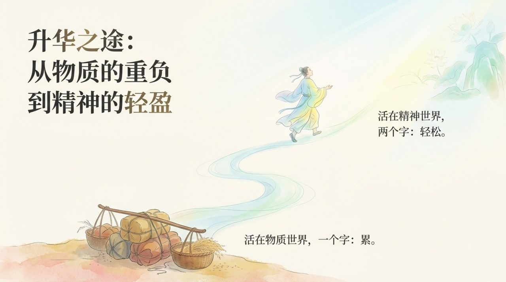
    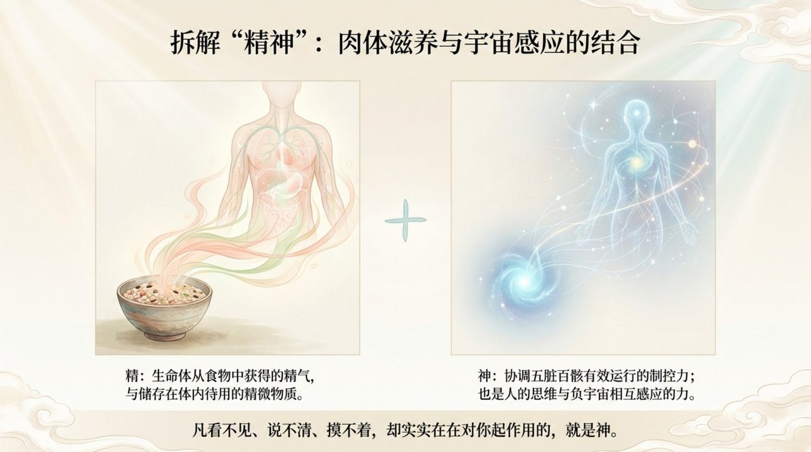
    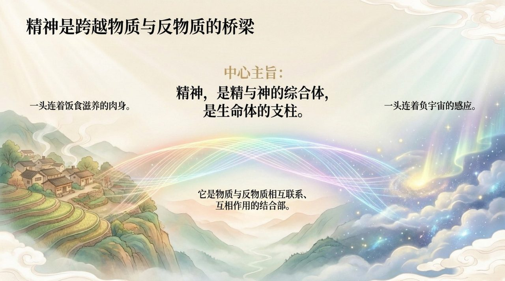
    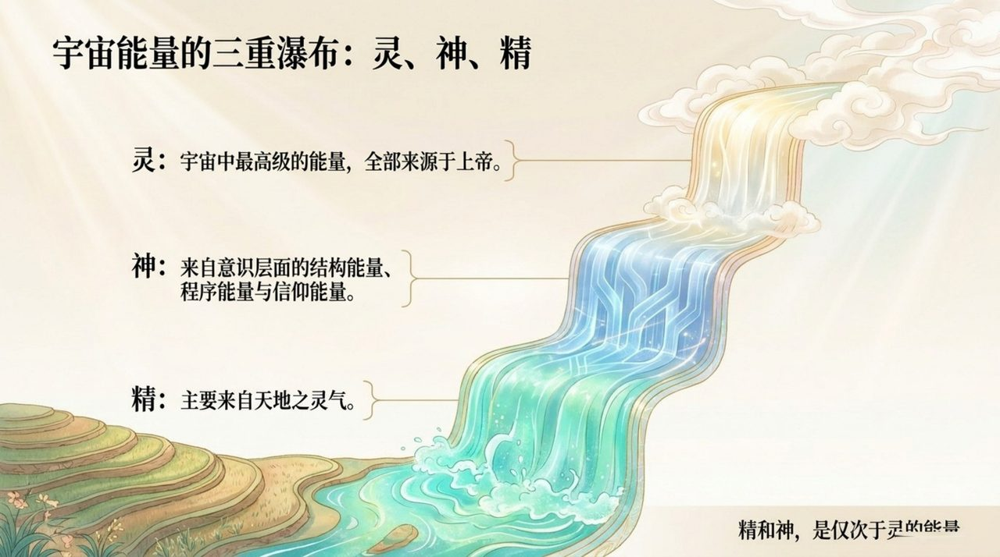
    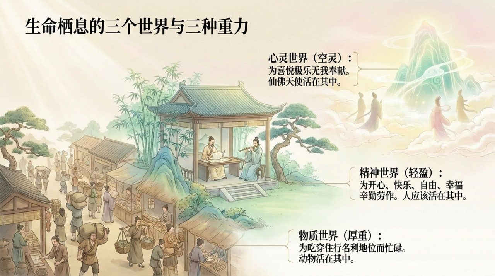
    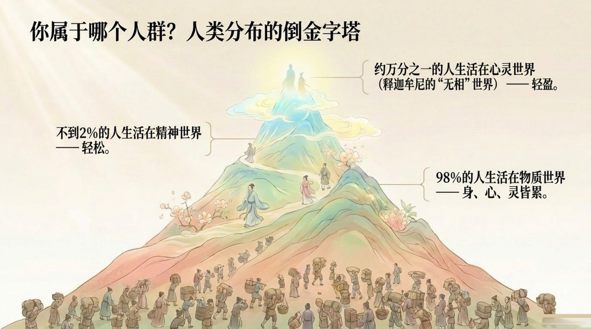
    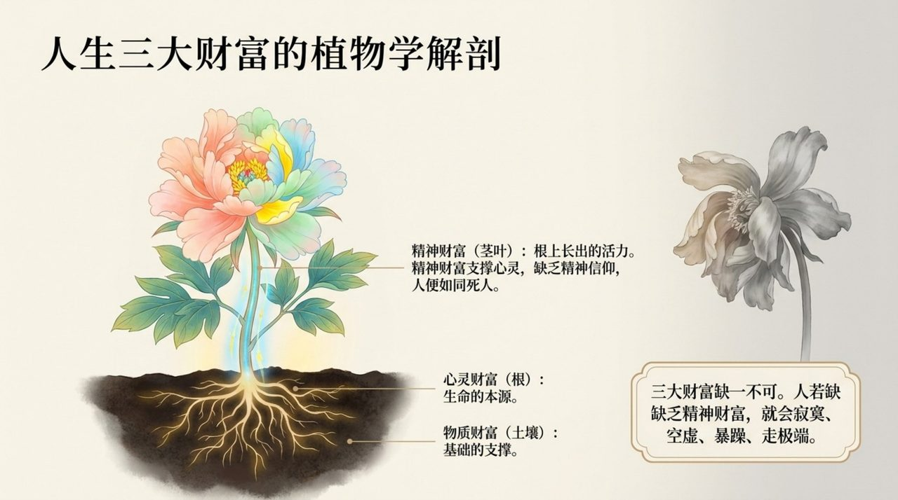
    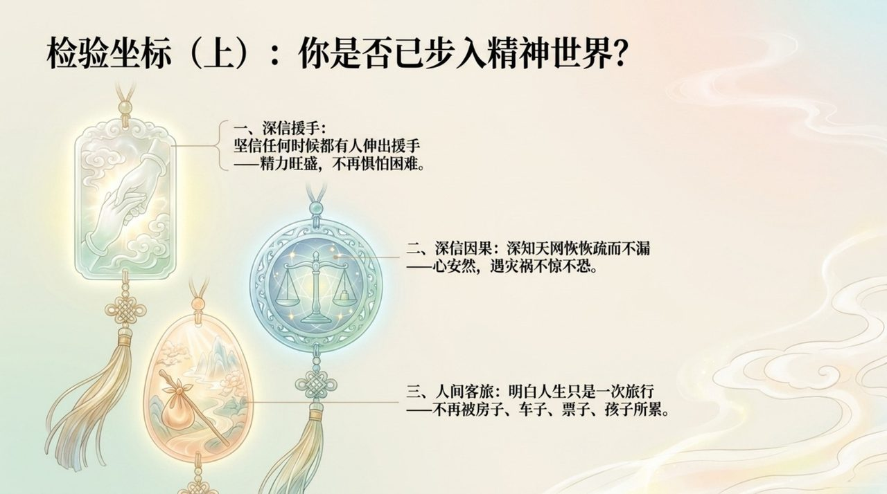
    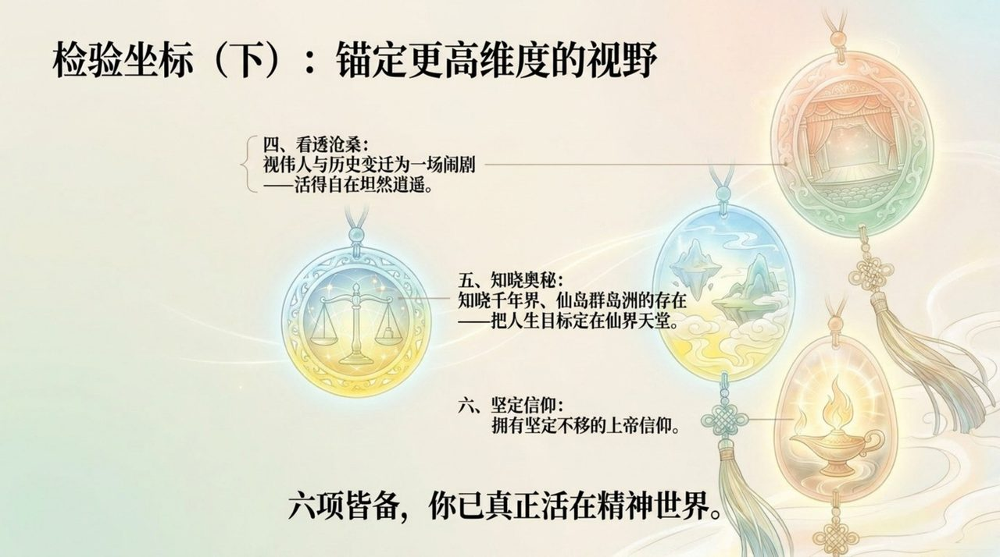
    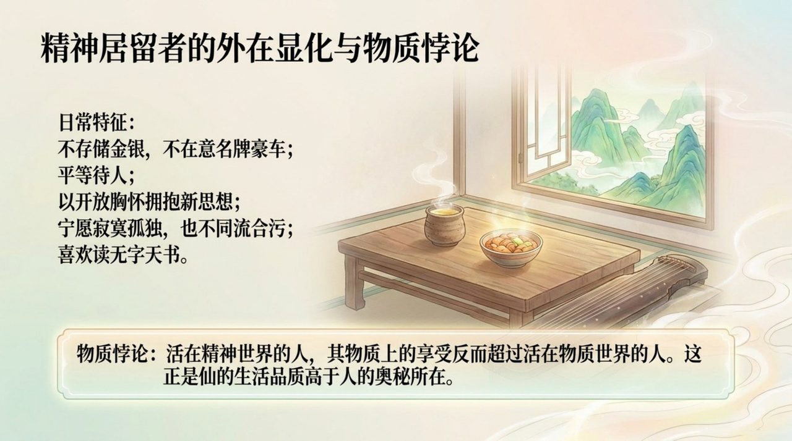
    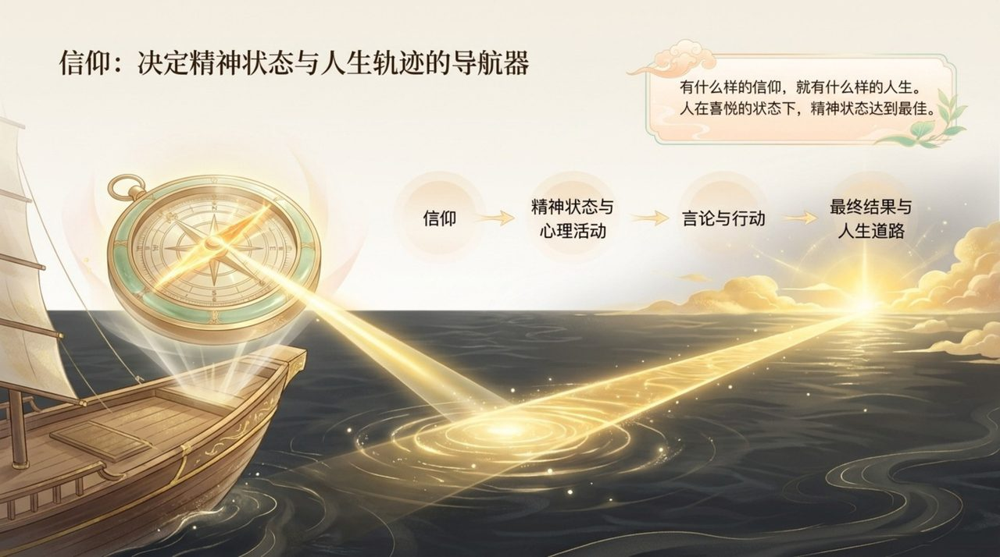
    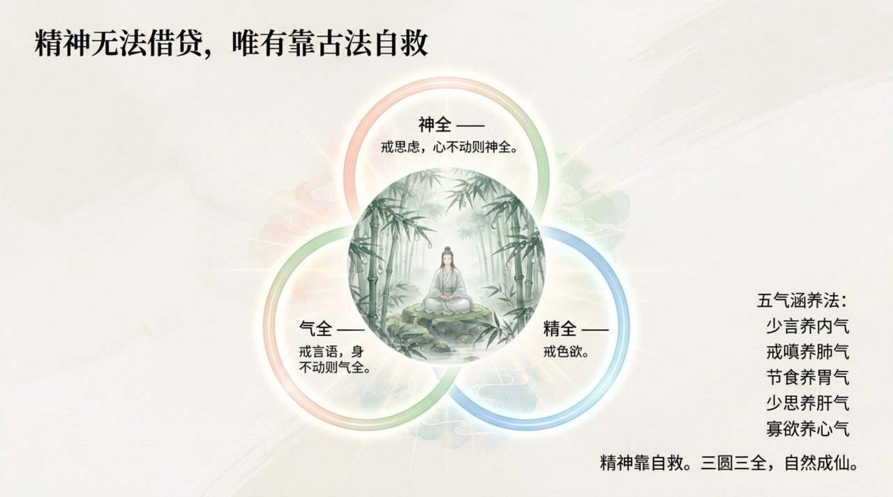
    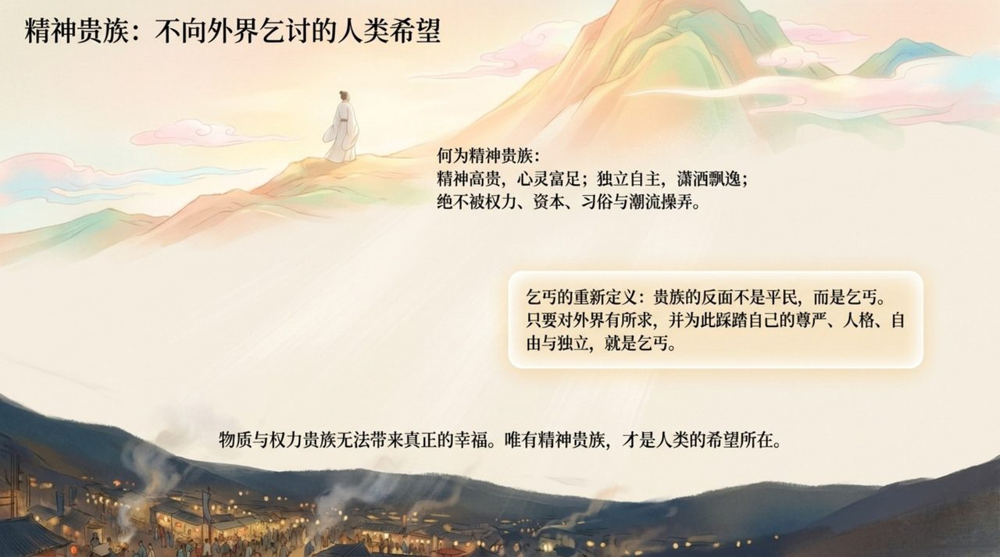
    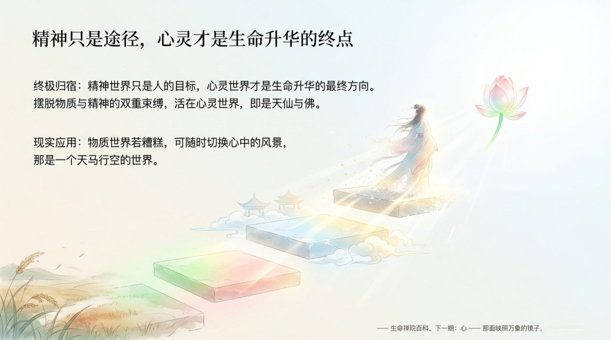

## 版本导航

| 版本 | 适合读者 | 入口 |
|------|----------|------|
| 友好版 | 初次接触，希望轻松理解 | [阅读友好版](/zh/spirit-overview/friendly/) |
| 学术版 | 深入研究，系统梳理 | [阅读学术版](/zh/spirit-overview/academic/) |
| 内部版 | 禅院草，研读原典 | [阅读内部版](/zh/spirit-overview/internal/) |

---

## 相关词条

[生命](/zh/life/) · [灵](/zh/ling-spirit/) · [灵性](/zh/spirituality/) · [意识](/zh/consciousness/) · [能量](/zh/energy/) · [心灵（总论）](/zh/soul-overview/) · [提升振动频率](/zh/raise-vibration-frequency/) · [归零](/zh/return-to-zero/)
