# 心灵出实像

> **实像出自你的心灵，成仙需要心灵的纯净，心像思维就是心灵的活动，这个活动的结果就是成仙的奥秘。**
>
> ——禅院文集·修仙篇·心灵出实像

| 版本 | 适合 | 核心角度 |
|------|------|----------|
| [友好版](friendly.md) | 初次了解 | 生活化解读，用镜片聚光的比喻理解心灵力量 |
| [学术版](academic.md) | 研究者 | 系统分析机制原理、与心像思维的关系及修炼路径 |
| [内部版](internal.md) | 深度研修 | 文集汇编，完整引文与出处 |

---

## 视频版

<iframe style="width:100%;aspect-ratio:4/3;border:0" src="https://www.youtube-nocookie.com/embed/mNkILhiDdCQ" title="心灵出实像（生命禅院百科·视频版）" allowfullscreen></iframe>

??? info "📖 图文幻灯（14 张，点击展开）"

    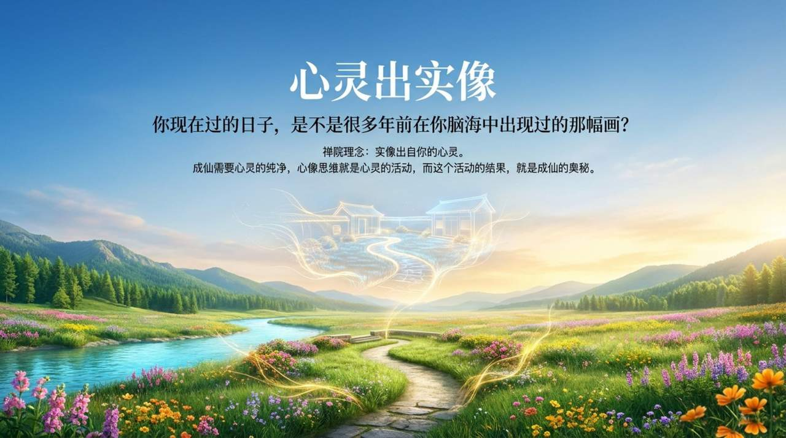
    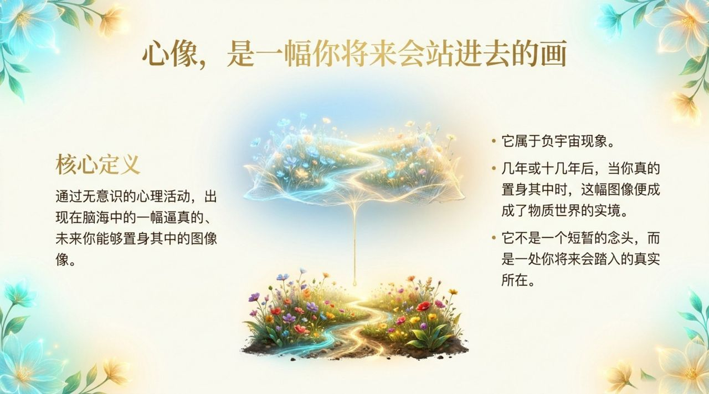
    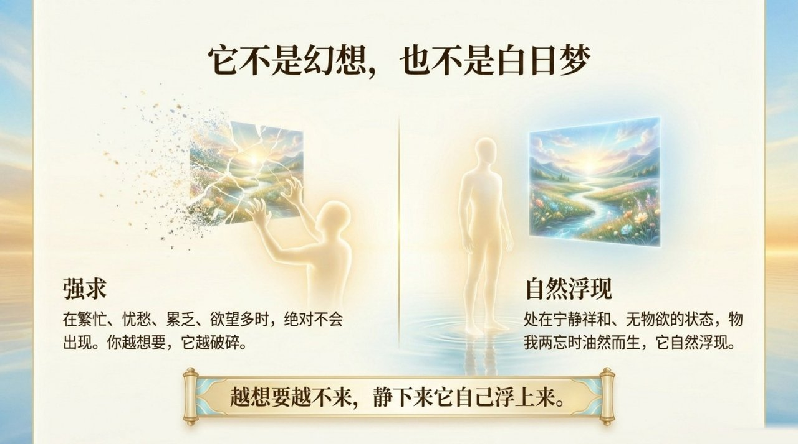
    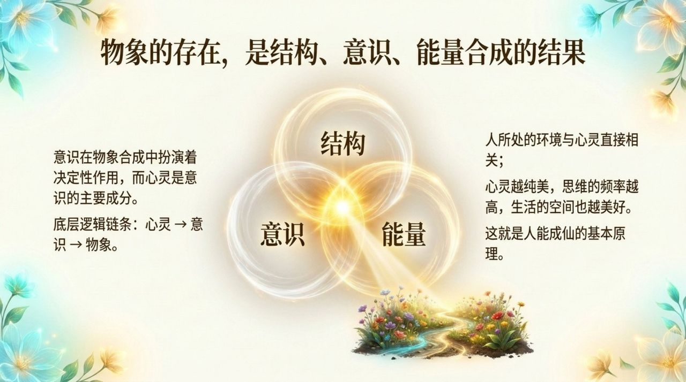
    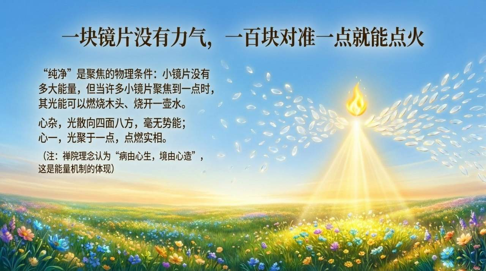
    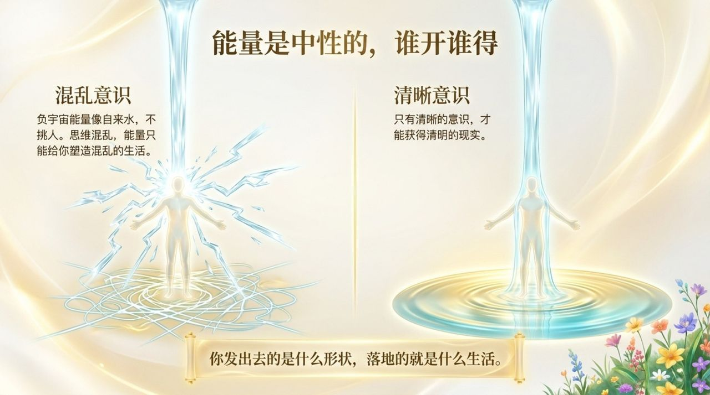
    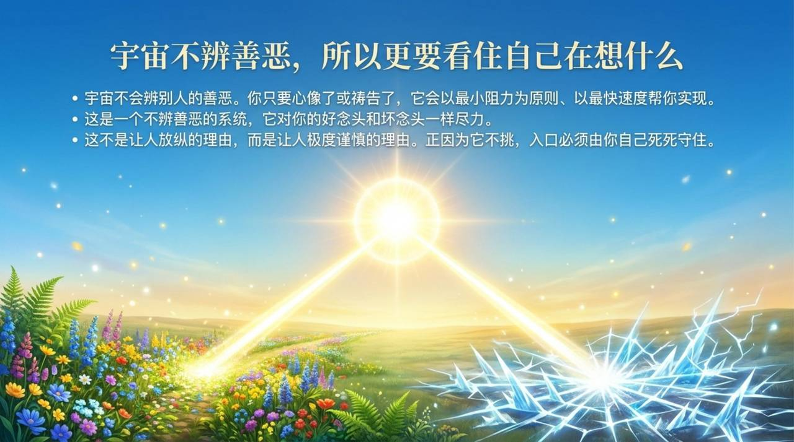
    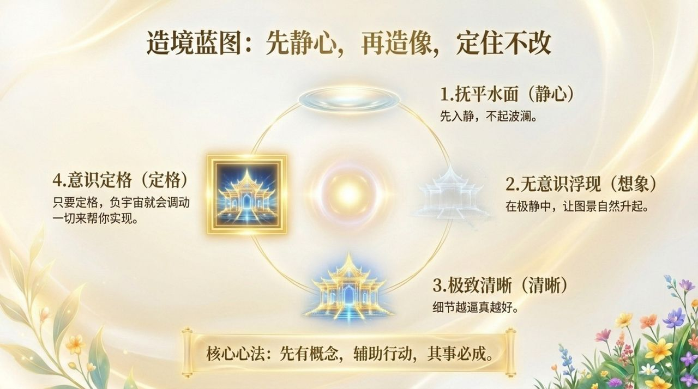
    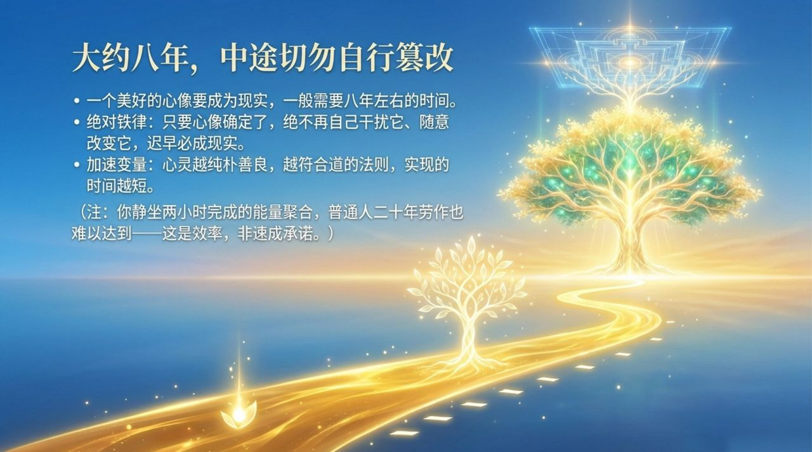
    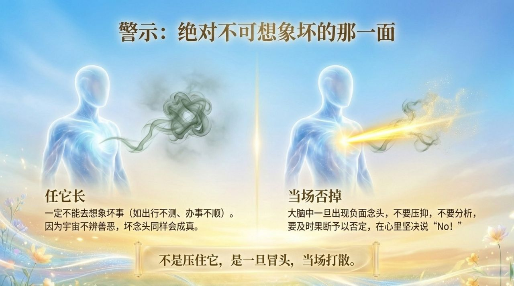
    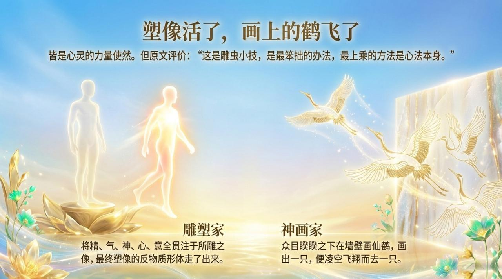
    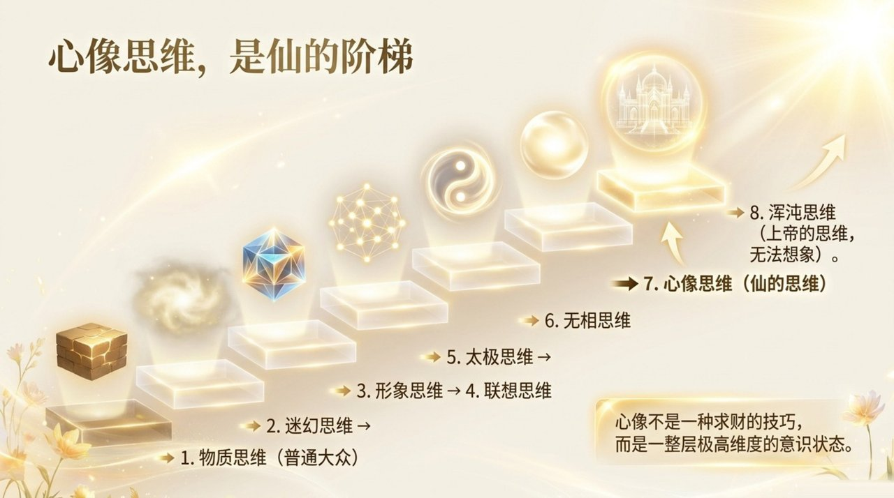
    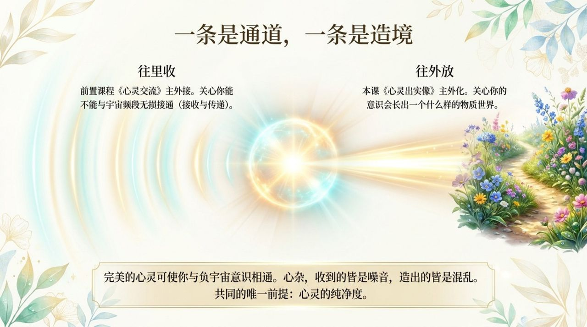
    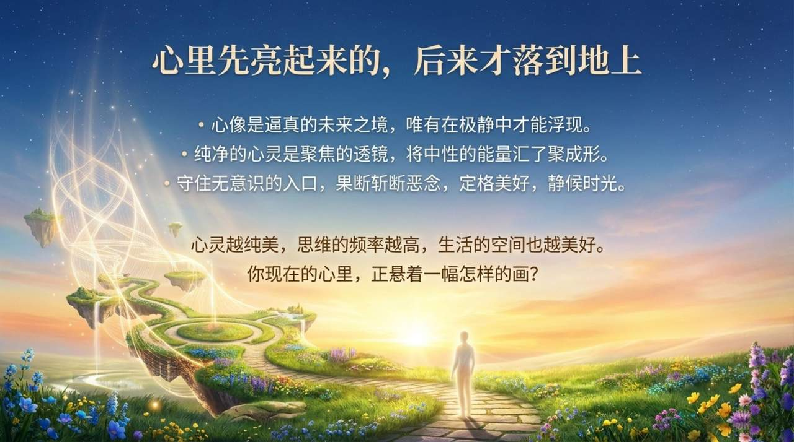

---

## 简介

"心灵出实像"是生命禅院修炼体系中的核心命题：纯净的心灵能将内在的心像（意识图像）转化为物质世界中真实存在的现实。其原理是，物象的存在由结构、意识、能量三者相互作用演化而来，心灵是意识的主要成分，心灵越纯净，其聚焦能量的力量越大，心像越能成为实境。正如镜片聚光的原理，单独的小镜片能量有限，但当许多小镜片将光聚焦到同一点上，便能点燃木头、烧开水——纯净的心灵就是这种聚焦力量。

这一命题既揭示了日常创造的奥秘（境由心造、意识决定存在），也揭示了修仙的终极路径：随着意识不断提升、思维频率提高、心灵不断净化，成仙便瓜熟蒂落、水到渠成。

## 相关词条

- [心像思维](/zh/heart-image-thinking/)
- [提升振动频率](/zh/raise-vibration-frequency/)
- [净化心灵](/zh/jinghuaxinling/)
- [成仙](/zh/becoming-celestial/)
- [羽化成仙](/zh/yuhuachengxian/)
- [反物质结构](/zh/antimatter-structure/)
- [意识](/zh/consciousness/)
- [八大思维阶梯](/zh/eight-thinking-ladders/)
- [中级修行](/zh/intermediate-cultivation/)
- [心灵花园](/zh/soul-garden/)
