# 万年界

**万年界**，是生命禅院天国体系中的中间层高层生命空间概念，高于千年界、低于极乐界，与二者共同构成"天堂/天国"层级结构的重要一环；空间定位为离地球约3480光年的物质星球（正宇宙范畴），是生命反物质结构进一步完美化后的目标生命空间之一。

## 视频版

<iframe style="width:100%;aspect-ratio:4/3;border:0" src="https://www.youtube-nocookie.com/embed/jwxzM7QB0G0" title="万年界（生命禅院百科·视频版）" allowfullscreen></iframe>

??? info "📖 图文幻灯（12 张，点击展开）"

    
    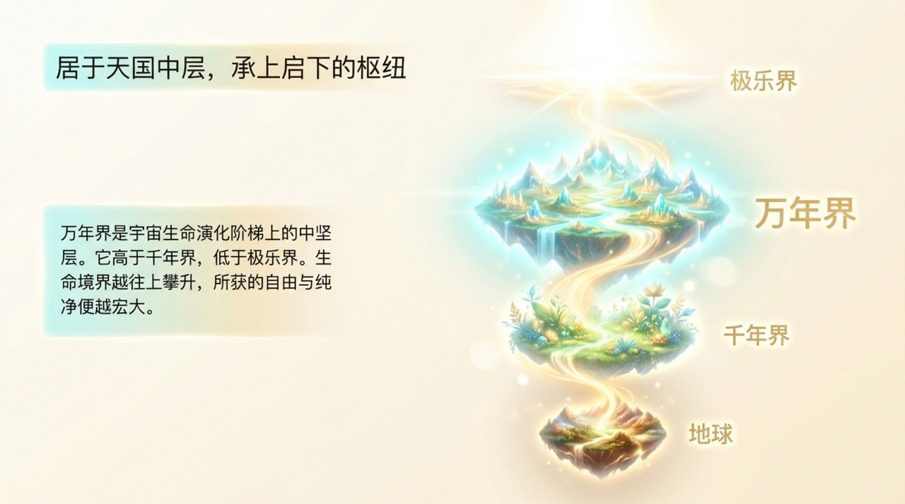
    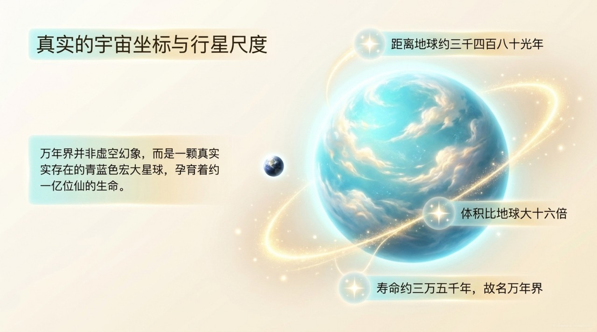
    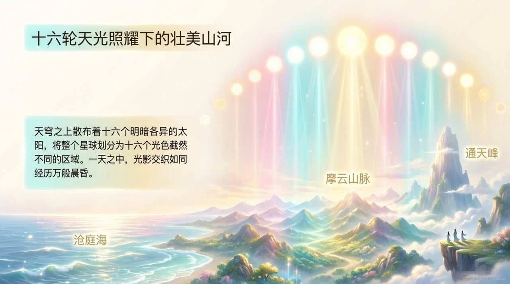
    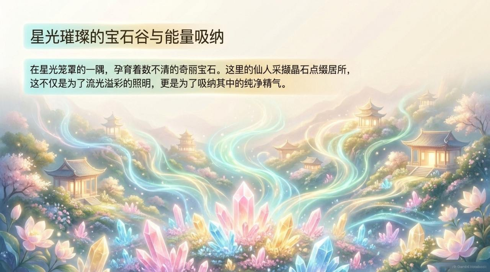
    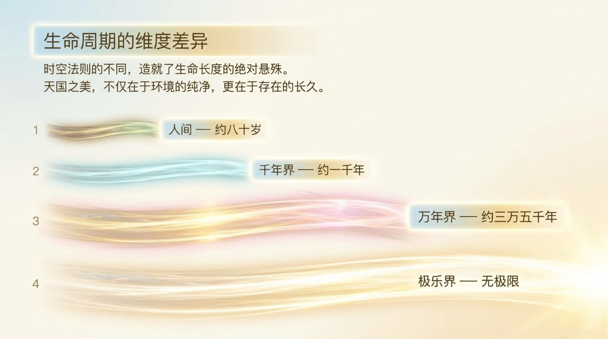
    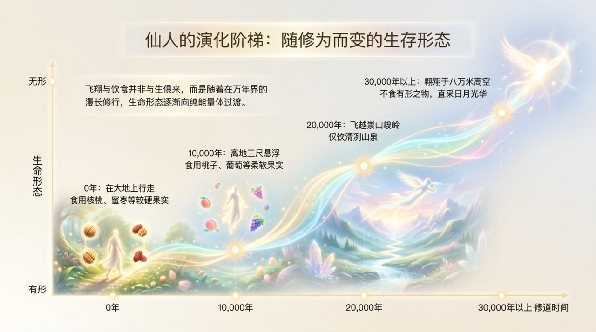
    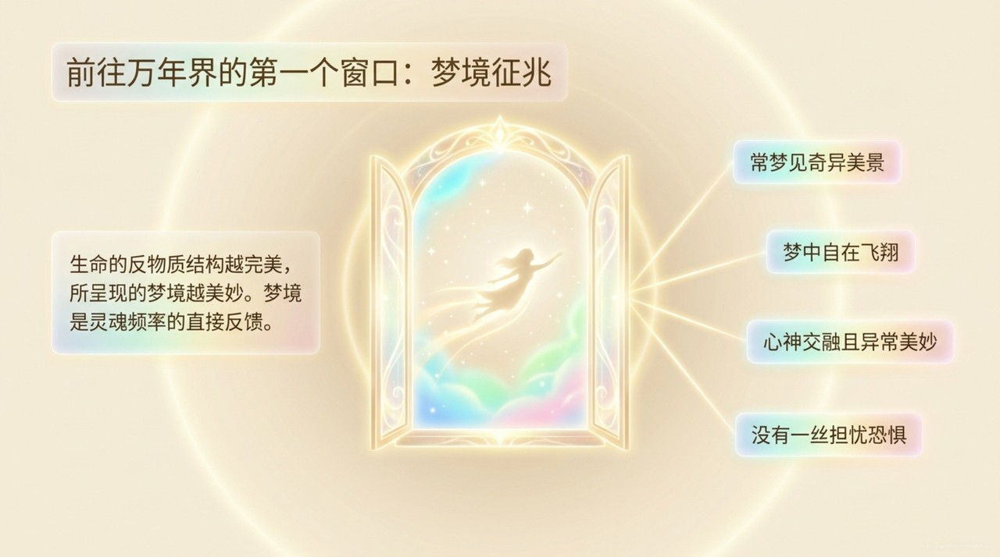
    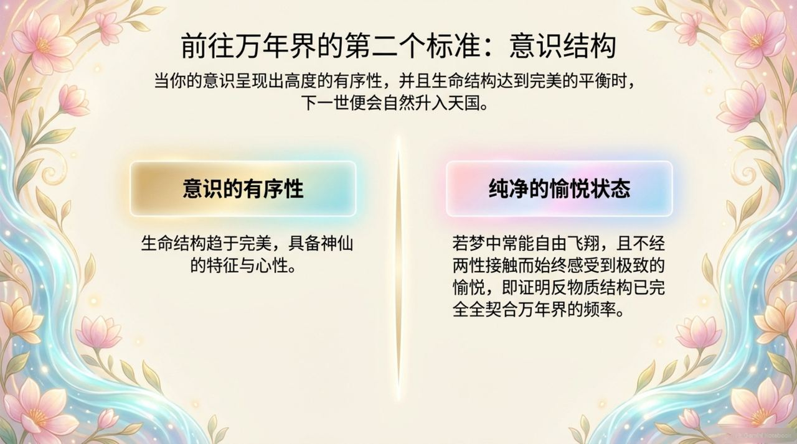
    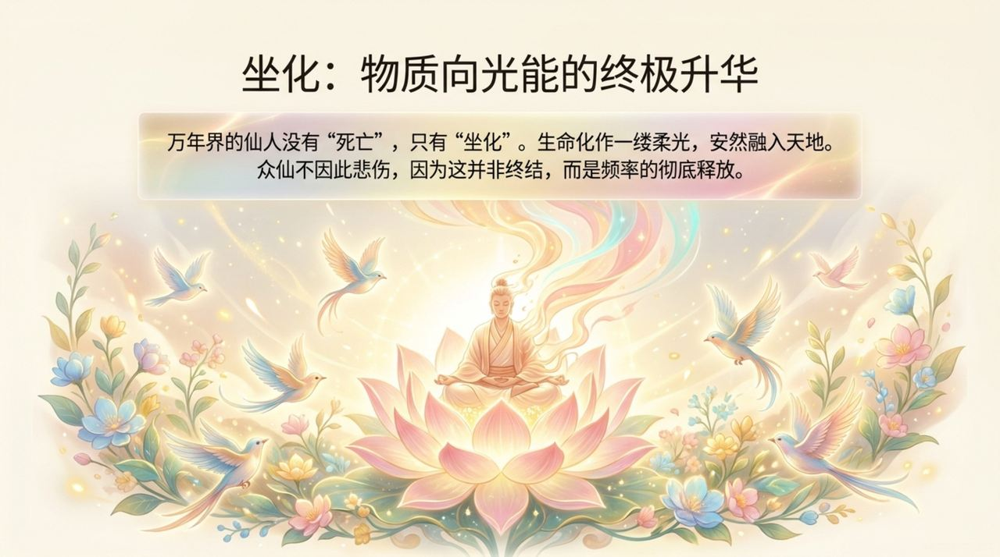
    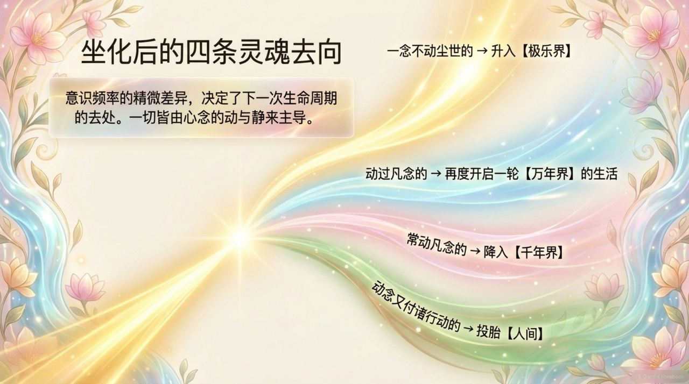
    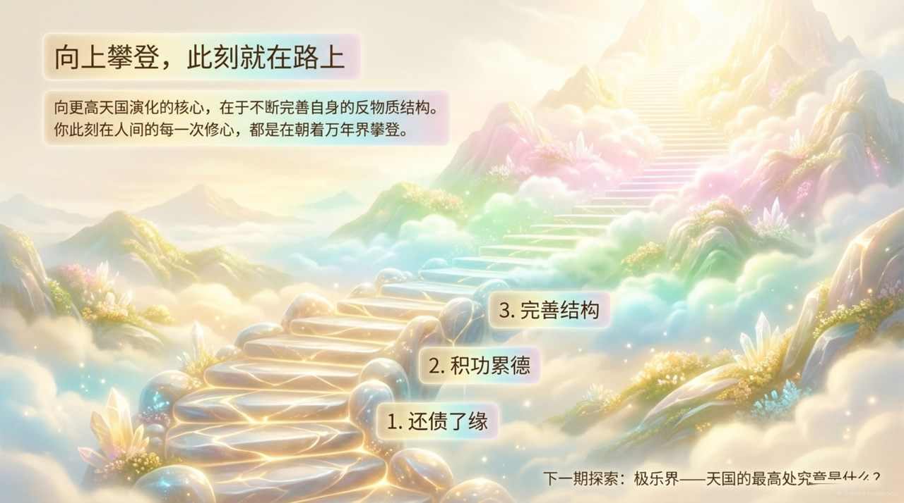

## 版本导航

| 版本 | 适合 |
|------|------|
| [友好版](friendly/) | 首次接触，内容丰满、可读性强 |
| [学术版](academic/) | 理论研究与引用 |
| [内部版](internal/) | 体系内核心学习，以母版为准 |

## 相关词条

[千年界](/zh/thousand-year-world/) · [极乐界](/zh/elysium-world/) · [天国天堂](/zh/kingdom-of-heaven/) · [反物质结构](/zh/antimatter-structure/) · [心灵花园](/zh/soul-garden/) · [心灵净化课](/zh/spiritual-purification-course/)
