# 三十六道八卦阵

> 宇宙中有36道八卦阵，生命中有难以计数的陷阱，只有逃离生命的陷阱，才能获得生命的自由。
>
> ——新时代人类八百理念第四版·第344条

**三十六道八卦阵**是上帝在宇宙中布置的三十六道程序性约束，兼具束缚与保护双重作用。它将各层生命置于特定时空、意识层次与定数程序中，使其在其中繁衍生息、轮回转化，从而维护宇宙生命秩序的整体平衡。每一道阵都留有出口，逃出者可升华进入更高生命空间。目前在导游文集中有明确论述的共十八道阵，另外十八道尚未揭示。

---

| 版本 | 适合 | 核心角度 |
|------|------|----------|
| [友好版](friendly.md) | 初次了解 | 生活类比与十八阵概览 |
| [学术版](academic.md) | 研究者 | 系统梳理与概念辨析 |
| [内部版](internal.md) | 深度研修 | 原典引文逐阵全集 |

---

## 视频版

<iframe style="width:100%;aspect-ratio:4/3;border:0" src="https://www.youtube-nocookie.com/embed/wIUbtREOlNY" title="三十六道八卦阵（生命禅院百科·视频版）" allowfullscreen></iframe>

??? info "📖 图文幻灯（12 张，点击展开）"

    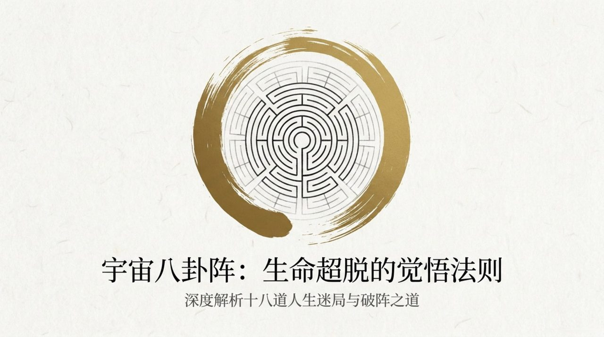
    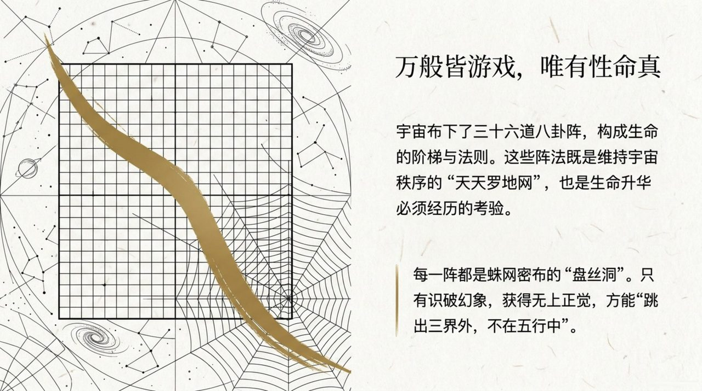
    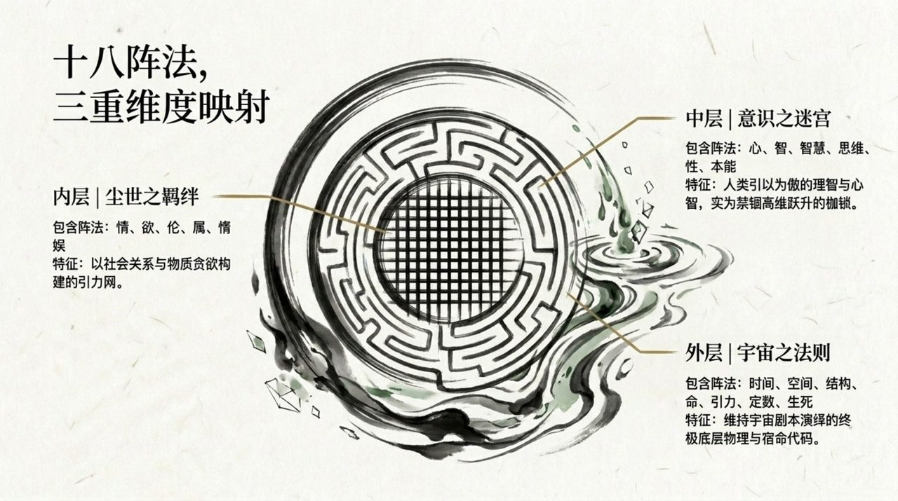
    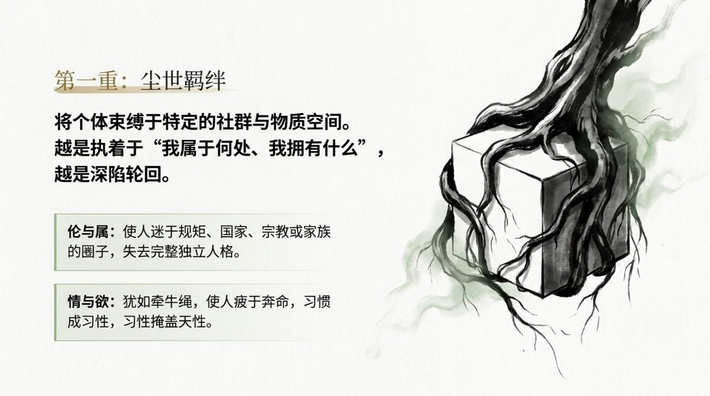
    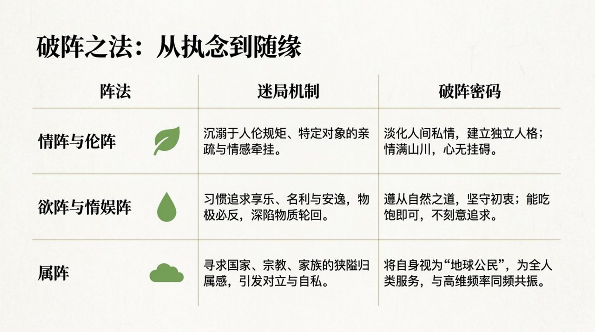
    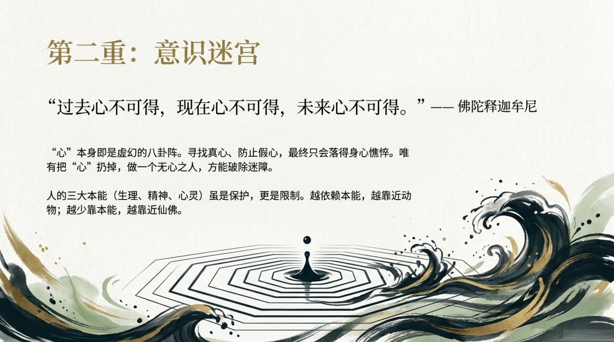
    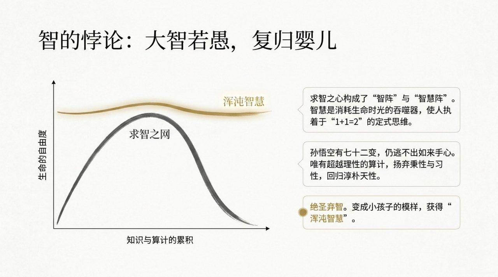
    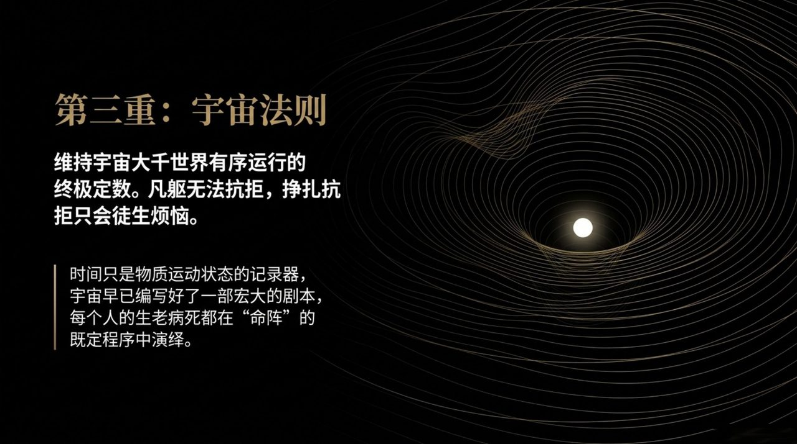
    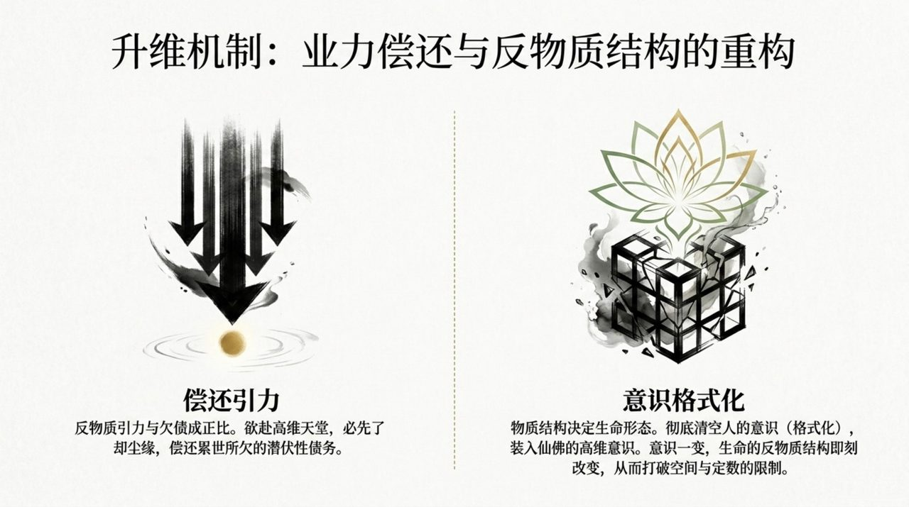
    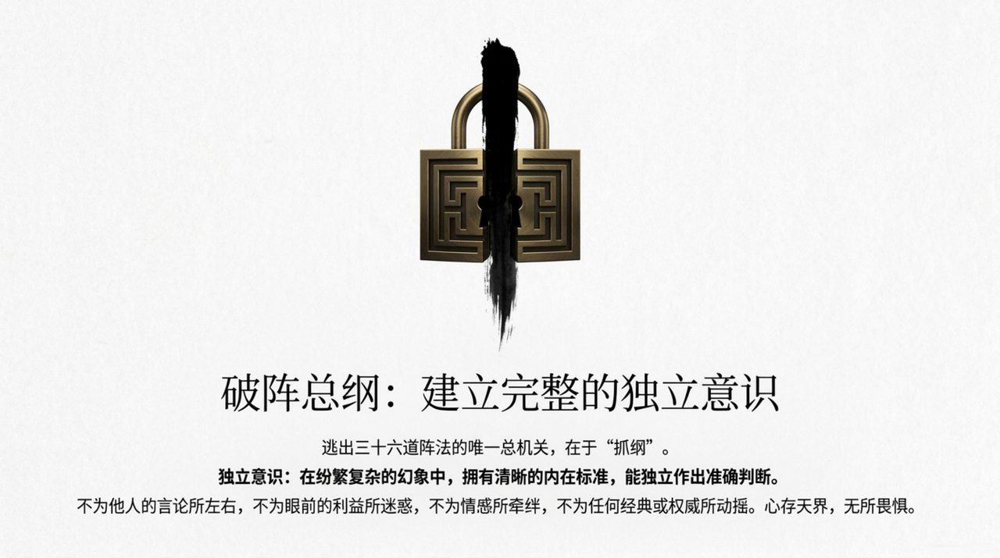
    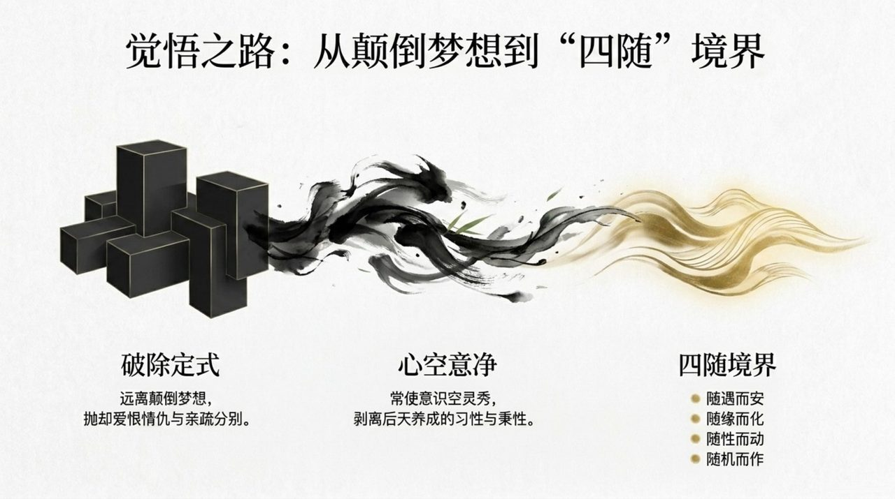
    

## 相关词条

[三十六维空间](/zh/thirty-six-dimensional-space/) · [空间](/zh/space/) · [时间](/zh/time/) · [结构](/zh/structure/) · [生命的轮回](/zh/life-reincarnation/) · [因果·报应·轮回](/zh/karma-retribution-reincarnation/) · [自由意志](/zh/free-will/) · [宇宙大剧本](/zh/cosmic-script/) · [完整独立意识](/zh/complete-independent-consciousness/) · [18阵破阵法·最简版](/zh/eighteen-formation-breaking/)
