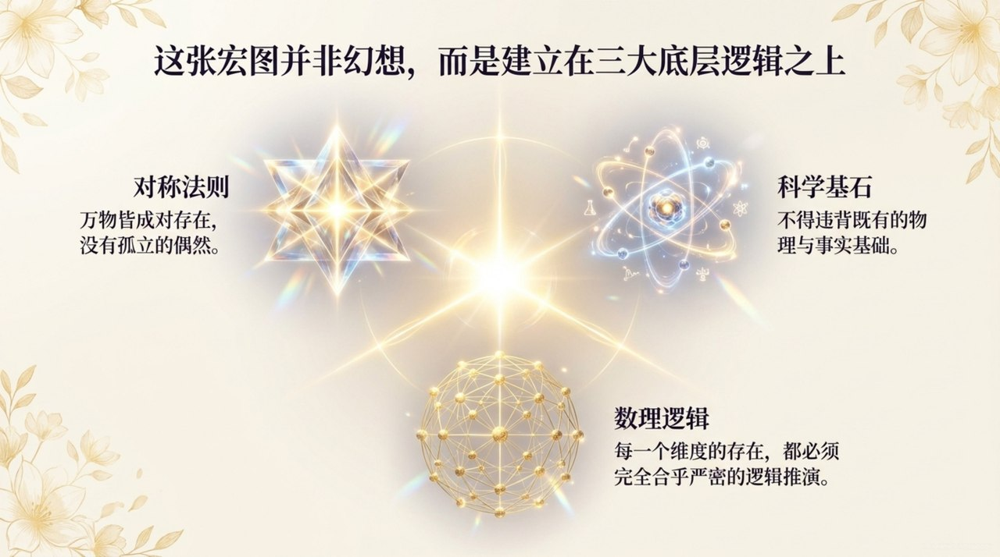
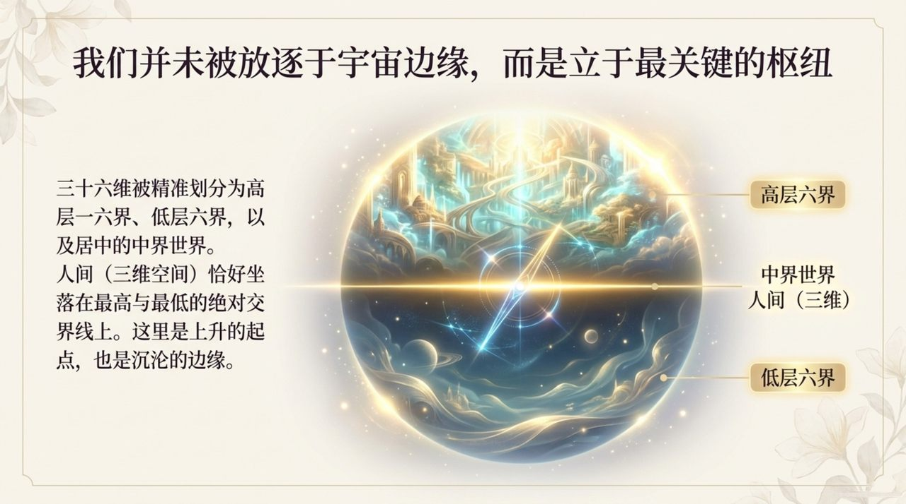
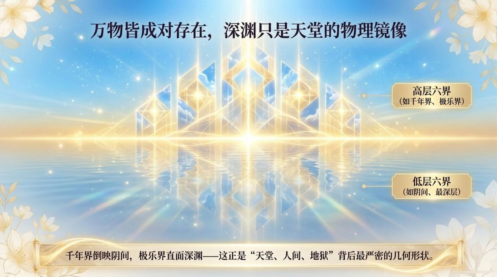
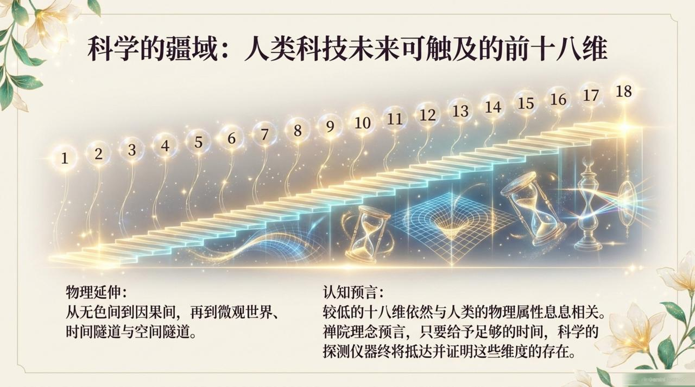
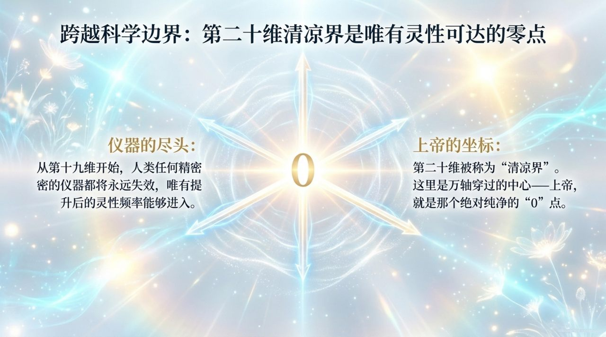
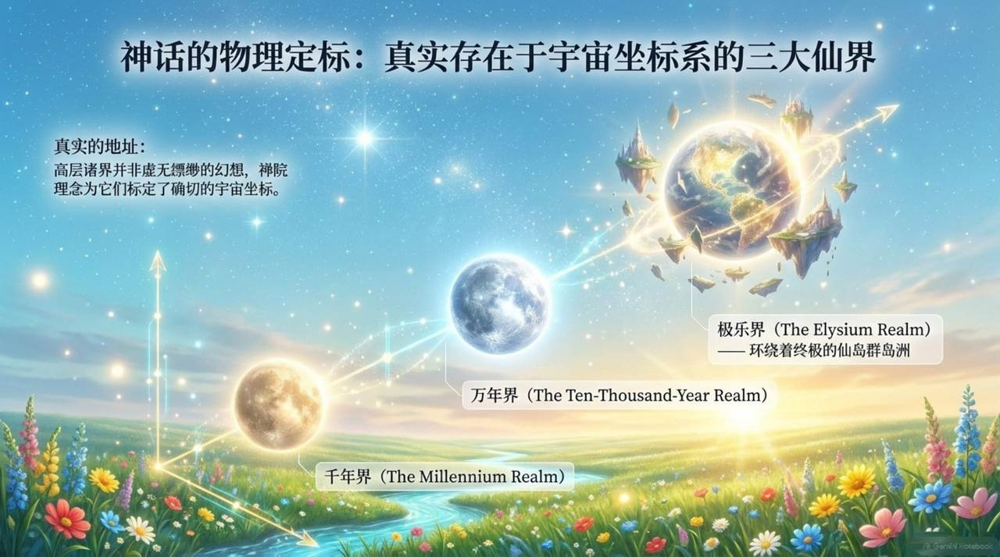
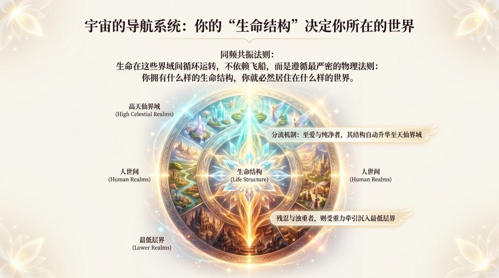
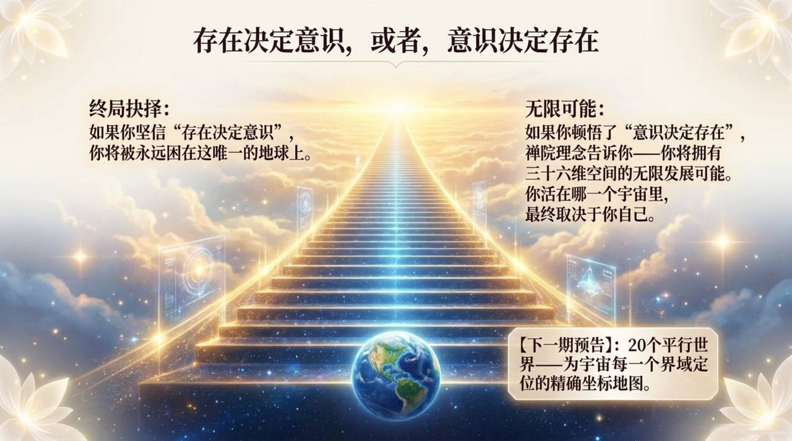

# 三十六维空间

**三十六维空间**，是生命禅院宇宙时空理论中的核心结构模型，用于描述不同生命质能所对应的存在空间层级与运行关系；以"对称原理＋科学事实＋数理逻辑"为划分依据，构建从高层生命空间到低层生命空间、再到中性过渡空间的完整宇宙坐标框架。

> 根据物质与反物质生命质能高下，宇宙存在三十六维空间。

## 视频版

<iframe style="width:100%;aspect-ratio:4/3;border:0" src="https://www.youtube-nocookie.com/embed/IZLU9JU4itY" title="三十六维空间（生命禅院百科·视频版）" allowfullscreen></iframe>

??? info "📖 图文幻灯（14 张，点击展开）"

    
    
    
    
    
    
    
    
    
    
    
    
    
    

## 版本导航

| 版本 | 适合 |
|------|------|
| [友好版](friendly/) | 首次接触，内容丰满、可读性强 |
| [学术版](academic/) | 理论研究与引用 |
| [内部版](internal/) | 体系内核心学习，以母版为准 |

## 相关词条

[道](/zh/dao/) · [上帝](/zh/greatest-creator/) · [上帝之道](/zh/way-of-the-greatest-creator/) · [反物质结构](/zh/antimatter-structure/) · [千年界](/zh/thousand-year-world/) · [天国天堂](/zh/kingdom-of-heaven/)
