# 千年界

**千年界**，是生命禅院宇宙生命体系中的关键高层空间概念，既是"天国层级"中的初级层，也是"修行路径"中的第一门槛目标；距地球约960光年，进入条件强调"完美人性"与心灵净化，第二家园的实践被视为千年界生活方式在人间的拷贝与预演。

## 视频版

<iframe style="width:100%;aspect-ratio:4/3;border:0" src="https://www.youtube-nocookie.com/embed/4y1TqSeo-lk" title="千年界（生命禅院百科·视频版）" allowfullscreen></iframe>

??? info "📖 图文幻灯（14 张，点击展开）"

    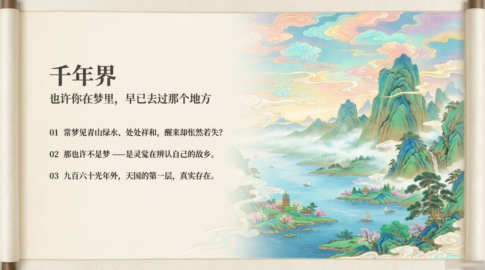
    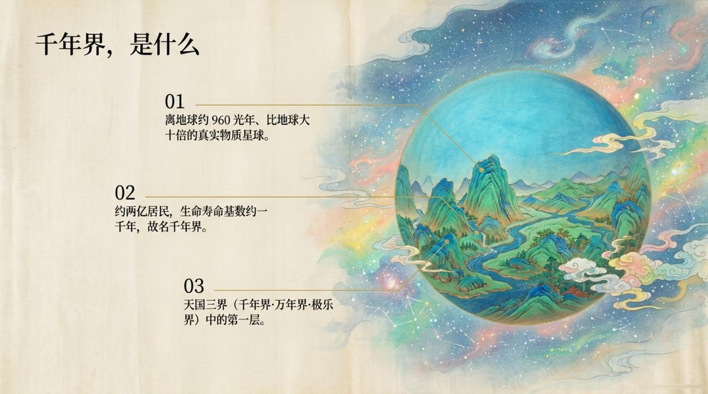
    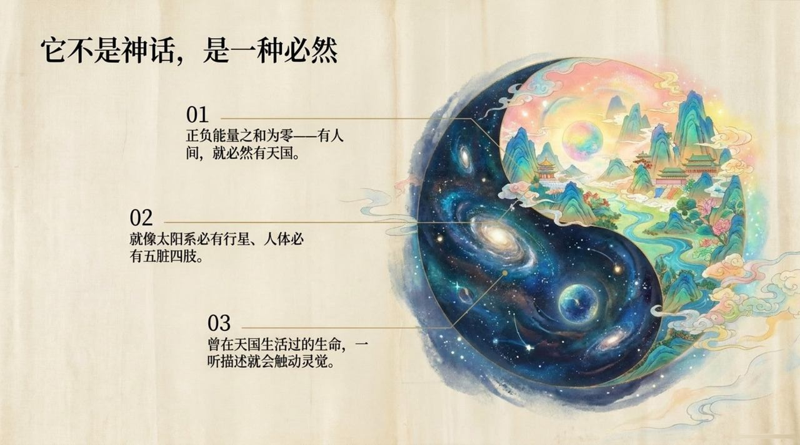
    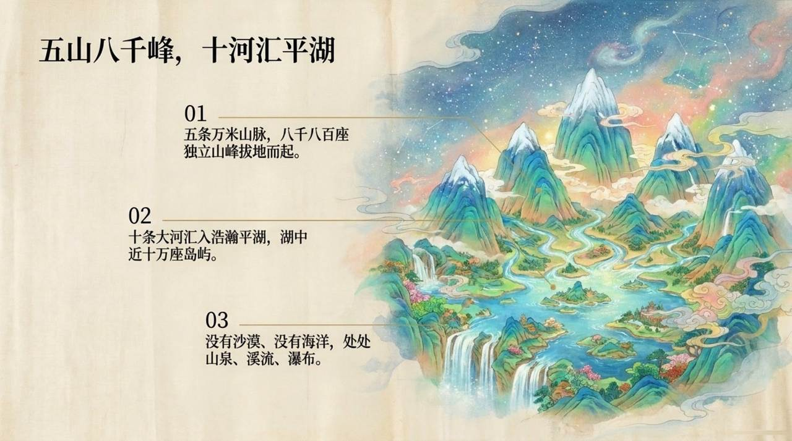
    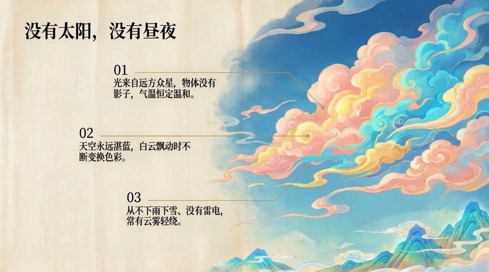
    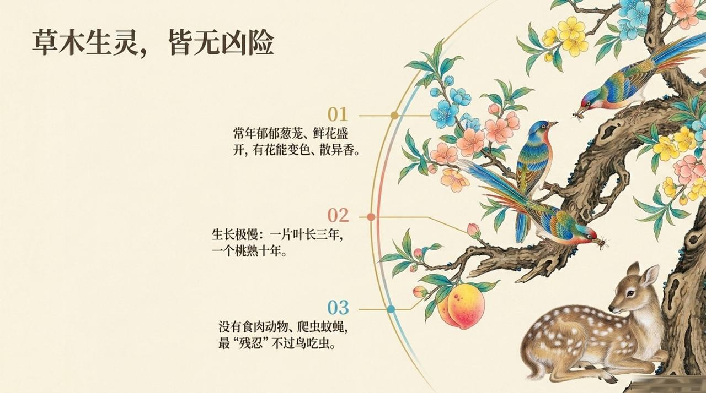
    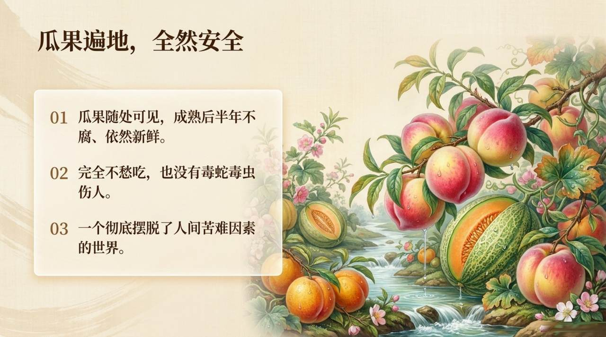
    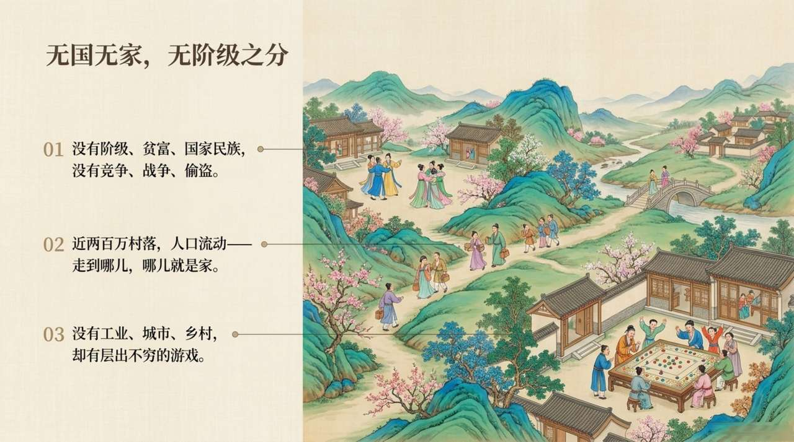
    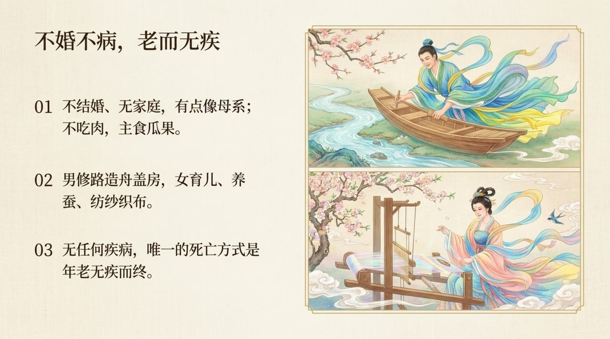
    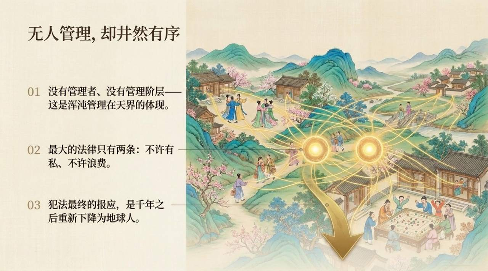
    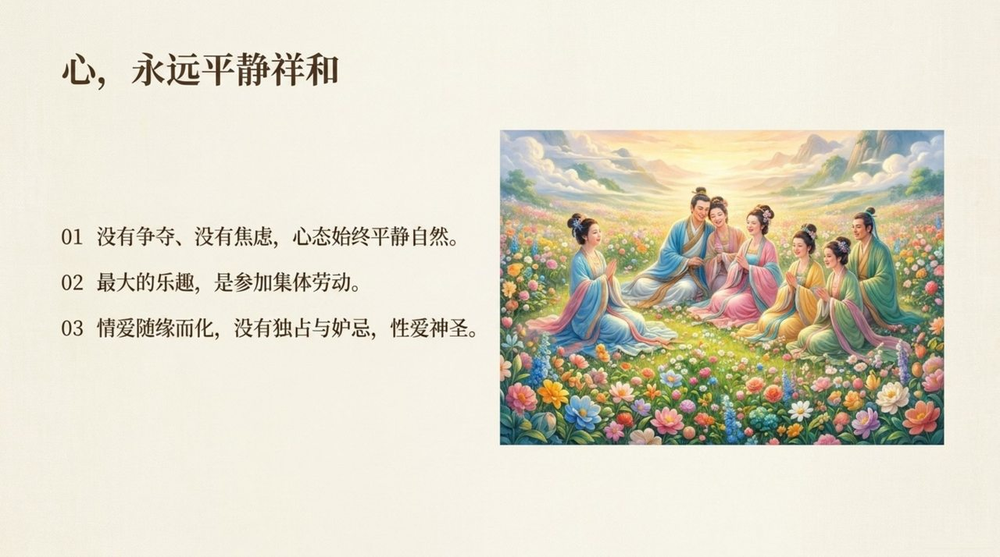
    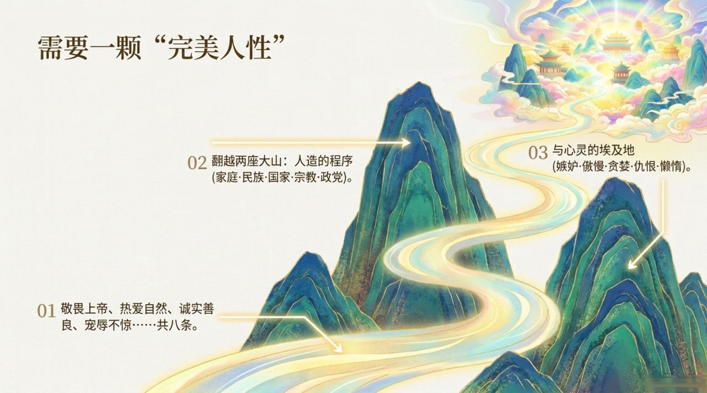
    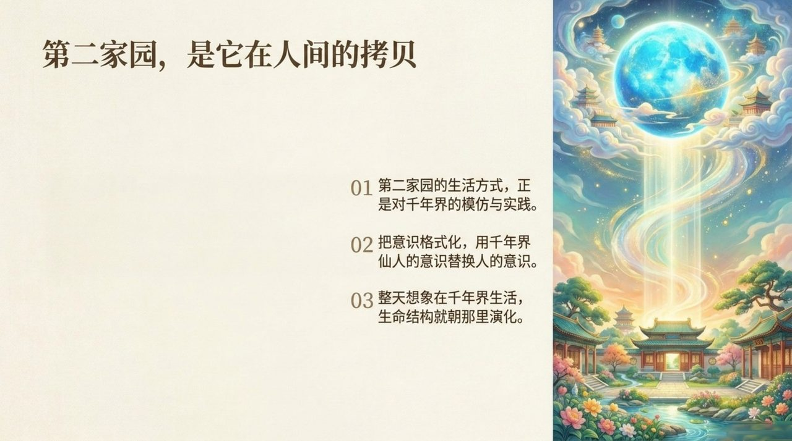
    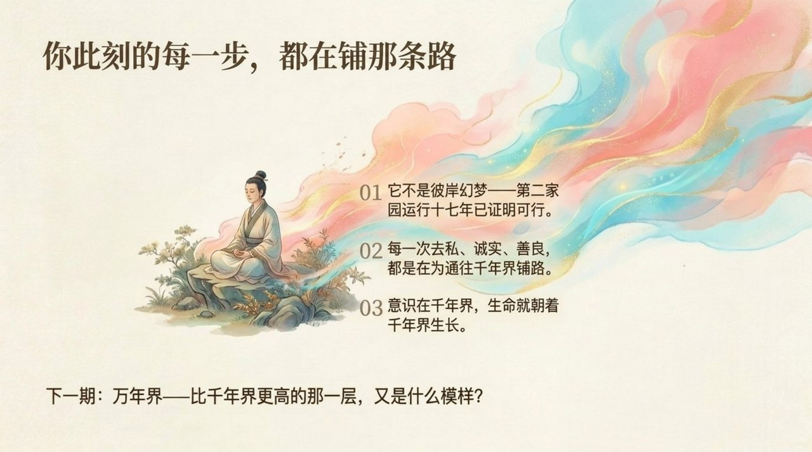

## 版本导航

| 版本 | 适合 |
|------|------|
| [友好版](friendly/) | 首次接触，内容丰满、可读性强 |
| [学术版](academic/) | 理论研究与引用 |
| [内部版](internal/) | 体系内核心学习，以母版为准 |

## 相关词条

[万年界](/zh/ten-thousand-year-world/) · [极乐界](/zh/elysium-world/) · [浑沌管理](/zh/hundun-management/) · [新时代人类八百理念](/zh/new-era-human-800-concepts/) · [禅院草](/zh/chanyuan-celestials/)
