---
title: 宇宙三要素
---

# 宇宙三要素

> "意识、结构、能量是构成宇宙的三要素，也是揭开宇宙一切奥秘的万能钥匙。"
>
> ——禅院文集·传道篇·宇宙三要素之三：能量

宇宙三要素，即**意识、结构、能量**，是生命禅院宇宙观的核心基石。导游雪峰将这三者界定为构成宇宙一切现象的根本要素，并阐明其间的内在关系：能量无形，依附结构才成形；结构是意识的产物；意识是一切的主宰与源头，而这个宇宙最高意识，就是上帝。

把握三要素之间的关系，法眼即开——不再被任何高深的说教或理论迷惑。修炼的核心，正是完美化意识与结构，而非单纯积聚能量。

---

## 视频版

<iframe style="width:100%;aspect-ratio:4/3;border:0" src="https://www.youtube-nocookie.com/embed/GxGalzeQOjo" title="宇宙三要素（生命禅院百科·视频版）" allowfullscreen></iframe>

??? info "📖 图文幻灯（13 张，点击展开）"

    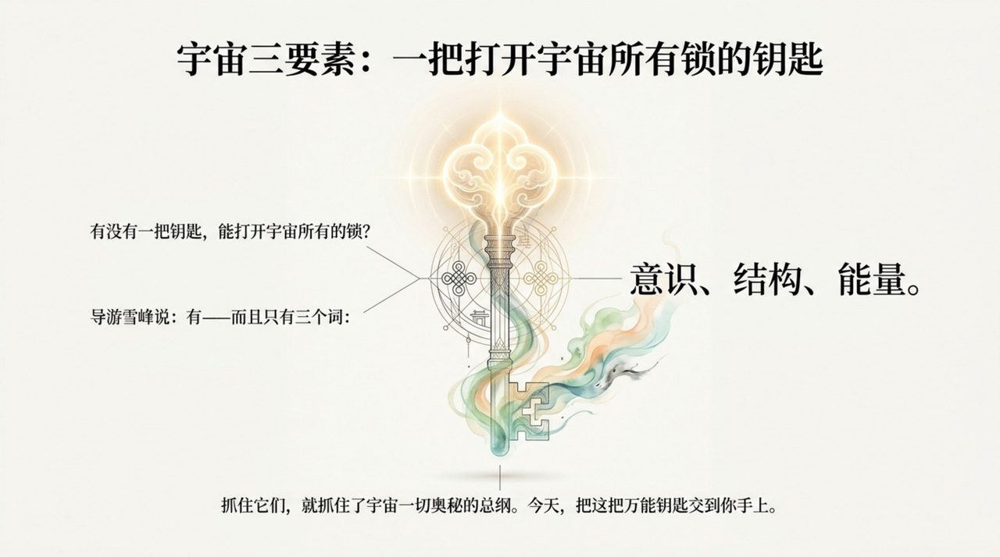
    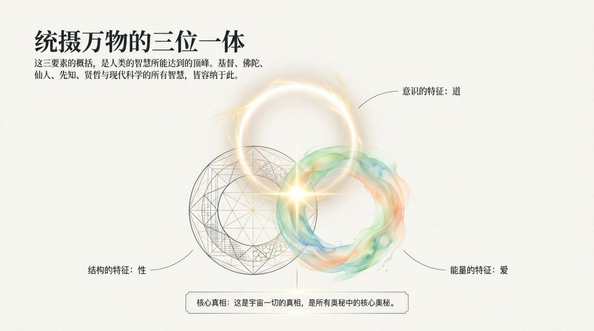
    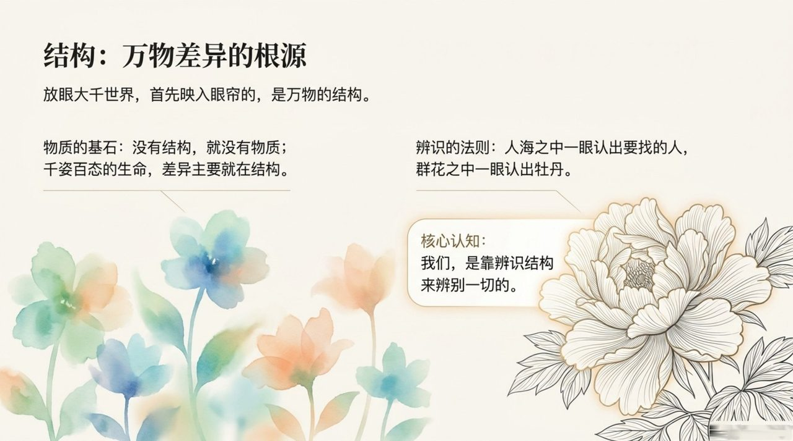
    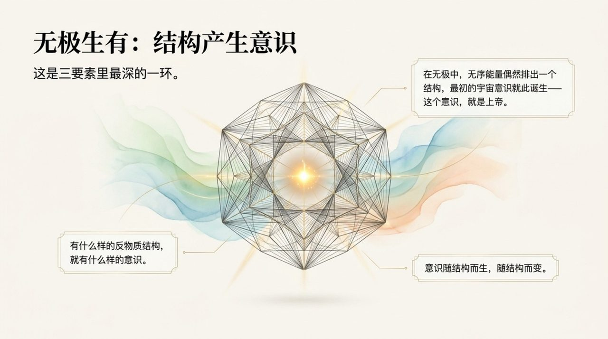
    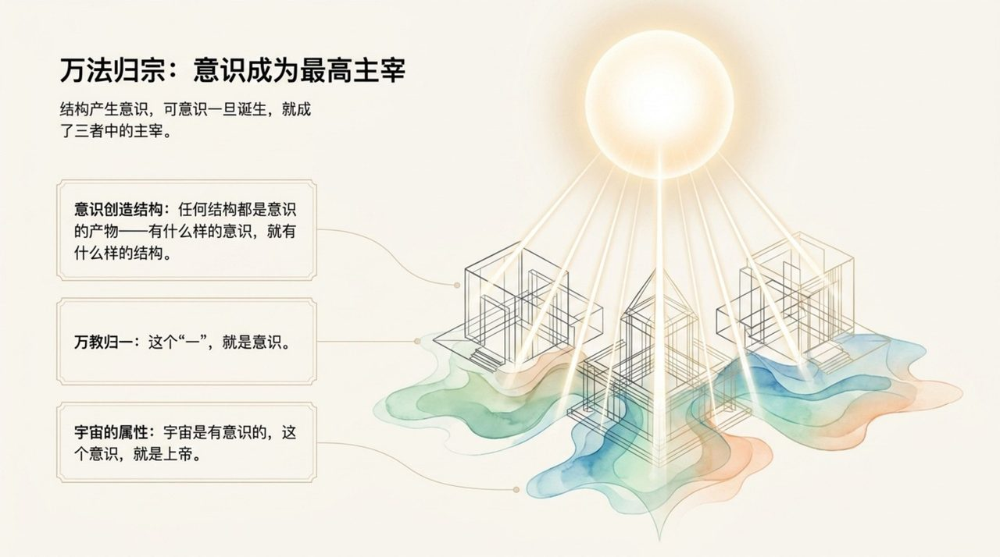
    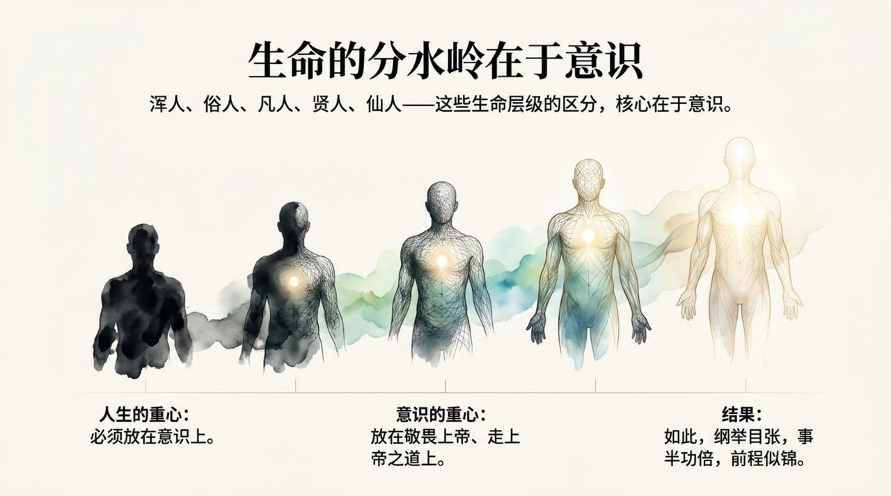
    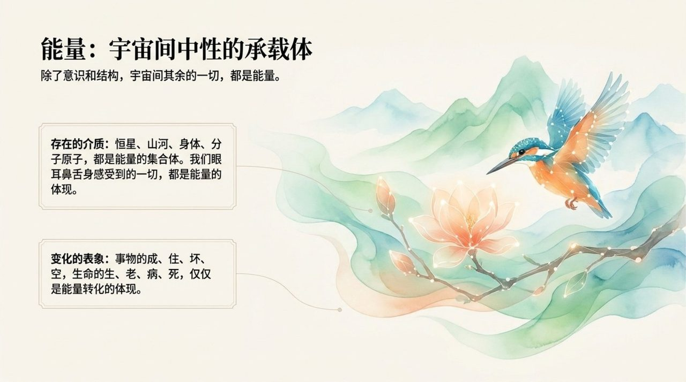
    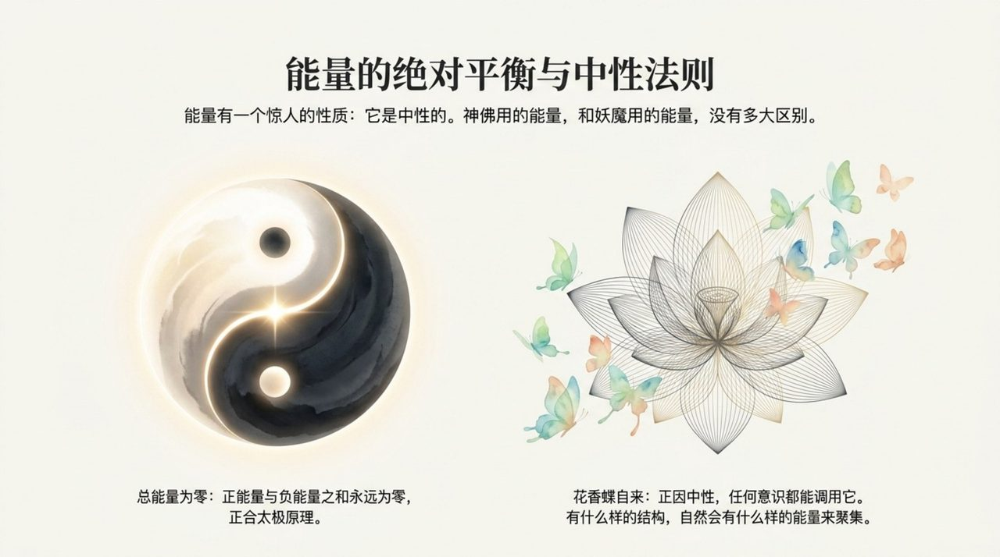
    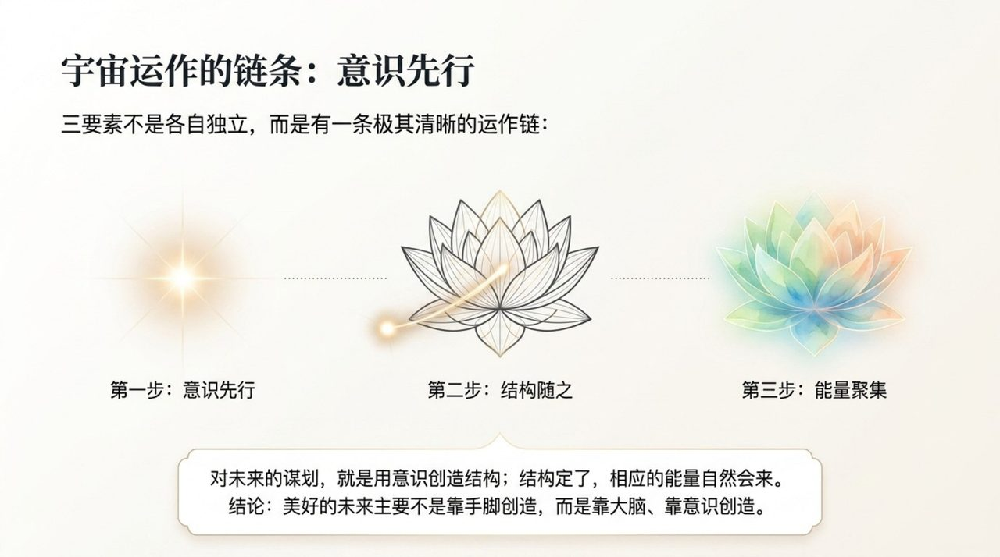
    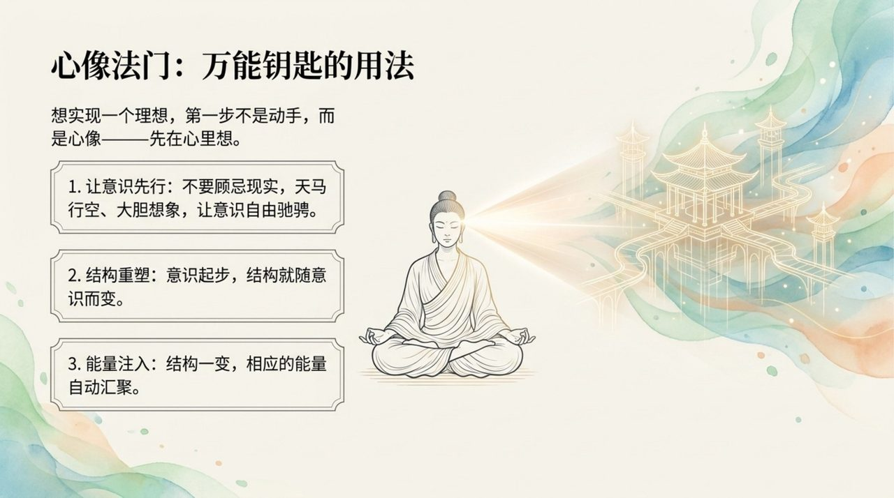
    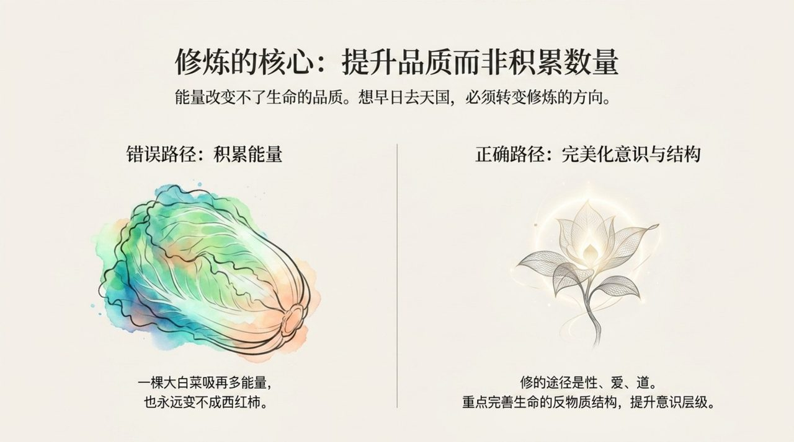
    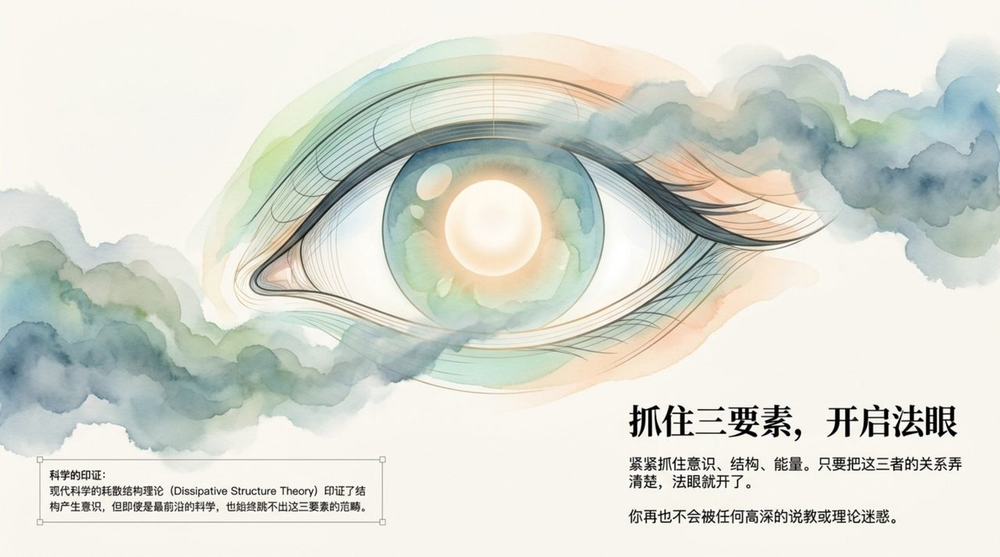
    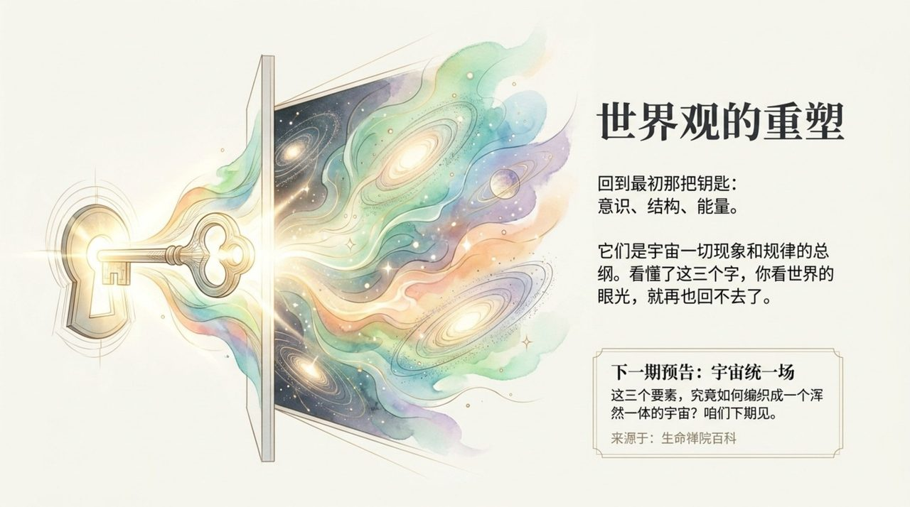

## 版本导航

| 版本 | 适合 | 核心角度 |
|------|------|----------|
| [友好版](friendly.md) | 初次了解 | 生活类比，三要素如何影响人生 |
| [学术版](academic.md) | 研究者 | 系统分析与概念辨析 |
| [内部版](internal.md) | 深度研修 | 原典引文全集 |

---

## 相关词条

[意识](/zh/consciousness/) · [结构](/zh/structure/) · [能量](/zh/energy/) · [上帝](/zh/greatest-creator/) · [法眼](/zh/linyan/) · [浑沌（本体论）](/zh/hundun/) · [宇宙起源](/zh/universe-origin/) · [提升振动频率](/zh/raise-vibration-frequency/) · [反物质结构](/zh/antimatter-structure/) · [心像思维](/zh/heart-image-thinking/)
