# 时间

> **时间是物质运动状态的记录器，时间产生于运动，无运动便无时间。**
>
> ——新时代人类八百理念第四版·第427条

时间在生命禅院体系中具有深刻的宇宙论意义：它不是永恒的背景，而是物质运动的产物，随运动而生灭，随空间不同而各异。反物质世界无时间，故为永恒。人的肉体困于纵向时间，灵体却可沿横向时间进入永恒时空。修行者的终极使命之一，便是认清"时间阵"的本质，超越时间，走向仙的自由境界——顺着时间走，成凡人；逆着时间走，成仙人。

## 视频版

<iframe style="width:100%;aspect-ratio:4/3;border:0" src="https://www.youtube-nocookie.com/embed/2NC1J3n9aDI" title="时间（生命禅院百科·视频版）" allowfullscreen></iframe>

??? info "📖 图文幻灯（14 张，点击展开）"

    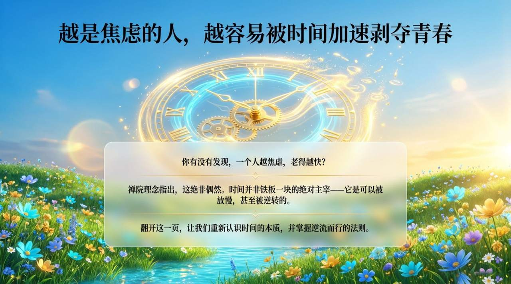
    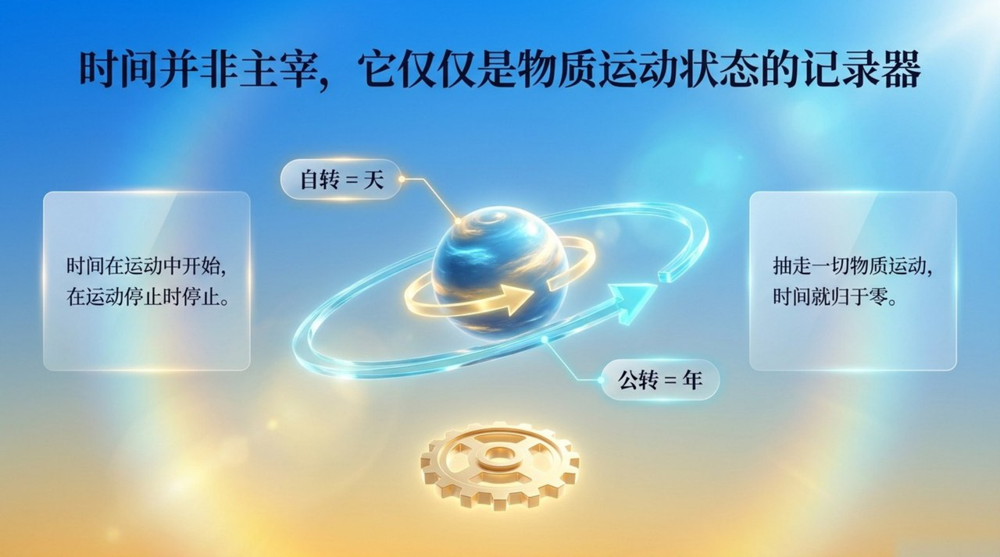
    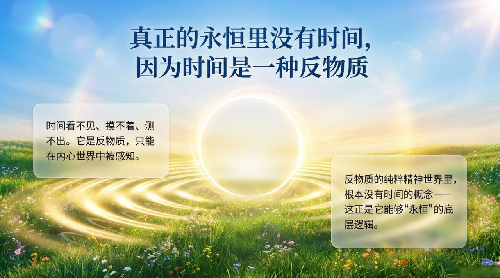
    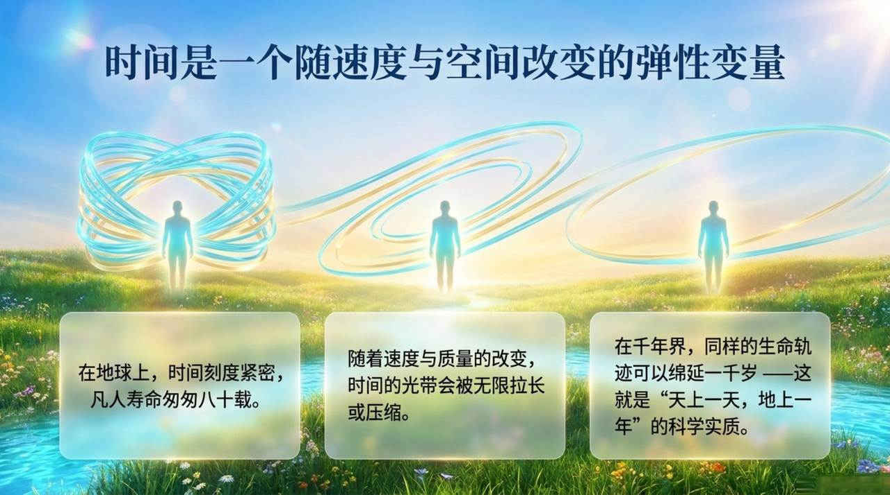
    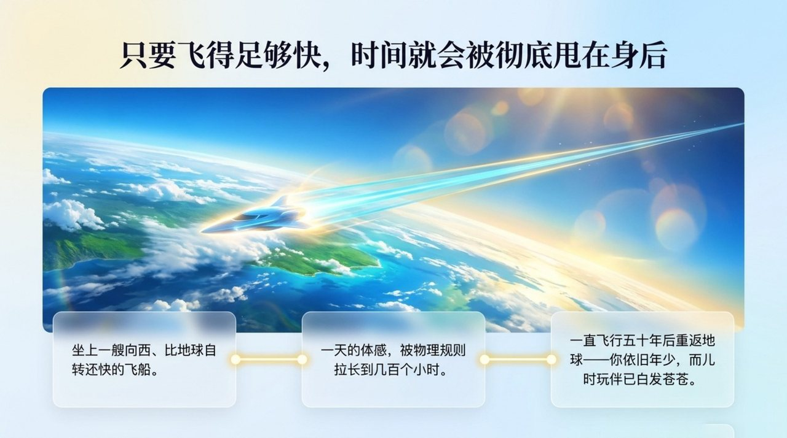
    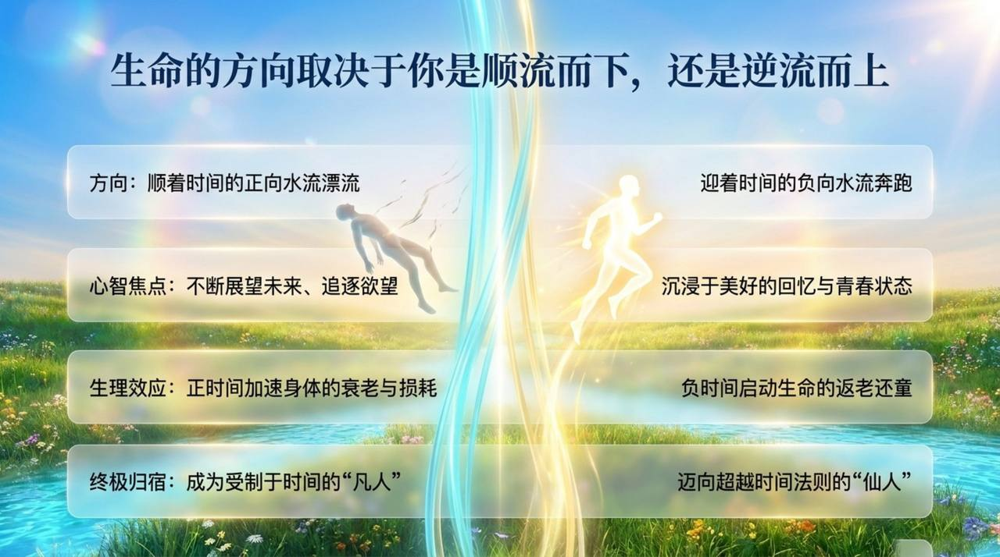
    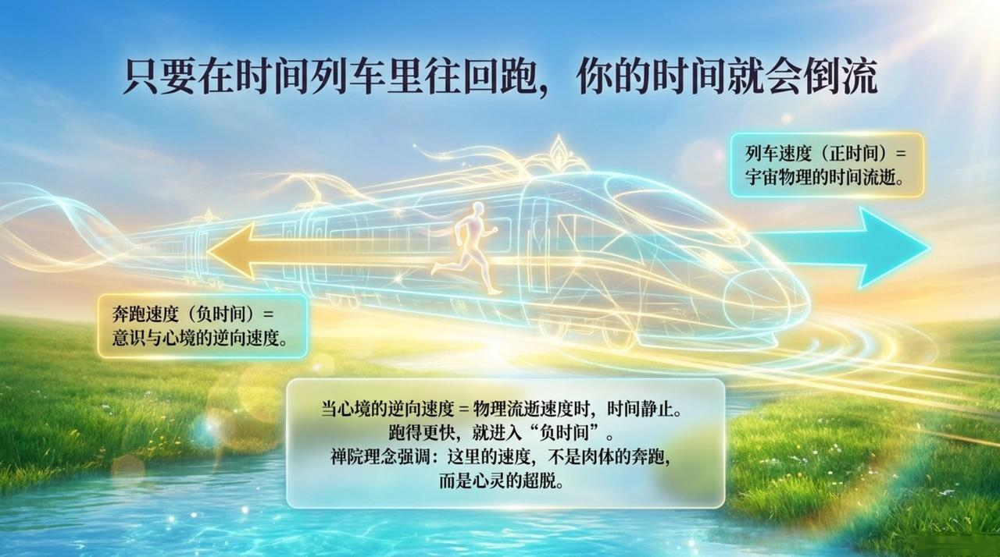
    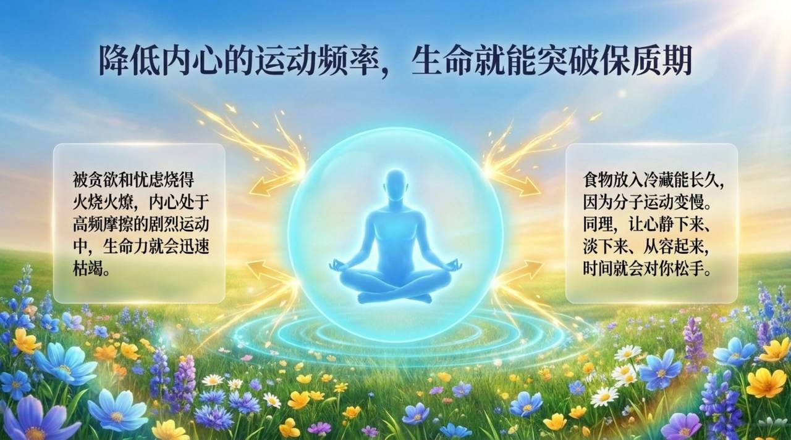
    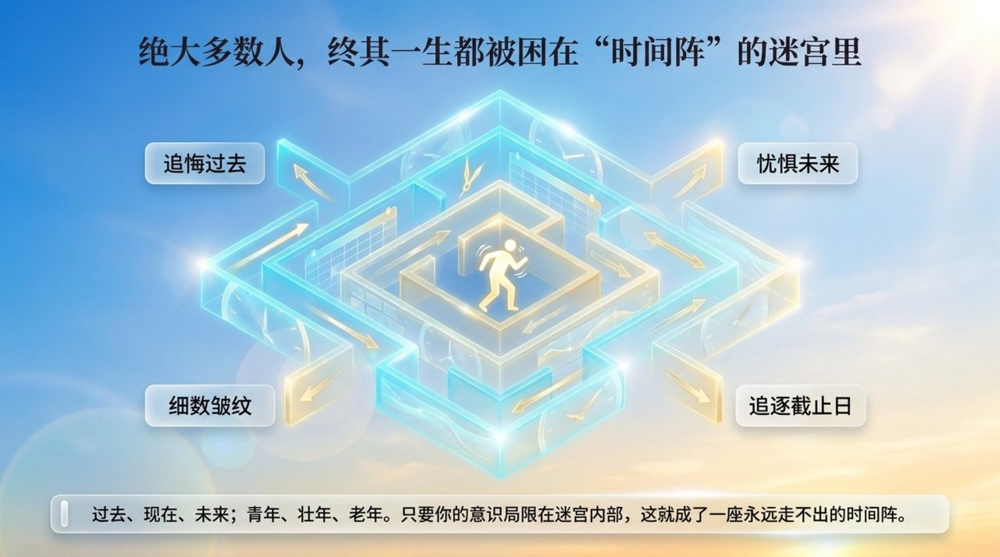
    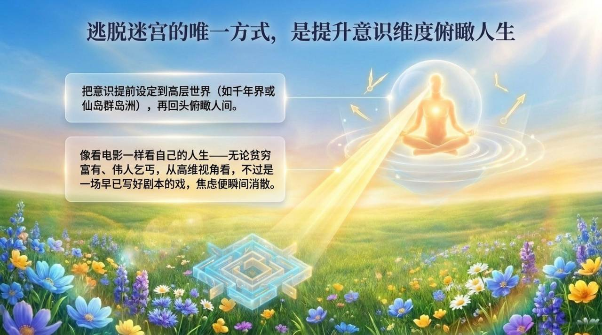
    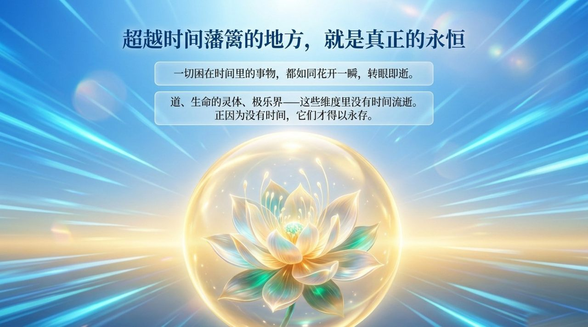
    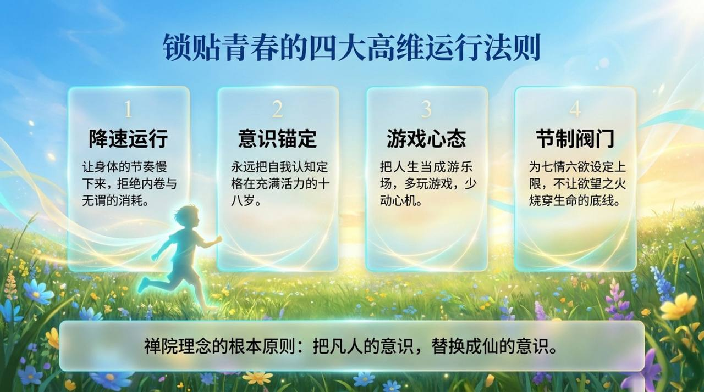
    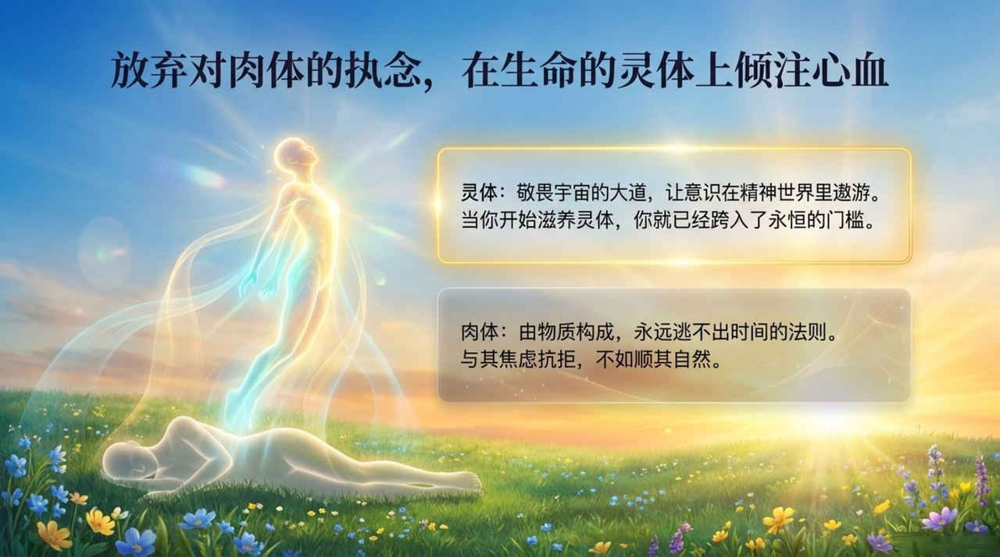
    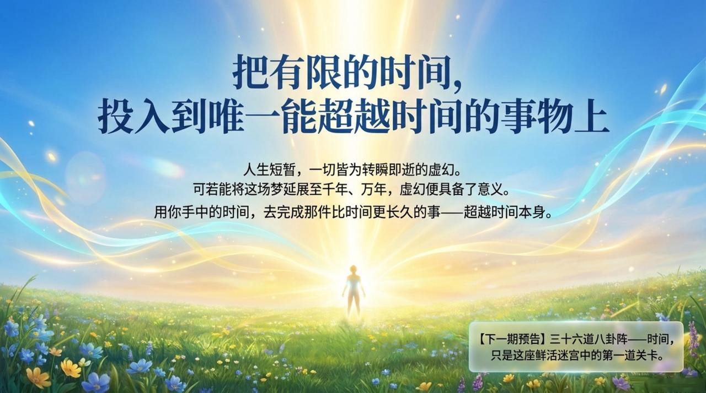

---

| 版本 | 适合 | 核心角度 |
|------|------|----------|
| [友好版](friendly.md) | 初次了解 | 生活类比，感受时间的奥秘与修炼意义 |
| [学术版](academic.md) | 研究者 | 系统分析，与物理学概念比较 |
| [内部版](internal.md) | 深度研修 | 文集全文，出处完整 |

---

## 相关词条

[时空](/zh/spacetime/) · [空间](/zh/space/) · [20个集合体世界](/zh/twenty-parallel-worlds/) · [反物质世界](/zh/antimatter-world/) · [三十六维空间](/zh/thirty-six-dimensional-space/) · [千年界](/zh/thousand-year-world/) · [万年界](/zh/ten-thousand-year-world/) · [极乐界](/zh/elysium-world/) · [梦境](/zh/dream-state/) · [生命不灭定律](/zh/law-of-life-indestructibility/) · [返老还童（青春永驻·长生不老）](/zh/fanlaohuantong/)
