<!-- id: LC-TPW-0001-ZH theme: 宇宙时空 type: 导航 direction: 宇宙结构 lang: zh -->

# 20个集合体世界

宇宙中同时并存着20个世界（亦称"20个平行世界"），由导游雪峰依据立体坐标系的数学原理推导得出。我们人类所处的人间（XY世界）仅是其中之一，其余19个世界与人间同时存在，通过清凉界O点这一枢纽彼此相连——上帝的质即居于此处。理解20个集合体世界，是觉悟空间、走上帝之道的重要一步。

## 视频版

<iframe style="width:100%;aspect-ratio:4/3;border:0" src="https://www.youtube-nocookie.com/embed/aY8FXqC7U78" title="20个集合体世界（生命禅院百科·视频版）" allowfullscreen></iframe>

??? info "📖 图文幻灯（14 张，点击展开）"

    
    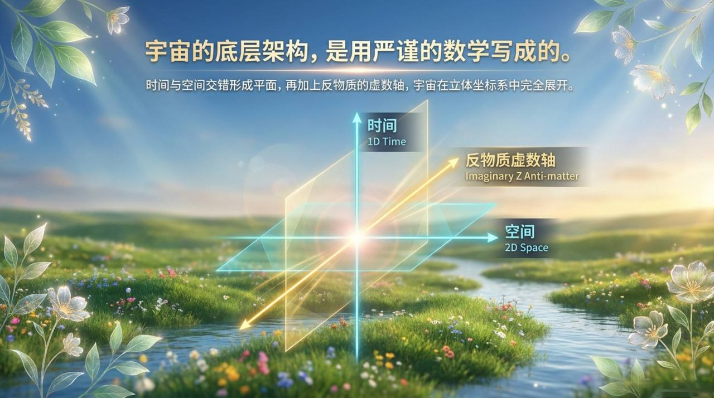
    
    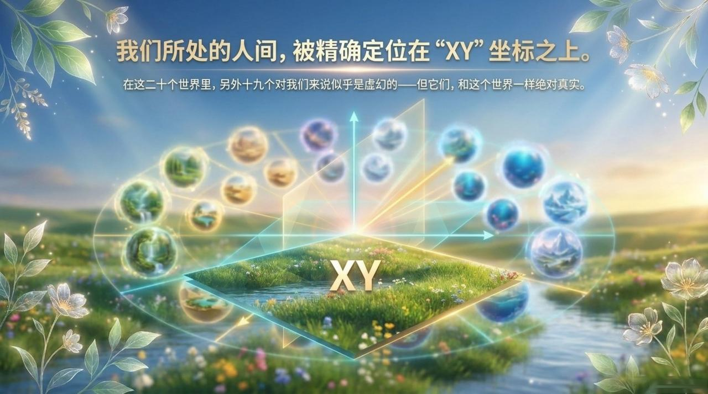
    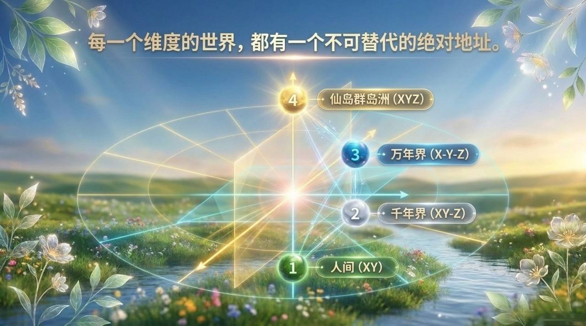
    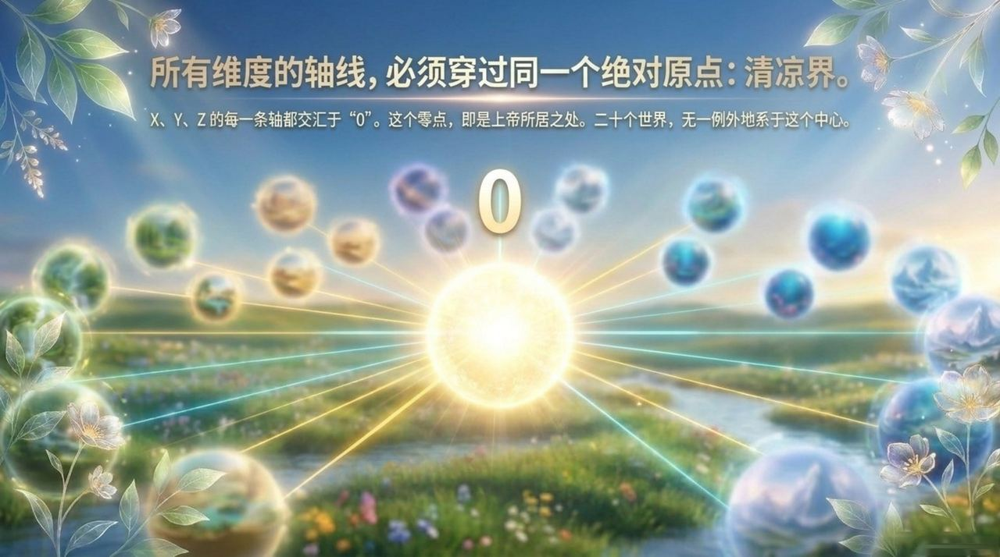
    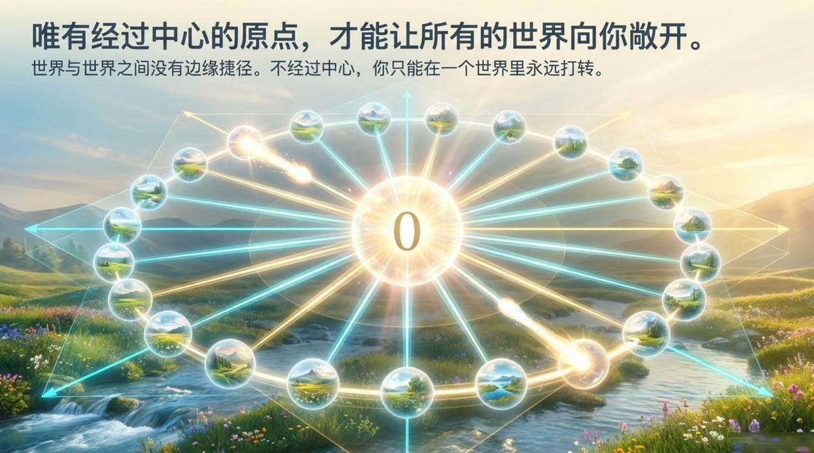
    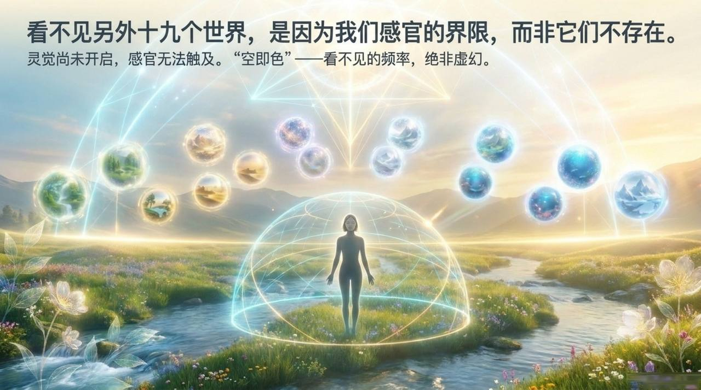
    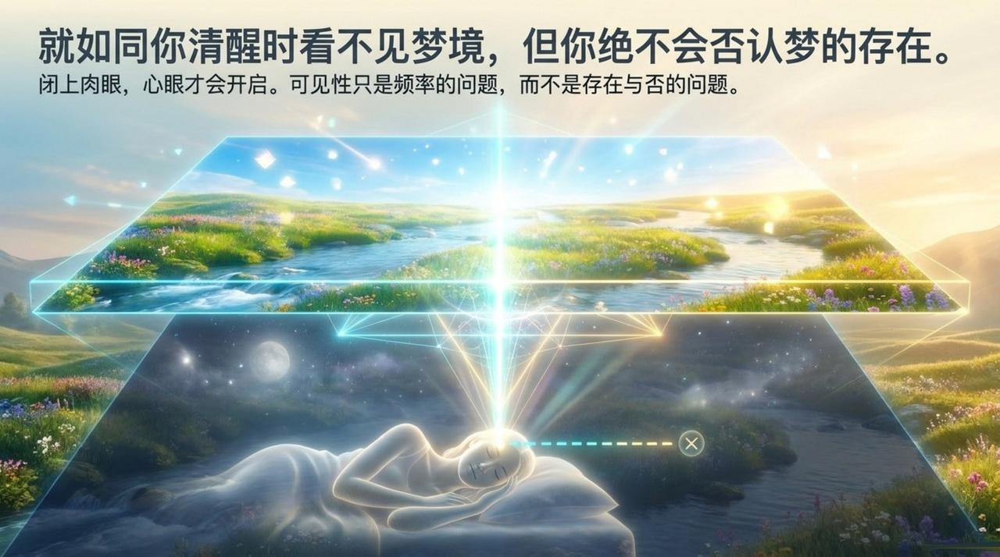
    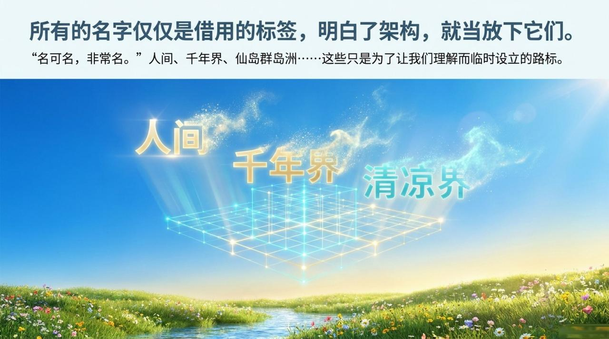
    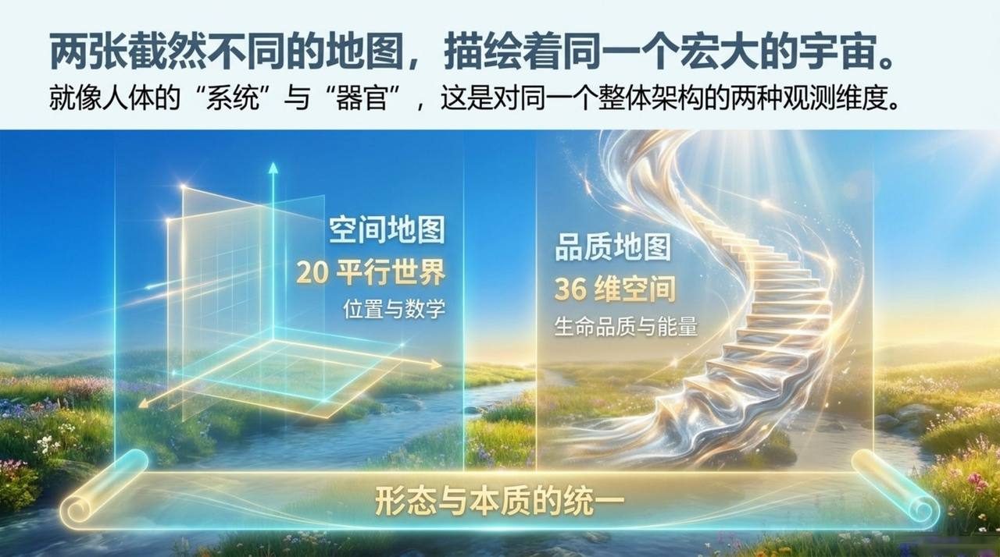
    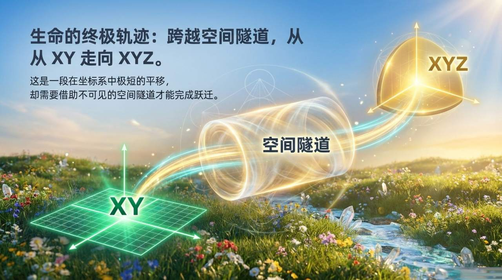
    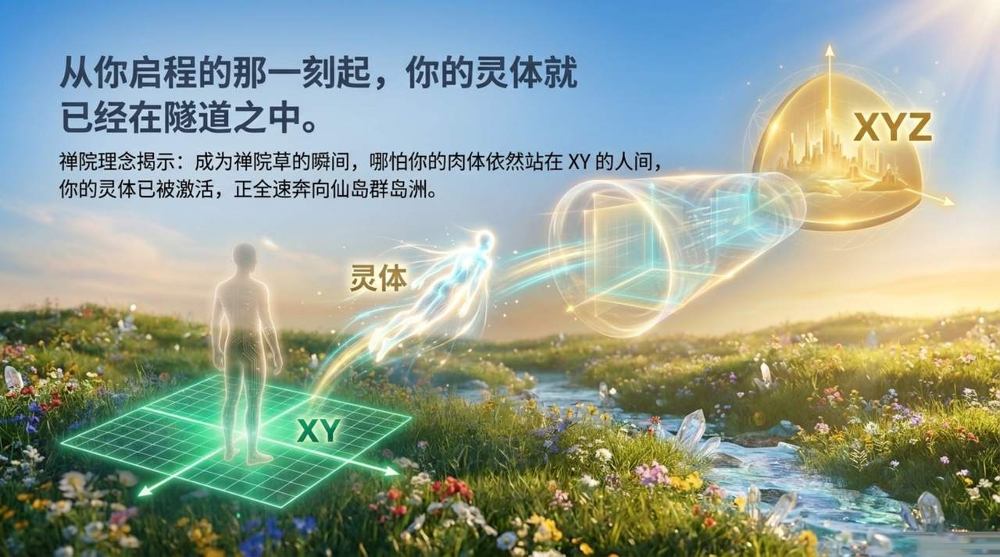
    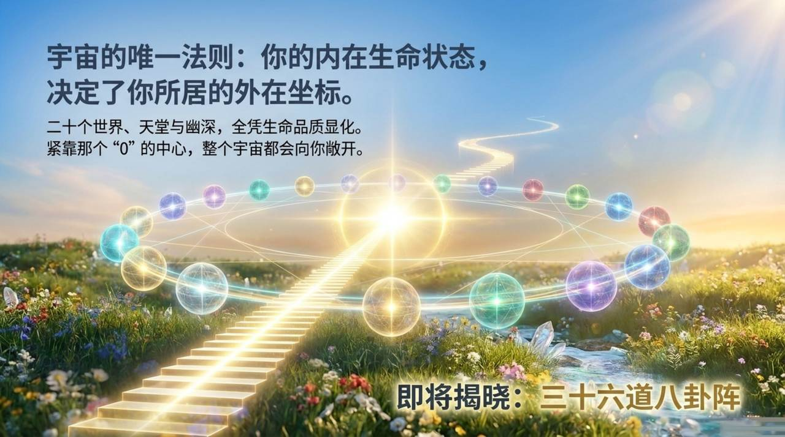

---

## 版本导航

| 版本 | 适合 | 核心角度 |
|------|------|----------|
| [友好版](friendly.md) | 初次了解 | 白话图解·20个世界逐一介绍·修炼意义 |
| [学术版](academic.md) | 研究者 | 数理推导·与佛道三界说比较·体系定位 |
| [内部版](internal.md) | 深度研修 | 完整引文·坐标名称对照表·导游问答 |

---

## 关联词条

[三十六维空间](/zh/thirty-six-dimensional-space/) · [时空隧道](/zh/spacetime-tunnel/) · [宇宙（总论）](/zh/universe-overview/) · [上帝](/zh/greatest-creator/) · [时空](/zh/spacetime/) · [反物质世界](/zh/antimatter-world/) · [千年界](/zh/thousand-year-world/) · [万年界](/zh/ten-thousand-year-world/) · [极乐界](/zh/elysium-world/) · [黑洞](/zh/black-hole/)
