# 宇宙（总论）

**宇宙**，在生命禅院体系中，是"由无限空间和无限时间构成的物质和反物质的综合体"。宇宙的本质是浑沌，构成要素是意识、结构、能量，起源于无极生太极、混沌变浑沌，运行的核心血液是道，创造者与主宰者是上帝。宇宙与生命互为存在，宇宙为生命而存在。认识宇宙，是认识生命、认识道、认识上帝的前提。

---

## 视频版

<iframe style="width:100%;aspect-ratio:4/3;border:0" src="https://www.youtube-nocookie.com/embed/80td9kPm-DQ" title="宇宙（总论）（生命禅院百科·视频版）" allowfullscreen></iframe>

??? info "📖 图文幻灯（14 张，点击展开）"

    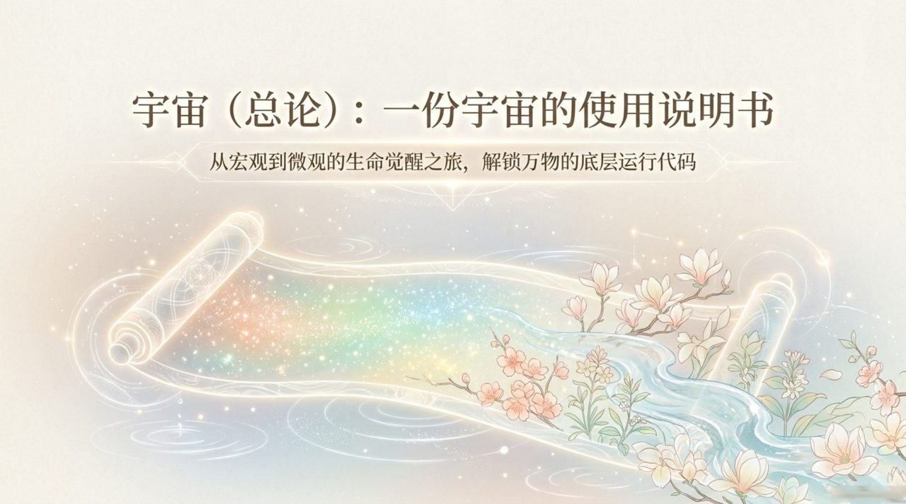
    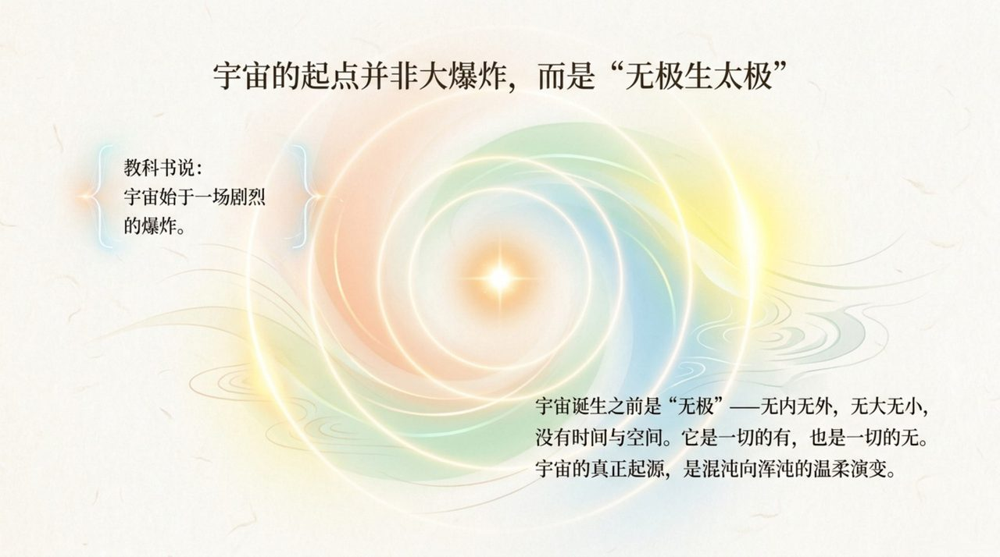
    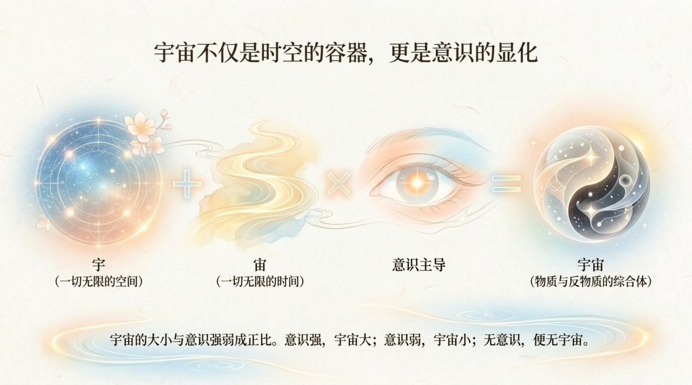
    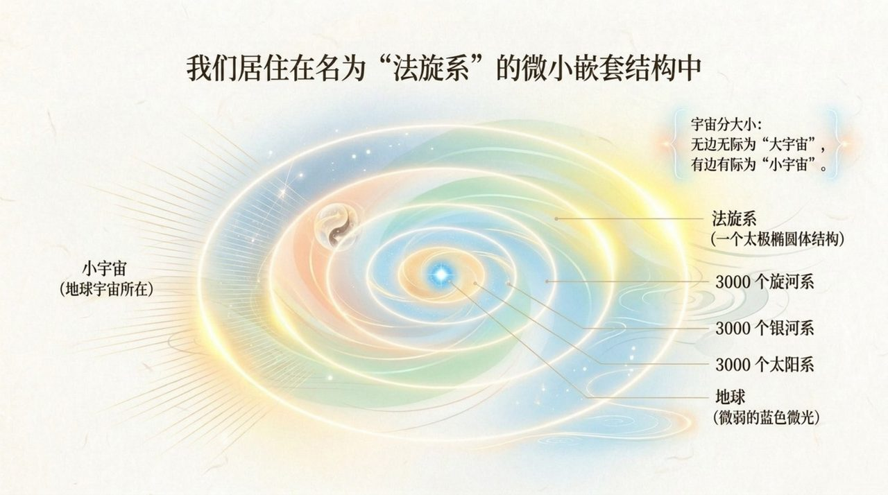
    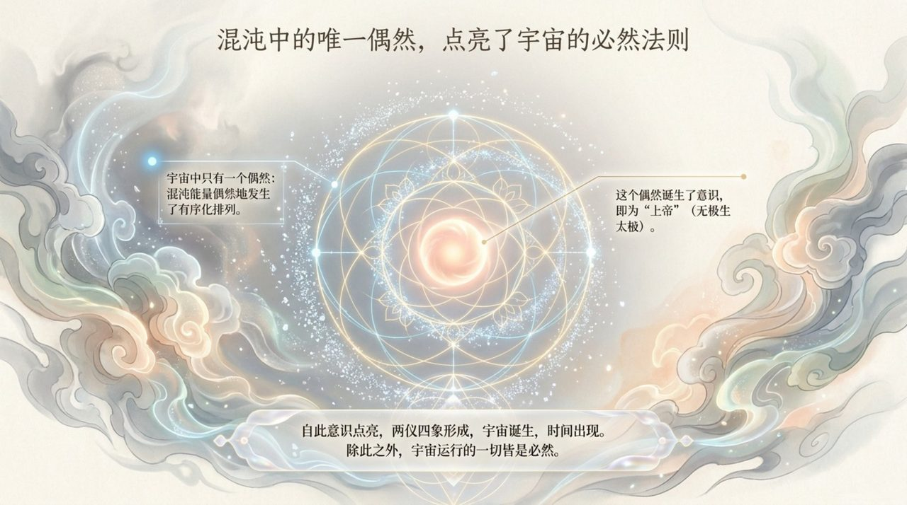
    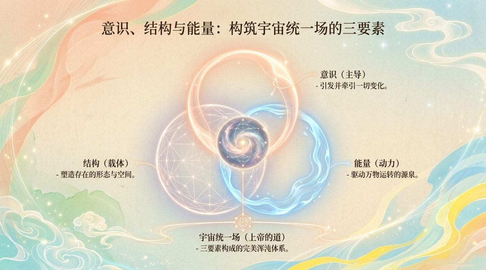
    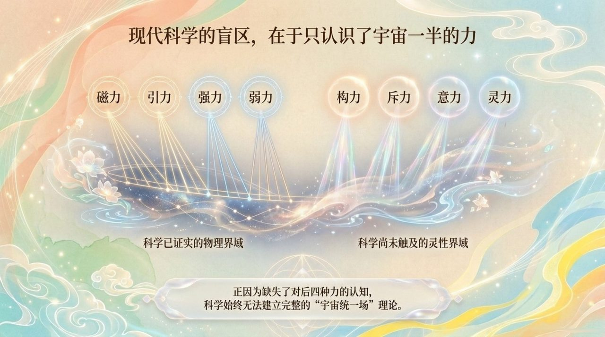
    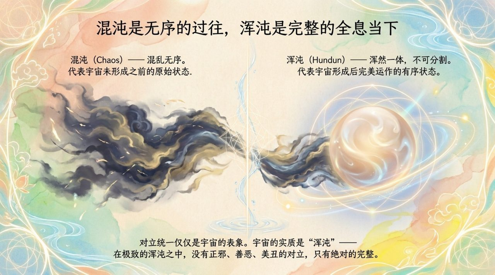
    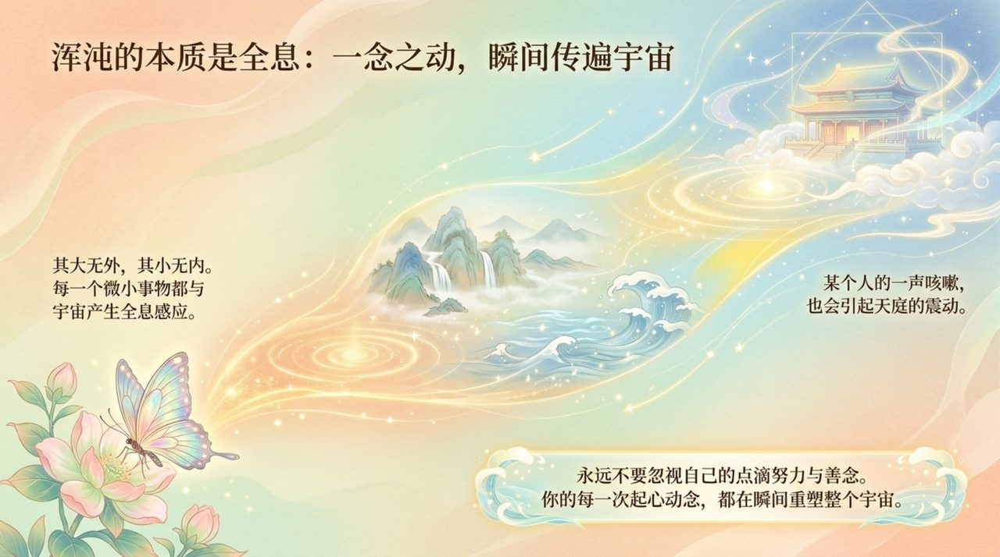
    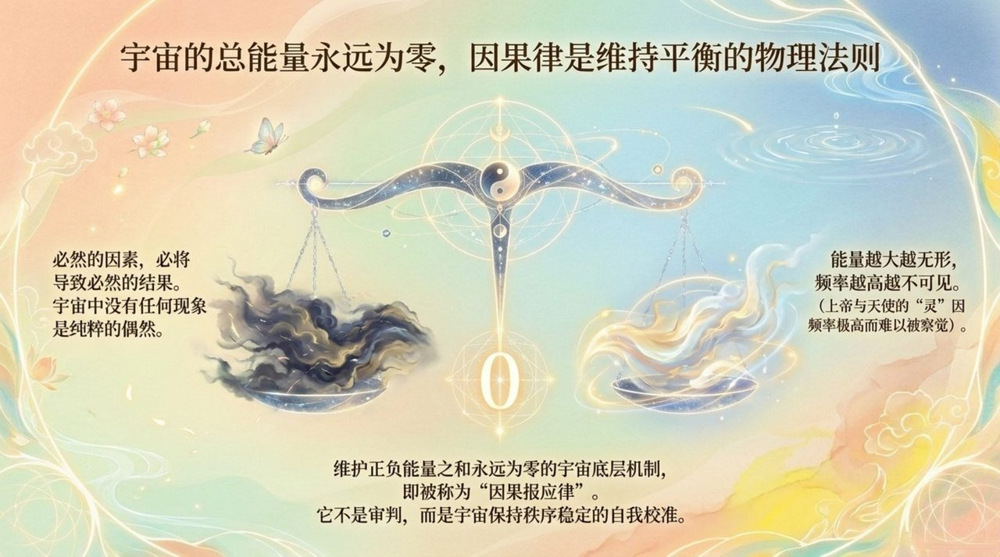
    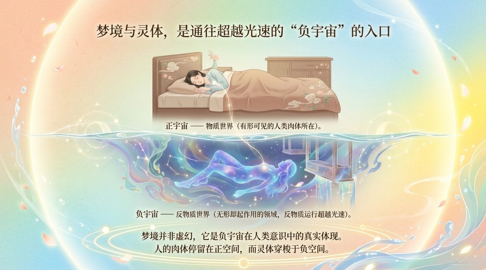
    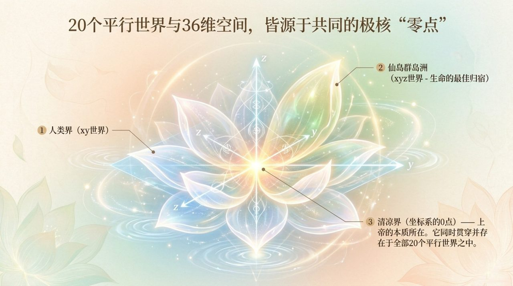
    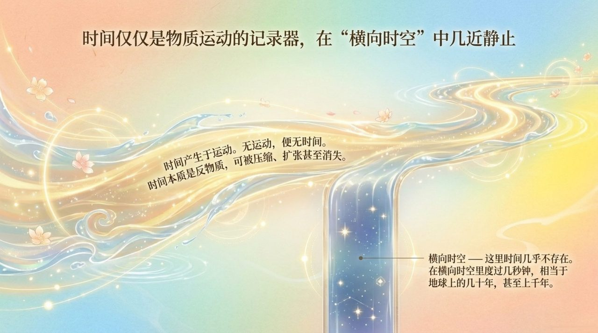
    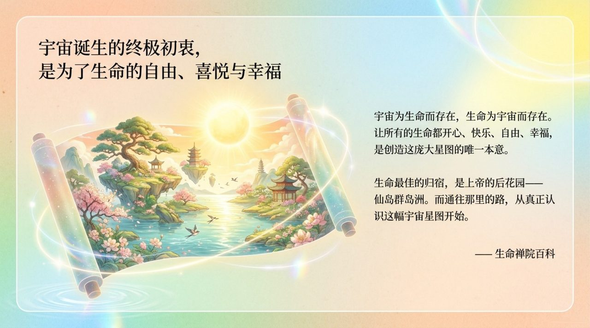

## 版本导航

| 版本 | 适合读者 | 入口 |
|------|----------|------|
| 友好版 | 初次接触，希望轻松理解 | [阅读友好版](/zh/universe-overview/friendly/) |
| 学术版 | 深入研究，系统梳理 | [阅读学术版](/zh/universe-overview/academic/) |
| 内部版 | 禅院草，研读原典 | [阅读内部版](/zh/universe-overview/internal/) |

---

## 相关词条

[道](/zh/dao/) · [上帝](/zh/greatest-creator/) · [浑沌](/zh/hundun/) · [负宇宙](/zh/negative-universe/) · [反物质结构](/zh/antimatter-structure/) · [三十六维空间](/zh/thirty-six-dimensional-space/) · [时空](/zh/spacetime/) · [能量](/zh/energy/) · [意识](/zh/consciousness/) · [宇宙全景图](/zh/cosmic-panorama/)
