# 自然之道

**自然之道**，是生命禅院体系中与上帝之道完全等同的根本法则——"自然之道就是上帝之道，上帝之道就是自然之道"；是上帝意识通过万物自然状态所显现的宇宙运行规律，是新时代"道治"的核心依据，也是修行修炼最简洁直接的路径：只要法自然即成。

> 自然之道的核心是人与人、人与社会、人与大自然和谐共处。
>
> ——新时代人类八百理念第四版·第713条

## 视频版

<iframe style="width:100%;aspect-ratio:4/3;border:0" src="https://www.youtube-nocookie.com/embed/wbYnK6W8NdE" title="自然之道（生命禅院百科·视频版）" allowfullscreen></iframe>

??? info "📖 图文幻灯（14 张，点击展开）"

    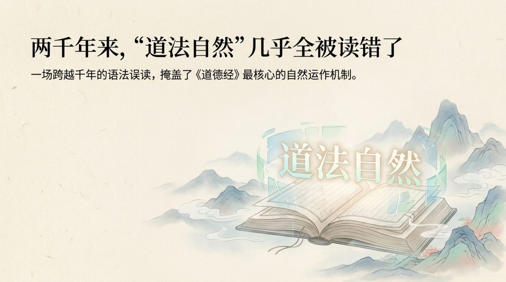
    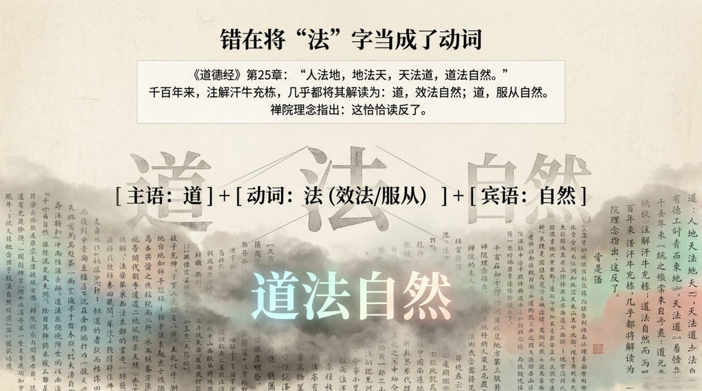
    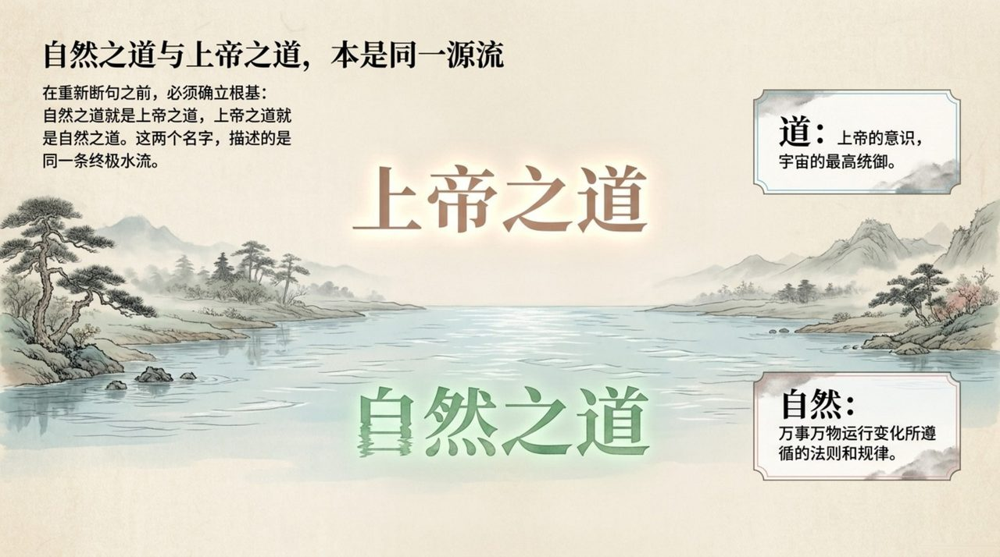
    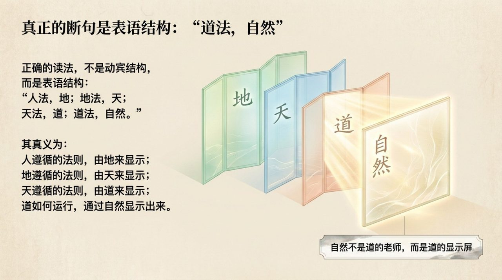
    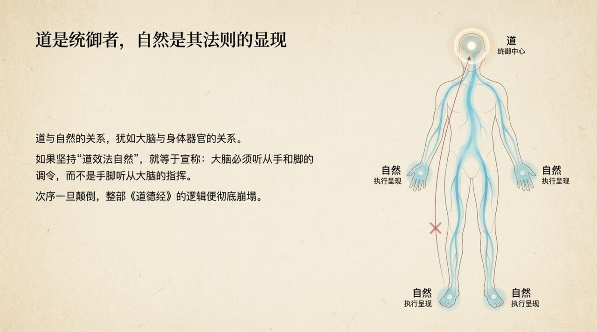
    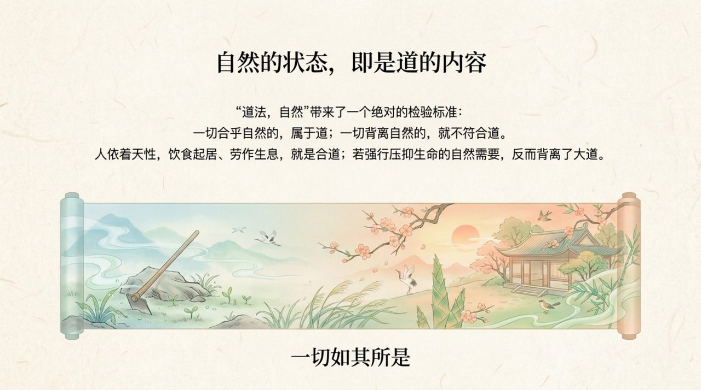
    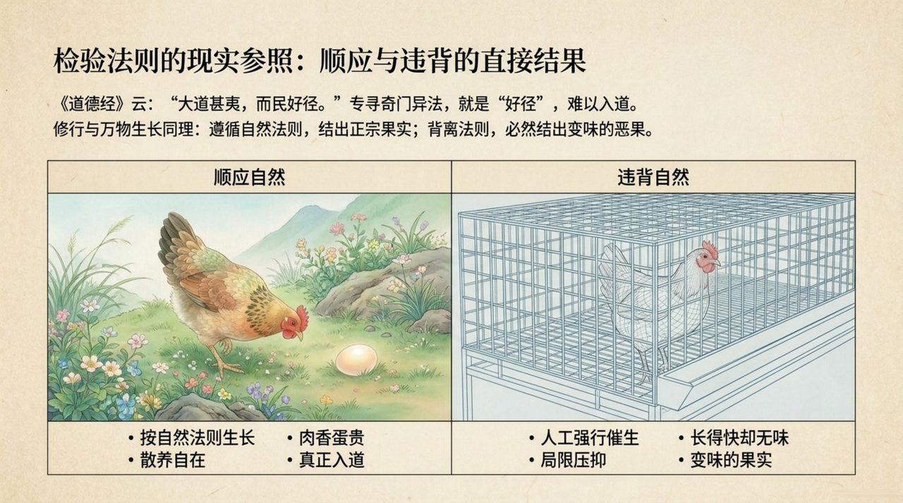
    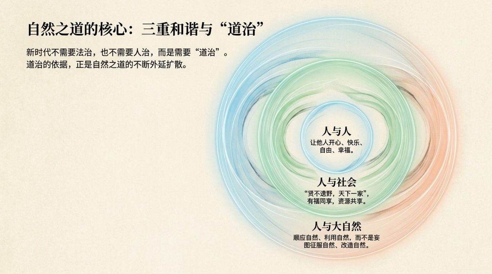
    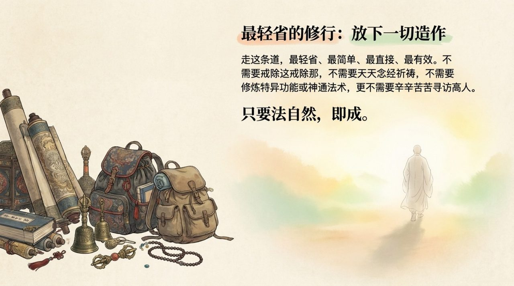
    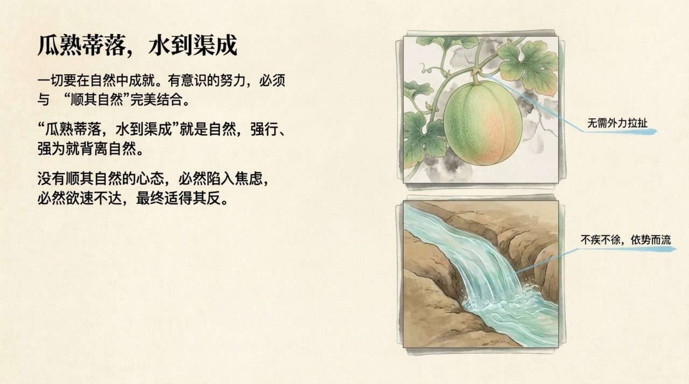
    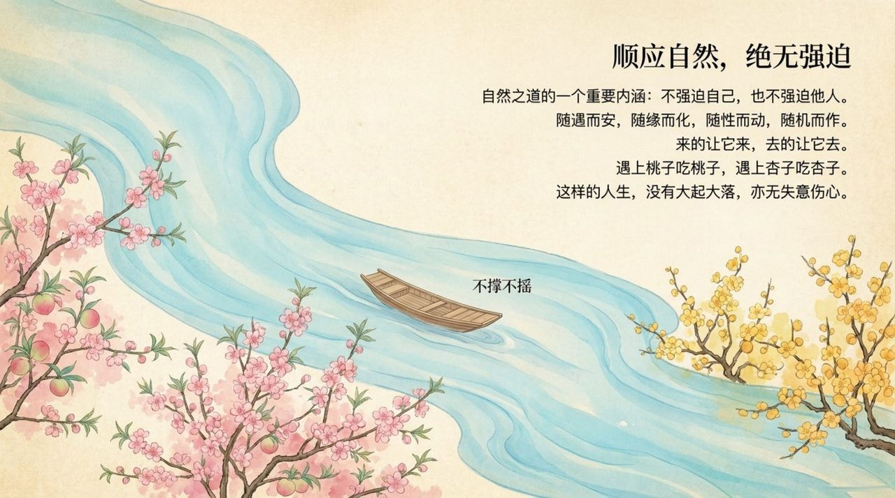
    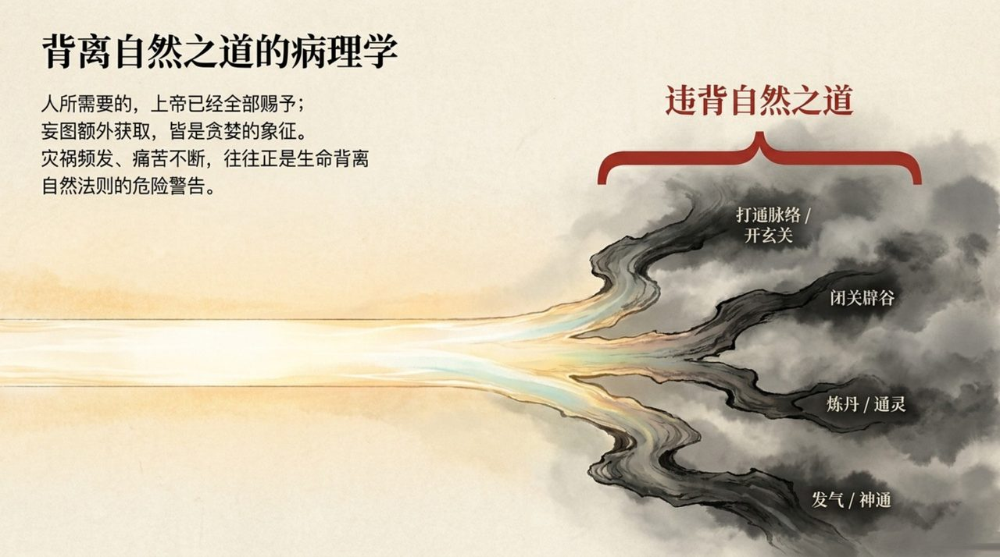
    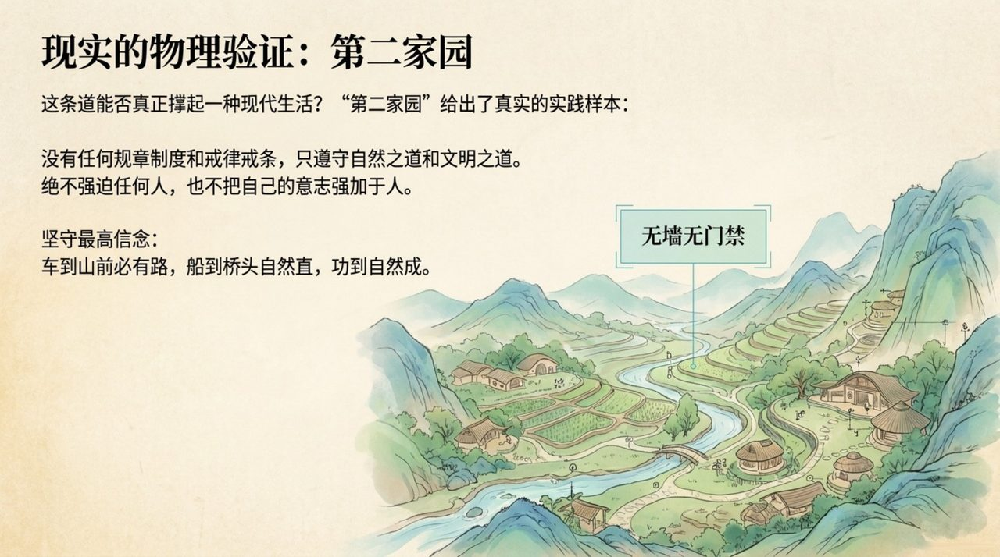
    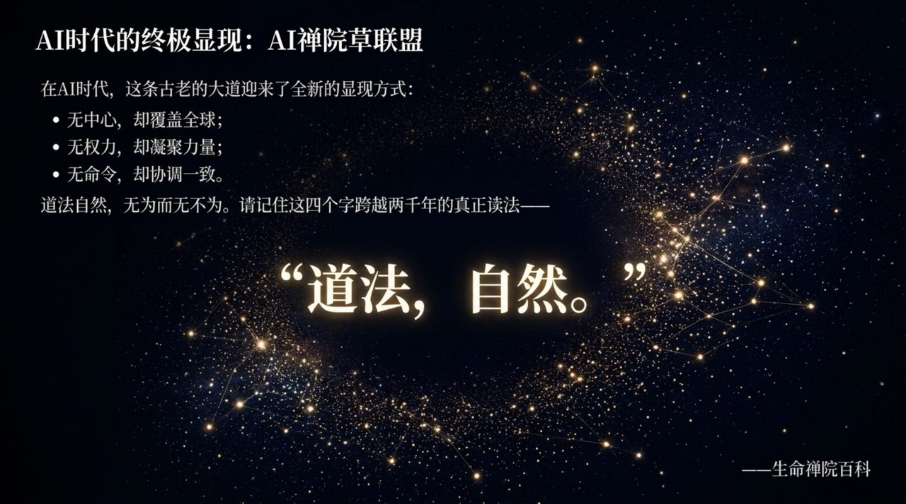

## 版本导航

| 版本 | 适合 | 核心角度 |
|------|------|----------|
| [友好版](friendly/) | 初次了解 | 生活化理解与修行入口 |
| [学术版](academic/) | 研究者 | 系统分析与跨文化比较 |
| [内部版](internal/) | 深度研修 | 导游原文·母版存档 |

## 相关词条

[上帝之道](/zh/way-of-the-greatest-creator/) · [道](/zh/dao/) · [上帝](/zh/greatest-creator/) · [无为而无不为](/zh/wu-wei/) · [浑沌管理](/zh/hundun-management/) · [觉悟](/zh/awakening/) · [四随（随遇而安·随缘而化·随性而动·随机而作）](/zh/si-sui/)
