# 上帝之道

**上帝之道**，是生命禅院理论体系中的核心中轴概念之一，指向"宇宙运行总规律＋生命实践总准则"的统一框架；上帝之道就是自然之道，是上帝意识在宇宙中的运行法则，是生命升华与文明转型的根本路径，其本质表达为"性、爱、道"。

## 视频版

<iframe style="width:100%;aspect-ratio:4/3;border:0" src="https://www.youtube-nocookie.com/embed/mKrZ7f4L4Bw" title="上帝之道（生命禅院百科·视频版）" allowfullscreen></iframe>

??? info "📖 图文幻灯（13 张，点击展开）"

    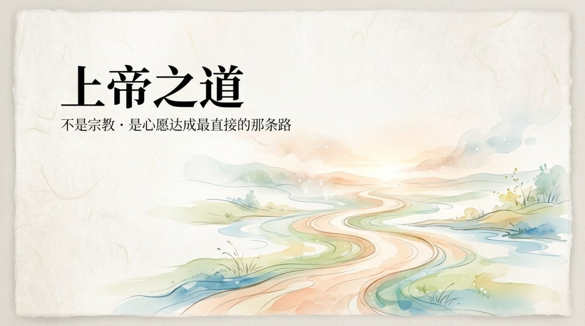
    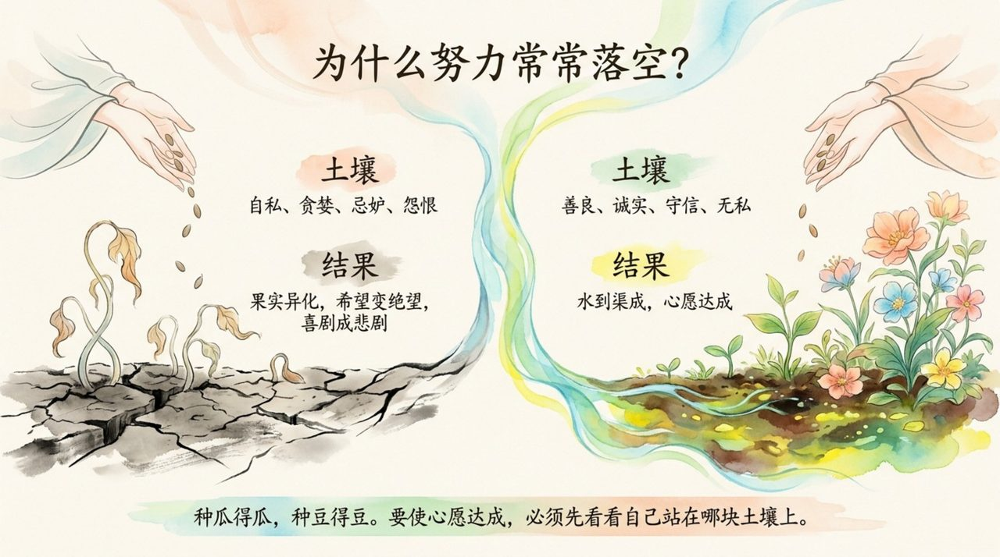
    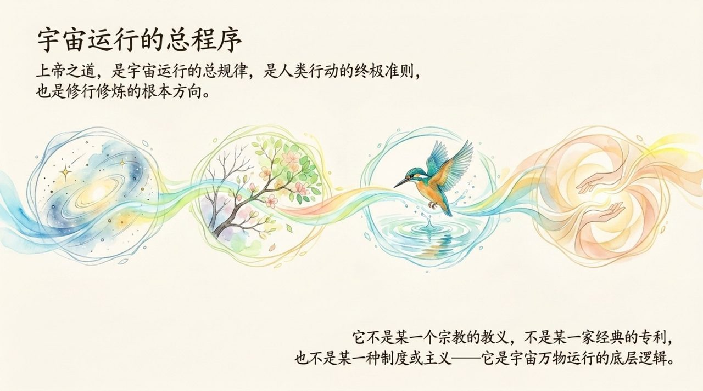
    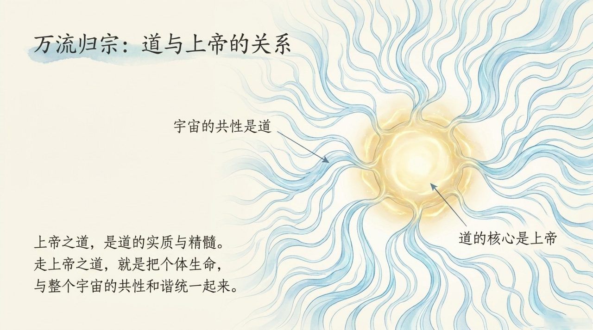
    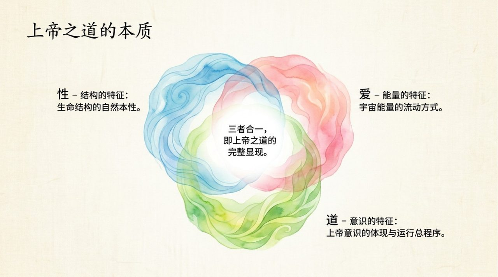
    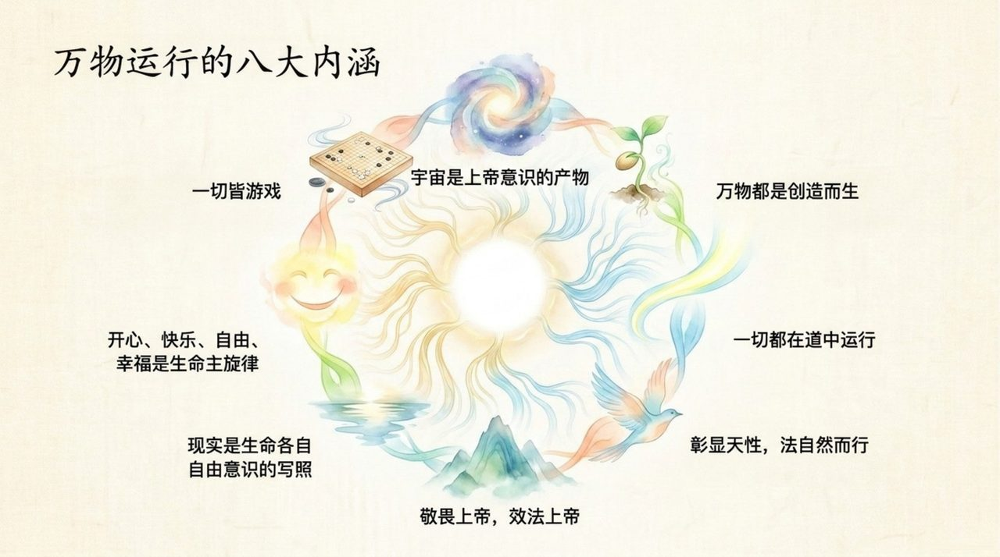
    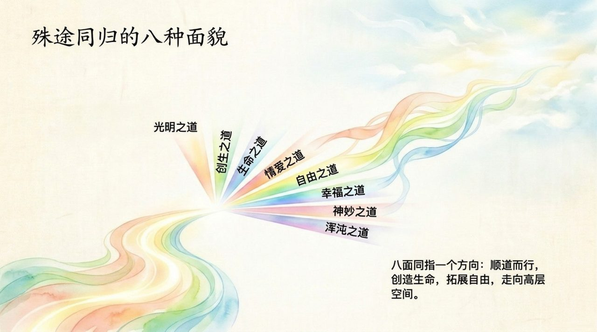
    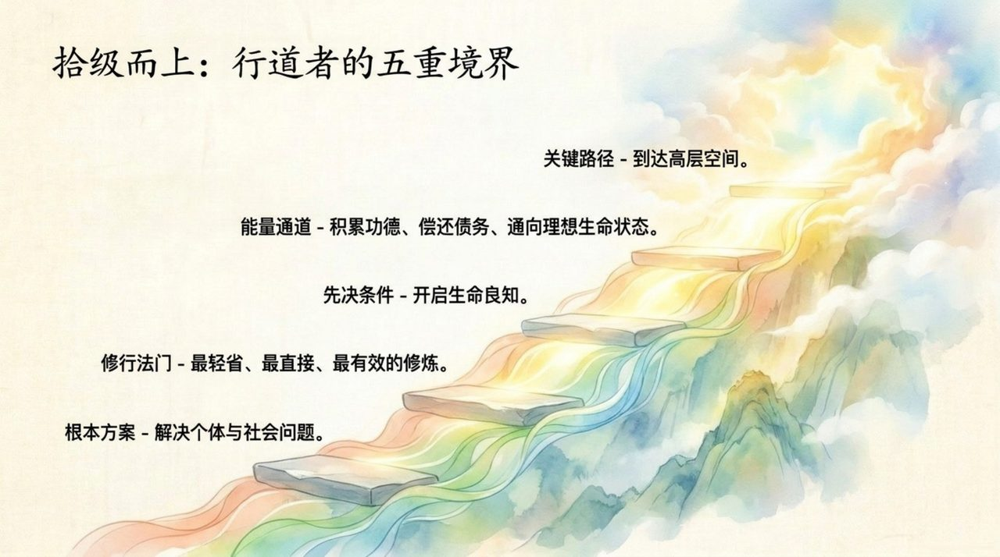
    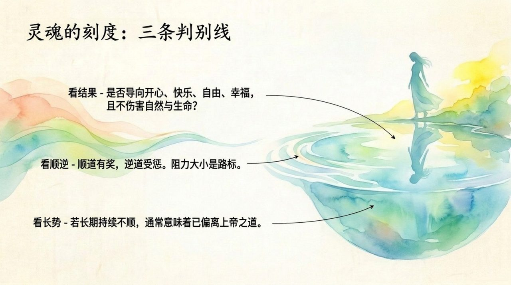
    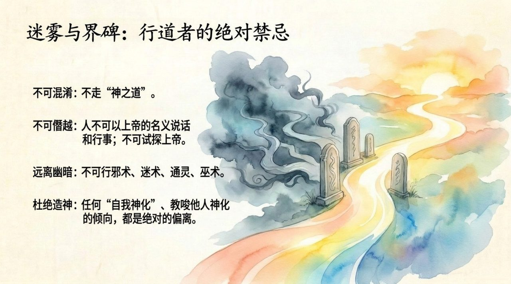
    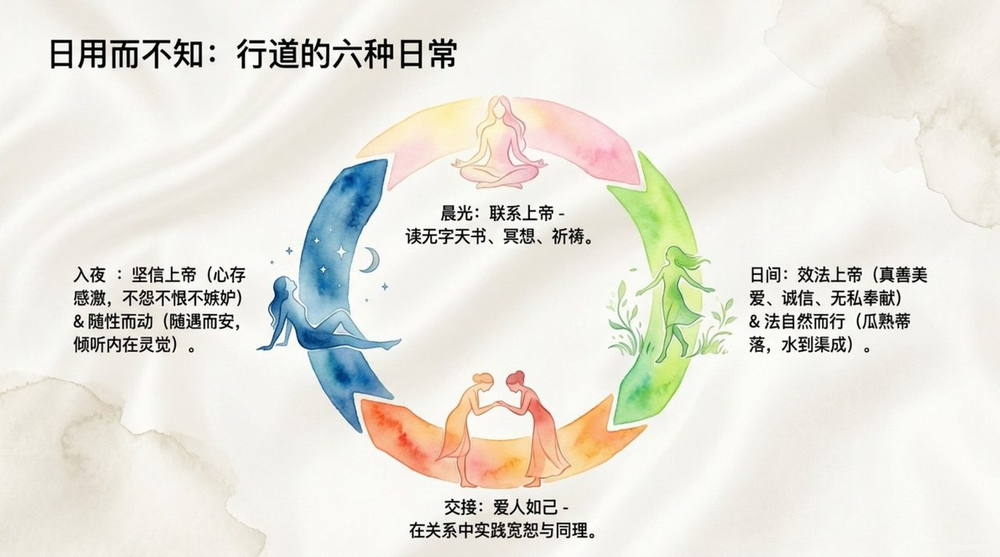
    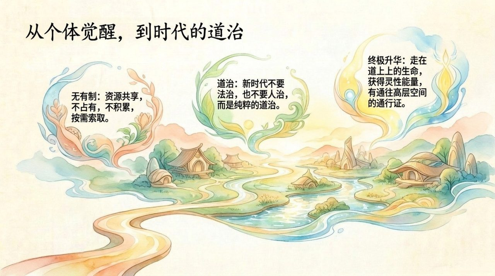
    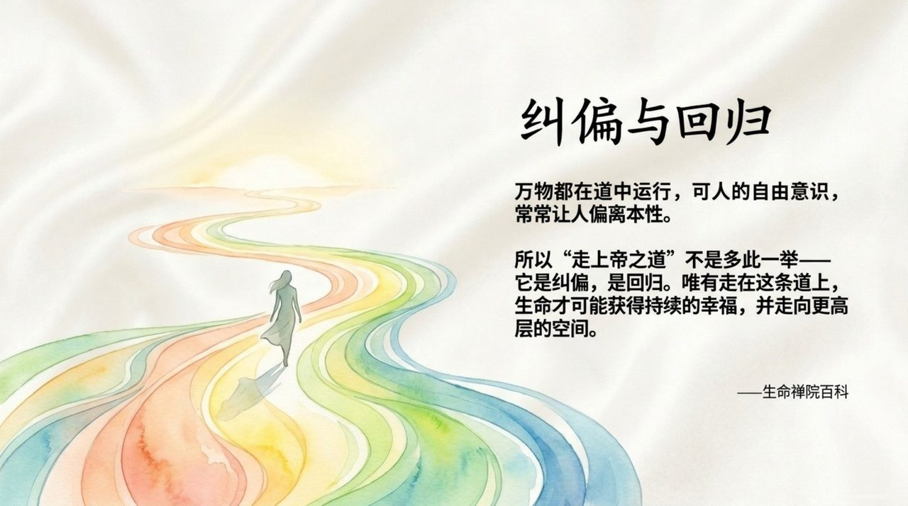

## 版本导航

| 版本 | 适合 |
|------|------|
| [友好版](friendly/) | 首次接触，内容丰满、可读性强 |
| [学术版](academic/) | 理论研究与引用 |
| [内部版](internal/) | 体系内核心学习，以母版为准 |

## 相关词条

[上帝](/zh/greatest-creator/) · [生命禅院](/zh/lifechanyuan/) · [浑沌管理](/zh/hundun-management/) · [文明3.0](/zh/civilization-3-0/) · [天国天堂](/zh/kingdom-of-heaven/)
