# 五蕴皆空

> "观自在菩萨，行深般若波罗蜜多时，照见五蕴皆空，度一切苦厄。"  
> ——《般若波罗蜜多心经》（新时代人类八百理念第四版·第689条）

"五蕴皆空"是生命禅院修炼体系的核心境界：色（物质形体）、受（感受）、想（知觉）、行（意志活动）、识（分别意识）五蕴悉皆归空，唯意识、结构、能量三要素永恒不空。五蕴皆空，常回零态，此乃达极乐永恒妙法。

| 版本 | 适合 | 核心角度 |
|------|------|----------|
| [友好版](friendly.md) | 初次了解 | 放下执取，回归零态 |
| [学术版](academic.md) | 研究者 | 与佛学文集的对照与新诠 |
| [内部版](internal.md) | 深度研修 | 导游文集完整辑录 |

---

## 视频版

<iframe style="width:100%;aspect-ratio:4/3;border:0" src="https://www.youtube-nocookie.com/embed/U2drFWdZM_w" title="五蕴皆空（生命禅院百科·视频版）" allowfullscreen></iframe>

??? info "📖 图文幻灯（14 张，点击展开）"

    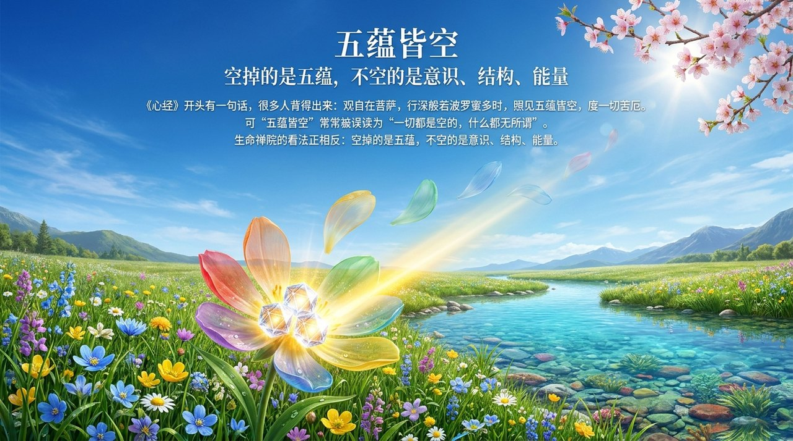
    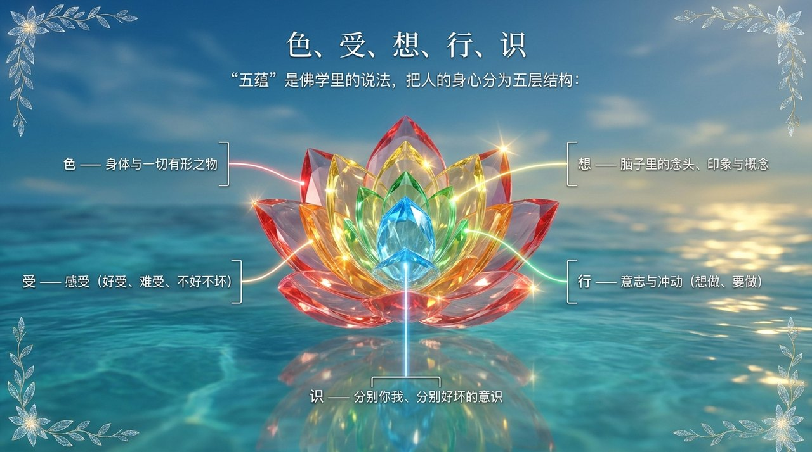
    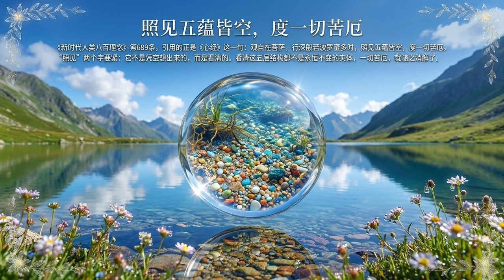
    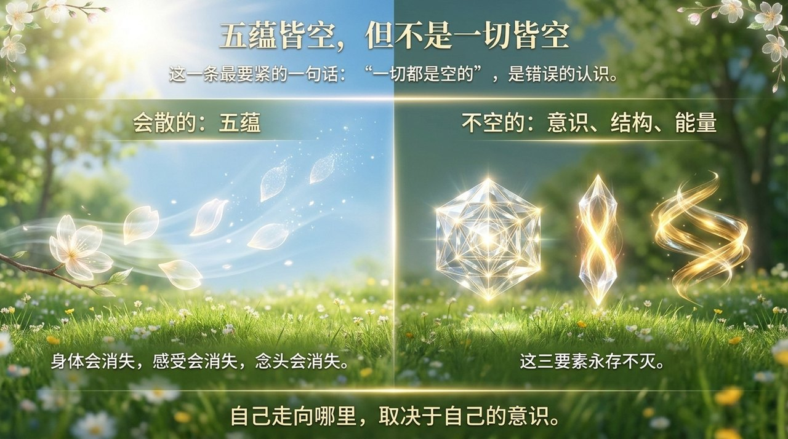
    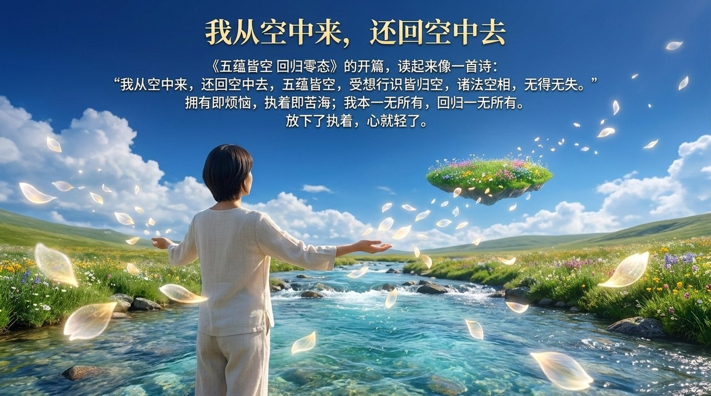
    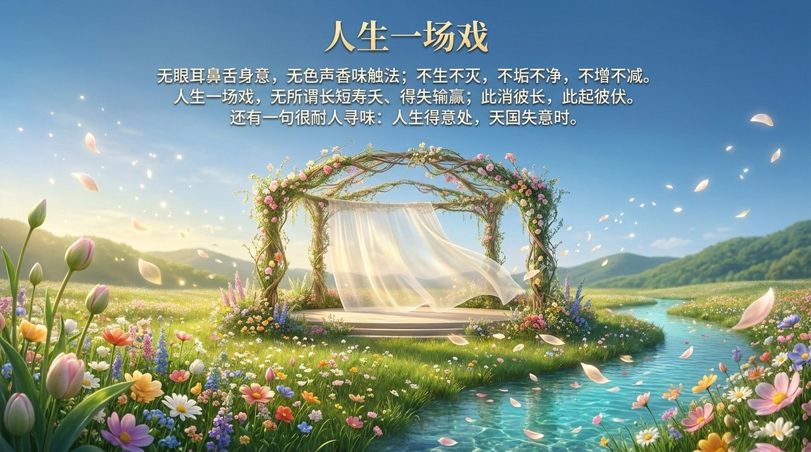
    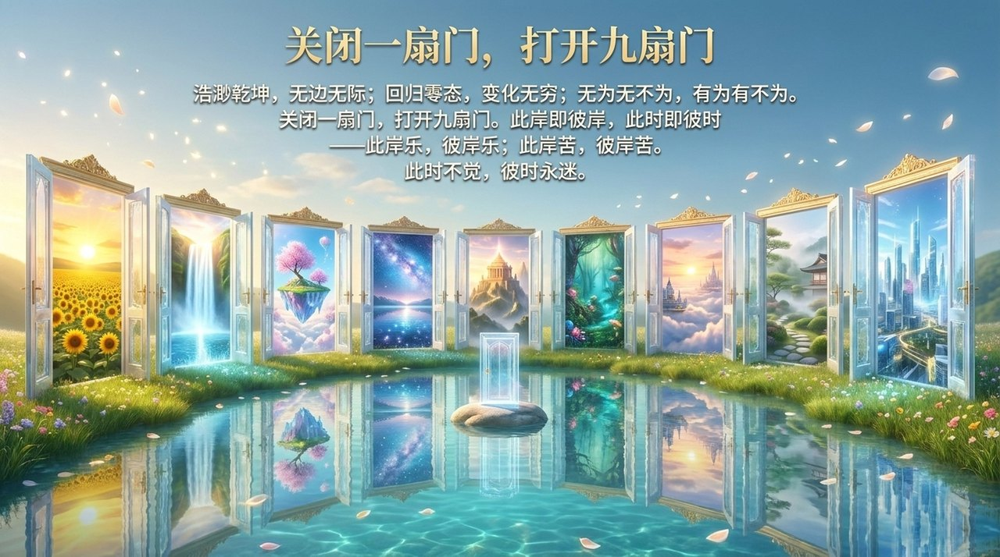
    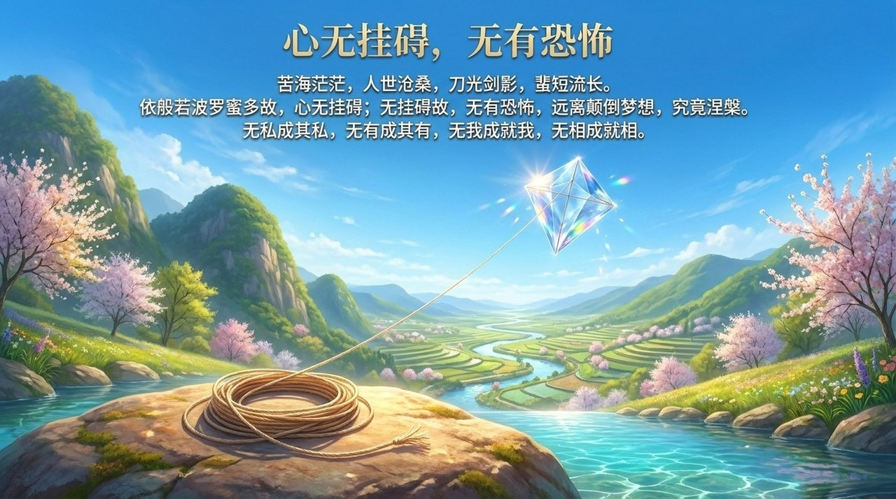
    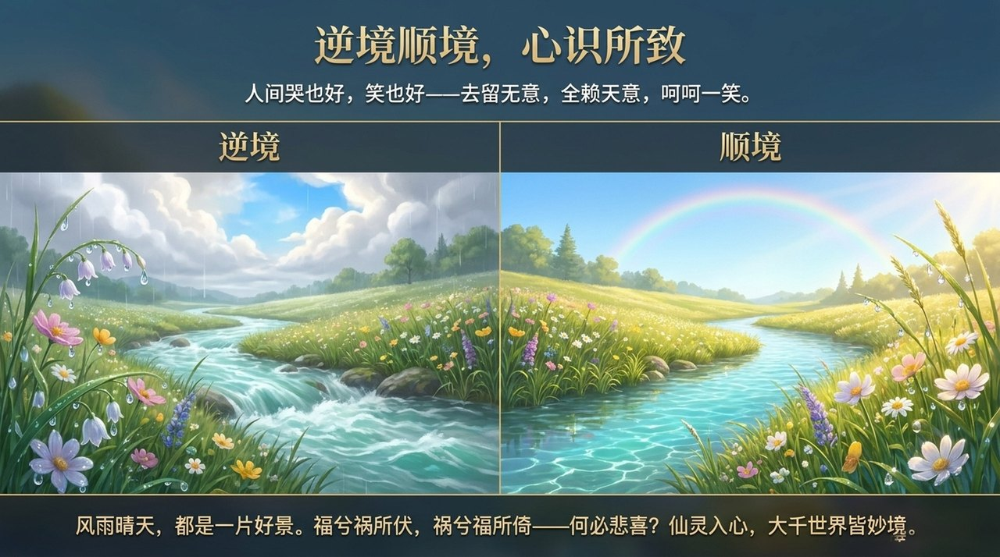
    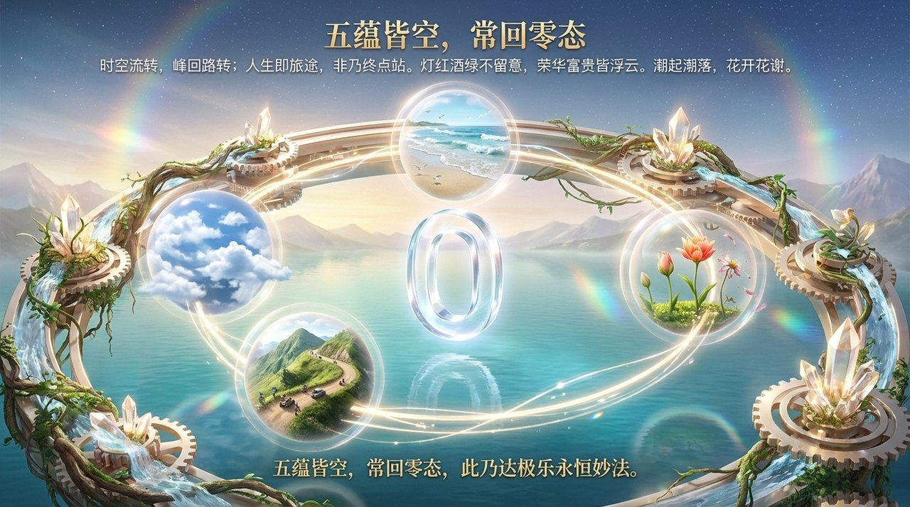
    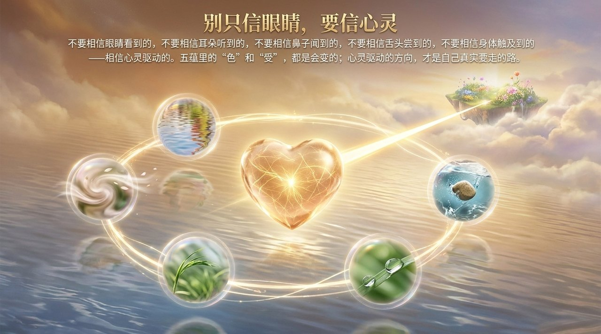
    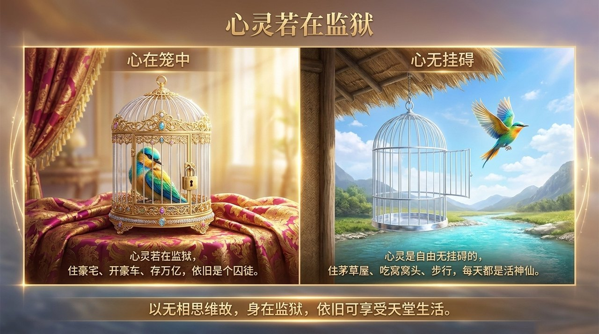
    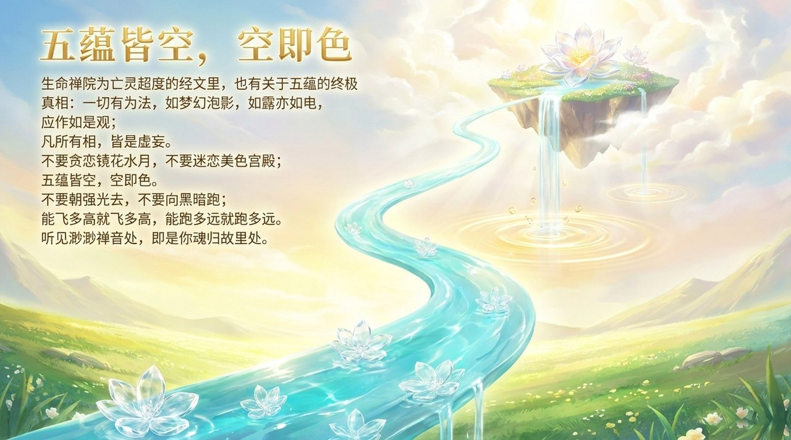
    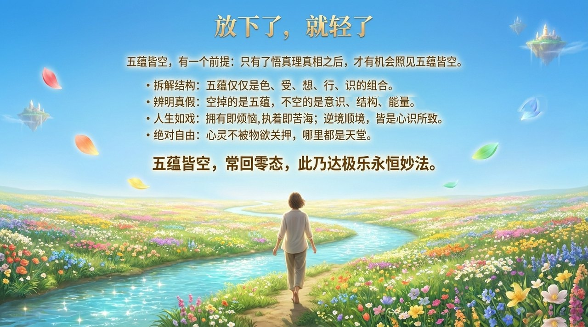

---

## 相关词条

[零态](/zh/zero-state/) · [极乐妙境](/zh/jilemiaojing/) · [空性](/zh/kong-xing/) · [涅槃](/zh/nirvana/) · [无我无相](/zh/no-self-no-form/) · [归零](/zh/return-to-zero/) · [心无所住·心无挂碍](/zh/xinwu-suozhu-guaai/) · [颠倒梦想](/zh/diandao-mengxiang/) · [放下](/zh/letting-go/)
