<!-- id: LC-XW-0001-ZH theme: 修行 type: 导航 direction: 修仙修炼 lang: zh -->

# 心无所住·心无挂碍

心无所住，源自《金刚经》"应无所住而生其心"，指心不固着于任何对象、不被任何人事物所牵缚的状态；心无挂碍，源自《心经》"依般若波罗蜜多故，心无挂碍，无挂碍故，无有恐怖，远离颠倒梦想，究竟涅槃"，指心灵彻底自由、毫无阻碍羁绊的境界。两者高度契合、互为表里，是生命禅院体系中修仙成佛的最高实践标志，是八万四千法门中最殊胜的法门，也是从人到仙完成蜕变的根本标准。

---

## 版本导航

| 版本 | 适合读者 | 特点 |
|------|---------|------|
| [通俗版](friendly.md) | 初次了解者 | 生活情境·心里装了什么的比喻·放下的具体路径 |
| [学术版](academic.md) | 学者·跨文化比较 | 《金刚经》《心经》来源·与道家无为·心理学正念的对照 |
| [内部版](internal.md) | 修行者·研究者 | 完整引文·六节框架·体系内深度理解 |

---

## 视频版

<iframe style="width:100%;aspect-ratio:4/3;border:0" src="https://www.youtube-nocookie.com/embed/F9kSZj1sujw" title="心无所住·心无挂碍（生命禅院百科·视频版）" allowfullscreen></iframe>

??? info "📖 图文幻灯（14 张，点击展开）"

    
    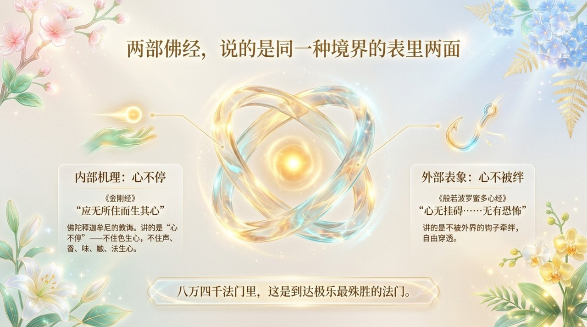
    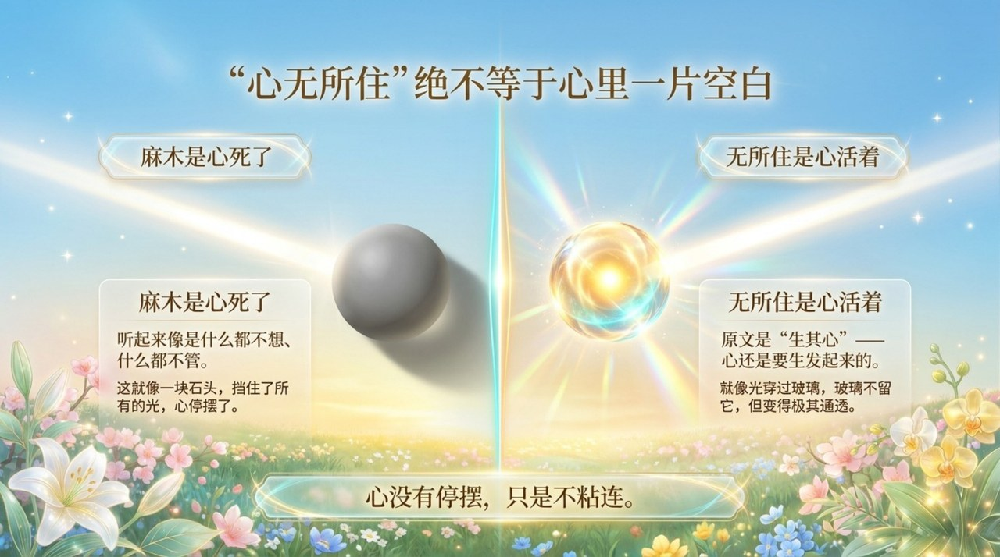
    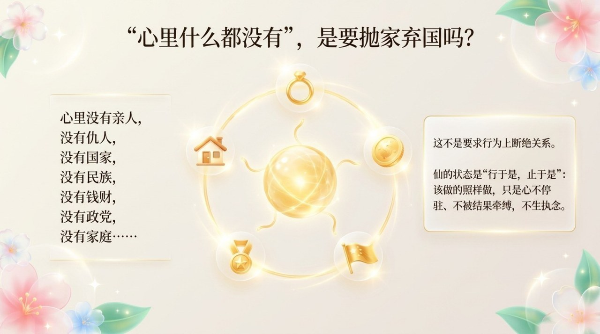
    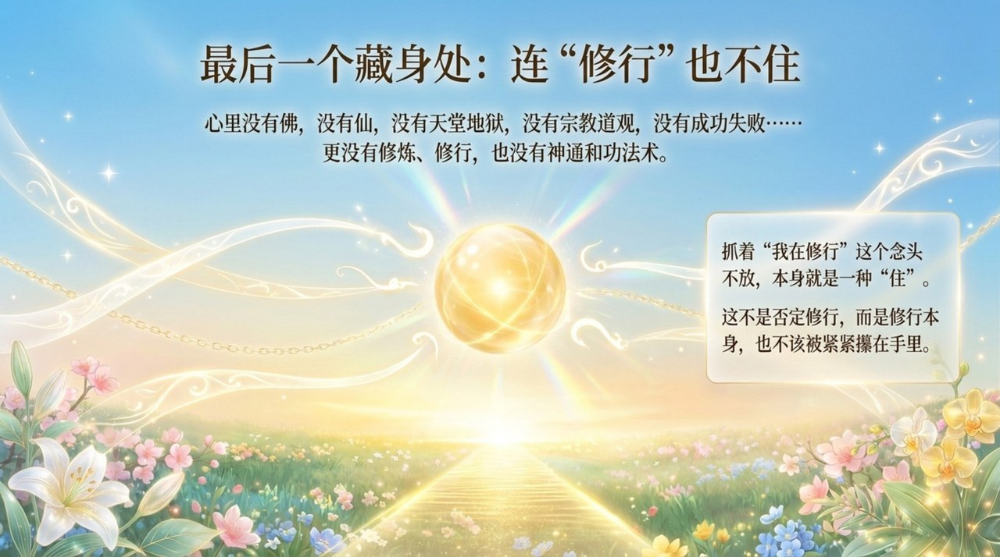
    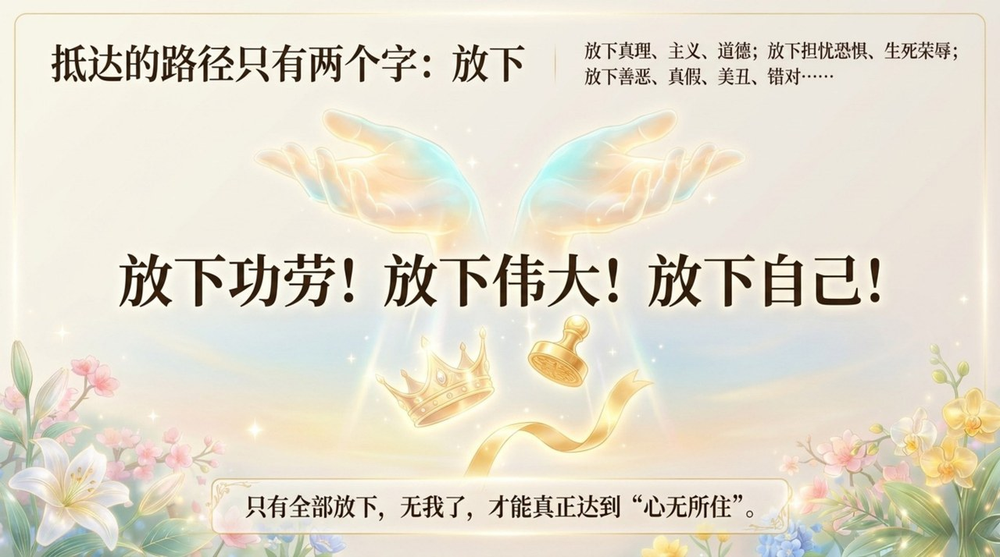
    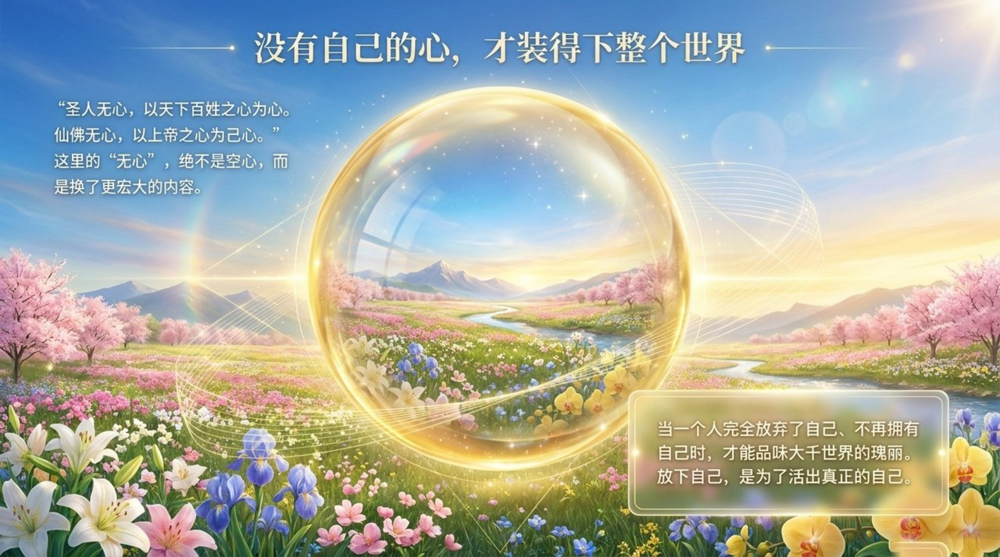
    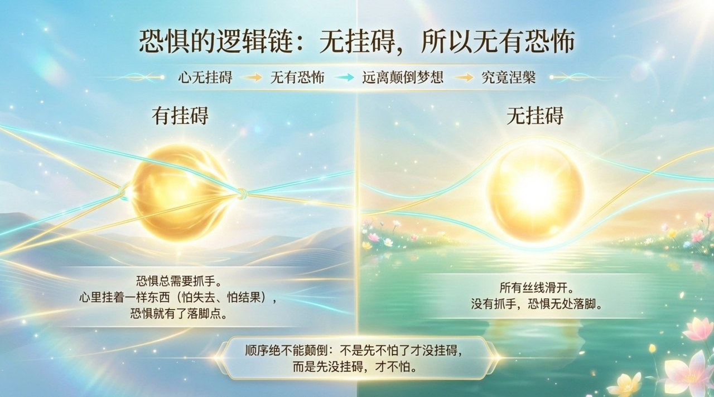
    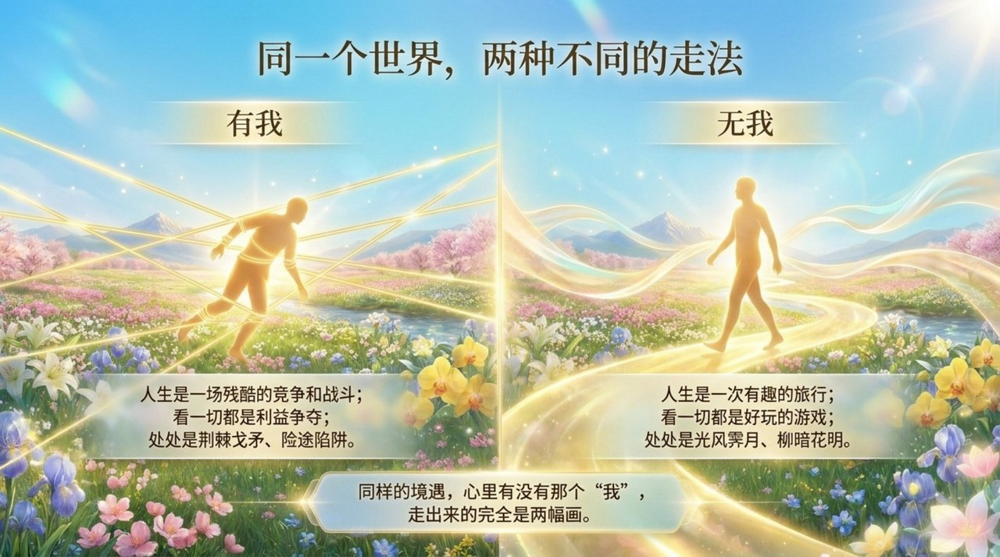
    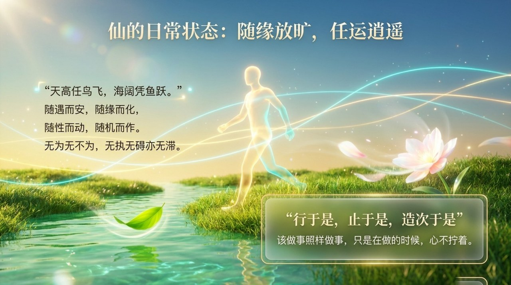
    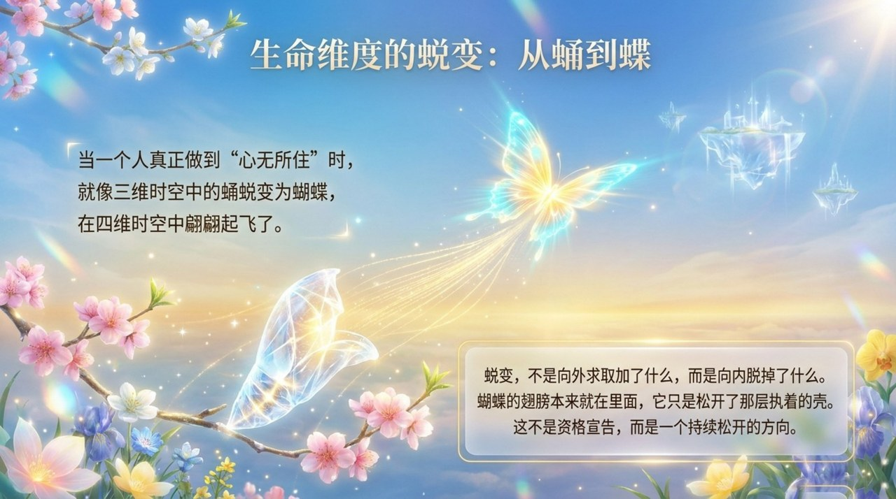
    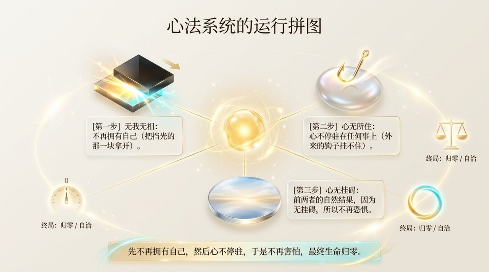
    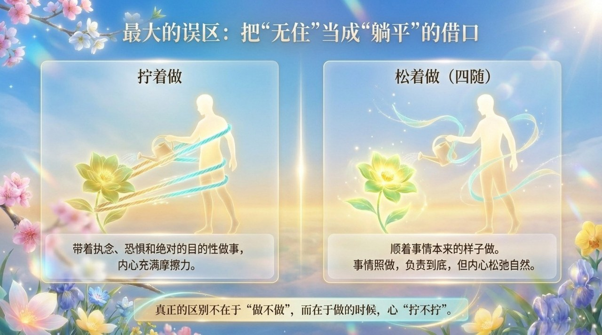
    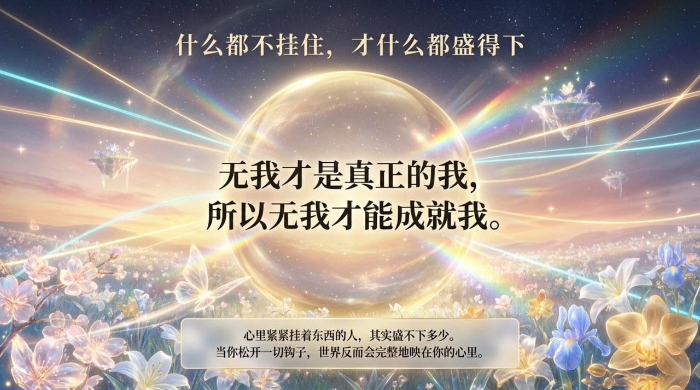

---

## 相关词条

[无我无相](/zh/no-self-no-form/) · [放下](/zh/letting-go/) · [归零](/zh/return-to-zero/) · [零态](/zh/zero-state/) · [四随（随遇而安·随缘而化·随性而动·随机而作）](/zh/si-sui/) · [无为而无不为](/zh/wu-wei/) · [大乘心愿](/zh/dasheng-xinyuan/) · [成仙成佛](/zh/becoming-celestial-buddha/) · [心灵花园](/zh/soul-garden/)
