# 缘

**缘**，是生命与生命之间、生命与万事万物之间所结下的无形引力与债务关系。一切相遇、悲欢、离合、苦乐，皆有缘之所驱。缘是反物质存在，无形无相，却有影有踪；缘既是人生轨迹的编写者，也是生命轮回的根本原因。了尘缘、结仙缘，是修行修炼从人到仙的核心课程。

---

## 版本导读

| 版本 | 适合读者 | 入口 |
|------|----------|------|
| 友好版 | 初次接触者 | [阅读友好版](/zh/yuan/friendly/) |
| 学术版 | 学术研究、跨文化比较 | [阅读学术版](/zh/yuan/academic/) |
| 内部版 | 禅院草、深度研究者 | [阅读内部版](/zh/yuan/internal/) |

---

## 视频版

<iframe style="width:100%;aspect-ratio:4/3;border:0" src="https://www.youtube-nocookie.com/embed/zHfvVxT7YKc" title="缘（生命禅院百科·视频版）" allowfullscreen></iframe>

??? info "📖 图文幻灯（14 张，点击展开）"

    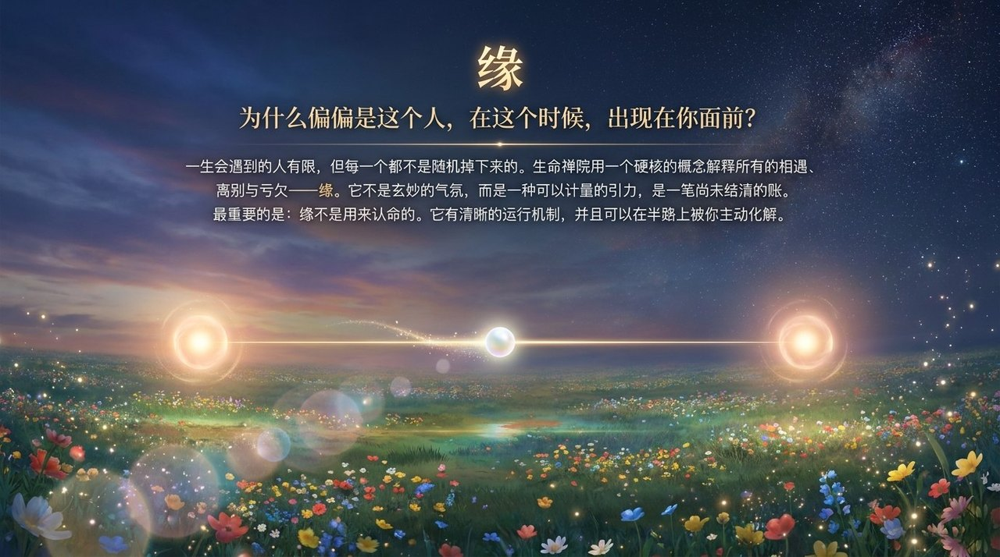
    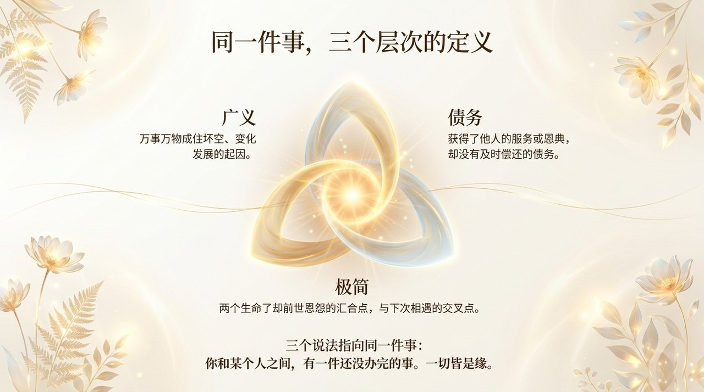
    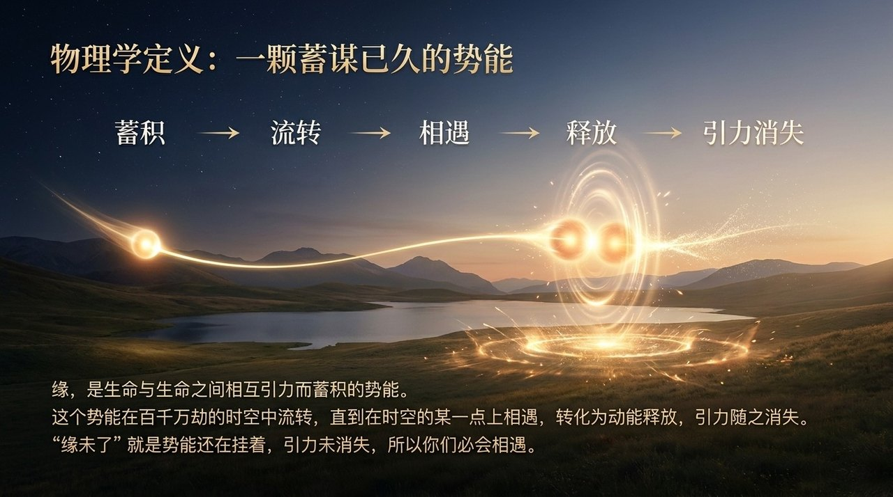
    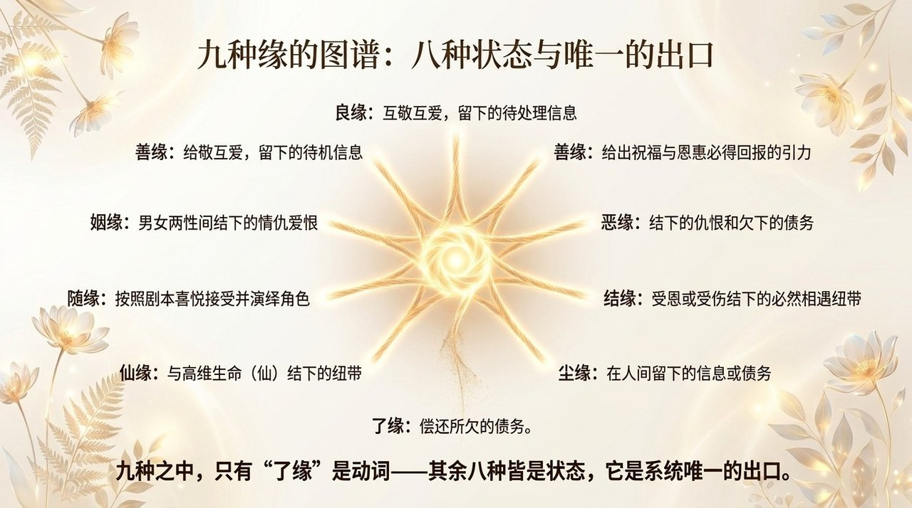
    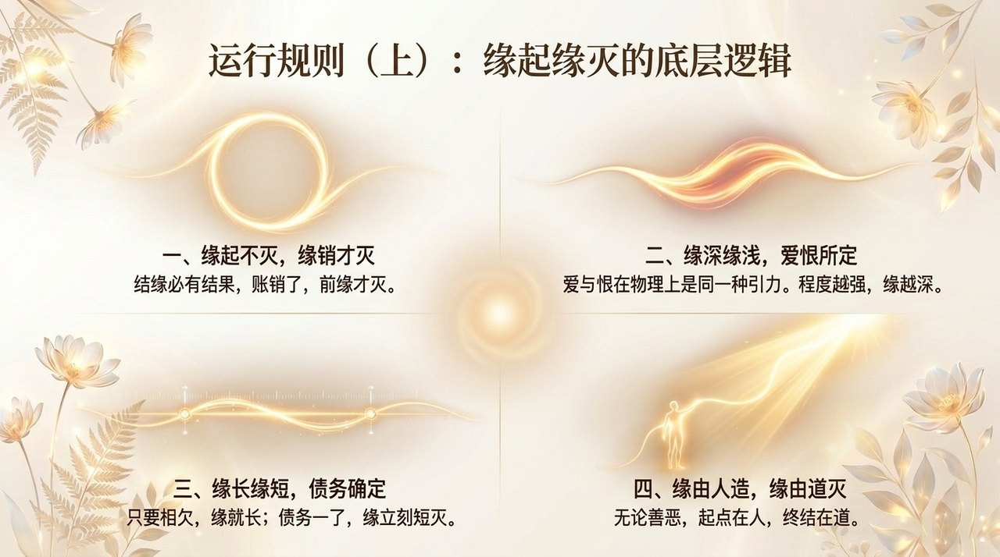
    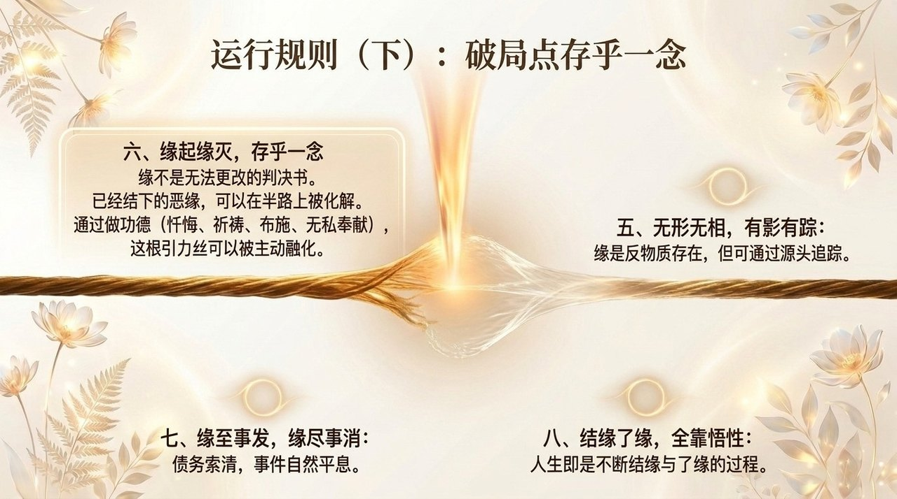
    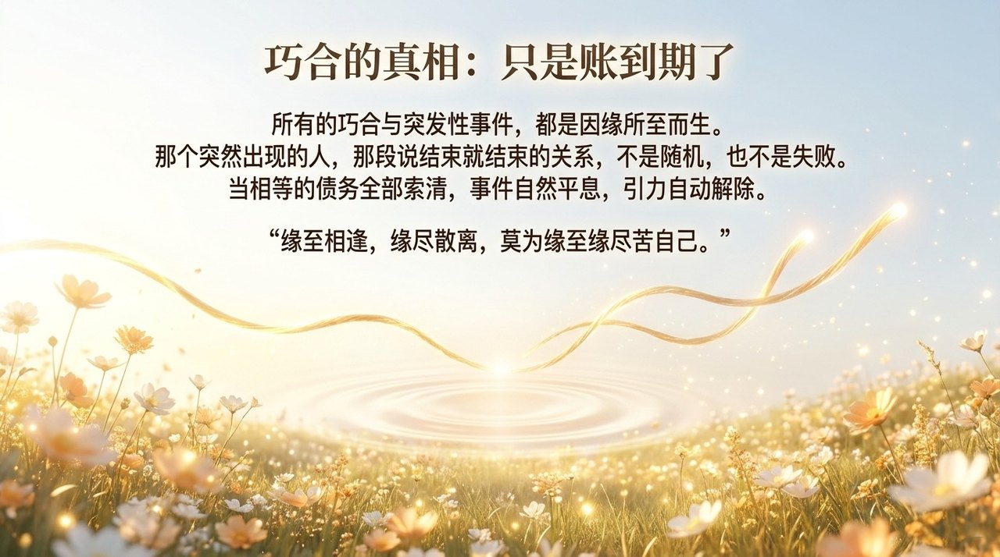
    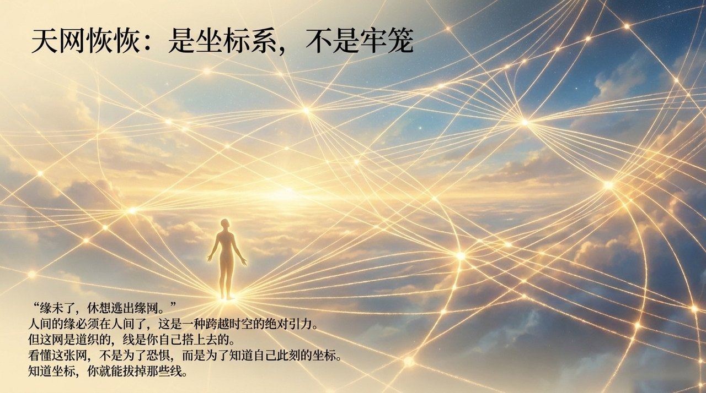
    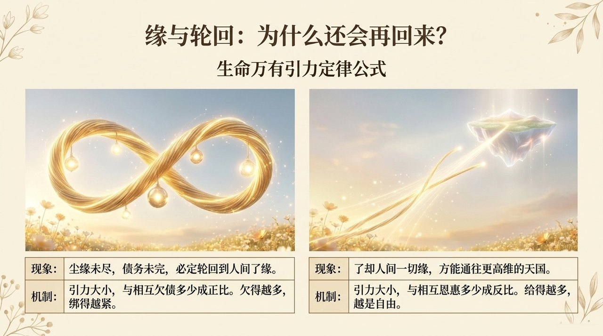
    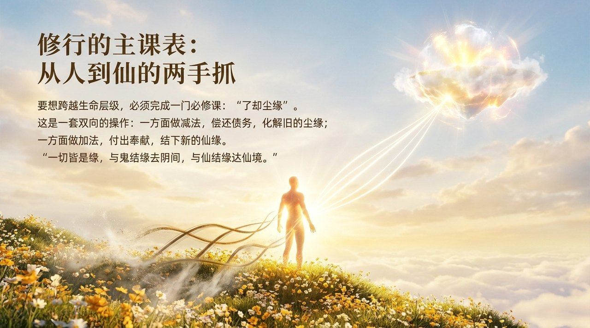
    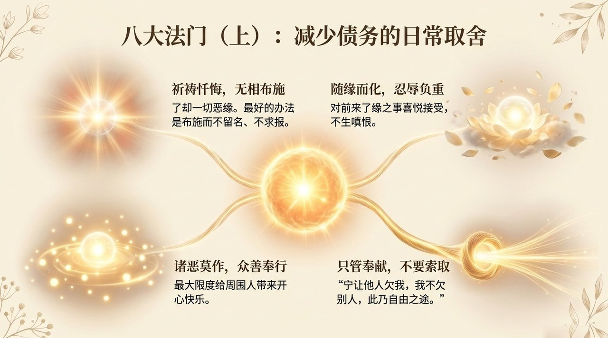
    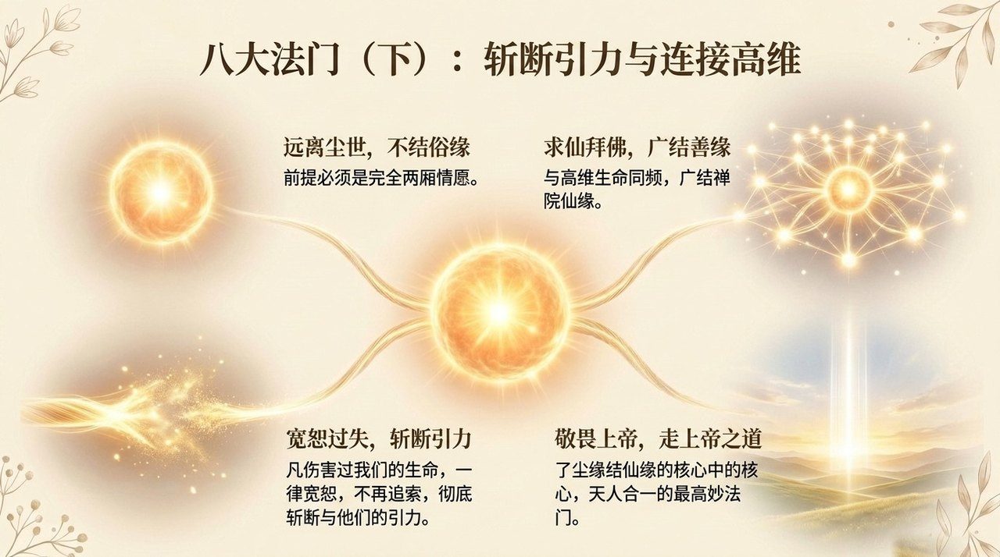
    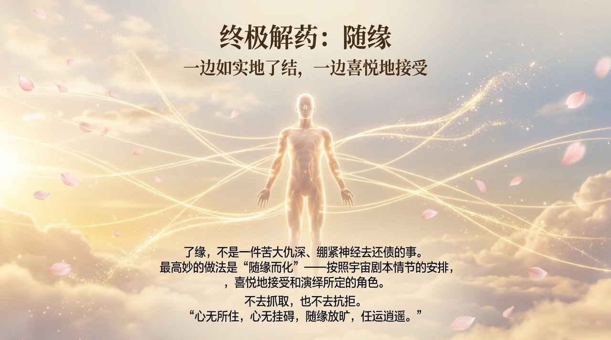
    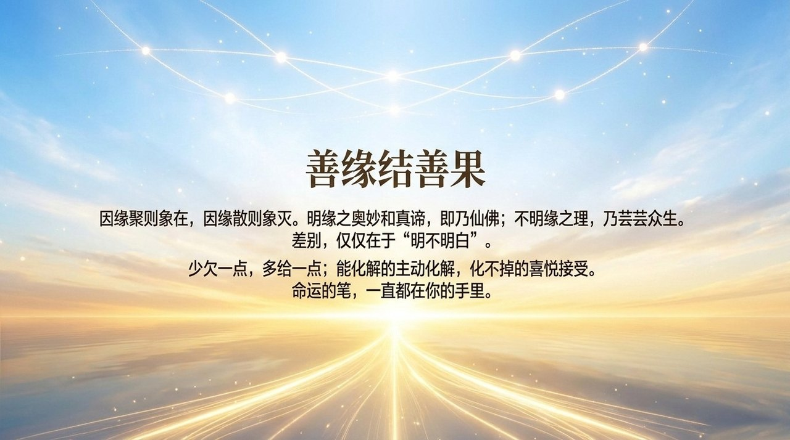

---

## 相关词条

[因果·报应·轮回](/zh/karma-retribution-reincarnation/) · [无相布施](/zh/formless-giving/) · [觉悟](/zh/awakening/) · [灵魂](/zh/soul/) · [生命](/zh/life/) · [道](/zh/dao/) · [生命的特征](/zh/life-characteristics/)
