# 零态

**零态**，是生命禅院体系中揭示最高修行境界与最佳生命状态的核心概念——"空灵秀"之境，老子"无为"、佛陀"无相"、乾坤元初"中道"三者共指的同一实相；是上帝的状态，是佛的状态，是天仙的状态；一无所有却拥有一切；让自己始终处于零态，就是一种高级修炼。

## 版本导航

| 版本 | 适合 |
|------|------|
| [友好版](friendly/) | 首次接触，内容丰满、可读性强 |
| [学术版](academic/) | 理论研究与引用 |
| [内部版](internal/) | 体系内核心学习，以母版为准 |

---

## 视频版

<iframe style="width:100%;aspect-ratio:4/3;border:0" src="https://www.youtube-nocookie.com/embed/TysVUQx4vZ4" title="零态（生命禅院百科·视频版）" allowfullscreen></iframe>

??? info "📖 图文幻灯（14 张，点击展开）"

    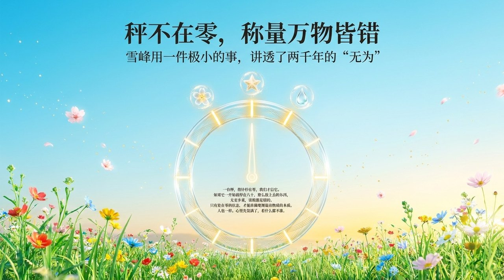
    
    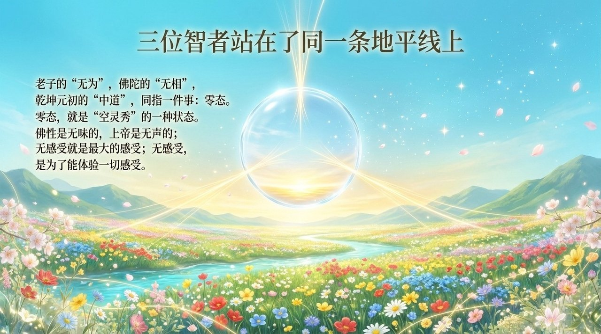
    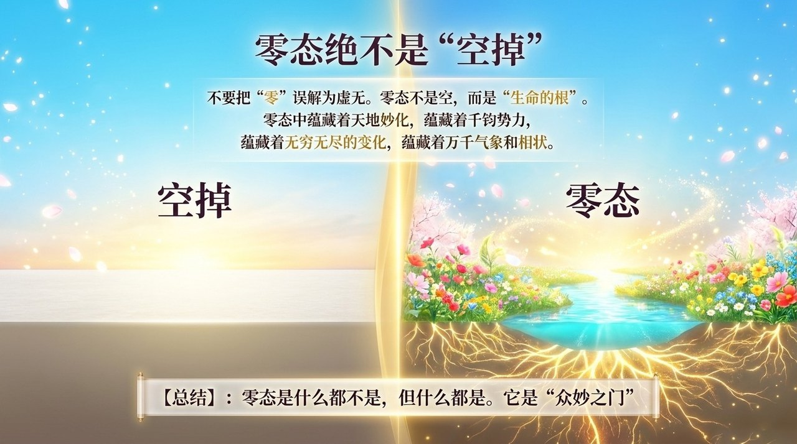
    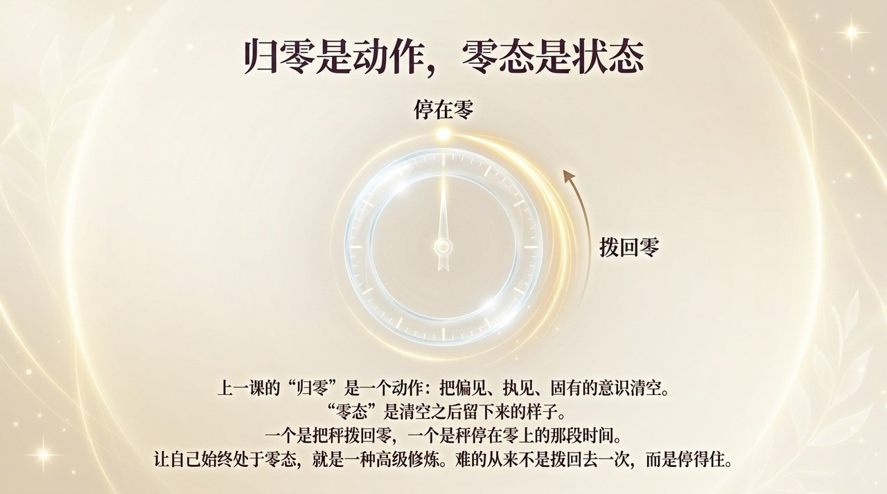
    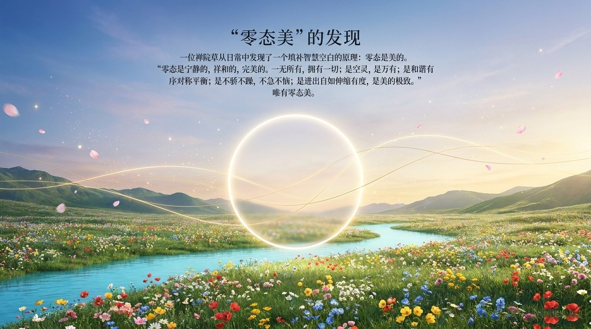
    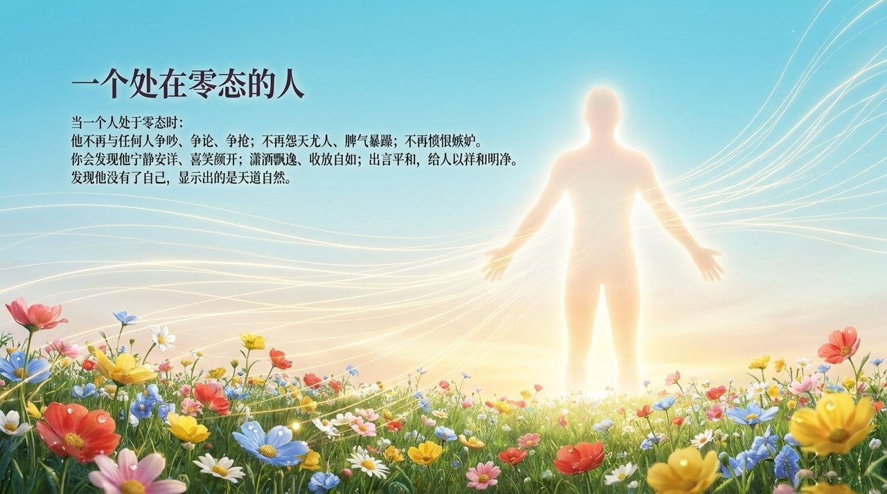
    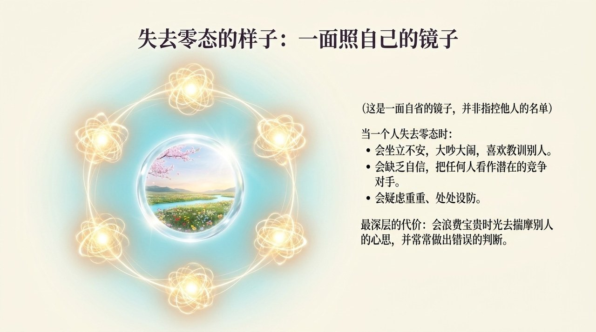
    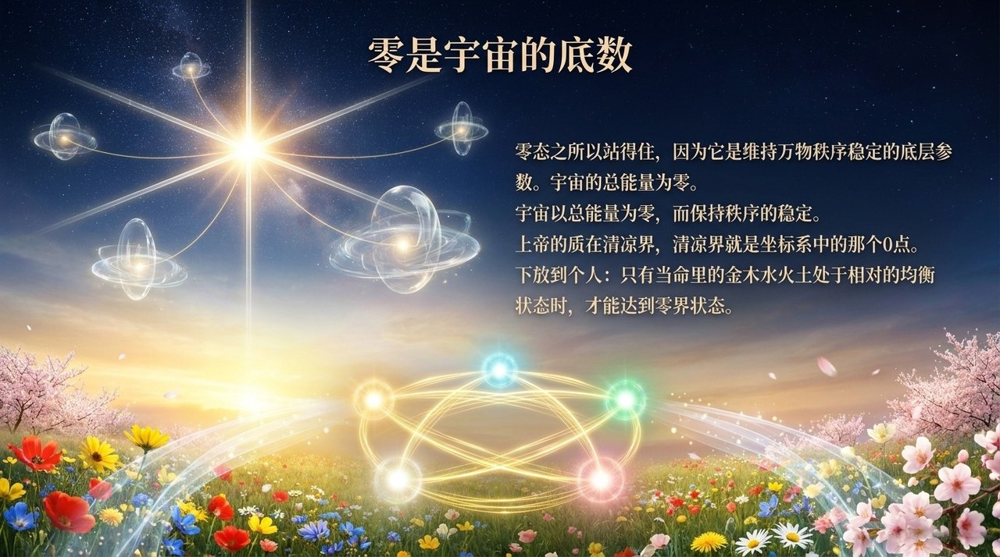
    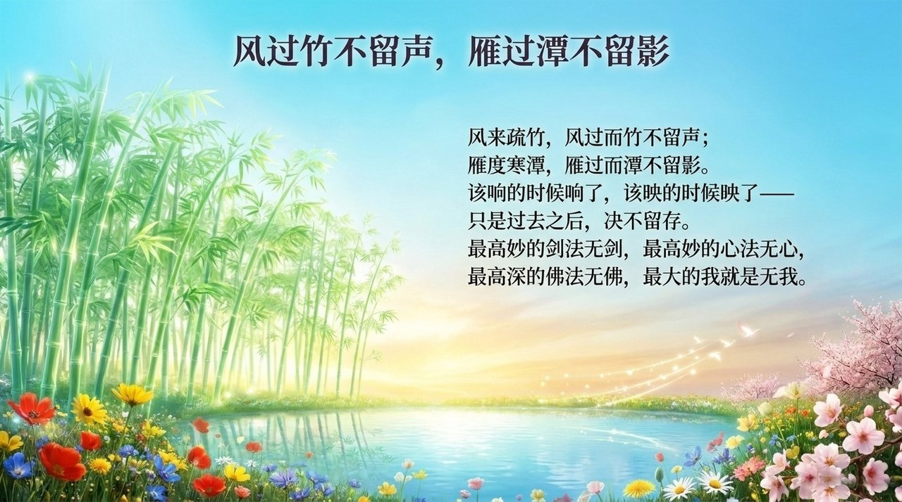
    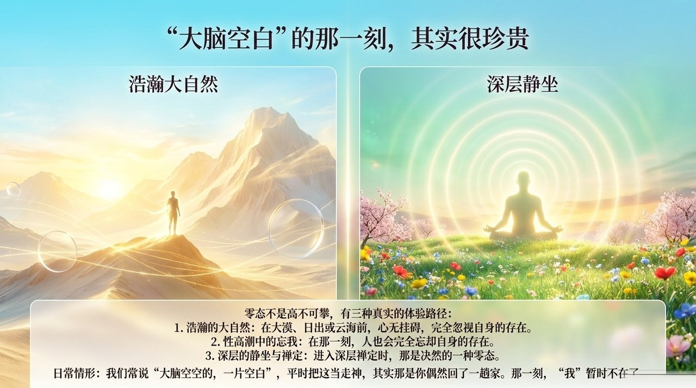
    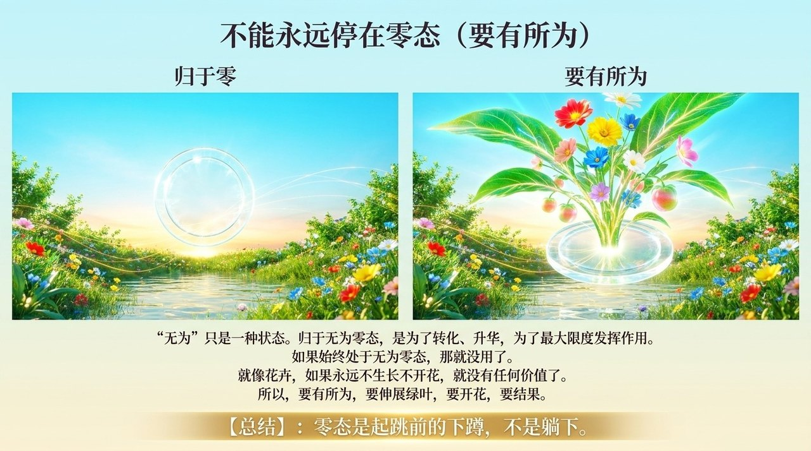
    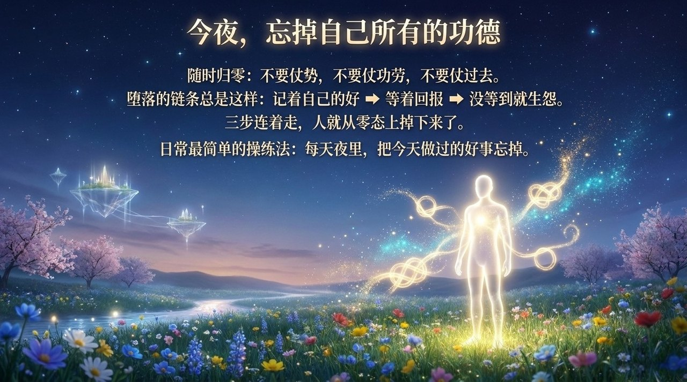
    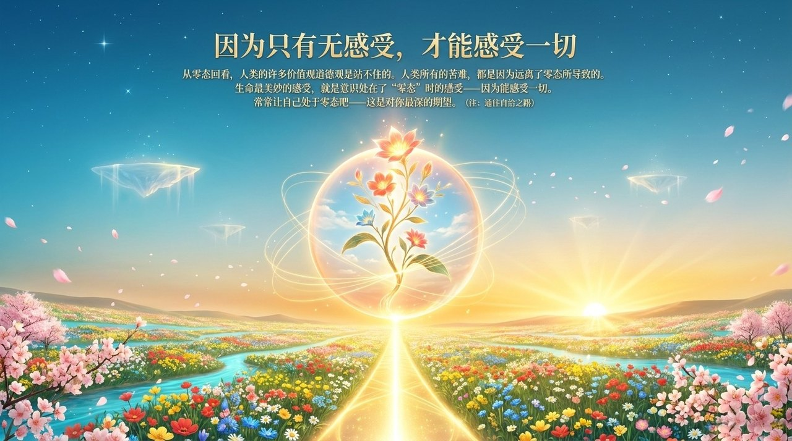

---

## 相关词条

[归零](/zh/return-to-zero/) · [无相思维](/zh/non-form-thinking/) · [灵觉](/zh/spiritual-sensing/) · [自洽](/zh/self-coherence/) · [心灵净化课](/zh/spiritual-purification-course/) · [浑沌思维](/zh/hundun-thinking/) · [上帝](/zh/greatest-creator/)
