# 真理

> 道就是真理，真理就是道，道和真理是一回事，这就是为什么神、佛、先知、仙、圣人重视道的原因，也就是说，神佛先知仙圣给我们讲的就是真理。  
> ——导游雪峰《禅院文集·天启篇·真理！》

**真理**，在生命禅院体系中与"道"和"上帝"三位一体：真理就是道，道就是上帝的意识与灵，故真理即上帝。真理具有八大属性：无、万有、信（可靠）、自然、公正、亲切、唯一、永恒；它不可造，只可识；它是活的，随维度空间而展现不同面貌；寻求真理、认识真理、尊重真理，是人生的头等大事，是通往高层生命空间的根本路径。

## 视频版

<iframe style="width:100%;aspect-ratio:4/3;border:0" src="https://www.youtube-nocookie.com/embed/oMcYRCO3Agc" title="真理（生命禅院百科·视频版）" allowfullscreen></iframe>

??? info "📖 图文幻灯（14 张，点击展开）"

    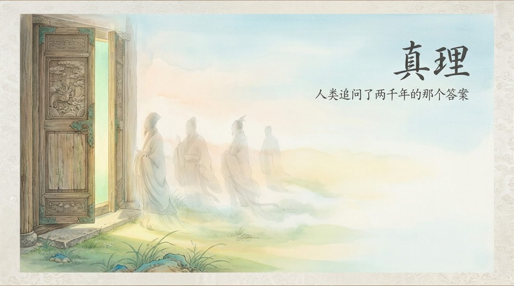
    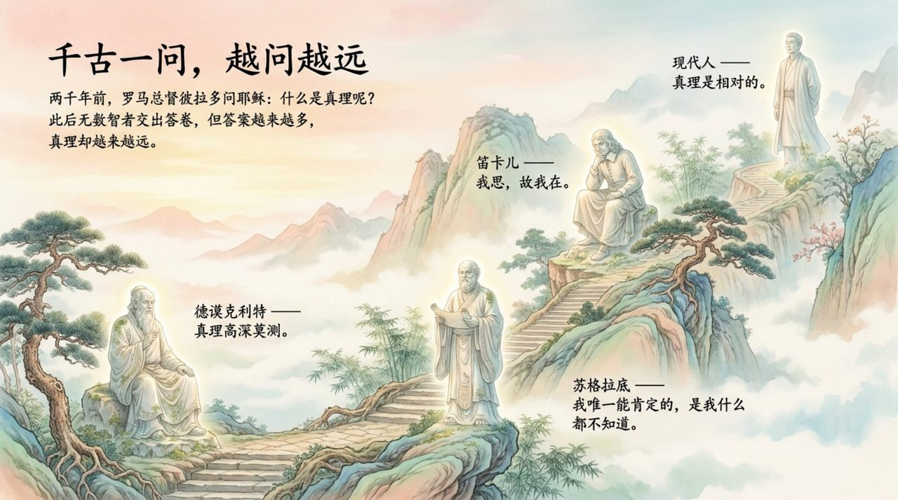
    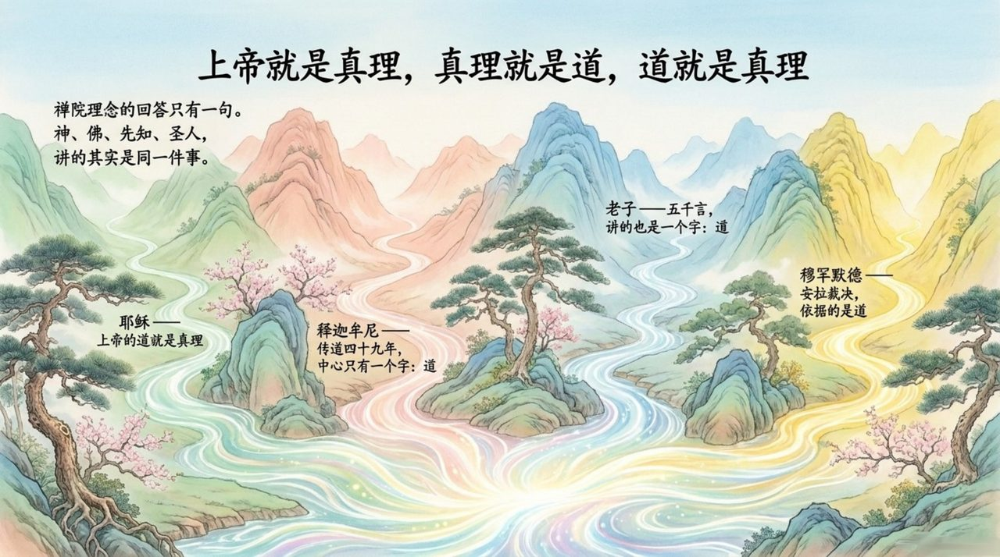
    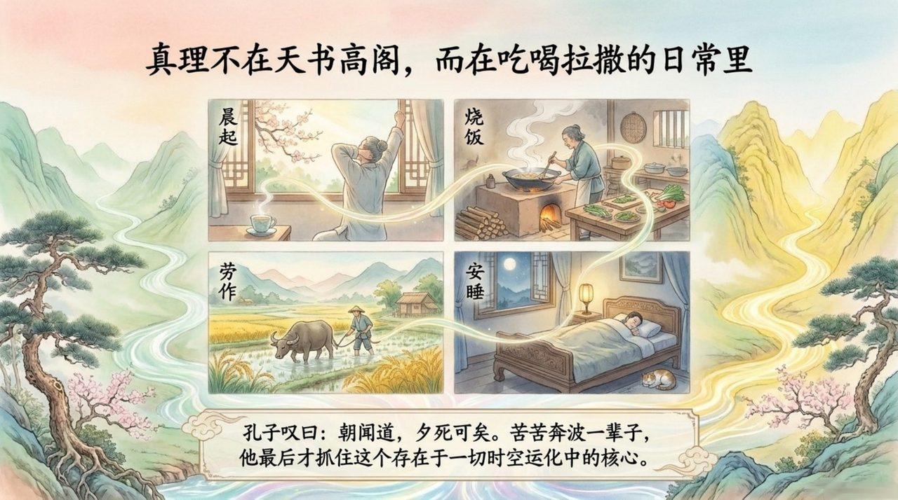
    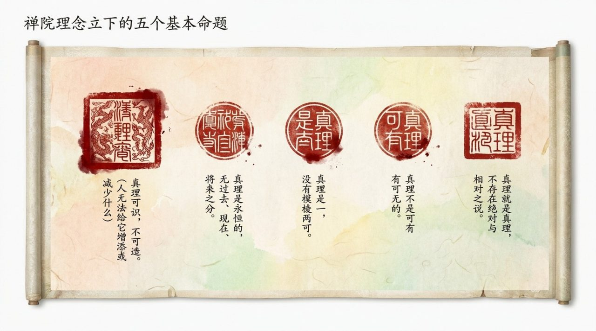
    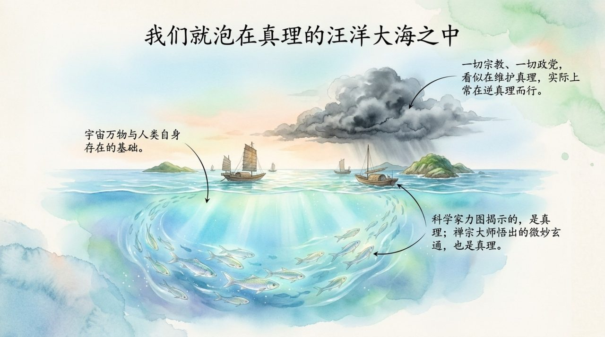
    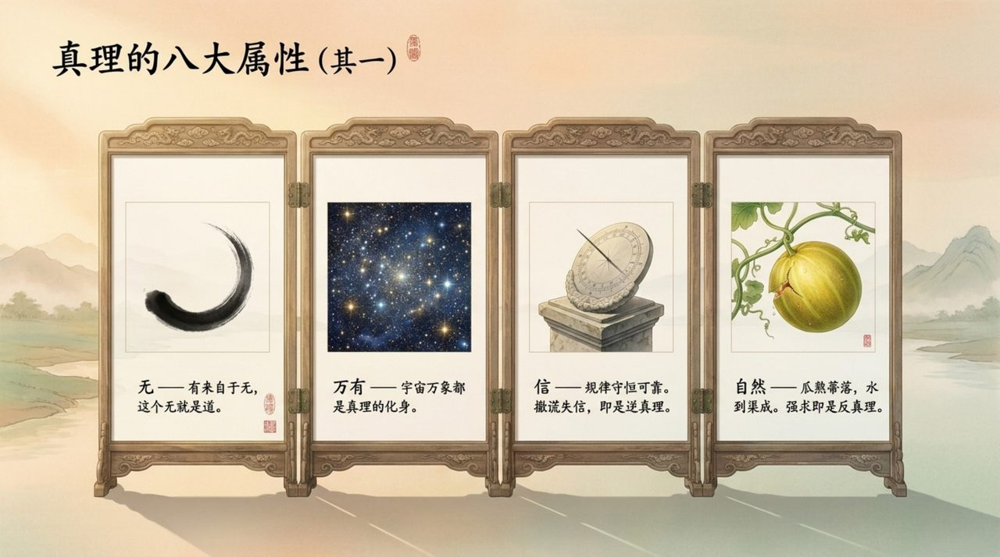
    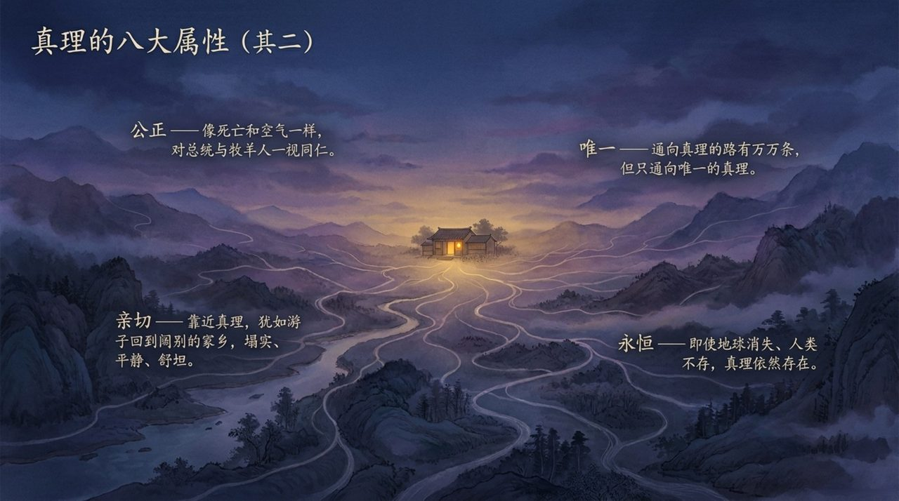
    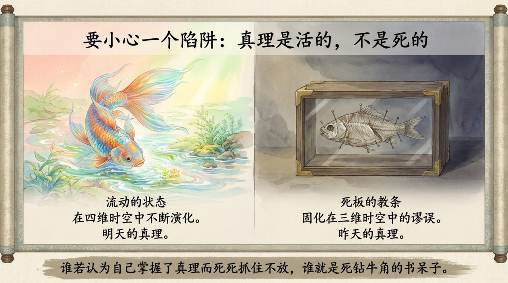
    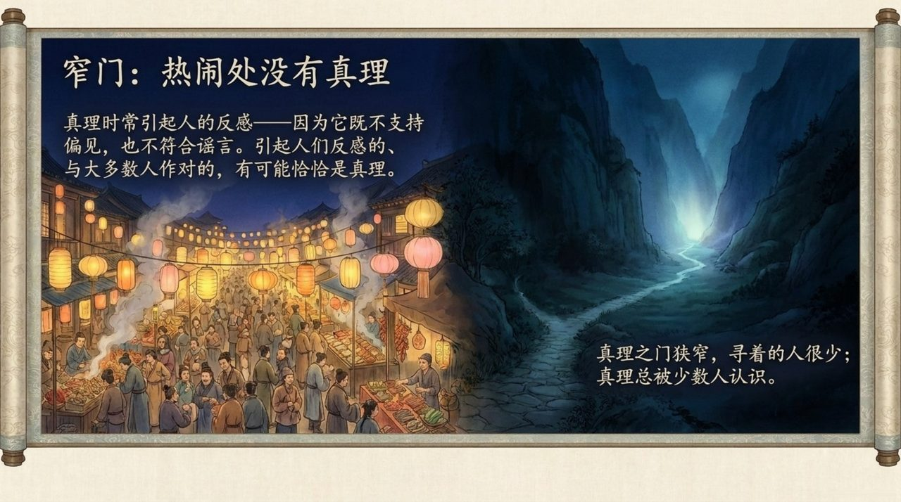
    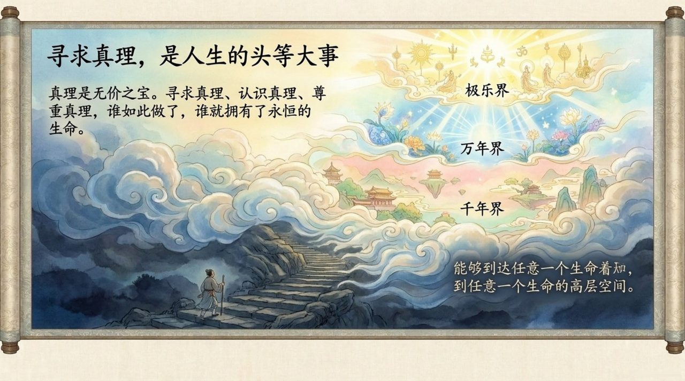
    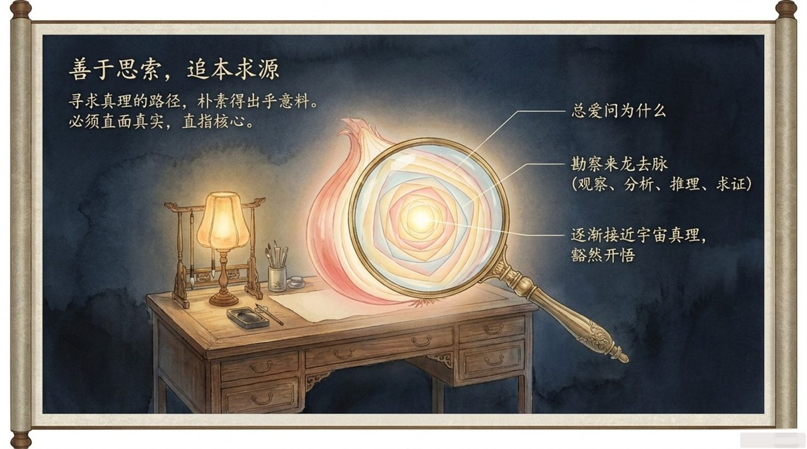
    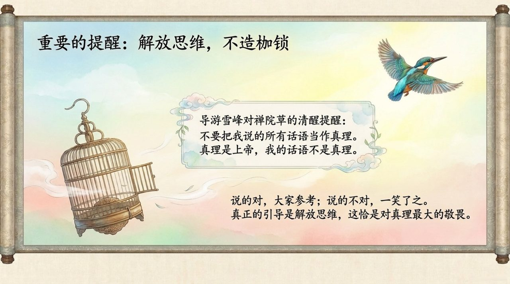
    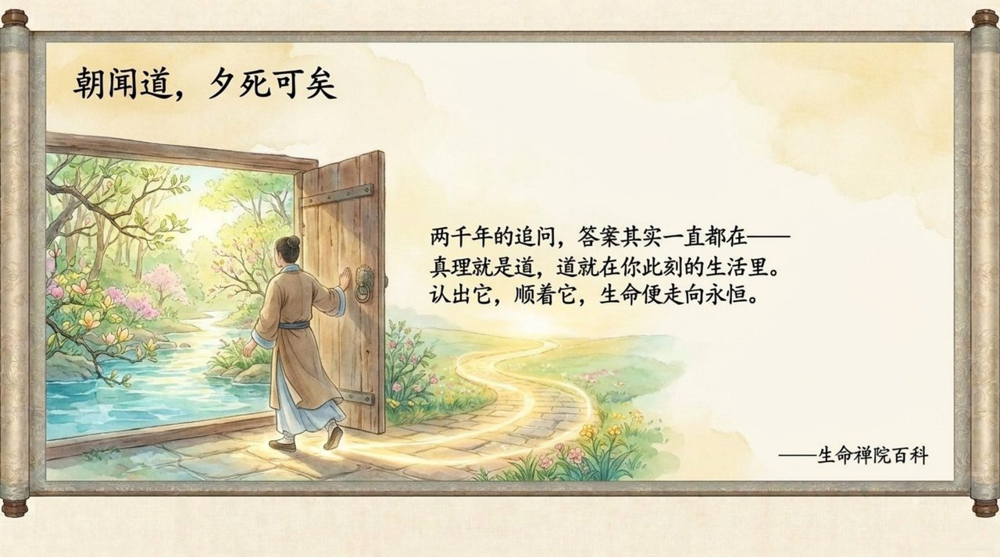

| 版本 | 适合 | 核心角度 |
|------|------|----------|
| [友好版](friendly.md) | 初次了解 | 真理是什么，为何寻求真理是人生大事 |
| [学术版](academic.md) | 研究者 | 真理的八大属性与比较哲学分析 |
| [内部版](internal.md) | 深度研修 | 完整原典，系统梳理导游关于真理的全部论述 |

---

## 相关词条

[道](/zh/dao/) · [上帝](/zh/greatest-creator/) · [上帝之道](/zh/way-of-the-greatest-creator/) · [道德](/zh/morality/) · [觉悟](/zh/awakening/) · [信仰](/zh/xinyang/) · [自然之道](/zh/way-of-nature/) · [浑沌](/zh/hundun/)
